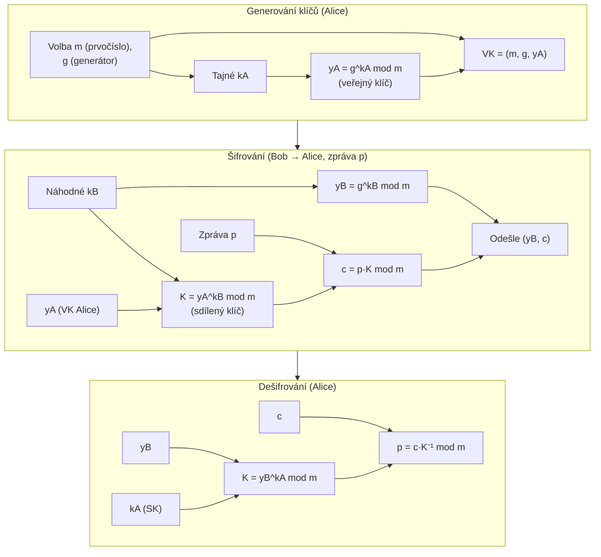
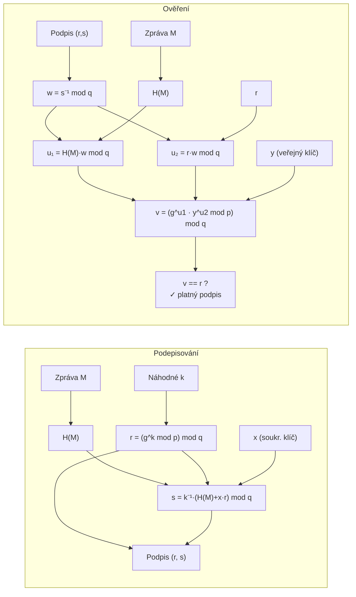

# 5. Asymetrická kryptografie

---

## Diffie-Hellman výměna klíčů

**Veřejné parametry:** prvočíslo $m$, generátor $a$

| Krok | Alice | Bob |
|------|-------|-----|
| Tajný klíč | $k_A$ | $k_B$ |
| Veřejná hodnota | $y_A = \|a^{k_A}\|_m$ → posílá Bobovi | $y_B = \|a^{k_B}\|_m$ → posílá Alici |
| Sdílený klíč | $K = \|y_B^{k_A}\|_m = \|a^{k_A k_B}\|_m$ | $K = \|y_A^{k_B}\|_m = \|a^{k_A k_B}\|_m$ |

!!! info "Bezpečnost"
    Útočník vidí: $m, a, y_A, y_B$ → nedokáže spočítat $K$.
    
    **DHP ≤ DLP** (Diffie-Hellman problém ≤ diskrétní logaritmus)

---

## RSA

=== "Definice"
    1. $p, q$ velká prvočísla, $n = pq$, $\phi(n) = (p-1)(q-1)$
    2. $e$: $\gcd(e, \phi(n)) = 1$
    3. $d = e^{-1} \bmod \phi(n)$
    4. **Veřejný klíč** = $(n, e)$, **Soukromý klíč** = $(n, d)$

=== "Příklad (malá čísla)"
    - $p = 43,\ q = 59 \Rightarrow n = 2537,\ \phi(n) = 2436$
    - $e = 13,\ d = 937$ (ext. Euklidův alg.)
    - VK = (2537, 13), SK = (2537, 937)
    - Šifrování: $1520^{13} \bmod 2537 = 95$
    - Dešifrování: $95^{937} \bmod 2537 = 1520$ ✓

### Šifrování, dešifrování a digitální podpis

```mermaid
flowchart LR
    subgraph ENC["Šifrování (Bob → Alice)"]
        M["Plaintext m"] --> CE["c = mᵉ mod n"]
        VK["VK = (n,e)\nveřejný"] --> CE
        CE --> C["Ciphertext c"]
    end
    subgraph DEC["Dešifrování (Alice)"]
        C2["Ciphertext c"] --> DE["m = cᵈ mod n"]
        SK["SK = (n,d)\ntajný"] --> DE
        DE --> M2["Plaintext m"]
    end
    subgraph SIGN["Digitální podpis (Alice podepisuje)"]
        MSG["Zpráva m"] --> HS["H(m)"] --> SIGS["S = H(m)ᵈ mod n\n(podpis SK)"]
        SKS["SK Alice"] --> SIGS
        SIGS --> SIG["Podpis S"]
    end
    subgraph VERIFY["Ověření podpisu (Bob)"]
        SIG2["Podpis S"] --> VV["Sᵉ mod n = H'"]
        VKV["VK Alice"] --> VV
        MSG2["Zpráva m"] --> HV["H(m)"]
        VV & HV --> CMP["H' == H(m)?\n✓ platný podpis"]
    end
    style ENC fill:#1a1d2e
    style DEC fill:#1a1d2e
    style SIGN fill:#1a1d2e
    style VERIFY fill:#1a1d2e
```

!!! warning "Bezpečnost RSA"
    - Bezpečnost spojena s **faktorizačním problémem**
    - Doporučená délka: ≥ 2048 b (dnes **3072–4096 b** pro dlouhodobou bezpečnost)
    - Nutné padding schéma (**OAEP**) – „školbooková" RSA bez paddingu je nezabezpečená

---

## RSA-CRT

!!! info "4–8× rychlejší dešifrování pomocí Čínské věty o zbytcích"
    SK = $(p, q, d_p, d_q, q_{inv})$ kde:
    - $d_p = d \bmod (p-1)$
    - $d_q = d \bmod (q-1)$
    - $q_{inv} = q^{-1} \bmod p$

```mermaid
flowchart TB
    C["Ciphertext c"] --> M1["m₁ = cᵈᵖ mod p\n(polovina délky!)"]
    C --> M2["m₂ = cᵈᵠ mod q\n(polovina délky!)"]
    M1 & M2 --> H["h = q_inv·(m₁-m₂) mod p"]
    H --> M["m = m₂ + h·q"]
    style M fill:#1a1d2e,stroke:#34d399
```

$m_1$ a $m_2$ jsou datově nezávislé → paralelizovatelné. Práce s čísly **poloviční délky** → kvadratické zrychlení exponencování.

---

## ElGamal

!!! danger "⚠️ $k_B$ musí být vždy nové!"
    Opakované použití $k_B$ pro různé zprávy umožní útočníkovi rekonstruovat plaintexty přímým odečtením.

---

## DSA – Digital Signature Algorithm

!!! danger "Sony PS3 exploit"
    Sony používalo **konstantní $k$** pro všechny podpisy. Ze dvou podpisů $(r, s_1)$ a $(r, s_2)$ pro různé $H(M_1), H(M_2)$ lze snadno spočítat soukromý klíč $x$:
    
    $$k = \frac{H(M_1) - H(M_2)}{s_1 - s_2} \pmod{q}$$
    $$x = \frac{s_1 k - H(M_1)}{r} \pmod{q}$$
