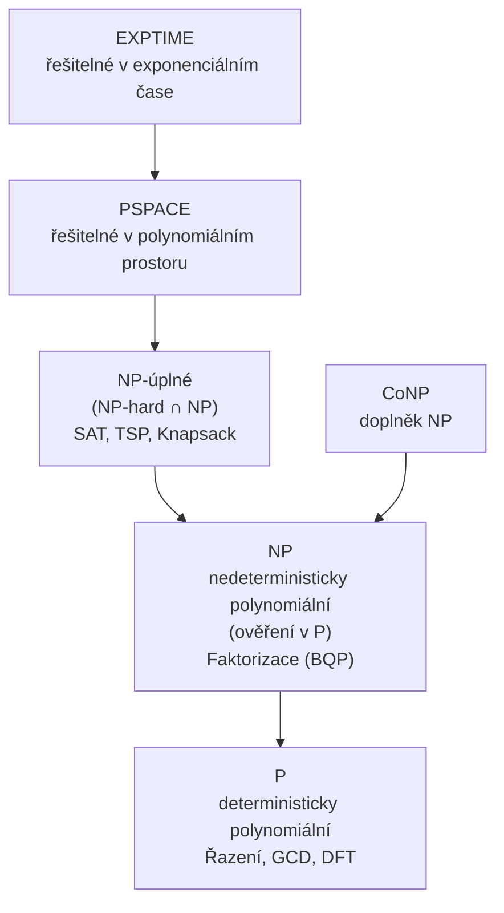

# 8. Bezpečnost kryptosystémů

!!! warning "Kerckhoffsův princip (1883)"
    Bezpečnost závisí **pouze na tajnosti klíče**, nikoli na tajnosti algoritmu. Předpokládáme, že útočník zná celý kryptosystém. *Security through obscurity* je nepřijatelná jako jediná obrana.

### Typy bezpečnosti

| Typ bezpečnosti | Definice | Příklad |
|-----------------|----------|---------|
| **Nepodmíněná** | Nelze prolomit ani s neomezenými prostředky | Vernamova šifra (OTP) |
| **Podmíněná** | Prolomení vyžaduje prostředky, které nemáme | AES |
| **Prokazatelná** | Důkaz, že prolomení ≡ NP problém | RSA (faktorizace) |
| **Výpočetní** | Prolomení trvá déle než životnost informace | DES ($7 dní, $10 000) |

---

## Shannonova teorie informace

=== "Entropie"
    $$H(X) = -\sum_{i=1}^n p_i \log_2 p_i \;[\text{bitů}]$$
    
    Maximum při rovnoměrném rozdělení: $H_{\max} = \log_2 n$.

=== "Vzdálenost jednoznačnosti"
    $$\delta_U = \frac{H(K)}{D}$$
    
    $D = R - r$ (redundance jazyka).
    
    Angličtina: $R = 4.7$ b/znak, $r = 1.5$ b/znak, $D = 3.2$ b/znak.

### Konfúze a difúze

=== "Konfúze"
    Maří statistické vztahy šifrového textu ↔ otevřeného textu.
    
    **Realizace:** substituce
    
    **AES:** SubBytes (S-box)

=== "Difúze"
    Rozprostírá redundanci otevřeného textu po celém šifrovém textu (avalanche efekt).
    
    **Realizace:** transpozice / permutace
    
    **AES:** ShiftRows + MixColumns

---

## Teorie složitosti

### Relevantní problémy pro kryptografii

| Problém | Třída | Použití |
|---------|-------|---------|
| Faktorizace $n = pq$ | NP (pravděp. BQP) | RSA |
| Diskrétní logaritmus | NP | DH, ElGamal, DSA |
| ECDLP | NP | ECC |
| SAT | NP-úplný | Důkazy bezpečnosti |
| Shorův algoritmus (kvantový) | BQP | Útok na RSA, DH, ECC |

!!! danger "Kvantová hrozba"
    **Shorův algoritmus** řeší faktorizaci a diskrétní logaritmus v polynomiálním čase na kvantovém počítači.
    
    - RSA, DH, ElGamal, DSA, ECC → **zranitelné** vůči kvantovému útoku
    - Symetrické šifry (AES) → bezpečnost se sníží na polovinu (Groverův algoritmus), stačí zdvojnásobit délku klíče
    - **Post-kvantová kryptografie:** lattice-based, hash-based, code-based (NIST standardizace probíhá)
