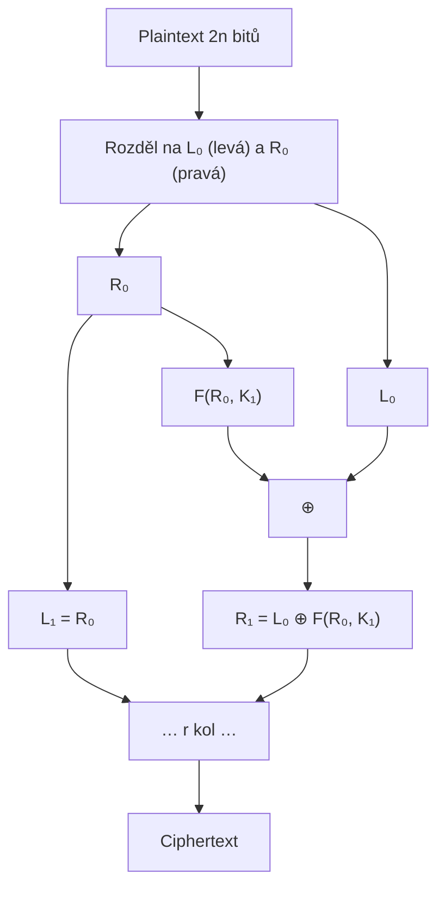
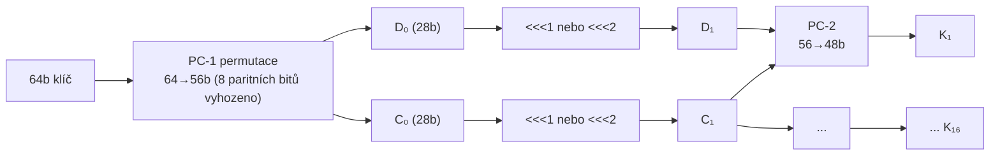
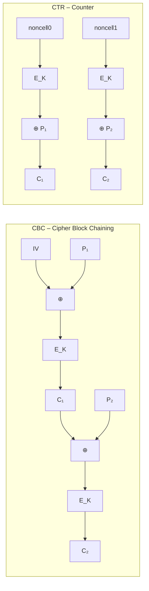

# 3. Blokové šifry

---

## Feistelova síť



Každé kolo: $L_i = R_{i-1}$, $R_i = L_{i-1} \oplus F(R_{i-1}, K_i)$.

!!! success "Klíčová vlastnost"
    Dešifrování = šifrování s **obráceným pořadím klíčů**. Funkce $F$ nemusí být invertibilní – konfúze i difúze závisí pouze na $F$.

---

## DES – Data Encryption Standard

=== "Parametry"
    | Parametr | Hodnota |
    |----------|---------|
    | Blok | 64 bitů |
    | Klíč | 56 bitů (+8 parity) |
    | Kola | 16 (Feistel) |
    | Status | :octicons-x-circle-fill-16: **ZASTARALÝ** |

=== "Schéma kola"
    ```
    R (32b) → Expanze E (32→48b) → ⊕ Kᵢ (48b)
                                         ↓
                             8× S-box (6b→4b)  ← 48b → 32b, nelineárnost!
                                         ↓
                             P-permutace (32b difúze)
                                         ↓
                                    F(R, Kᵢ) výstup 32b
    ```

### Funkce F v jednom kole DES

```mermaid
flowchart LR
    subgraph F["Funkce F (jedno kolo DES)"]
        R32["R (32b)"] --> E["Expanze E\n32 → 48 bitů\n(16 bitů duplikace)"]
        KI["Podklíč Kᵢ\n48 bitů"] --> XOR["⊕"]
        E --> XOR
        XOR --> S1["S1\n6→4b"] & S2["S2\n6→4b"] & S3["S3\n6→4b"] & S4["S4\n6→4b"] & S5["S5\n6→4b"] & S6["S6\n6→4b"] & S7["S7\n6→4b"] & S8["S8\n6→4b"]
        S1 & S2 & S3 & S4 & S5 & S6 & S7 & S8 --> P["P-permutace\n32 bitů"]
        P --> OUT["F výstup 32b"]
    end
    style F fill:#1a1d2e
```



**S-boxy** jsou klíčovým nelineárním prvkem DES (konfúze). Každý S-box: 6 vstupních bitů → 4 výstupní.

> Vnější 2 bity vyberou **řádek**, vnitřní 4 bity vyberou **sloupec** lookup tabulky.

### Generování podklíčů DES



### 3DES – trojité šifrování


EDE mód (Encrypt-Decrypt-Encrypt). Pro $K_1 = K_2 = K_3$ zpětně kompatibilní s DES. Efektivní bezpečnost **112 bitů** (meet-in-the-middle útok).

---

## AES / Rijndael

!!! info "Parametry"
    | Klíč | Kola |
    |------|------|
    | 128b | 10 |
    | 192b | 12 |
    | 256b | 14 |

    Stav = matice **4×4 bytů** (128b). Pracuje v $\text{GF}(2^8)$. **SP-síť** (nikoli Feistel).

    Každé kolo: **SubBytes → ShiftRows → MixColumns → AddRoundKey**. Poslední kolo bez MixColumns.

### Transformace stavu krok za krokem

!!! abstract "① SubBytes – S-box lookup"
    Každý byte nahrazen hodnotou z AES S-boxu (nelineární, odvozeno z $\text{GF}(2^8)$ inverze + afinní transformace).
    
    Příklad: `0x19 → 0xd4`, `0xa0 → 0xe0`

!!! abstract "② ShiftRows – rotace řádků"
    | Řádek | Posun |
    |-------|-------|
    | 0 | bez rotace |
    | 1 | <<<1 |
    | 2 | <<<2 |
    | 3 | <<<3 |

    ```
    Před:           Po:
    r0c0 r0c1 r0c2 r0c3    r0c0 r0c1 r0c2 r0c3
    r1c0 r1c1 r1c2 r1c3 →  r1c1 r1c2 r1c3 r1c0
    r2c0 r2c1 r2c2 r2c3    r2c2 r2c3 r2c0 r2c1
    r3c0 r3c1 r3c2 r3c3    r3c3 r3c0 r3c1 r3c2
    ```

!!! abstract "③ MixColumns – mix každého sloupce"
    Každý sloupec (4 byty) násoben pevnou maticí v $\text{GF}(2^8)$:
    
    $$\begin{pmatrix}2&3&1&1\\1&2&3&1\\1&1&2&3\\3&1&1&2\end{pmatrix} \cdot \begin{pmatrix}b_0\\b_1\\b_2\\b_3\end{pmatrix} \pmod{x^8+x^4+x^3+x+1}$$

!!! abstract "④ AddRoundKey – XOR s podklíčem"
    Každý byte stavu XORován s odpovídajícím bytem podklíče.

### Kompletní schéma AES

```mermaid
flowchart LR
    PT["Plaintext\n128b"] --> ARK0["AddRoundKey\nK₀"]
    ARK0 --> SB["SubBytes\nS-box lookup"]
    SB --> SR["ShiftRows\nrotace řádků"]
    SR --> MC["MixColumns\nGF(2⁸) násobení"]
    MC --> ARK["AddRoundKey\nKᵢ"]
    ARK --> |"kola 1..N-1"| SB
    ARK --> |"poslední kolo\n(bez MixColumns)"| FIN["Ciphertext"]
    style PT fill:#1a1d2e,stroke:#34d399
    style FIN fill:#1a1d2e,stroke:#f87171
```



---

## Provozní módy blokových šifer



| Mód | Formule | Vlastnosti |
|-----|---------|------------|
| **ECB** | $c_i = E_K(p_i)$ | ⚠️ Deterministický, vzory v šifrovém textu |
| **CBC** | $c_i = E_K(p_i \oplus c_{i-1})$ | Randomizovaný, šifrování sekvenční |
| **CTR** | $c_i = p_i \oplus E_K(IV \| i)$ | Paralelní, nevyžaduje $E^{-1}$ |
| **OFB** | $z_i = E_K(z_{i-1})$, $c_i = p_i \oplus z_i$ | Proudová šifra, chyba se nešíří |
| **GCM** | CTR + GHASH | AEAD – důvěrnost + integrita |

!!! danger "ECB pingvin"
    ECB mód zachovává vzory v plaintextu (stejné bloky → stejný ciphertext). Nikdy nepoužívat pro data s opakujícími se vzory.
