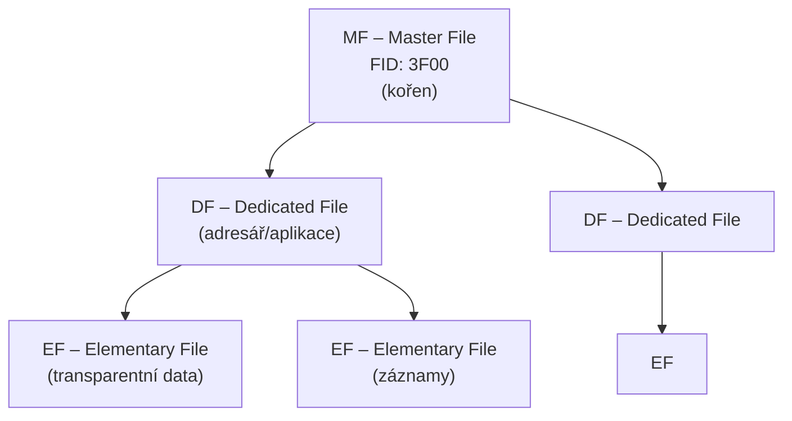
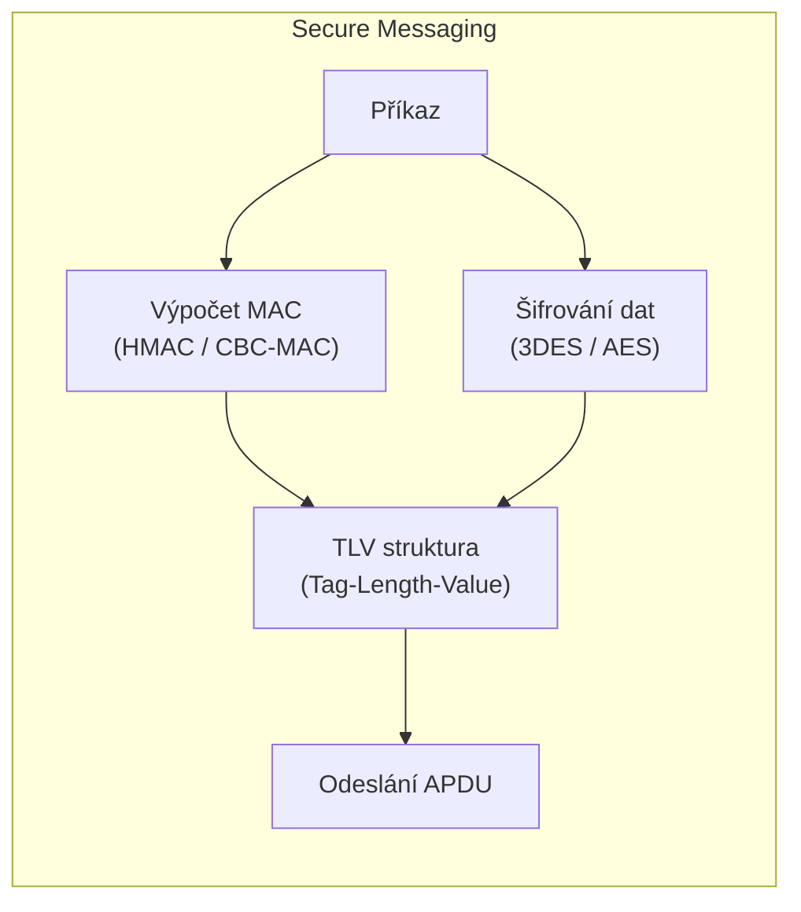

# 11. Čipové karty

---

## APDU – komunikace ISO 7816

### Formát příkazu a odpovědi

=== "Command APDU"
    ```
    CLA | INS | P1 | P2 | [Lc | DATA | Le]
    ```
    
    | Pole | Délka | Popis |
    |------|-------|-------|
    | CLA | 1 B | Třída instrukce |
    | INS | 1 B | Kód instrukce |
    | P1, P2 | 2 B | Parametry |
    | Lc | 0/1/3 B | Délka dat příkazu |
    | DATA | Lc B | Data příkazu |
    | Le | 0/1/3 B | Očekávaná délka odpovědi |

=== "Response APDU"
    ```
    [DATA] | SW1 | SW2
    ```
    
    | Status Word | Význam |
    |-------------|--------|
    | `90 00` | OK – úspěch |
    | `6A 82` | Soubor nenalezen |
    | `69 83` | Authentication method blocked |
    | `63 Cx` | Counter = x, operace selhala |

### Příklad – SELECT aplikace

```
00  A4  04  00  06  41 42 43 44 45 46
│   │   │   │   │   └── AID = ABCDEF (6 bytů)
│   │   │   │   └────── Lc = 6
│   │   │   └────────── P2 = 00
│   │   └────────────── P1 = 04 (select by name)
│   └────────────────── INS = A4 (SELECT)
└────────────────────── CLA = 00
```

---

## Souborový systém ISO 7816-4



### Typy Elementary Files

| Typ | Popis |
|-----|-------|
| **Transparent** | Binární data, přístup přes offset + délka |
| **Linear Fixed** | Záznamy pevné délky |
| **Linear Variable** | Záznamy proměnné délky |
| **Cyclic** | Cyklický buffer záznamů |

---

## Secure Messaging



!!! info "TLV (Tag-Length-Value)"
    Každé datové pole je zakódováno jako:
    ```
    Tag (1-3 B) | Length (1-3 B) | Value (Length B)
    ```
    
    Příklad:
    ```
    87 11 01 <16 bytů šifrovaných dat>
    8E 08 <8 bytů MAC>
    ```

### Základní bezpečnostní funkce čipové karty

| Funkce | Popis |
|--------|-------|
| **PIN ověření** | Ochrana přístupu (blokace po N neúspěších) |
| **Secure Channel** | Šifrovaná + autentizovaná komunikace |
| **Key Diversification** | Unikátní klíče pro každou kartu |
| **Anti-tampering** | Fyzická ochrana (mesh, zener diody, senzory) |
