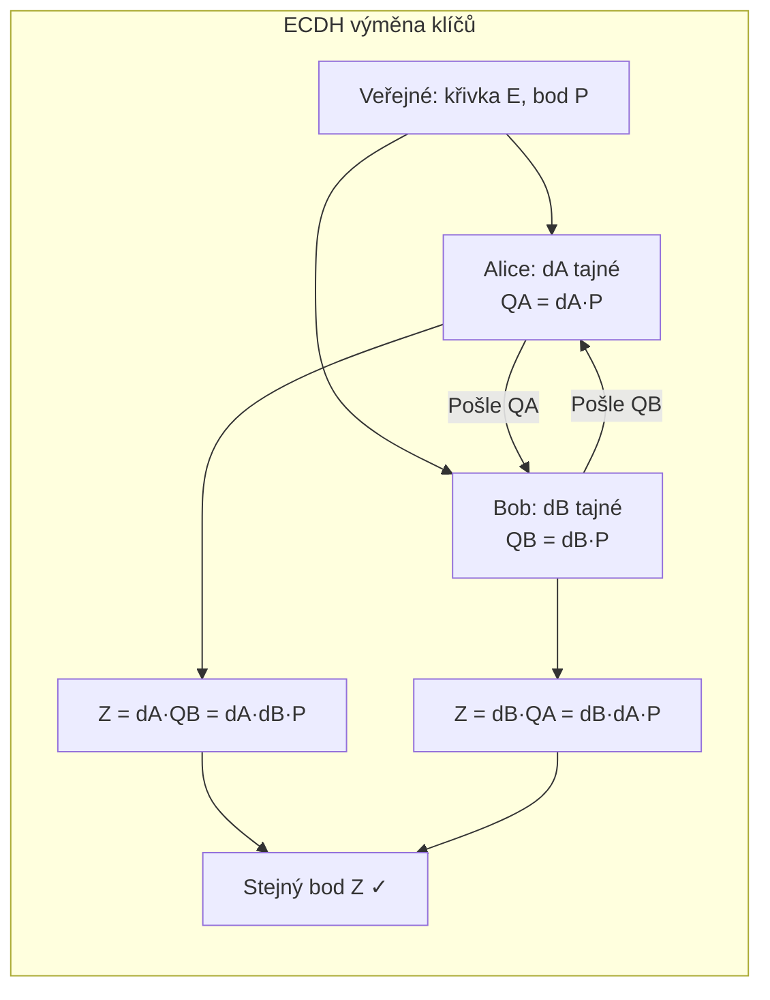

# 6. ECC – Kryptografie eliptických křivek

---

## Sčítání bodů na křivce

!!! info "Eliptická křivka nad GF(p)"
    $$y^2 \equiv x^3 + ax + b \pmod{p}, \quad |4a^3 + 27b^2|_p \neq 0$$

### Geometrická interpretace P + Q

```
y
│         *Q
│       /  \
│      /    \
│     /     *-R (průsečík)
│    *P      |
│            *(R = P+Q, odraz přes osu x)
└──────────────── x
```

**Postup:** Spojíme P a Q přímkou → najdeme průsečík −R → odrazíme přes osu x → R = P+Q.

### Formule pro P + Q (P ≠ Q)

!!! info "Formule"
    Směrnice: $s = \dfrac{y_Q - y_P}{x_Q - x_P} \bmod p$

    $$x_R = s^2 - x_P - x_Q \bmod p$$
    $$y_R = s(x_P - x_R) - y_P \bmod p$$

### Formule pro 2P (tečna)

!!! info "Formule"
    Směrnice: $s = \dfrac{3x_P^2 + a}{2y_P} \bmod p$

    Souřadnice $x_{2P}, y_{2P}$ stejnou formulí jako výše.

!!! success "Numerický příklad"
    $E: y^2 \equiv x^3 + 2x + 2 \pmod{17}$, $P = [5, 1]$

    $$s = (2 \cdot 1)^{-1} \cdot (75 + 2) \bmod 17 = 9 \cdot 9 \bmod 17 = 13$$
    $$x_{2P} = 169 - 10 \bmod 17 = 6$$
    $$y_{2P} = 13(5 - 6) - 1 \bmod 17 = 3$$
    
    $2P = [6, 3]$ ✓

---

## ECDLP a ECC Diffie-Hellman

!!! info "ECDLP – Elliptic Curve Discrete Logarithm Problem"
    Dáno $P$ a $Q = kP$ na křivce $E$ → **najdi $k$**.
    
    - Nejlepší útok: **Pollardova $\rho$**, složitost $O(\sqrt{\pi r/2})$ kde $r = \#E$
    - Pro $r \approx 2^{256}$ → $2^{128}$ kroků (≈ AES-128)
    - Index calculus **nelze aplikovat** na ECC → klíče jsou 6–10× kratší než RSA při stejné bezpečnosti

### ECDH výměna klíčů



### Srovnání délek klíčů: ECC vs. RSA

| Symetrická bezpečnost | RSA | ECC |
|-----------------------|-----|-----|
| 80 bitů | 1024 b | 160 b |
| 128 bitů | 3072 b | 256 b |
| 256 bitů | 15360 b | 521 b |

!!! success "Výhoda ECC"
    Při stejné bezpečnostní úrovni jsou klíče ECC **6–10× kratší** → rychlejší operace, méně paměti (ideální pro IoT, čipové karty).
