# 9. Generování klíčů

---

## Čínská věta o zbytcích (CRT)

!!! info "Formule"
    $$x \equiv a_i \pmod{m_i} \;\forall i \implies x = \sum_i a_i M_i y_i \pmod{M}$$
    
    kde $M = \prod m_i$, $M_i = M/m_i$, $y_i = M_i^{-1} \bmod m_i$.

**Použití:** RSA-CRT, exponencování s modulem.

---

## Legendreův a Jacobiho symbol

=== "Legendreův symbol"
    $$\left(\frac{a}{p}\right) = \begin{cases}1 & \text{a je QR mod p}\\-1 & \text{a je QNR mod p}\end{cases}$$
    
    **Eulerovo kritérium:** $\left(\frac{a}{p}\right) \equiv a^{(p-1)/2} \pmod{p}$

=== "Jacobiho symbol"
    $$\left[\frac{a}{n}\right] = \prod_i \left(\frac{a}{p_i}\right)^{\alpha_i}, \quad n = \prod p_i^{\alpha_i}$$
    
    !!! warning "Pozor"
        Jacobi = +1 neznamená QR (jen Legendreův symbol to zaručuje pro prvočíslo $p$).

---

## Rabin-Millerův test prvočíselnosti

```mermaid
flowchart TD
    START["Testované číslo p"] --> WRITE["Zapiš p-1 = 2ᵇ·m, m liché"]
    WRITE --> RANDA["Zvolíme náhodné a, 1 < a < p"]
    RANDA --> Z0["z = aᵐ mod p"]
    Z0 --> IF1{"z == 1 ?"}
    IF1 -->|"Ano"| MAYBE["Pravděpodobně prvočíslo\n(zkus další a)"]
    IF1 -->|"Ne"| LOOP["j=0"]
    LOOP --> IF2{"z == p-1 ?"}
    IF2 -->|"Ano"| MAYBE
    IF2 -->|"Ne, j≤b-2"| SQ["z = z² mod p, j++"]
    SQ --> IF2
    IF2 -->|"Ne, j>b-2"| COMP["JISTĚ SLOŽENÉ"]
    MAYBE --> |"Opakuj t-krát"| RANDA
    MAYBE --> |"Po t testech"| PRIME["Prvočíslo\ns pravděp. 1-4⁻ᵗ"]
    style COMP fill:#450a0a,stroke:#f87171
    style PRIME fill:#064e3b,stroke:#34d399
```



!!! info "Přesnost testu"
    Chyba: složené číslo projde testem s pravděpodobností $\leq 4^{-t}$.
    
    Pro $t = 20$ → chyba $\leq 4^{-20} \approx 10^{-12}$.

---

## PRNG a TRNG

=== "PRNG – Blum-Blum-Shub"
    $$X_{n+1} = X_n^2 \bmod m, \quad m = pq, \; p, q \equiv 3 \pmod{4}$$

    ```mermaid
    flowchart LR
        SEED["X₀ (seed)"] --> SQ2["X₁ = X₀² mod m"]
        SQ2 --> BIT["Výstup: LSB(X₁)"]
        SQ2 --> SQ3["X₂ = X₁² mod m"]
        SQ3 --> BIT2["Výstup: LSB(X₂)"]
        SQ3 --> DOTS2["…"]
    ```

    Bezpečnost spojena s faktorizací $m$. **Pomalý, ale prokazatelně bezpečný.**

=== "TRNG – fyzikální zdroje entropie"
    - Radioaktivní rozpad
    - Atmosférický šum (random.org)
    - Tepelný šum
    - Pohyb myši, prodlevy klávesnice

    **Von Neumannův dekorelátor** (odstranění biasu):
    
    | Vstup | Výstup |
    |-------|--------|
    | `00`, `11` | – (zahodit) |
    | `01` | `0` |
    | `10` | `1` |

!!! tip "CSPRNG v praxi"
    Operační systémy kombinují TRNG (pro seedování) s CSPRNG (pro rychlé generování):
    
    - Linux: `/dev/random`, `/dev/urandom`, `getrandom()`
    - Windows: `BCryptGenRandom()`
    - Standard: **NIST SP 800-90A** (CTR_DRBG, Hash_DRBG)
