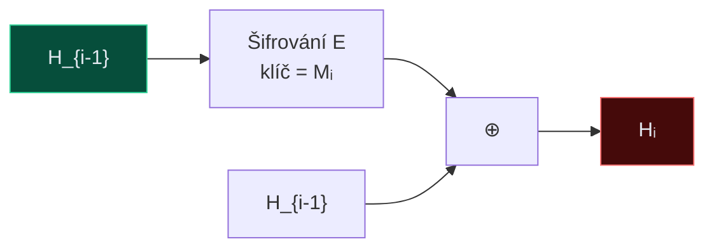
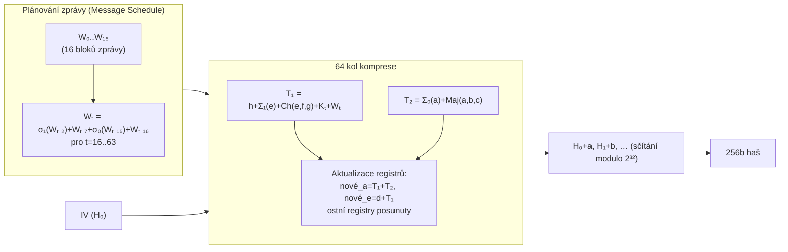

# 4. Hašovací funkce

Hašovací funkce $H: \{0,1\}^* \to \{0,1\}^n$ musí splňovat tři bezpečnostní vlastnosti:

=== "Preimage resistance"
    Ze zadaného $h$ nelze najít $m$ : $H(m) = h$.
    
    **Složitost:** $O(2^n)$

=== "2nd preimage resistance"
    Ze zadaného $m$ nelze najít $m' \neq m$ : $H(m') = H(m)$.
    
    **Složitost:** $O(2^n)$

=== "Collision resistance"
    Nelze nalézt *libovolná* $m \neq m'$ : $H(m) = H(m')$.
    
    **Narozeninový paradox:** $O(2^{n/2})$ pokusů.

---

## Damgård-Merklova konstrukce

```mermaid
flowchart LR
    M["Zpráva M"] --> PAD["Padding\n+ délka M"]
    PAD --> M1["M₁"] & M2["M₂"] & MT["Mₜ"]
    IV["IV\n(const)"] --> F1["f(H₀, M₁)"] --> H1["H₁"]
    M1 --> F1
    H1 --> F2["f(H₁, M₂)"] --> H2["H₂"]
    M2 --> F2
    H2 --> FT["f(Hₜ₋₁, Mₜ)"] --> HT["H(M) = Hₜ"]
    MT --> FT
    style IV fill:#1a1d2e,stroke:#fbbf24
    style HT fill:#1a1d2e,stroke:#f87171
```

### Davies-Meyerova kompresní funkce

!!! info "Formule"
    $$H_i = E_{M_i}(H_{i-1}) \oplus H_{i-1}$$

XOR zabraňuje fixním bodům (bez XOR by $E_M(H) = H$ byl problém).

---

## SHA-256 – jedno kolo

64 kol, 8 registrů $a, b, c, d, e, f, g, h$ (každý 32 bitů).

### Operace v jednom kole $t$

| Výpočet | Formule |
|---------|---------|
| $T_1$ | $h + \Sigma_1(e) + Ch(e,f,g) + K_t + W_t$ |
| $T_2$ | $\Sigma_0(a) + Maj(a,b,c)$ |
| nové $a$ | $T_1 + T_2$ |
| nové $e$ | $d + T_1$ |
| ostatní | registry posunuty (b←a, c←b, …) |

**Pomocné funkce:**
$$Ch(e,f,g) = (e \wedge f) \oplus (\neg e \wedge g)$$
$$Maj(a,b,c) = (a \wedge b) \oplus (a \wedge c) \oplus (b \wedge c)$$
$$\Sigma_1(e) = (e \ggg 6) \oplus (e \ggg 11) \oplus (e \ggg 25)$$
$$\Sigma_0(a) = (a \ggg 2) \oplus (a \ggg 13) \oplus (a \ggg 22)$$

### Kompletní schéma SHA-256

### Srovnání hašovacích funkcí

| Funkce | Výstup | Blok | Kola | Stav |
|--------|--------|------|------|------|
| SHA-1 | 160b | 512b | 80 | ❌ PROLOMEN 2017 |
| SHA-256 | 256b | 512b | 64 | ✅ Bezpečný |
| SHA-512 | 512b | 1024b | 80 | ✅ Bezpečný |
| SHA-3/Keccak | 224–512b | variabilní | 24 | ✅ Bezpečný |

---

## HMAC

!!! info "Formule"
    $$\text{HMAC}_K(M) = H\bigl((K^+ \oplus \text{opad}) \;\|\; H\bigl((K^+ \oplus \text{ipad}) \;\|\; M\bigr)\bigr)$$

    kde `ipad = 0x36...` a `opad = 0x5C...`

```mermaid
flowchart LR
    K["Klíč K"] --> KP["K⁺ = K doplněný\nnulami na délku bloku"]
    KP --> IKXOR["K⁺ ⊕ ipad (0x36…)"]
    KP --> OKXOR["K⁺ ⊕ opad (0x5C…)"]
    M["Zpráva M"] --> ICON["(ipad_key ‖ M)"]
    IKXOR --> ICON
    ICON --> IH["H(ipad_key ‖ M)\nVnitřní haš"]
    IH --> OCON["(opad_key ‖ inner_hash)"]
    OKXOR --> OCON
    OCON --> OH["H(opad_key ‖ inner_hash)\nVnější haš = HMAC"]
    style OH fill:#1a1d2e,stroke:#f87171
```

!!! success "Proč dvojité hashování?"
    Odolává **length extension útokům** (útok na jednoduché $H(K \| M)$). Bezpečnost: útok vyžaduje útok na $H$ nebo znalost klíče.
