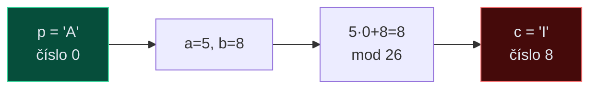

# 1. Klasická kryptografie

Klasická kryptografie operuje nad přirozeným jazykem. Bezpečnost závisí na tajnosti algoritmu nebo klíče, nikoli na matematicky tvrdém problému. Principy **substituce** a **transpozice** jsou základem moderní kryptografie.

---

## Caesarova šifra

!!! info "Formule"
    $$c = |p + k|_{26} \qquad d = |c - k|_{26}$$

    Každé písmeno se posune o konstantu $k$ v abecedě.

**Příklad pro $k = 3$:**

| Plaintext  | K | R | Y | P | T | O |
|------------|---|---|---|---|---|---|
| Posun (+3) | + | + | + | + | + | + |
| Ciphertext | N | U | B | S | W | R |


!!! warning "Bezpečnost"
    Jen **25 různých klíčů** → hrubá síla triviální. Frekvenční analýza stačí i bez znalosti $k$.

---

## Afinní šifra

!!! info "Formule"
    $$c = |a \cdot p + b|_{26} \qquad d = |a^{-1}(c - b)|_{26}$$



**Podmínka:** $\gcd(a, 26) = 1$ – jinak mapování není bijekce (více písmen → stejné).

Možné hodnoty $a$: `{1, 3, 5, 7, 9, 11, 15, 17, 19, 21, 23, 25}` → **12 hodnot** × 26 hodnot $b$ = **312 klíčů**.

**Dešifrování:** inverze $a^{-1}$ se hledá rozšířeným Euklidovým algoritmem.

> Příklad: $5^{-1} \bmod 26 = 21$ (protože $5 \cdot 21 = 105 \equiv 1$)

---

## Hillova šifra

!!! info "Formule (bigramy, n=2)"
    $$\vec{c} = K \cdot \vec{p} \pmod{26} \qquad \vec{p} = K^{-1} \cdot \vec{c} \pmod{26}$$

**Krok za krokem – šifrování "HE" klíčem $K = \begin{pmatrix}3 & 3 \\ 2 & 5\end{pmatrix}$:**

$$\begin{pmatrix}3 & 3 \\ 2 & 5\end{pmatrix} \cdot \begin{pmatrix}7 \\ 4\end{pmatrix} = \begin{pmatrix}3 \cdot 7 + 3 \cdot 4 \\ 2 \cdot 7 + 5 \cdot 4\end{pmatrix} = \begin{pmatrix}33 \\ 34\end{pmatrix} \equiv \begin{pmatrix}7 \\ 8\end{pmatrix} \pmod{26} \Rightarrow \text{HI}$$


!!! warning "Podmínka invertibility"
    Matice $K$ musí být invertibilní mod 26: $\det(K) \not\equiv 0 \pmod{26}$ a $\gcd(\det(K), 26) = 1$.

---

## Vigenèrova šifra

!!! info "Formule"
    $$c_i = |p_i + k_{(i \bmod V)}|_{26}$$

    Heslo délky $V$ se opakuje.

**Příklad šifrování slova KRYPTOGR klíčem KEY:**

| Pozice | 0 | 1 | 2 | 3 | 4 | 5 | 6 | 7 |
|--------|---|---|---|---|---|---|---|---|
| Plaintext | K | R | Y | P | T | O | G | R |
| Klíč (KEY↺) | K | E | Y | K | E | Y | K | E |
| p+k (mod 26) | 10+10 | 17+4 | 24+24 | 15+10 | 19+4 | 14+24 | 6+10 | 17+4 |
| Ciphertext | **U** | **V** | **W** | **Z** | **X** | **M** | **Q** | **V** |

**Vlastnosti:**

- Klíčový prostor: $26^V$ možností
- Vzdálenost jednoznačnosti: $\delta_U = 1.5V$

**Útoky:**

1. **Kasiskiho test** – hledá opakující se vzory v šifrovém textu → délka hesla
2. **Index koincidence** (Friedman) – odhadne délku klíče statisticky
3. Frekvenční analýza po pozicích (každá je Caesarova šifra)

---

## Sloupcová transpozice

!!! info "Jak funguje (klíč = \"3 1 4 2\")"

```
Plaintext:   K R Y P T O G R A F I E

Klíč:        3  1  4  2       ← pořadí sloupců abecedně
Sloupce:     K  R  Y  P
             T  O  G  R
             A  F  I  E

Permutace:   1→R O F    2→P R E    3→K T A    4→Y G I
ŠT:          ROF | PRE | KTA | YGI  →  ROFPREKTA YGI
```

**Vlastnosti:**

- **Difúze** bez konfúze – vzory frekvenčně zachovány, ale pozice jsou přesunuté
- Dvojitá transpozice výrazně bezpečnější
