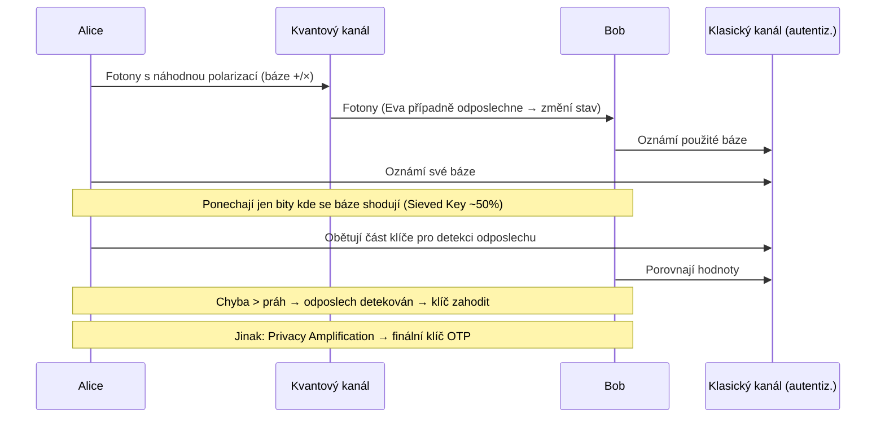

# 7. Kvantová kryptografie

!!! info "Qubit"
    $$|\psi\rangle = \omega_0|0\rangle + \omega_1|1\rangle, \quad \omega_0, \omega_1 \in \mathbb{C}$$
    
    Měřením zkolabuje do $|0\rangle$ nebo $|1\rangle$.
    
    **Heisenbergův princip:** $\Delta x \cdot \Delta p \geq \hbar/2$ → nelze změřit qubit bez ovlivnění jeho stavu → **odposlech je detekovatelný**.

---

## Protokol BB84

### Průběh protokolu

### Příklad přenosu

| Pozice | 1 | 2 | 3 | 4 | 5 | 6 | 7 | 8 |
|--------|---|---|---|---|---|---|---|---|
| Alice bit | 0 | 1 | 1 | 0 | 1 | 0 | 0 | 1 |
| Alice báze | + | + | × | × | + | × | + | × |
| Bob báze | + | × | × | + | + | × | × | × |
| Bob bit | 0 | ? | 1 | ? | 1 | 0 | ? | 1 |
| Shoda bází | ✅ | ❌ | ✅ | ❌ | ✅ | ✅ | ❌ | ✅ |
| **Sieved key** | **0** | | **1** | | **1** | **0** | | **1** |

**Polarizační báze:**

| Báze | 0 | 1 |
|------|---|---|
| `+` (rectilinear) | → | ↑ |
| `×` (diagonal) | ↗ | ↘ |

!!! info "Detekce odposlechu"
    Pravděpodobnost detekce Evy při $n$ obětovaných bitech: $1 - (3/4)^n \to 1$.
    
    - Eva musí hádat bázi (50% šance správně)
    - Při špatné bázi: 50% šance odeslat špatný bit Bobovi
    - Každý odposlechnutý bit: 25% šance způsobit chybu → detekce

!!! success "Výsledek"
    Sdílený tajný klíč použitelný jako **One-Time Pad (OTP)** → nepodmíněná bezpečnost.
    
    **Privacy Amplification** zmenší klíč, aby eliminovala jakoukoliv informaci, kterou mohla Eva získat.
