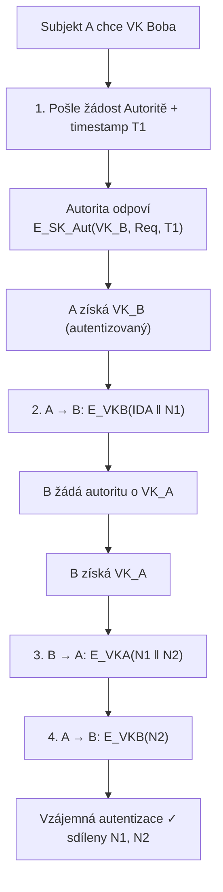
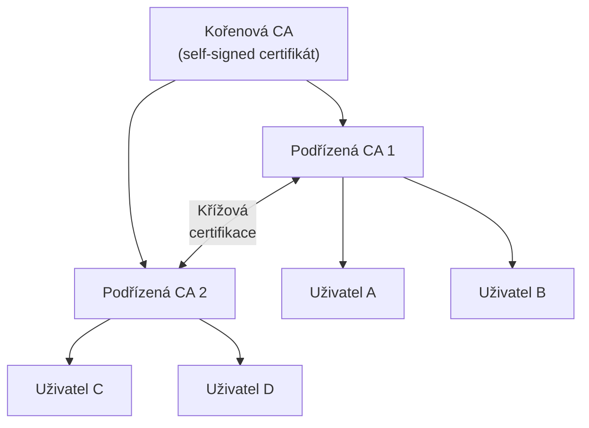

# 10. PKI – Infrastruktura veřejného klíče

---

## Protokol výměny klíčů přes autoritu



---

## Certifikát X.509

!!! info "Struktura certifikátu"

    ```
    Certificate:
      Serial Number:    12345
      Signature Alg:   sha256WithRSAEncryption
      Issuer:          CN=Root CA, O=Org
      Validity:
        Not Before:    2024-01-01
        Not After:     2025-01-01
      Subject:         CN=Alice, O=CVUT
      Public Key:      RSA 2048-bit
        Exponent: 65537
        Modulus: ab:cd:ef:...
      Extensions (v3):
        Key Usage:     Digital Signature
        SAN:           alice@cvut.cz
      Signature:       SK_Aut(hash výše)
    ```

**Podpis certifikátu:** $\text{SK}_\text{CA}(H(\text{obsah certifikátu}))$

---

## Hierarchie certifikačních autorit



!!! info "Řetězec certifikátů"
    U1 → SUB1 → ROOT
    
    Platný ↔ **všechny certifikáty v řetězci platné**.

### Typy certifikačních autorit

| Typ | Popis |
|-----|-------|
| **Root CA** | Kořen důvěry, self-signed, offline |
| **Intermediate CA** | Vydává certifikáty pro end entity |
| **End Entity** | Certifikáty uživatelů, serverů, kódu |

### Odvolání certifikátů

| Mechanismus | Popis |
|-------------|-------|
| **CRL** (Certificate Revocation List) | Periodicky zveřejňovaný seznam odvolání |
| **OCSP** (Online Certificate Status Protocol) | Real-time dotaz na stav certifikátu |
| **OCSP Stapling** | Server přikládá podepsanou OCSP odpověď |

!!! tip "Web PKI"
    Prohlížeče obsahují **Trust Store** s ~150 kořenovými CA. Certifikáty pro HTTPS musí být vydány jednou z těchto CA a zaregistrovány v **Certificate Transparency logu** (RFC 6962).
