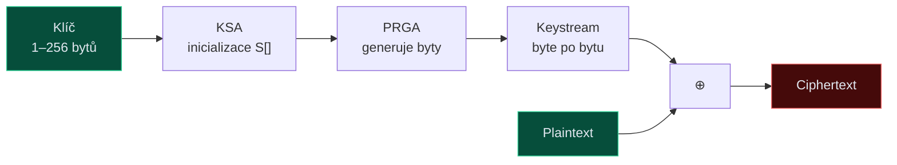
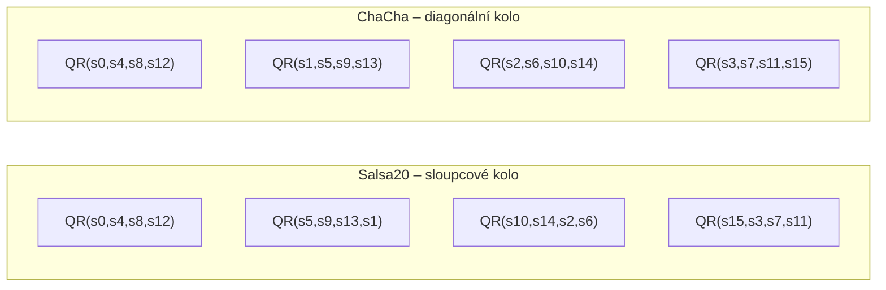
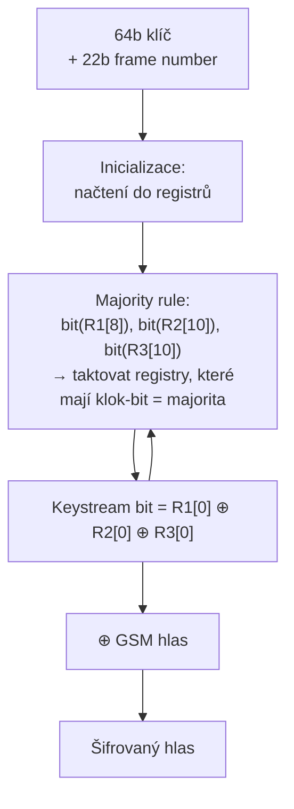

# 2. Proudové šifry

Proudová šifra generuje **keystream** $K_1, K_2, \ldots$ a šifruje: $c_i = p_i \oplus K_i$. Bezpečnost závisí na nepředvídatelnosti keystreamu a délce klíče.

!!! danger "Základní pravidlo"
    Keystream **nesmí být nikdy použit dvakrát** se stejným klíčem.
    Pokud $c_1 \oplus c_2 = p_1 \oplus p_2$ – klíč mizí, útočník rekonstruuje plaintexty.

---

## RC4

=== "Parametry"
    - **Autor:** Ron Rivest, 1987
    - **Stav:** S-box 256 bytů + ukazatele $i, j$
    - **Klíč:** 1–256 bytů
    - **Status:** :octicons-x-circle-fill-16:{ .danger } **PROLOMEN – nepoužívat**

=== "Dva algoritmy"
    1. **KSA** – Key Scheduling Algorithm: inicializace S-boxu
    2. **PRGA** – Pseudo-Random Generation Algorithm: generování keystreamu swapováním

### KSA – inicializace S-boxu

```mermaid
flowchart LR
    A["S = [0..255]\n(identita)"] --> B["for i=0..255:\n  j=(j+S[i]+Key[i mod keylen]) mod 256\n  swap(S[i], S[j])"]
    B --> C["S-box\npromíchán\nklíčem"]
    style A fill:#1a1d2e,stroke:#34d399
    style C fill:#1a1d2e,stroke:#6c8ef5
```



### PRGA – generování keystreamu a šifrování

```mermaid
flowchart LR
    I["i=0, j=0"] --> L["i=(i+1) mod 256"]
    L --> J["j=(j+S[i]) mod 256"]
    J --> SW["swap(S[i], S[j])"]
    SW --> K["K = S[(S[i]+S[j]) mod 256]"]
    K --> XOR["c = p ⊕ K"]
    XOR --> L
    style XOR fill:#1a1d2e,stroke:#f87171
```





!!! warning "Slabost RC4"
    Prvních ~256 bytů keystreamu koreluje s klíčem (**WEP exploit**). Oprava: přeskočit prvních $N$ bytů PRGA.

---

## Salsa20 a ChaCha20

=== "Stav (512 bitů = 16 slov × 32 b)"

    | | | | |
    |---|---|---|---|
    | **expa** | **nd 3** | **2-by** | **te k** |
    | k₀ | k₁ | k₂ | k₃ |
    | k₄ | k₅ | k₆ | k₇ |
    | ctr | n₀ | n₁ | n₂ |

    - **tučně** = konstanta `"expand 32-byte k"`
    - k₀–k₇ = klíč (256 bitů)
    - ctr = čítač
    - n₀–n₂ = nonce

=== "Quarter Round (QR) – jádro ARX"
    ```python
    QR(a, b, c, d):
        b ^= (a + d) <<< 7
        c ^= (b + a) <<< 9
        d ^= (c + b) <<< 13
        a ^= (d + c) <<< 18
    ```

    **ARX** = **A**dd + **R**otate + **X**OR. Žádné S-boxy, ideální pro SW.

### Salsa20 vs ChaCha – struktura kola

```mermaid
flowchart LR
    IN["Stav X₀\n(klíč+nonce+čítač)"] --> R["20 kol\n(10× double-round)"]
    R --> ADD["X₀ + X₂₀\n(32b sčítání)"]
    ADD --> OUT["512b keystream block"]
    OUT --> XOR["⊕ plaintextový blok"]
    XOR --> C["64B ciphertextu"]
    style IN fill:#1a1d2e,stroke:#34d399
    style C fill:#1a1d2e,stroke:#f87171
```





!!! success "Standard"
    ChaCha20 se liší **diagonálními koly** místo sloupcových → lepší difúze v prvních kolech.
    Standard **TLS 1.3**, RFC 8439.

---

## A5/1 (GSM)

### Tři LFSR registry s nepravidelným taktováním

| Registr | Délka | Tapy | Takt-bit |
|---------|-------|------|----------|
| R1 | 19 bitů | {18, 17, 16, 13} | pozice 8 |
| R2 | 22 bitů | {21, 20} | pozice 10 |
| R3 | 23 bitů | {22, 21, 20, 7} | pozice 10 |

**Schéma R1 (19 bitů):**
```
[b18] [TAP:17] [TAP:16] [...] [TAP:13] [...] [CLK:8⊙] [...] [b0→]
```

Legenda: `TAP` = zpětná vazba XOR · `CLK⊙` = taktovací bit · `b0→` = výstupní bit



!!! danger "Prolomen"
    Taktovací pravidlo: ze tří klok-bitů se určí majorita (alespoň 2 stejné). Taktují se registry se shodnou hodnotou klok-bitu.
    
    - Perioda: cca $2^{40.2}$
    - **V roce 2009 prolomen** time-memory trade-off v reálném čase
