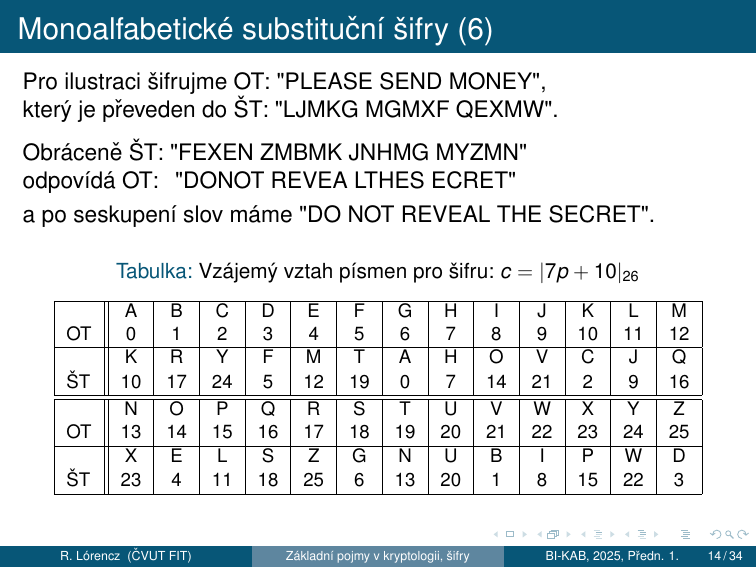
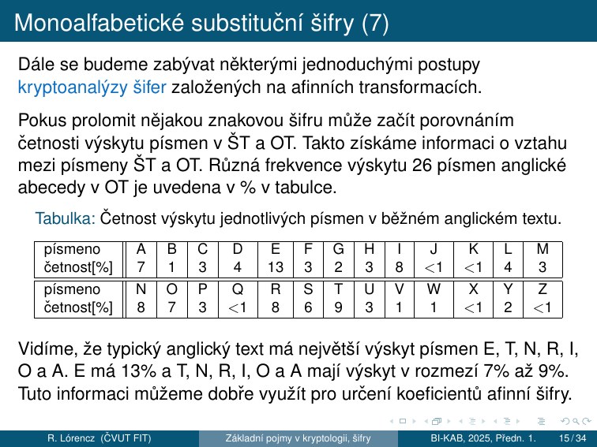
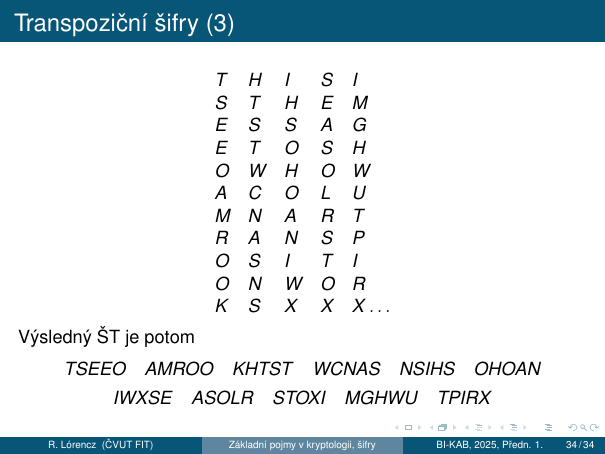

# 1. Klasická kryptografie

!!! abstract "Cíle kapitoly"
    - Pochopit základní pojmy kryptologie a modely útočníka
    - Umět zašifrovat/dešifrovat všechny klasické šifry (Caesar, Afinní, Hill, Vigenère, Transpozice)
    - Znát kryptoanalýzu každé šifry — frekvenční analýza, Kasiski, IC
    - Rozumět pojmům **konfúze** a **difúze**, **substituce** a **transpozice**

Klasická kryptografie operuje nad přirozeným jazykem (abeceda A–Z = čísla 0–25). Bezpečnost závisí na tajnosti algoritmu nebo klíče, nikoli na matematicky tvrdém problému.

---

## 1.0 Základní pojmy v kryptologii

### Kryptologie, kryptografie, kryptoanalýza

- **Kryptologie** – tvorba a luštění šifer
    - **Kryptografie** – věda o tvorbě šifer
    - **Kryptoanalýza** – věda o luštění šifer
- **Otevřený Text (OT)** – text, který je určen k utajení
- **Šifrování** – proces převádějící otevřený text do **Šifrového Textu (ŠT)**
- **Šifra** – metoda, která převádí text do utajené formy
- **Dešifrování** – proces opačný k procesu šifrování, je založený na znalosti šifry

**Luštění – kryptoanalýza:**

- **Identifikace** – jaký šifrovací systém byl použit
- **Prolomení** – způsob šifrování zprávy, určení neměnných částí systému. Kolik šifrových zpráv je potřebných k prolomení
- **Nastavení** – určení, jak se mění proměnlivé části kryptosystému

### Šifra vs. kód

- **Šifra** – utajení obsahu zprávy před nepovolanou osobou
- **Kód** – **neutajuje se zpráva**, ale upravuje tak, aby ji bylo možné přenést přes nějaký kanál (např. kódy pro detekci chyb – paritní, nebo samoopravné kódy – Hammingovy kódy)

**Šifrovací systémy** vytváří šifrovou zprávu z OT pomocí šifrovacího algoritmu. Do nástupu počítačů dominovaly 3 základní metody:

1. **substituční** – záměna znaků
2. **transpoziční** – přeuspořádání znaků
3. **metoda kódové knihy**

Substituční a transpoziční šifry jsou **symetrické** – používají stejný klíč pro šifrování i dešifrování.

### Šifrování pomocí kódové knihy

Slovník s běžnými frázemi nahrazovanými kódovými skupinami (čtveřice/pětice písmen nebo čísel).

- K jedné frázi může existovat více kódových skupin → ztíží identifikaci frekventovaných výrazů
- Překlad zprávy do málo používaného jazyka lze považovat za šifrování pomocí kódové knihy (příklad: Navajové – japonská armáda v pacifiku)
- Osobní těsnopis (středověk) – pravidelný výskyt symbolů poskytuje dostatečný klíč k rozluštění

### Posuzování spolehlivosti šifrových systémů

Při posuzování navrhovaného šifrovacího systému je důležité posoudit jeho sílu – odolnost vůči všem známým útokům za **předpokladu znalosti typu šifrovacího systému** (Kerckhoffsův princip).

Odolnost šifrovacího systému je posuzována v 5 situacích. Kryptoanalytik provádí luštění se znalostí:

| # | Útok | Znalost kryptoanalytika |
|---|------|-------------------------|
| 1 | **Ciphertext-only attack** | Pouze ŠT (systém rozluštěný v této situaci je za normálních podmínek nepoužitelný) |
| 2 | **Known-plaintext attack** | ŠT a jeden nebo více OT |
| 3 | **Chosen-plaintext attack** | ŠT a odpovídající **vybraný** OT |
| 4 | **Chosen-ciphertext attack** | ŠT, který je vybrán na základě určitého významu, a k tomu dešifrovaný odpovídající OT |
| 5 | **Chosen-text attack** | Sjednocení metody 3. a 4. |

### Steganografie a terminologie textu

**Steganografie** – ukrytí samotné **existence** zprávy (nejen jejího obsahu). Zakládá se na principu vkládání zprávy do běžných a nepodezřelých objektů – textů, programů, obrázků atd.

**Terminologie analýzy textu:**

- **Monogram** – jedno písmeno v jakékoliv abecedě
- **Bigram** – jakákoliv dvojice sousedních písmen v textu
- **Trigram** – trojice po sobě následujících písmen
- **Polygram** – nespecifikovaný počet písmen po sobě jdoucích v textu
- **Symbol** – jakékoliv písmeno, číslice, interpunkční znaménko atd.
- **Řetězec** – jakákoliv posloupnost po sobě jdoucích symbolů

---

## 1.1 Monoalfabetické substituční šifry

### Číselné ekvivalenty písmen

Každému písmenu anglické abecedy přiřadíme číslo:

| A | B | C | D | E | F | G | H | I | J | K  | L  | M  |
|---|---|---|---|---|---|---|---|---|---|----|----|-----|
| 0 | 1 | 2 | 3 | 4 | 5 | 6 | 7 | 8 | 9 | 10 | 11 | 12 |

| N  | O  | P  | Q  | R  | S  | T  | U  | V  | W  | X  | Y  | Z  |
|----|----|----|----|----|----|----|----|----|----|----|----|----|
| 13 | 14 | 15 | 16 | 17 | 18 | 19 | 20 | 21 | 22 | 23 | 24 | 25 |

### Caesarova šifra

!!! info "Formule"
    **Šifrování:** $c = |p + k|_{26}$

    **Dešifrování:** $p = |c - k|_{26}$

    Tradičně $k = 3$: A → D, B → E, ..., W → Z, X → A, Y → B, Z → C.

#### Příklad šifrování: zpráva „THIS MESSAGE IS TOP SECRET", $k = 3$

Zprávu seskupíme do bloků po pěti písmenech:

```
THISM ESSAG EISTO PSECR ET
```

Číselné ekvivalenty:

```
19 7 8 18 12    4 18 18 0 6    4 8 18 19 14    15 18 4 2 17    4 19
```

Transformace $c = |p + 3|_{26}$:

```
22 10 11 21 15    7 21 21 3 9    7 11 21 22 17    18 21 7 5 20    7 22
```

Šifrový text: **WKLVP HVVDJ HLVWR SVHFU HW**

#### Příklad dešifrování: ŠT „WKLVL VKRZZ HGHFL SKHU"

Transformace $p = |c - 3|_{26}$:

```
22 10 11 21 11 → 19 7 8 18 8   → T H I S I
21 10 17 25 25 → 18 7 14 22 22 → S H O W W
7 6 7 5 11    → 4 3 4 2 8     → E D E C I
18 10 7 20    → 15 7 4 17     → P H E R
```

Výsledek: **THIS IS HOW WE DECIPHER**

#### Jednoduché substituční šifry – zobecnění

Šifry s transformací posunu jsou definovány vztahem $c = |p + k|_{26}$, kde $k$ je posun. Caesarova šifra je speciálním případem pro $k = 3$.

!!! danger "Bezpečnost: Triviálně slabá"
    - **Klíčový prostor:** pouze **25 klíčů** → hrubá síla v sekundách
    - **Frekvenční analýza:** nejčastější písmeno v angličtině je E → stačí najít, čemu odpovídá

---

### Afinní šifra

!!! info "Formule"
    **Šifrování:** $c = |ap + b|_{26}, \quad 0 \le c \le 25$

    **Dešifrování:** $p = |a^{-1}(c - b)|_{26}, \quad 0 \le p \le 25$

    Klíč = dvojice $(a, b)$. **Podmínka:** $\gcd(a, 26) = 1$.

Obecnější šifrou oproti Caesarovi je **afinní transformace** $c = |ap + b|_{26}$, kde $a, b \in \mathbb{Z}$ a $\gcd(a, 26) = 1$. Transformace posunem je afinní transformací pro $a = 1$.

Existuje 12 konstant $a$ (kde $\varphi(26) = 12$) a 26 hodnot $b$, tedy $12 \times 26 = 312$ afinních transformací.

**Povolené hodnoty $a$:** {1, 3, 5, 7, 9, 11, 15, 17, 19, 21, 23, 25} → **12 hodnot**

**Proč $\gcd(a, 26) = 1$?** Pokud podmínka nesplněna, mapování není bijekce – více písmen OT se zobrazí na stejný znak, dešifrování je nejednoznačné.

**Velikost klíčového prostoru:** $12 \times 26 = \mathbf{312}$ klíčů

#### Příklad: $a = 7$, $b = 10$, šifrování „PLEASE SEND MONEY"

$c = |7p + 10|_{26}$ → ŠT: **LJMKG MGMXF QEXMW**

Pro dešifrování: $a^{-1} = |7|^{-1}_{26} = 15$ (protože $7 \times 15 = 105 = 4 \times 26 + 1$), tedy $p = |15(c - 10)|_{26} = |15c + 6|_{26}$.

Vzájemný vztah písmen pro šifru $c = |7p + 10|_{26}$:



#### Příklad: $a = 7$, $b = 10$, dešifrování

ŠT „FEXEN ZMBMK JNHMG MYZMN" → OT: **DO NOT REVEAL THE SECRET**

---

## 1.2 Kryptoanalýza monoalfabetických šifer

### Frekvenční analýza

Pokus prolomit znakovou šifru může začít porovnáním četnosti výskytu písmen v ŠT a OT.

**Četnost výskytu jednotlivých písmen v běžném anglickém textu:**



| A | B | C | D | E  | F | G | H | I | J   | K   | L | M |
|---|---|---|---|----|---|---|---|---|-----|-----|---|---|
| 7 | 1 | 3 | 4 | **13** | 3 | 2 | 3 | 8 | <1 | <1 | 4 | 3 |

| N | O | P | Q | R | S | T | U | V | W | X   | Y | Z   |
|---|---|---|---|---|---|---|---|---|---|-----|---|-----|
| 8 | 7 | 3 | <1| 8 | 6 | 9 | 3 | 1 | 1 | <1 | 2 | <1 |

Typický anglický text má největší výskyt písmen **E (13%), T, N, R, I, O, A (7–9%)**.

### Příklad – útok na Caesarovu šifru (ciphertext-only)

ŠT: `YFXMP CESPZ CJTDF DPQFW QZCPY NTASP CTYRX PDDLR PD`

Četnosti výskytu písmen v ŠT:

| A | B | C | D | E | F | G | H | I | J | K | L | M |
|---|---|---|---|---|---|---|---|---|---|---|---|---|
| 1 | 0 | 4 | 5 | 1 | 3 | 0 | 0 | 0 | 1 | 0 | 1 | 1 |
| N | O | **P** | Q | R | S | T | U | V | W | X | Y | Z |
| 1 | 0 | **7** | 2 | 2 | 2 | 3 | 0 | 0 | 1 | 2 | 3 | 2 |

**P** má největší výskyt → odpovídá **E** v OT. Tedy $|4 + k|_{26} = 15$, z toho $k = 11$.

$c = |p + 11|_{26}$, obráceně $p = |c - 11|_{26}$ → OT: **NUMBER THEORY IS USEFUL FOR ENCIPHERING MESSAGES.**

### Příklad – útok na afinní šifru (ciphertext-only)

ŠT:
```
USLEL JUTCC YRTPS URKLT YGGFV
ELYUS LRYXD JURTU ULVCU URJRK
QLLQL YXSRV LBRYZ CYREK LVEXB
RYZDG HRGUS LJLLM LYPDJ LJTJU
FALGU PTGVT JULYU SLDAL TJRWU
SLJFE OLPU
```

Četnosti:

| A | B | C | D | E | F | G | H | I | J  | K | **L**  | M |
|---|---|---|---|---|---|---|---|---|----|----|----|----|
| 2 | 2 | 4 | 4 | 5 | 3 | 6 | 1 | 0 | 10 | 3 | **22** | 1 |
| N | O | P | Q | R  | S | T | **U** | V | W | X | Y  | Z |
|---|---|---|---|----|----|---|----|----|---|---|----|----|
| 0 | 1 | 4 | 2 | 12 | 7 | 8 | **16** | 5 | 1 | 3 | 10 | 2 |

**L** (22×) odpovídá **E**, **U** (16×) odpovídá **T** v OT. Podle $c = |ap + b|_{26}$:

$$|4a + b|_{26} = 11 \quad \text{(E=4 → L=11)}$$

$$|19a + b|_{26} = 20 \quad \text{(T=19 → U=20)}$$

Řešení: $|a|_{26} = 11$, $|b|_{26} = 19$. Dešifrovací transformace ($|11|^{-1}_{26} = 19$):

$$p = |19(c - 19)|_{26} = |19c + 3|_{26}, \quad 0 \le p \le 25$$

Výsledek: **THEBE STAPP ROACH TOLEA RNNUM ...**

---

## 1.3 Polygrafické substituční šifry — Hillova šifra

### Motivace

!!! warning "Slabina monoalfabetických šifer"
    Afinní šifry jsou zranitelné při použití kryptoanalýzy založené na **frekvenční analýze** – distribuce četností ŠT odráží distribuci OT.

K eliminaci těchto nevýhod byl vyvinut systém nahrazující bloky určité délky OT bloky ŠT → **šifry polygrafické – blokové**. Tyto šifry na modulární aritmetice vyvinul **Hill v roce 1930**.

### Hillova šifra – bigramy ($n = 2$)

Uvažujeme šifru s blokem jednoho bigramu OT, který je převáděn do ŠT dvoupísmenovými bloky. Pokud zpráva končí blokem s jedním písmenem, přidáváme **X** (padding).

!!! example "Příklad: zpráva „THE GOLD IS BURIED IN ORONO""

    Seskupení: **TH EG OL DI SB UR IE DI NO RO NO.**

    Číselné ekvivalenty: `19 7 | 4 6 | 14 11 | 3 8 | 18 1 | 20 17 | 8 4 | 3 8 | 13 14 | 17 14 | 13 14`

    Klíčová transformace:

    $$c_1 = |5p_1 + 17p_2|_{26}, \qquad c_2 = |4p_1 + 15p_2|_{26}$$

    První blok (19, 7):

    $$c_1 = |5 \cdot 19 + 17 \cdot 7|_{26} = |214|_{26} = 6$$
    $$c_2 = |4 \cdot 19 + 15 \cdot 7|_{26} = |181|_{26} = 25$$

Celý zašifrovaný text převodem na písmena: **GZ SC XN VC DJ ZX EO VC RC LS RC**

### Hillova šifra – maticový zápis

!!! info "Formule (obecná)"
    **Šifrování:** $|\mathbf{c}|_{26} = |\mathbf{A} \cdot \mathbf{p}|_{26}$

    **Dešifrování:** $|\mathbf{p}|_{26} = |\mathbf{A}^{-1} \cdot \mathbf{c}|_{26}$

    kde **A** je matice $n \times n$ a $\gcd(\det \mathbf{A}, 26) = 1$.

Pro bigramy ($n=2$) s výše uvedenou transformací:

$$\left|\begin{pmatrix}c_1 \\ c_2\end{pmatrix}\right|_{26} = \left|\begin{pmatrix}5 & 17 \\ 4 & 15\end{pmatrix} \cdot \begin{pmatrix}p_1 \\ p_2\end{pmatrix}\right|_{26}$$

Dešifrovací matice:

$$\left|\begin{pmatrix}p_1 \\ p_2\end{pmatrix}\right|_{26} = \left|\begin{pmatrix}17 & 5 \\ 18 & 23\end{pmatrix} \cdot \begin{pmatrix}c_1 \\ c_2\end{pmatrix}\right|_{26}$$

### Hillova šifra – trigramy ($n = 3$)

!!! example "Příklad: šifrování zprávy „STOP PAYMENT""

    Šifrovací matice:

    $$\mathbf{A} = \begin{pmatrix}11 & 2 & 19 \\ 5 & 23 & 25 \\ 20 & 7 & 1\end{pmatrix}, \quad \det \mathbf{A} = 5, \quad \gcd(5, 26) = 1 \ ✓$$

    Zpráva seskupena do trojic s paddingem X: **STO | PPA | YME | NTX**

    Číselné ekvivalenty: `18 19 14 | 15 15 0 | 24 12 4 | 13 19 23`

    První blok:

    $$\left|\begin{pmatrix}11 & 2 & 19 \\ 5 & 23 & 25 \\ 20 & 7 & 1\end{pmatrix} \begin{pmatrix}18 \\ 19 \\ 14\end{pmatrix}\right|_{26} = \left|\begin{pmatrix}502 \\ 877 \\ 507\end{pmatrix}\right|_{26} = \begin{pmatrix}8 \\ 19 \\ 13\end{pmatrix}$$

    Celý ŠT: `8 19 13 | 13 4 15 | 0 2 22 | 20 11 0` → **ITN NEP ACW ULA**

    Inverzní matice:

    $$|\mathbf{A}^{-1}|_{26} = \begin{pmatrix}6 & 21 & 11 \\ 21 & 25 & 16 \\ 19 & 3 & 7\end{pmatrix}$$

### Podmínka invertibility matice

Matice $\mathbf{A}$ musí být invertibilní mod 26: $\gcd(\det(\mathbf{A}), 26) = 1$.

Inverze: $\mathbf{A}^{-1} = \det(\mathbf{A})^{-1} \cdot \text{adj}(\mathbf{A}) \pmod{26}$

### Zobecnění – blokové šifrování

Pokud víme, že bloky o velikosti $n$ znaků ŠT $c_{1j}, c_{2j}, \ldots, c_{nj}$ vzájemně odpovídají blokům $n$ znaků OT $p_{1j}, p_{2j}, \ldots, p_{nj}$, obdržíme soustavu $n$ lineárních kongruencí:

$$|\mathbf{AP}|_{26} = |\mathbf{C}|_{26}$$

kde **P** a **C** jsou matice dimenze $n \times n$. Pokud $\gcd(\det \mathbf{P}, 26) = 1$, platí $|\mathbf{A}|_{26} = |\mathbf{CP}^{-1}|_{26}$.

### Kryptoanalýza Hillovy šifry

!!! danger "Slabiny"
    - **Frekvenční analýza** $n$-gramů je možná pouze pro malé $n$ (pro $n = 2$ existuje $26^2 = 676$ kombinací bigram; nejčastější v angličtině: **TH**, pak **HE**)
    - **Known-plaintext attack:** Lze využít lineární závislosti ŠT na OT k získání matice **A** — stačí $n$ párů OT/ŠT bloků
    - **Chosen-plaintext attack:** Zvolím OT tak, aby matice **P** byla jednotková → dostávám přímo $\mathbf{C} = \mathbf{A}$ (klíč)!
    - Pro velké $n$ (např. $n = 10$: $26^{10} \doteq 1.4 \times 10^{14}$ kombinací) je kryptoanalýza velmi obtížná

#### Příklad – known-plaintext útok

Bloky 19 7 a 7 4 odpovídají v ŠT blokům 10 23 a 21 25:

$$\mathbf{A} \begin{pmatrix}19 & 7 \\ 7 & 4\end{pmatrix}_{26} = \begin{pmatrix}10 & 21 \\ 23 & 25\end{pmatrix}_{26}$$

Řešením: $\mathbf{A} = \begin{pmatrix}23 & 17 \\ 21 & 2\end{pmatrix}$, $|\mathbf{A}^{-1}|_{26} = \begin{pmatrix}2 & 9 \\ 5 & 23\end{pmatrix}$.

---

## 1.4 Polyalfabetické substituční šifry

### Definice

Monoalfabetické šifry jsou málo bezpečné – distribuce četnosti ŠT odráží distribuci OT. **Polyalfabetické šifry** řeší tento nedostatek.

**Systém polyalfabetických šifer** nad abecedou $\mathbb{Z}_N$ tvoří konečná nebo nekonečná posloupnost monoalfabetických transformací $(T_1, T_2, \ldots, T_n, \ldots)$. Prostor klíčů: $K = \{T_1, T_2, \ldots, T_n, \ldots\}$.

Speciálním případem jsou **Vigenèrovské šifry** – konečná posloupnost transformací s posunem:

$$K = \{k_1, k_2, \ldots, k_n\}, \quad k_i \in \mathbb{Z}_N$$

### Vigenèrova šifra

!!! info "Formule"
    $$c_j = |p_j + k_{|j|_n}|_N$$

    Číslo $n$ se nazývá **periodou** (délkou klíče). Klíčové slovo se cyklicky opakuje.

#### Příklad — klíč „KEY", plaintext „KRYPTOGR"

| Pozice | 0 | 1 | 2 | 3 | 4 | 5 | 6 | 7 |
|--------|---|---|---|---|---|---|---|---|
| Plaintext | K(10) | R(17) | Y(24) | P(15) | T(19) | O(14) | G(6) | R(17) |
| Klíč (KEY↺) | K(10) | E(4) | Y(24) | K(10) | E(4) | Y(24) | K(10) | E(4) |
| Součet mod 26 | 20 | 21 | 22 | 25 | 23 | 12 | 16 | 21 |
| Ciphertext | **U** | **V** | **W** | **Z** | **X** | **M** | **Q** | **V** |

#### Příklad — klíč $K = (B,R,I,D,G,E) = (1,17,8,3,6,4)$

OT: **THE LITERATURE OF CRYPTOGRAPHY HAS A CURIOUS HISTORY**

ŠT v blocích po 5:
```
THELI TERAT UREOF CRYPT OGRAP HYHAS ACURI ...
BRIDG EBRID GEBRI DGEBR IDGEB RIDGE BRIDG ...
UYMOO XFIIW ...
```

Algoritmus snižuje vliv četnosti každého písmene OT – má k dispozici 6 různých transformací. Konečný klíč je ovšem slabina, zvláště je-li klíč slovem přirozeného jazyka.

### Vlastnosti a bezpečnost

- **Klíčový prostor:** $26^V$ možností
- **Vzdálenost jednoznačnosti:** $\delta_U = \frac{H(K)}{D}$, kde $D \approx 3.2$ b/znak (angličtina)

### Útok: Kasiskiho test

Pokud se v ciphertextu opakuje stejný vzor, vzdálenost opakování je pravděpodobně násobkem $V$.

!!! example "Kasiskiho test"
    Výskyt vzoru `THE` na pozicích 5 a 17 → vzdálenost = 12

    $\gcd(12, \ldots) \Rightarrow V \mid 12 \Rightarrow V \in \{1, 2, 3, 4, 6, 12\}$

    Pak pro každou pozici mod $V$ zvlášť → Caesarova šifra → frekvenční analýza.

### Útok: Index koincidence (Friedman)

$$IC = \frac{\sum_{i=0}^{25} n_i(n_i - 1)}{N(N-1)}$$

- Angličtina: $IC \approx 0.065$
- Náhodný text: $IC \approx 0.038$

$$V \approx \frac{0.065 - 0.038}{IC - 0.038}$$

!!! tip "Zkouška"
    Znát obě metody útoku, umět odvodit délku klíče. Znát vzorec pro vzdálenost jednoznačnosti.

---

## 1.5 Transpoziční šifry

### Konfúze vs. difúze

| Vlastnost | Substituce | Transpozice |
|-----------|:----------:|:-----------:|
| **Konfúze** – ztížení určení způsobu transformace a klíče na ŠT | ✓ | ✗ |
| **Difúze** – rozptyl informace zprávy nebo klíče po celé šíři ŠT | ✗ | ✓ |

- **Transpozice** = šifrování, kde dochází ke změně uspořádání písmen zprávy (žádná záměna znaků)
- Transpozice odstraňuje systematické struktury a je označována za **permutaci** symbolů zprávy
- Frekvenční vzory jednotlivých písmen jsou **zachovány** – útok možný přes frekvenční analýzu

### Sloupcová transpozice

Sloupcová transpozice přerozděluje znaky OT do sloupců. Znaky OT se rozdělí do bloků po $k$ písmenech a zapíší se po sobě do mřížky; ŠT se čte po sloupcích.

!!! example "Příklad – pětisloupcová transpozice"

    OT: **THIS IS THE MESSAGE TO SHOW HOW A COLUMNAR TRANSPOSITION WORKS**

    Zapsáno do mřížky 5 sloupců:

    | 1 | 2 | 3 | 4 | 5 |
    |---|---|---|---|---|
    | T | H | I | S | I |
    | S | T | H | E | M |
    | E | S | S | A | G |
    | E | T | O | S | H |
    | O | W | H | O | W |
    | A | C | O | L | U |
    | M | N | A | R | T |
    | R | A | N | S | P |
    | O | S | I | T | I |
    | O | N | W | O | R |
    | K | S | X | X | X |

    Výsledný ŠT (čteme po sloupcích):

    ```
    TSEEO AMROO KHTST WCNAS NSIHS OHOAN IWXSE ASOLR STOXI MGHWU TPIRX
    ```



### Dvojitá transpozice

Aplikujeme transpozici dvakrát (s různými nebo stejnými klíči) → výrazně vyšší bezpečnost než jednoduchá transpozice.

!!! tip "Zkouška"
    Umět provést transpozici ručně. Vědět, že transpozice = difúze bez konfúze.

---

## Shrnutí kapitoly

!!! abstract "Rychlý přehled"

    | Šifra | Typ | Klíč | Klíčový prostor | Hlavní útok |
    |-------|-----|------|-----------------|-------------|
    | Caesar | Mono, subst. | $k$ | **25** | Hrubá síla, frekv. analýza |
    | Afinní | Mono, subst. | $(a,b)$ | **312** | Frekv. analýza → soustava kongr. |
    | Hill | Poly-gram, subst. | matice $\mathbf{A}$, $n \times n$ | velký | Known-plaintext → matice $\mathbf{A}$ |
    | Vigenère | Polyalfab., subst. | slovo délky $V$ | $26^V$ | Kasiski + frekv. analýza |
    | Sloupcová transpozice | Transpoziční | perm. sloupců | $n!$ | Frekv. analýza (vzory zachovány) |

!!! question "Klíčové otázky ke zkoušce"
    1. Zašifrujte „HELLO" Caesarovou šifrou s $k = 13$ (ROT13).
    2. Proč musí být $\gcd(a, 26) = 1$ u afinní šifry?
    3. Jak Kasiskiho test odhalí délku klíče Vigenèrovy šifry?
    4. Jaký je rozdíl mezi konfúzí a difúzí? Která platí pro transpozici?
    5. Vyjmenujte 5 modelů útočníka na šifrovací systémy.
    6. Proč je Hillova šifra zranitelná na known-plaintext útok?
    7. Jaký je rozdíl mezi šifrou a kódem?
