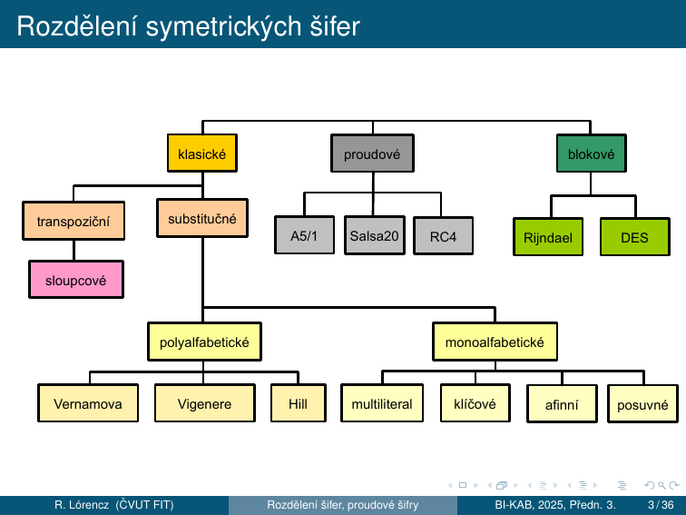
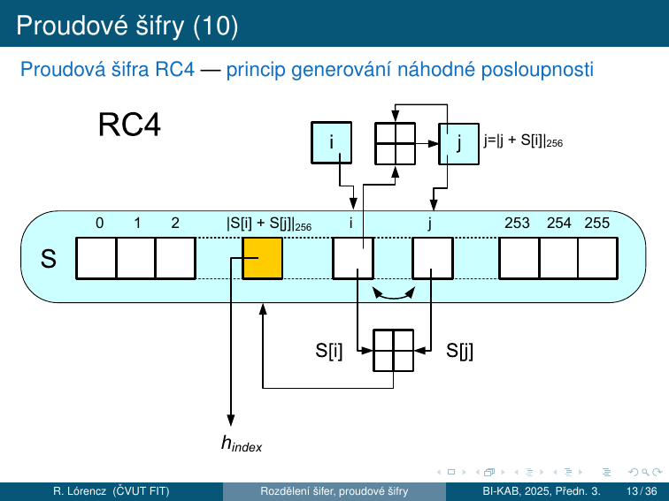
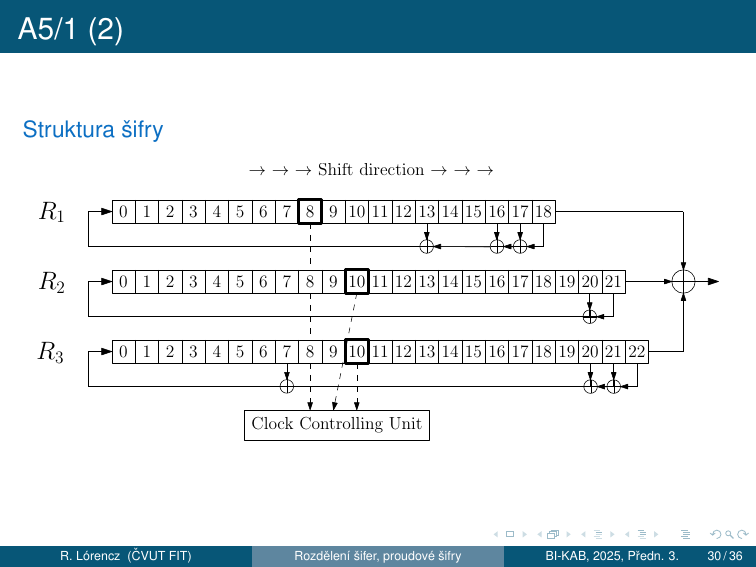

# 2. Proudové šifry

!!! abstract "Cíle kapitoly"
    - Pochopit formální definici proudové šifry a rozdíl proudové vs blokové
    - Znát Vernamovu šifru a princip absolutní bezpečnosti
    - Porozumět synchronním vs asynchronním proudovým šifrám
    - Znát RC4, Salsa20/ChaCha20 a A5/1 — jak fungují a kde jsou slabiny
    - Pochopit LFSR a majority taktování u A5/1

---

## 2.0 Rozdělení symetrických šifer



Symetrické šifry se dělí na **klasické** (transpoziční a substituční z přednášky 1), **proudové** (A5/1, Salsa20, RC4) a **blokové** (Rijndael/AES, DES).

---

## 2.1 Princip proudové šifry

### Proudové vs blokové šifry

Z hlediska použití klíče ke zpracování OT rozeznáváme dva základní druhy symetrických šifer – **proudové a blokové**:

- Proudová šifra šifruje jednotlivé znaky abecedy **zvlášť**, zatímco bloková šifra zpracovává najednou **bloky (řetězce) délky $t$ znaků**
- Podstatné na blokových šifrách je, že všechny bloky jsou šifrovány (dešifrovány) **stejnou transformací** $E_k$ ($D_k$), kde $k$ je šifrovací klíč
- Ale proudové šifry nejprve z klíče $k$ vygenerují posloupnost $h_1, h_2, \ldots$ a každý znak otevřeného textu šifrují **jinou transformací** $E_{h_i}$
- Proudové šifry by mohly být chápány jako blokové šifry s blokem délky $t = 1$, ale u proudových šifer je každý tento „blok" zpracováván jiným způsobem, jinou substitucí

### Formální definice

Nechť $A$ je abeceda $q$ symbolů, nechť $M = C$ je množina všech konečných řetězců nad $A$ a nechť $K$ je množina klíčů. Proudová šifra se skládá z:

- **generátoru** $G$ (transformace hesla)
- **zobrazení** $E$ (šifrování)
- **zobrazení** $D$ (dešifrování)

Pro každý klíč $k \in K$ **generátor $G$** vytváří posloupnost hesla $h_1, h_2, \ldots$ přičemž prvky $h_i$ reprezentují libovolné substituce $E_{h_1}, E_{h_2}, \ldots$ nad abecedou $A$.

**Zobrazení $E$ a $D$** každému klíči $k \in K$ přiřazují transformace šifrování $E_k$ a odšifrování $D_k$:

$$c_1 = E_{h_1}(m_1),\quad c_2 = E_{h_2}(m_2),\quad \ldots$$

$$m_1 = D_{h_1}(c_1),\quad m_2 = D_{h_2}(c_2),\quad \ldots \quad \text{kde } D_{h_i} = E_{h_i}^{-1}$$

### Heslo (keystream)

Z historických důvodů se $G$ nazývá **generátor hesla**, neboť $h_1, h_2, \ldots$ bývá proud znaků abecedy $A$ a substituce $E_{h_i}$ posunem v abecedě $A$ o $h_i$ pozic, tj. $c_i = |m_i + h_i|_q$.

V anglické literatuře se $h_1, h_2, \ldots$ nazývá **running-key** nebo **key-stream (keystream)**, tj. proud klíče, a i když se jedná o derivát originálního klíče $k$.

Pokud se proud hesla začne po určité pozice opakovat → **periodická hesla** a periodická šifra (Vigenèrova šifra).

### Moderní proudové šifry — binární abeceda

Moderní proudové šifry pracují nad abecedou $A = \{0, 1\}$, tj. $q = 2$. Sčítání/odčítání modulo 2 je binárním sčítáním/odčítáním — platí $|a + b|_2 = |a - b|_2$ a vyjadřuje diferenci bitů: **XOR**, označujeme $\oplus$.

U moderních proudových šifer ŠT vzniká tak, že **jednotlivé bity proudu hesla jsou postupně sčítány s jednotlivými bity proudu OT** binárním sčítáním. Vzhledem k rovnosti binárního sčítání a odčítání je transformace pro šifrování a odšifrování také stejná.

Jedinou smysluplnou substitucí $E_{h_i}$ nad bitem abecedy $m_i$ je $E_{h_i}(m_i) = m_i + h_i$ nebo $E_{h_i}(m_i) = m_i + h_i + 1$.

---

## 2.2 Vernamova šifra a absolutní bezpečnost

### Vernamova šifra (OTP — One-Time Pad)

Vernamova šifra používala náhodné heslo **stejně dlouhé jako OT** ⇒ heslo se ničilo (nikdy nebylo použito k šifrování 2 různých OT).

Na OT (5b na písmeno v 32znakovém Baudotově kódu) se bit po bitu binárně načítá náhodná posloupnost bitů klíče (**děrná páska** = one-time pad).

### Absolutní bezpečnost

!!! success "Absolutní bezpečnost (perfect secrecy)"
    Vernamova šifra má vlastnost **absolutní bezpečnosti**, tj. dokonalého utajení. ŠT nenese žádnou informaci o OT — toto je **definice absolutně bezpečné šifry**.

    Ze zachyceného ŠT není možné odvodit žádnou informaci o OT bez znalosti klíče, nezávisle na výpočetní síle útočníka.

### Algoritmické proudové šifry a IV

Protože distribuce klíče stejně dlouhého jako zpráva je nepraktická, používají moderní proudové šifry **algoritmické generování hesla**:

- Heslo se „vypočítá" na základě tajného šifrovacího klíče (distribuuje se)
- Aby klíč mohl být použitý pro více zpráv ⇒ **princip náhodně se měnícího inicializačního vektoru (IV)**
- IV pro každou zprávu je vybírán náhodně a je přenášen před ŠT v otevřené podobě
- IV (za účasti tajného klíče nebo bez něj) nastavuje příslušný algoritmus (konečný automat, šifrátor) vždy do **jiného (náhodného) počátečního stavu** ⇒ při stejném tajném klíči je pokaždé jiná heslová posloupnost
- **Za různost hesla zodpovídá IV; za utajenost zodpovídá tajný šifrovací klíč** (podobný princip se využívá i v blokových šifrách)

!!! danger "Zlaté pravidlo"
    **Keystream nesmí být nikdy použit dvakrát se stejným klíčem!**

    Pokud útočník zachytí $c_1$ a $c_2$ šifrované stejným keystreamem $k$:

    $$c_1 \oplus c_2 = (m_1 \oplus k) \oplus (m_2 \oplus k) = m_1 \oplus m_2$$

    Klíč se vyruší a útočník zná XOR plaintextů — z toho lze rekonstruovat oba texty.

---

## 2.3 Synchronní a asynchronní proudové šifry

### Synchronní proudové šifry

Pokud proud hesla **nezávisí na OT ani ŠT** ⇒ **synchronní proudové šifry** ⇒ příjemce i odesílatel jsou **přesně synchronizováni** (jinak výpadek jednoho znaku ŠT naruší veškerý následující OT).

### Asynchronní (samosynchronizující) proudové šifry

**Šifry eliminující taktové chyby** — u nich dojde v krátké době k synchronizaci a správné dešifraci zbývajícího OT. To se může docílit například tím, že proud hesla je generován pomocí klíče a $n$ předchozích znaků ŠT:

$$h_i = f(k,\, c_{i-n},\, \ldots,\, c_{i-1})$$

K synchronizaci dojde, jakmile se přijme souvislá posloupnost $n + 1$ správných znaků ŠT.

**Historická asynchronní šifra — Vigenèrův autoklíč:**

$h_1 = k$ a $c_i = p_i + h_i$, $i = 2, 3, \ldots$, kde $h_i = c_{i-1}$.

### Použití proudových šifer

- **Linkové šifrátory** — do komunikačního kanálu přicházejí jednotlivé znaky v pravidelných nebo nepravidelných časových intervalech ⇒ v daném okamžiku je nutné ten znak okamžitě přenést
- Příklad tzv. terminálového spojení: to, co uživatel píše na klávesnici, se ihned objevuje na monitoru druhého uživatele
- Šifrovací zařízení má omezenou paměť na průchozí data
- **Výhodou proudových šifer oproti blokovým je malá „propagace chyby"**: chyba v jednom znaku ŠT se projeví u proudových šifer pouze v jednom odpovídajícím znaku OT, u blokové šifry má vliv na celý blok znaků

---

## 2.4 RC4

### Kontext a parametry

| Vlastnost | Hodnota |
|-----------|---------|
| Autor | Ron Rivest, 1987 |
| Jiný název | „Arcfour" (z důvodu ochrany autorských práv) |
| Klíč | 40–128 bitů (40b a 128b jsou nejpoužívanější) |
| Vnitřní stav | S-box 256 bajtů + ukazatele $i, j$ |
| Protokoly | S/MIME, SSL (historicky), WEP |
| Status | ❌ **PROLOMEN — nepoužívat** |

RC4 je jedna z nejpoužívanějších šifer na internetu (Rivest – 1987). Nevyužívá IV ⇒ na každé spojení generuje náhodně nový tajný klíč (pomocí asymetrické metody). Struktura RC4 nebyla oficiálně publikována, ale v roce 1994 byla zveřejněna neznámým hackerem disassemblováním z programu BSAFE společnosti RSA.

Šifrovací klíč se používá pouze k vygenerování tajné náhodné substituce $\{0,\ldots,255\} \to \{0,\ldots,255\}$, tedy **substituce bajtu za bajt**. Pomocí tabulky $S$ pak konečným automatem generujeme jednotlivé bajty hesla $h_0, h_1, \ldots$, které se xorují na OT nebo ŠT.

### Princip generování náhodné permutace

Obecná metoda generování náhodné permutace P z posloupnosti r:

1. Naplníme identickou permutací: $P_i = i$ pro $i = 0, 1, 2, \ldots, 255$
2. Pomocí posloupnosti $r$ promícháme permutaci $P$
3. Míchání provádíme postupně tak, že v každém kroku $i$ ($i = 0, 1, 2, \ldots, 255$) v permutaci $P$ vyměníme hodnoty $P$ na pozicích $i$ a $P_{r_i}$, tj. hodnoty $i$ a $a_{r_i}$ vzájemně vyměníme

```
P(0)=0, P(1)=1, ..., P(255)=255
for i = 0 to 255:
    vyměň mezi sebou hodnoty P(i) a P(r(i))
```

$P$ zůstává stále permutací. Výsledek je nová permutace závislá na posloupnosti $r$.

### KSA — Key Scheduling Algorithm (inicializace S-boxu)

```python
# Inicializace S-boxu jako identita
S = list(range(256))   # S[i] = i pro i = 0..255
j = 0
for i in range(256):
    j = (j + S[i] + Key[i % len(Key)]) % 256
    S[i], S[j] = S[j], S[i]   # swap
```

### PRGA — Pseudo-Random Generation Algorithm (tvorba hesla)

```python
i = j = 0
for index in range(n):       # n = délka zprávy
    i = (i + 1) % 256
    j = (j + S[i]) % 256
    S[i], S[j] = S[j], S[i]   # swap
    h_index = S[(S[i] + S[j]) % 256]   # bajt hesla
```

- Počítání s bajty ⇒ redukce modulo 256
- $i$ se systematicky zvyšuje modulo 256
- $j$ je náhodný na klíči závislý index
- Hodnota $h_{index}$ obsahuje heslovou posloupnost generovanou tímto algoritmem



### Dvojí použití hesla (útok)

U proudových šifer, kde každá parciální substituce je posunem OT v abecedě $A$ o $h_i$, postačí k luštění 2 ŠT ($c, c'$), šifrované **tímtéž heslem**. Podobně to platí i pro XOR a další invertibilní operace.

Mějme $c_i = |m_i + h_i|_q$ a $c'_i = |m'_i + h_i|_q$. Odečtením ŠT od sebe eliminujeme heslo:

$$|c_i - c'_i|_q = |m_i - m'_i|_q$$

Z posloupnosti $|m_i - m'_i|_q$ pro $i = 0, 1, \ldots$ pak luštíme jako při použití knižní šifry, kde v roli původního OT vystupuje $m$ a v roli knižního hesla $m'$.

!!! warning "Metoda předpokládaného slova (crib dragging)"
    Někdy se používá metoda předpokládaného slova, kdy za $m'$ zkoušíme nějaké běžné slovo (např. v angličtině **the**) postupně od první do poslední pozice, odpočítáme $m$ a sledujeme, zda dává smysl.

### Slabiny RC4

!!! danger "WEP exploit"
    Prvních ~256 bajtů keystreamu **statisticky koreluje** s klíčem.

    WEP (Wi-Fi Encryption Protocol) používal RC4 s krátkým IV → po zachycení ~4 milionů paketů lze klíč obnovit. Oprava: přeskočit prvních 256+ bajtů PRGA (ale WEP to nedělal).

---

## 2.5 Salsa20

### Kontext

- Proudová šifra – **2005 D. J. Bernstein**
- Modifikovaná verze Salsa20 o 12 rundách – kandidát projektu **eSTREAM**
- eSTREAM (2004–08) – nové proudové šifry Profil 1/Profil 2 – SW/HW
    - **Profil 1** – Proudové šifry pro SW aplikace s požadavkem na vysokou propustnost: HC-128, Rabbit, **Salsa20/12**, SOSEMANUK
    - **Profil 2** – Proudové šifry pro HW aplikace s omezenými prostředky: Grain, MICKEY, Trivium
- Salsa20 nabízí rychlosti kolem 4–14 cyklů na B v SW (procesory x86)

### Vnitřní stav (512 bitů = 16 slov po 32 bitech)

Základ – pseudonáhodná funkce s operacemi ARX (Add-Rotate-XOR):

- 32bitové sčítání, bitové sčítání (XOR) a operace rotace
- Základní funkce mapuje **256bitový klíč, 64bitový nonce a 64bitový čítač na 512bitový blok keystreamu**

Vnitřní stav je tvořen 16 32bitovými slovy v matici $4 \times 4$:

| | a | b | c | d |
|--|---|---|---|---|
| **0** | **„expa"** | Key | Key | Key |
| **1** | Key | **„nd 3"** | Nonce | Nonce |
| **2** | Pos. | Pos. | **„2-by"** | Key |
| **3** | Key | Key | Key | **„te k"** |

- 4 pevná slova tvoří výraz **"expand 32-byte k"** (zapsáno v ASCII) na hlavní diagonále
- 8 klíčových slov (256 bitů)
- 2 slova pozice keystreamu (čítač)
- 2 slova nonce

### Quarter Round (čtvrtinová runda)

Základní operací v Salsa20 je **čtvrtinová runda QR(a, b, c, d)**, která vstup tvoří 4 slova a výstupem jsou rovněž 4 slova:

$$b := b \oplus (a \boxplus d) \lll 7$$

$$c := c \oplus (b \boxplus a) \lll 9$$

$$d := d \oplus (c \boxplus b) \lll 13$$

$$a := a \oplus (d \boxplus c) \lll 18$$

kde $\boxplus$ označuje sčítání mod $2^{32}$ a $\lll$ označuje cyklickou rotaci vlevo.

Použití pouze operací add-rotate-xor **zabraňuje možnosti časových útoků** v SW implementacích.

### Lichá a sudá runda

**Lichá runda** — QR na každý ze 4 sloupců v matici:

```
QR( 0,  4,  8, 12)   sloupec 1
QR( 5,  9, 13,  1)   sloupec 2
QR(10, 14,  2,  6)   sloupec 3
QR(15,  3,  7, 11)   sloupec 4
```

**Sudá runda** — QR na každý ze 4 řádků:

```
QR( 0,  1,  2,  3)   řádek 1
QR( 5,  6,  7,  4)   řádek 2
QR(10, 11,  8,  9)   řádek 3
QR(15, 12, 13, 14)   řádek 4
```

2 po sobě jdoucí rundy (runda po sloupcích a po řádcích) se nazývají **dvourunda**. Zopakuje se 10 krát → celkem **20 rund**.

Nakonec se k výsledku **přičte vstup** (přidání originálu znemožňuje obnovení vstupu — stejná technika je používána v hašovacích funkcích). Výstup je **64B keystreamu**.

### Varianty Salsa20

- **Salsa20/8** (8 rund) a **Salsa20/12** (12 rund) s redukovaným počtem rund — doplňující varianty, neslouží jako náhrada
- V benchmarcích eSTREAM dosahují lepších výsledků než varianta Salsa20, ale s odpovídající nižší bezpečností
- **XSalsa20** (Bernstein 2008) – 192bitové nonces, prokazatelně bezpečná vzhledem k bezpečnosti Salsa20 — vhodnější pro aplikace, kde jsou požadovány delší nonces

### Kryptoanalýza Salsa20

- 2005 Crowley – útok na Salsa20/5 se složitostí $2^{165}$ pomocí zkrácené diferenciální kryptoanalýzy
- 2006 Fischer et al. – útok na Salsa20/6 se složitostí $\approx 2^{177}$
- 2007 Tsunoo et al. – prolomení 8 z 20 rund Salsa20 a obnovení 256 bitů tajného klíče za $2^{255}$ párů klíčů (srovnatelné s „brute force attack")
- 2013 Mouha et al. – důkaz: **15 rund Salsa20 je 128-bitově bezpečných** proti DC ⇒ nemá žádnou diferenciální charakteristiku s pravděpodobností $> 2^{-130}$, to je víc než $2^{128}$ (brute force attack)

---

## 2.6 ChaCha20

### Vznik a cíl

- Proudová šifra – **2008 D. J. Bernstein**
- Cíl: **zvýšení rozptylu** v jedné rundě při zachování nebo vylepšení výkonu
- Stejně jako Salsa20 obsahuje počáteční stav 128bitovou konstantu, 256bitový klíč, 64bitový čítač a 64bitovou nonce → celkem 512 bitů v matici $4 \times 4$

### Inicializace ChaCha — stav

| | a | b | c | d |
|--|---|---|---|---|
| **0** | **„expa"** | **„nd 3"** | **„2-by"** | **„te k"** |
| **1** | Key | Key | Key | Key |
| **2** | Key | Key | Key | Key |
| **3** | Count. | Count. | Nonce | Nonce |

Konstanta je stejná jako u Salsa20. ChaCha **přeuspořádává** některá slova v počátečním stavu — konstanty jsou v prvním řádku (vs na diagonále u Salsa20).

### ChaCha Quarter Round

ChaCha nahrazuje čtvrt-rundový QR(a,b,c,d) Salsa20 pomocí:

$$a := a \boxplus b;\quad d := d \oplus a;\quad d \lll= 16$$

$$c := c \boxplus d;\quad b := b \oplus c;\quad b \lll= 12$$

$$a := a \boxplus b;\quad d := d \oplus a;\quad d \lll= 8$$

$$c := c \boxplus d;\quad b := b \oplus c;\quad b \lll= 7$$

Tato verze QR ChaCha **aktualizuje každé slovo $2\times$** (QR verze Salsa20 aktualizuje každé slovo pouze jednou). V průměru se po změně 1 vstupního bitu u QR Salsa20 změní 8 výstupních bitů, zatímco u QR ChaCha se změní 12,5 výstupních bitů.

QR ChaCha má stejný počet sčítání, xorů a bitových rotací jako QR Salsa20. 2 z rotací jsou násobky 8 ⇒ malá optimalizace na některých architekturách včetně x86.

### Lichá a sudá runda ChaCha

**Lichá runda** — QR na každý ze 4 sloupců (stejné indexy jako Salsa20):

```
QR(0, 4, 8, 12)   sloupec 1
QR(1, 5, 9, 13)   sloupec 2
QR(2, 6,10, 14)   sloupec 3
QR(3, 7,11, 15)   sloupec 4
```

**Sudá runda** — QR na každou ze 4 diagonál:

```
QR( 0,  5, 10, 15)   diagonála 1 (hlavní)
QR( 1,  6, 11, 12)   diagonála 2
QR( 2,  7,  8, 13)   diagonála 3
QR( 3,  4,  9, 14)   diagonála 4
```

32bitová slova jsou do QR plněná po sloupcích a po úhlopříčkách (bez posuvu pro jednotlivá plnění). Výstup je **64B keystreamu**.

### Nasazení ChaCha20

- **BLAKE / BLAKE2 / BLAKE3** — základem hashovací funkce BLAKE, finalisty soutěže hašovacích funkcí NIST
- **ChaCha20-Poly1305** — Google vybral pro ověřování zpráv, používán v protokolu **QUIC (součást HTTP/3)** a v šifře **chacha20-poly1305@openssh.com** v OpenSSH
- **arc4random** — generátor náhodných čísel pro Free/Open/NetBSD (nahradil RC4)
- **Bez HW akcelerace AES** — ChaCha20 nahrazuje AES v systémech, kde procesor nemá akceleraci AES (mobilní zařízení s procesory ARM)

### Salsa20 vs ChaCha20

| | Salsa20 | ChaCha20 |
|---|---------|----------|
| Autor | Bernstein 2005 | Bernstein 2008 |
| Kola | 20 (10× dvourunda) | 20 (10× dvourunda) |
| Konstanty ve stavu | na diagonále | v prvním řádku |
| QR difúze | pomalejší | rychlejší (každé slovo 2×) |
| eSTREAM | finalist (Salsa20/12) | – |
| Standard | – | **TLS 1.3, RFC 8439** |

---

## 2.7 A5/1 (GSM)

### Úvod

A5/1 je **synchronní proudová šifra**, která se používá na zabezpečení komunikace mobilních telefonů v souladu se standardem GSM.

- Šifra vznikla v roce **1987** a dlouhou dobu byla její struktura utajována
- Až v roce **1999** byla pomocí reverzní analýzy kompletně zrekonstruována
- Skládá se z kombinace **tří LFSR** (Linear Feedback Shift Register) a **nelineárního mechanizmu** určujícího posunutí registrů v daném čase

### Struktura šifry A5/1



### LFSR (Linear Feedback Shift Register)

LFSR je posuvný registr, kde nový bit se spočítá jako XOR vybraných bitů (tapů — bity zpětné vazby). Aktualizace registrů je určena bity zpětné vazby, které jsou dány koeficienty **primitivního polynomu** — to zaručuje **maximální možnou periodu** výstupní posloupnosti registru.

### Tři registry A5/1

| Registr | Délka | Taktovací bit | Bity zpětné vazby |
|---------|-------|---------------|-------------------|
| $R_1$ | 19 bitů | bit 8 | {18, 17, 16, 13} |
| $R_2$ | 22 bitů | bit 10 | {20, 21} |
| $R_3$ | 23 bitů | bit 10 | {22, 21, 20, 7} |

### Majority taktování (mechanismus posunu registrů)

Zvýrazněné bity $R_1[8]$, $R_2[10]$ a $R_3[10]$ z obrázku se nazývají **taktovací bity** a na jejich hodnotách závisí, které registry se v následujícím taktu posunou.

Je zřejmé, že mohou-li tři bity nabývat každý jen dvou hodnot, musí jedna hodnota převládat. V každém taktu se posunou jen ty registry, ve kterých hodnota taktovacího bitu **převládá**. Tento mechanizmus posunu registrů je **jediným nelineárním prvkem** šifry.

!!! info "Takt šifry"
    V jednom taktu se vyprodukuje jeden bit keystreamu:

    1. Spočítá se **většinová hodnota $h$** taktovacích bitů $R_1[8]$, $R_2[10]$, $R_3[10]$
    2. Posunou se ty registry, u kterých je taktovací bit rovný $h$
    3. Výstupní bit keystreamu: $k_i = R_1[18] \oplus R_2[21] \oplus R_3[22]$

**Příklad:** Když $R_1[8] = 0$, $R_2[10] = 0$ a $R_3[10] = 1$ → převládá hodnota 0 → posunou se $R_1$ a $R_2$, $R_3$ stojí.

Šifrový text se získá tak, že na otevřený text $p$ „naxorujeme" keystream $k$, tj. $c_i = p_i \oplus k_i$.

### Inicializace šifry

```
1:  Nastav všechna políčka všech tří registrů na nulu.
2:  for i = 0 to 63 do
3:      R₁[0] = R₁[0] ⊕ K[i]
4:      R₂[0] = R₂[0] ⊕ K[i]
5:      R₃[0] = R₃[0] ⊕ K[i]
6:      Posuň všechny tři registry.
7:  end for
8:  for i = 0 to 21 do
9:      R₁[0] = R₁[0] ⊕ IV[i]
10:     R₂[0] = R₂[0] ⊕ IV[i]
11:     R₃[0] = R₃[0] ⊕ IV[i]
12:     Posuň všechny tři registry.
13: end for
14: for i = 0 to 99 do
15:     Vykonaj takt šifry (s použitím Majoritní funkce).
16: end for
```

### Šifrování

Komunikace spočívá v přenosu posloupnosti rámců, každý délky **228 bitů**, přičemž:

- 114 bitů se využívá na zašifrování dat vyslaných z GSM centra k uživatelskému mobilnímu telefonu
- Pomocí dalších 114 bitů se zašifrují data vyslané z mobilního telefonu do centra

Pro jeden rámec (frame) se vykonají následující kroky:

1. Na začátku proběhne **inicializační fáze**, ve které se registry naplní tajným klíčem a inicializačním vektorem a 100-krát se vykoná takt šifry se zahodím výstupního bitu šifry
2. Pak se vykoná **228 taktů** a vyprodukuje se 228 bitů keystreamu, které se použijí k šifrování

Keystream z jednoho rámce zabezpečí řádově milisekundy hovoru. Pro **další rámec** stejného hovoru se použije jiný inicializační vektor, ale stejný tajný klíč.

### Bezpečnost A5/1

!!! danger "Prolomen 2009"
    - Teoretická bezpečnost: **64 bitů** (délka klíče)
    - Efektivní bezpečnost: cca $2^{40.2}$ (nepravidelné taktování snižuje entropii)
    - **2009:** Karsten Nohl & spol. — prolomen pomocí **time-memory trade-off** (Rainbow tables) v reálném čase pomocí FPGA
    - Útok vyžadoval ~2 TB předpočítaných dat

    Tento mechanizmus posunu registrů je jediným nelineárním prvkem šifry a **na něm je postavena bezpečnost šifry**.

---

## Shrnutí kapitoly

!!! abstract "Rychlý přehled"

    | Šifra | Klíč | Stav | Kde se používá | Status |
    |-------|------|------|----------------|--------|
    | Vernam (OTP) | stejně dlouhý jako OT | — | historicky | ✅ Absolutně bezpečný |
    | RC4 | 40–128 b | 256 B S-box | WEP (hist.), SSL (hist.) | ❌ PROLOMEN |
    | Salsa20 | 256 b | 512 b, 4×4 | NaCl, eSTREAM | ✅ Bezpečný |
    | ChaCha20 | 256 b | 512 b, 4×4 | TLS 1.3, QUIC, OpenSSH | ✅ Bezpečný |
    | A5/1 | 64 b | 3 LFSR (~64 b) | GSM | ❌ PROLOMEN |

!!! question "Klíčové otázky ke zkoušce"
    1. Jaký je základní princip proudové šifry? Jak se liší od blokové šifry?
    2. Co je Vernamova šifra a proč je absolutně bezpečná? Jaká je její praktická nevýhoda?
    3. Jaký je problém dvojího použití hesla u aditivních proudových šifer?
    4. Jaký je rozdíl mezi synchronní a asynchronní proudovou šifrou? Co znamená samosynchronizace a jak ji demonstruje Vigenèrův autokláv?
    5. Jaký je základní princip A5/1? K čemu slouží LFSR a jak je zavedena nelinearita?
    6. Jaké jsou hlavní charakteristiky šifer Salsa20 a ChaCha20?
