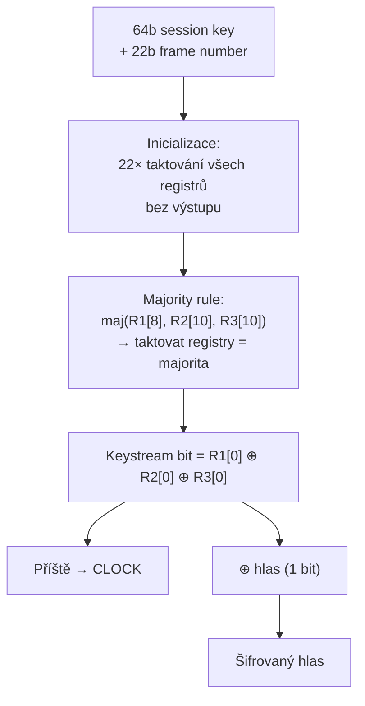

# 2. Proudové šifry

!!! abstract "Cíle kapitoly"
    - Porozumět principu keystream XOR šifrování
    - Znát RC4, Salsa20/ChaCha20 a A5/1 — jak fungují a kde jsou slabiny
    - Pochopit LFSR a majority taktování u A5/1
    - Vědět, proč nelze opakovat keystream

---

## 2.1 Princip proudové šifry

Proudová šifra generuje pseudo-náhodný **keystream** ze sdíleného klíče a šifruje znak po znaku:

$$c_i = p_i \oplus K_i$$

kde $K_i$ je $i$-tý byte/bit keystreamu. Dešifrování je identické: $p_i = c_i \oplus K_i$.

!!! danger "Zlaté pravidlo"
    **Keystream nesmí být nikdy použit dvakrát se stejným klíčem!**
    
    Pokud útočník zachytí $c_1$ a $c_2$ šifrované stejným keystreamem:
    $$c_1 \oplus c_2 = (p_1 \oplus K) \oplus (p_2 \oplus K) = p_1 \oplus p_2$$
    Klíč se vyruší a útočník zná XOR plaintextů — z toho lze rekonstruovat oba texty pokud jeden zná.

---

## 2.2 RC4

### Parametry

| Vlastnost | Hodnota |
|-----------|---------|
| Autor | Ron Rivest, 1987 |
| Klíč | 1–256 bytů |
| Vnitřní stav | S-box 256 bytů + ukazatele $i, j$ |
| Status | ❌ **PROLOMEN — nepoužívat** |

### KSA — Key Scheduling Algorithm (inicializace)

```python
# Inicializace S-boxu jako identita
S = list(range(256))
j = 0
for i in range(256):
    j = (j + S[i] + Key[i % len(Key)]) % 256
    S[i], S[j] = S[j], S[i]   # swap
```



```mermaid
flowchart LR
    A["S = [0,1,...,255]\n(identita)"] --> B["for i=0..255:\n  j=(j+S[i]+Key[i mod keylen]) mod 256\n  swap(S[i], S[j])"]
    B --> C["S-box promíchán\nklíčem"]
    style A fill:#1a1d2e,stroke:#34d399
    style C fill:#1a1d2e,stroke:#6c8ef5
```

### PRGA — Pseudo-Random Generation Algorithm

```python
i = j = 0
while True:
    i = (i + 1) % 256
    j = (j + S[i]) % 256
    S[i], S[j] = S[j], S[i]   # swap
    K = S[(S[i] + S[j]) % 256]  # výstupní byte keystreamu
    yield K
```



```mermaid
flowchart LR
    I["i=0, j=0"] --> L["i=(i+1) mod 256"]
    L --> J["j=(j+S[i]) mod 256"]
    J --> SW["swap(S[i], S[j])"]
    SW --> K["K = S[(S[i]+S[j]) mod 256]"]
    K --> XOR["c = p ⊕ K"]
    XOR --> L
    style XOR fill:#1a1d2e,stroke:#f87171
```

### Slabiny RC4

!!! warning "WEP exploit"
    Prvních ~256 bytů keystreamu **statisticky koreluje** s klíčem.
    
    WEP (Wi-Fi Encryption Protocol) používal RC4 s krátkým IV → po zachycení ~4 milionů paketů lze klíč obnovit. Oprava: přeskočit prvních 256+ bytů PRGA (ale WEP to nedělal).

!!! question "Typická otázka"
    „Popište KSA algoritmus RC4. Kde je jeho bezpečnostní slabina?"

---

## 2.3 Salsa20 a ChaCha20

### Vnitřní stav (512 bitů = 16 slov po 32 bitech)

```
"expa" "nd 3" "2-by" "te k"   ← konstanta (ASCII "expand 32-byte k")
  k₀     k₁     k₂     k₃     ← klíč (256 bitů = 8 slov)
  k₄     k₅     k₆     k₇
  ctr    n₀     n₁     n₂     ← čítač bloku + nonce
```

### Quarter Round — základní operace (ARX)

```
QR(a, b, c, d):
    b ^= (a + d) <<< 7
    c ^= (b + a) <<< 9
    d ^= (c + b) <<< 13
    a ^= (d + c) <<< 18
```

**ARX** = **A**dd (modulo $2^{32}$) + **R**otate (cyklický posun bitů) + **X**OR

!!! info "Proč ARX?"
    Žádné S-boxy (tabulky) → ideální pro softwarovou implementaci na všech platformách. ChaCha20 je ~3× rychlejší než AES bez hardware akcelerace.

### Salsa20 vs. ChaCha20

| | Salsa20 | ChaCha20 |
|---|---------|----------|
| Kola | 20 (10× double-round) | 20 (10× double-round) |
| Struktura kola | sloupcová QR | **diagonální** QR |
| Difúze | pomalejší | rychlejší (2 kola → plná difúze) |
| Standard | – | **TLS 1.3, RFC 8439** |

```mermaid
flowchart LR
    IN["Počáteční stav X₀\n(klíč + nonce + čítač)"] --> R["20 kol ARX\n(10× double-round)"]
    R --> ADD["X₀ + X₂₀\n(32b přetékající sčítání)"]
    ADD --> OUT["512b keystream blok"]
    OUT --> XOR["⊕ plaintextový blok (64 B)"]
    XOR --> C["Ciphertext"]
    style IN fill:#1a1d2e,stroke:#34d399
    style C fill:#1a1d2e,stroke:#f87171
```



!!! tip "Zkouška"
    Znát strukturu stavu (4×4 matrix), co je QR, rozdíl Salsa vs. ChaCha, proč je ChaCha lepší. Vědět, kde se ChaCha20 používá (TLS 1.3).

---

## 2.4 A5/1 (GSM)

Proudová šifra používaná v GSM pro šifrování hlasových hovorů. Skládá se ze **tří LFSR registrů** s **nepravidelným taktováním**.

### LFSR (Linear Feedback Shift Register)

LFSR je posuvný registr, kde nový bit se spočítá jako XOR vybraných bitů (tapů):

```
Nový bit = tap₁ XOR tap₂ XOR ... tapₙ  →  [b_{n-1}][b_{n-2}]...[b_1][b_0]  →  výstup b_0
                                ↑_______________________________________________↑
```

### Tři registry A5/1

| Registr | Délka | Tapy (zpětná vazba) | Taktovací bit |
|---------|-------|---------------------|---------------|
| R1 | 19 bitů | {18, 17, 16, 13} | bit 8 |
| R2 | 22 bitů | {21, 20} | bit 10 |
| R3 | 23 bitů | {22, 21, 20, 7} | bit 10 |

**Perioda každého LFSR:** $2^{délka} - 1$ (maximální perioda)

### Majority taktování (nepravidelné)

!!! info "Jak funguje majority taktování"
    1. Odečti taktovací bity: $b_8$ z R1, $b_{10}$ z R2, $b_{10}$ z R3
    2. Spočítej **majoritu** (alespoň 2 ze 3 jsou stejné) = $\text{maj}$
    3. Taktuj (posuň) **pouze** registry, jejichž taktovací bit se rovná $\text{maj}$
    4. Výstupní bit keystreamu = $R1[0] \oplus R2[0] \oplus R3[0]$

**Příklad:**
```
R1[8]=1, R2[10]=1, R3[10]=0  →  majorita = 1
→ taktují se R1 a R2 (jejich kl. bit = 1), R3 stojí
```



### Bezpečnost A5/1

!!! danger "Prolomen 2009"
    - Teoretická bezpečnost: 64 bitů (délka klíče)
    - Efektivní bezpečnost: cca $2^{40.2}$ (nepravidelné taktování snižuje entropii)
    - **2009:** Karsten Nohl & spol. — prolomen pomocí **time-memory trade-off** (Rainbow tables) v reálném čase pomocí FPGA
    - Útok vyžadoval ~2 TB předpočítaných dat a zvládl dekódovat hovor v minutách

!!! question "Typická otázka"
    „Jak funguje majority taktování v A5/1? Proč snižuje efektivní bezpečnost?"
    
    Odpověď: Každý krok taktuje průměrně 2,75 ze 3 registrů → perioda je nižší než plný produkt period → časová a prostorová složitost útoku je nižší než $2^{64}$.

---

## Shrnutí kapitoly

!!! abstract "Rychlý přehled"

    | Šifra | Klíč | Stav | Kde se používá | Status |
    |-------|------|------|----------------|--------|
    | RC4 | 1–256 B | 256 B S-box | WEP (hist.), SSL (hist.) | ❌ PROLOMEN |
    | Salsa20 | 256 b | 512 b | NaCl | ✅ Bezpečný |
    | ChaCha20 | 256 b | 512 b | TLS 1.3, QUIC | ✅ Bezpečný |
    | A5/1 | 64 b | 3 LFSR (~64 b) | GSM | ❌ PROLOMEN |

!!! question "Klíčové otázky ke zkoušce"
    1. Co je LFSR? Nakreslete schéma.
    2. Popište KSA a PRGA u RC4.
    3. Jaká je slabina RC4 a jak ji exploitoval WEP?
    4. Co je ARX a proč ho ChaCha20 používá místo S-boxů?
    5. Vysvětlete majority taktování A5/1 na příkladu.
    6. Proč keystream nikdy nesmíme použít dvakrát?
