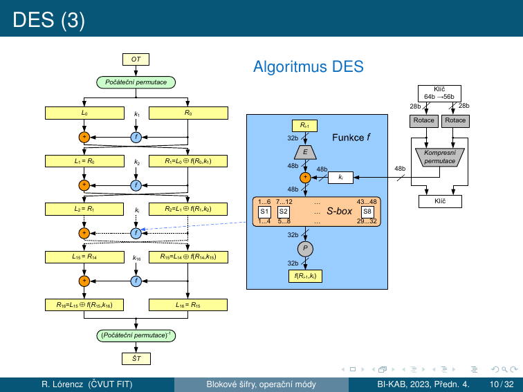
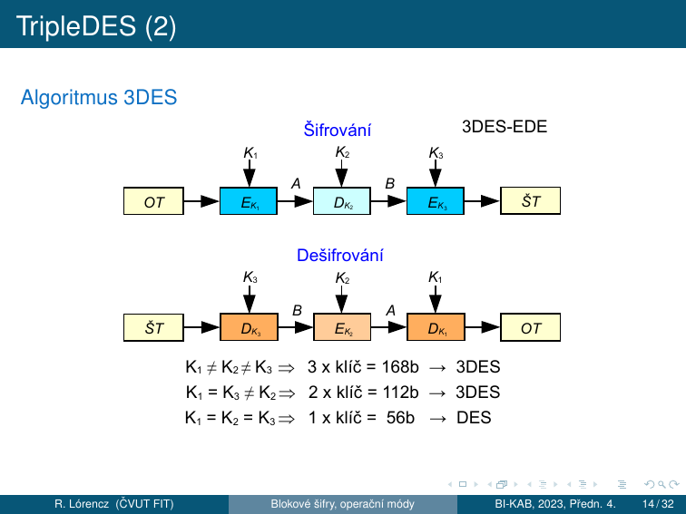
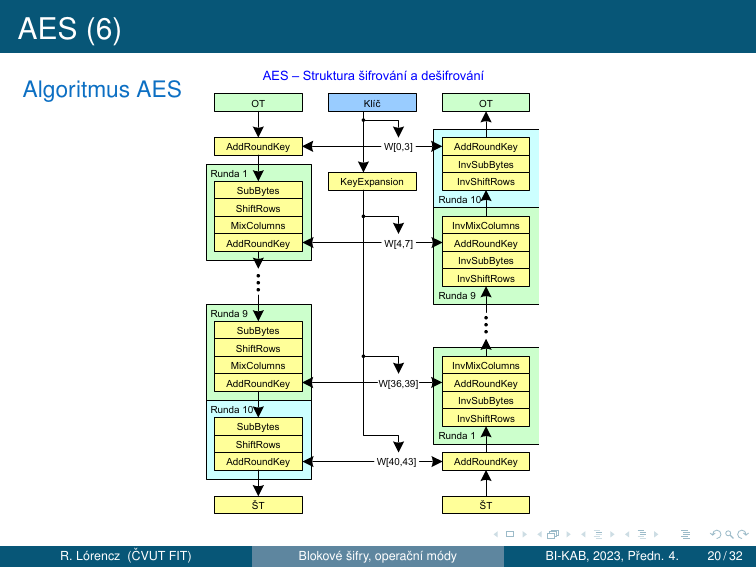
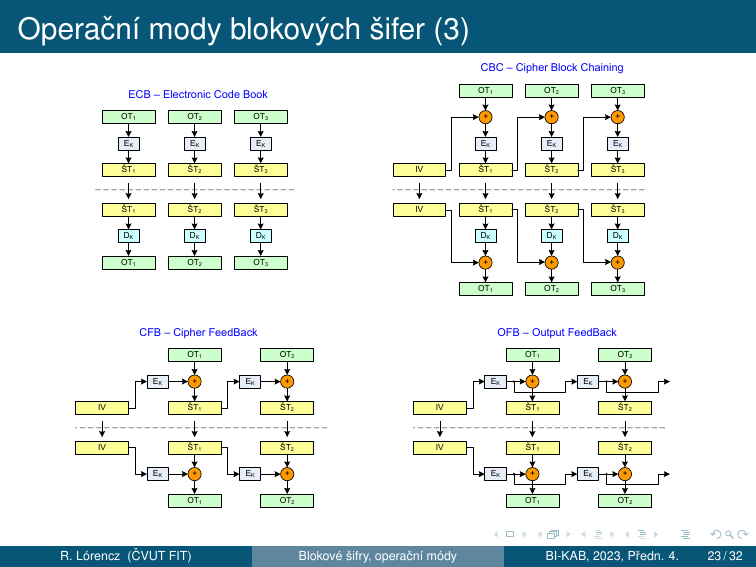
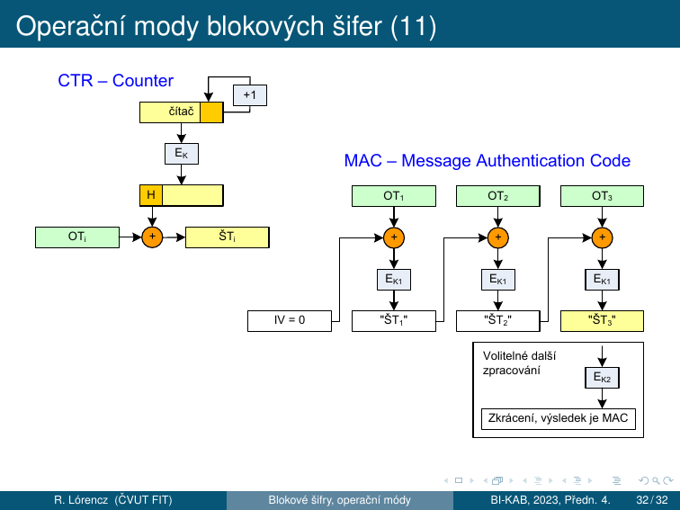

# 3. Blokové šifry

!!! abstract "Cíle kapitoly"
    - Pochopit formální definici blokové šifry a Feistelovu síť
    - Znát DES — F funkci, S-boxy, generování podklíčů, slabiny
    - Porozumět AES — 4 operace, GF(2⁸), proč není Feistelova
    - Umět popsat všechny provozní módy (ECB, CBC, CFB, OFB, CTR, CBC-MAC)

---

## 3.1 Bloková šifra — definice

Nechť $A$ je abeceda $q$ symbolů, $t \in \mathbb{N}$ a $M = C$ je množina všech řetězců délky $t$ nad $A$. Nechť $K$ je množina klíčů. **Bloková šifra** je šifrovací systém $(M, C, K, E, D)$, kde $E$ a $D$ jsou zobrazení, definující pro každé $k \in K$ transformace šifrování $E_k$ a dešifrování $D_k$ tak, že šifrování bloků OT $m_1, m_2, m_3, \ldots$, kde $m_i \in M$, probíhá podle vztahu $c_i = E_k(m_i)$ a dešifrování podle vztahu $m_i = D_k(c_i)$ pro každé $i \in \mathbb{N}$.

Pro blokovou šifru je podstatné, že všechny bloky OT jsou šifrovány **toutéž transformací** a všechny bloky ŠT jsou dešifrovány toutéž transformací. Za určitých okolností můžeme za blokové šifry považovat šifry substituční a transpoziční.

- Dnes nejběžnější šifry používají blok **128 bitů** (na přelomu letopočtu se přešlo ze 64 bitů)
- Historicky nejznámější 64b šifry: **DES**, TripleDES, IDEA, CAST
- Moderní blokové šifry využívají principy **algoritmů Feistelova typu** — umožňující postupnou aplikací relativně jednoduchých transformací vytvořit složitý kryptografický algoritmus

---

## 3.2 Feistelova síť

### Princip

Feistelova síť dělí blok $2n$ bitů na **levou** a **pravou** polovinu a střídavě je míchá pomocí libovolné funkce $F$:

$$L_i = R_{i-1}$$

$$R_i = L_{i-1} \oplus F(R_{i-1}, K_i)$$

!!! success "Klíčová vlastnost: Symetrie"
    **Dešifrování = šifrování s obráceným pořadím podklíčů** $K_r, K_{r-1}, \ldots, K_1$.

    Funkce $F$ **nemusí být invertibilní** — to je elegance Feistelovy sítě. Ze všech možných funkcí $f : V_4 \to V_4$ je $(2^4)^{2^4} = 16^{16} \doteq 1{,}85 \cdot 10^{19}$ — invertibilita není požadavek.

### Jednoduchý příklad (ne obecný princip)

Mějme 2 permutace na 4bitech a 8bitový blok $m = (m_0\, m_1)$:

$$f_1 = \begin{pmatrix}1&2&3&4\\3&1&2&4\end{pmatrix} \quad f_2 = \begin{pmatrix}1&2&3&4\\2&1&4&3\end{pmatrix}$$

Šifrování: $c_1 = (m_1\, m_2)$, kde $m_2 = m_0 \oplus f_1(m_1)$, pak $c_2 = (m_2\, m_3)$, kde $m_3 = m_1 \oplus f_2(m_2)$.

Pro $m = 1001\,1101$: $c_1 = (1101\,1110)$, $c_2 = (1110\,0000)$.

Dešifrování: $m_1 = m_3 \oplus f_2(m_2)$ a $m_0 = m_2 \oplus f_1(m_1)$, přičemž dešifrovaná hodnota je $m = 1001\,1101$. Z předcházejících příkladů je zřejmé, že funkce $f_1$ a $f_2$ nemusí být prosté.

---

## 3.3 DES — Data Encryption Standard

### Historie a kontext

- **Veřejná soutěž (1977):** šifrovací standard (FIPS 46-3) v USA pro ochranu citlivých ale neutajovaných dat ve státní správě — součást průmyslových, internetových a bankovních standardů
- **Klíč 56b:** původní návrh IBM byl 64b, ale byl do původního návrhu IBM zanesen vliv americké tajné služby NSA
- DES — intenzivní výzkum a útoky ⇒ objeveny teoretické negativní vlastnosti: tzv. **slabé a poloslabé klíče, komplementárnost** a teoreticky úspěšná lineární a diferenciální kryptoanalýza
- V praxi jedinou zásadní nevýhodou je pouze **krátký klíč**
- **1998:** stroj DES-Cracker, luštící DES hrubou silou
- DES jako americký standard skončil (jen v „dobíhajících" systémech a kvůli kompatibilitě) a místo něj: **Triple-DES (FIPS 46-3)**
- Od **26. 5. 2002** — šifrovací standard nové generace **AES**

### Parametry

| Parametr | Hodnota |
|----------|---------|
| Délka bloku | 64 bitů |
| Délka klíče | 56 bitů (+ 8 paritních = 64 bitů celkem, každý 8. bit je bit parity) |
| Počet kol | 16 (Feistel) |
| Status | ❌ **ZASTARALÝ** |

### Stavební části DES

DES je iterovaná šifra typu $E_{k_{16}}(E_{k_{15}}(\ldots(E_{k_1}(m_i)\ldots)))$.

- Místo počátečního zašumění OT se používá bezklíčová pevná permutace **Počáteční permutace** a místo závěrečného zašumění ŠT permutace k ní inverzní **(Počáteční permutace)⁻¹**
- Po počáteční permutaci je blok rozdělen na dvě 32b poloviny $(L_0, R_0)$
- Každá ze 16 rund $i = 1, 2, \ldots, 16$ transformuje $(L_i, R_i)$ na novou hodnotu $(L_{i+1}, R_{i+1}) = (R_i,\, L_i \oplus f(R_i, k_{i+1}))$
- Po 16. rundě dochází ještě k výměně pravé a levé strany: $(L_{16}, R_{16}) = (R_{15},\, L_{15} \oplus f(R_{15}, k_{16}))$ a závěrečné permutaci (Počáteční permutace)⁻¹
- **Dešifrování** probíhá stejným způsobem jako šifrování, pouze se obrátí pořadí výběru rundovních klíčů
- 56b klíč $k$ je v inicializační fázi nebo za chodu algoritmu expandován na 16 rundovních klíčů $k_1$ až $k_{16}$, které jsou řetězci 48 bitů, každý z těchto bitů je **některým bitem původního klíče $k$**

### Algoritmus DES

### Rundovní funkce $f$

Rundovní funkce se skládá z binárního načtení klíče $k_i$ na vstup. 48b klíč $k_i$ je vytvořen po kompresi ze 2 28b rotovaných částí původního klíče $k$, kde počet bitů rotace je závislý na čísle rundy.

1. **Expanze E** (32b → 48b): Tento klíč $k_i$ je dál xorován s expandovanou 32b částí $R_{i-1}$, která je expanzně permutována v bloku $E$ z 32 na 48b. Tato operace kromě rozšíření daného 32b slova také permutuje bity tohoto slova tak, aby se dosáhlo **lavinového efektu**. Žádný vstupní bit se nepoužije $2\times$.
2. **S-boxy** (48b → 32b): Následně je prováděna pevná **nelineární** substituce na úrovni 6b znaků do 4b znaků s následnou transpozicí na úrovni bitů. Těmito operacemi se dosahuje dobré difúze i konfúze. Použité substituce se nazývají **substituční boxy: S-boxy**, jsou **jediným nelineárním prvkem** schématu. Pokud bychom substituci vynechali, mohli bychom vztahy mezi ŠT, OT a klíčem popsat pomocí operace binárního sčítání $\oplus$, tedy **lineárními vztahy** — tato nelinearita je překážkou jednoduchého řešení rovnic vyjadřujících vztah mezi OT, ŠT a K.
3. **P-permutace** (32b → 32b): Následně je 32b výsledné slovo z S-boxu permutováno v bloku $P$. Tato permutace převádí každý vstupní bit do výstupu, kde žádný vstupní bit se nepoužije $2\times$.
4. Nakonec se výsledek permutace sečte modulo 2 s levou 32b polovinou a začne další runda.

### S-boxy — klíčový zdroj nelinearity

Každý S-box je 4×16 lookup tabulka. Vstup: 6 bitů, výstup: 4 bity.

- **Vnější 2 bity** ($b_1 b_6$) → číslo **řádku** (0–3)
- **Vnitřní 4 bity** ($b_2 b_3 b_4 b_5$) → číslo **sloupce** (0–15)

### Generování podklíčů

- 56b klíč expandován pomocí **PC-1** (vyhozeny 8 paritních bitů) na $C_0$ (28b) a $D_0$ (28b)
- V každém kole cyklický posun vlevo: kola 1, 2, 9, 16 → posun 1 bit; ostatní kola → posun 2 bity
- Z $C_i \| D_i$ se pomocí **PC-2** (kompresní permutace 56b → 48b) vybere podklíč $k_i$

---

## 3.4 3DES — Triple DES

TripleDES (3DES) prodlužuje klíč originální DES tím, že používá DES jako stavební prvek celkem $3\times$ s 2 nebo 3 různými klíči. Nejčastěji se používá varianta **EDE** (Encrypt-Decrypt-Encrypt), definovaná ve standardu FIPS PUB 46-3 (v bankovní normě X9.52).

$$\text{ŠT} = E_{K_3}(D_{K_2}(E_{K_1}(OT)))$$

| Konfigurace klíčů | Efektivní délka klíče |
|-------------------|-----------------------|
| $K_1 \neq K_2 \neq K_3$ | **168 bitů** (3DES) |
| $K_1 = K_3 \neq K_2$ | **112 bitů** (3DES) |
| $K_1 = K_2 = K_3$ | **56 bitů** (= DES, zpětná kompatibilita) |

- 3DES je spolehlivá šifra — klíč je dostatečně dlouhý a teoretickým slabinám (komplementárnost, slabé klíče) se dá předcházet
- 3DES lze, jako jakoukoliv jinou blokovou šifru, použít v různých operačních modech (CBC → 3DES-EDE-CBC)

!!! danger "3DES zastaralý"
    NIST deprecated 3DES v roce 2017 a disallowed od 2024. Migrujte na **AES-128** nebo **AES-256**.

---

## 3.5 AES / Rijndael

### Historie

- Po útocích hrubou silou na DES americký standardizační úřad připravil náhradu — **Advanced Encryption Standard (AES)**
- **2. 1. 1997** — výběrové řízení na AES, 15 kandidátů
- Z 5 finalistů byl vybrán algoritmus **Rijndael** [rájndol] (autoři J. Daemen a V. Rijmen)
- Jako AES byl přijat s účinností od **26. května 2002** — FIPS PUB 197

### Parametry

| Délka klíče $N_k$ (slov) | Počet kol $N_r$ | Velikost stavu |
|--------------------------|-----------------|----------------|
| 128 bitů ($N_k = 4$) | **10** | 4×4 byty |
| 192 bitů ($N_k = 6$) | **12** | 4×4 byty |
| 256 bitů ($N_k = 8$) | **14** | 4×4 byty |

**$N_r = N_k + 6$** — počet rund se mění podle délky klíče.

!!! warning "AES není Feistelovského typu!"
    AES je **SP-síť** (Substitution-Permutation network). Větší délka bloku a klíče zabraňují útokům aplikovaným na DES. AES nemá slabé klíče, je odolný proti známým útokům a metodám lineární a diferenciální kryptoanalýzy.

### GF(2⁸) — Galoisovo těleso

AES pracuje s prvky Galoisova tělesa $GF(2^8)$ a s polynomy, jejichž koeficienty jsou prvky z $GF(2^8)$. Bajt s bity $(b_7, \ldots, b_0)$ je zde chápán jako polynom $b_7 x^7 + \cdots + b_1 x^1 + b_0$ a operace „násobení těchto polynomů modulo $m(x)$" odpovídá násobení těchto polynomů modulo:

$$m(x) = x^8 + x^4 + x^3 + x^1 + 1$$

Konstantní prvky matice MixColumns jsou vyjádřeny hexadecimálně.

### Průběh šifrování

AES využívá $1 + N_r$ rundovních 128b klíčů, které se definovaným způsobem odvozují ze šifrovacího klíče.

1. Před zahájením 1. rundy šifrování se provede úvodní zašumění: xoruje se první rundovní klíč (128b na 128b)
2. $N_r$ shodných rund (s výjimkou poslední, kde se **neprovede operace MixColumns**), při kterých výstup z každé předchozí rundy slouží jako vstup do rundy následující — dochází k postupnému mnohonásobnému zesložiťování výstupu
3. Na počátku každé rundy se vstup (16 B) naplní postupně shora dolů a zleva doprava do matice 4×4 B: $\mathbf{A} = (a_{ij})$, $i, j = 0, 1, 2, 3$

### 4 operace každého kola

=== "① SubBytes"
    Na každý bajt matice $\mathbf{A}$ se zvlášť aplikuje substituce daná pevnou substituční tabulkou **SubBytes**. Zajišťuje **konfúzi** — nelineárnost AES. V roce 2002 bylo zjištěno, že vzájemné vztahy výstupních $(y1,\ldots,y8)$ a vstupních $(x1,\ldots,x8)$ bitů lze popsat implicitními rovnicemi $(x1,\ldots,x8,y1,\ldots,y8) = 0$ **pouze druhého řádu**.

=== "② ShiftRows"
    Řádky matice $\mathbf{A}$ se cyklicky posunou postupně o 0–3 bajty doleva: 1. řádek o 0, druhý o 1, třetí o 2 a čtvrtý o 3 — dochází k transpozici na úrovni bajtů. Zajišťuje **difúzi** mezi sloupci.

=== "③ MixColumns"
    Na každý jednotlivý sloupec matice $\mathbf{A}$ se aplikuje operace MixColumns, která je substitucí 32 bitů na 32 bitů. Lze ji popsat lineárními vztahy — všechny výstupní bity jsou nějakou lineární kombinací vstupních bitů:

    $$\begin{pmatrix}b_0\\b_1\\b_2\\b_3\end{pmatrix} = \begin{pmatrix}\text{02}&\text{03}&\text{01}&\text{01}\\\text{01}&\text{02}&\text{03}&\text{01}\\\text{01}&\text{01}&\text{02}&\text{03}\\\text{03}&\text{01}&\text{01}&\text{02}\end{pmatrix} \times \begin{pmatrix}a_0\\a_1\\a_2\\a_3\end{pmatrix}$$

    Násobení je násobením prvků $GF(2^8)$. Konstantní prvky jsou vyjádřeny hexadecimálně. Zajišťuje **difúzi** v rámci sloupce. **Vynechána v posledním kole.**

=== "④ AddRoundKey"
    Jako poslední operace rundy se vykoná transformace AddRoundKey, v rámci níž se na jednotlivé sloupce matice $\mathbf{A}$ zleva doprava xoruje odpovídající rundovní klíč ($4 \times 32$ bitů). Tím je jedna runda popsána a začíná další. Po poslední rundě se ŠT jen vyčte z matice $\mathbf{A}$.

    Jediné místo, kde vstupuje klíč.

### Struktura AES

Při odšifrování se používají operace inverzní k operacím použitým při zašifrování, neboť všechny jsou reverzibilní.

### AES Key Schedule

Z $N_k$ slov klíče se expanduje na $(N_r + 1) \times 4$ slov podklíčů pomocí:

- **SubWord** — SubBytes na slově (4 bajty)
- **RotWord** — cyklická rotace slova o 1 bajt
- **XOR s Rcon** — round constant (odvozena z $GF(2^8)$)

---

## 3.6 Provozní módy blokových šifer

Operační mody blokových šifer jsou způsoby použití blokových šifer v daném kryptosystému, kde OT není jen 1 blok blokové šifry, ale obecně **posloupnost znaků dané abecedy**. U moderních blokových šifer chápeme jako znaky bajty (i když se délka bloku $N$ uvádí v bitech; obvykle $N = 64$ nebo 128). Pomocí operačních módů lze získat nové zajímavé vlastnosti a využití blokových šifer. **Módy: ECB, CFB, OFB, CBC, CTR a CBC-MAC.**

Synchronní proudové šifry mají nedostatečnou vlastnost difúze neboť pracují jen nad jednotlivými znaky abecedy. **Moderní blokové šifry naproti tomu dosahují velmi dobrých vlastností jak difúze, tak konfúze.**

### ECB — Electronic Codebook

$$\text{ŠT}_i = E_K(OT_i), \quad i = 1, 2, \ldots, n$$

Dešifrování: $OT_i = D_K(\text{ŠT}_i)$

!!! danger "ECB — NIKDY NEPOUŽÍVAT"
    - Stejné bloky OT mají vždy stejný šifrový obraz → vzory OT jsou viditelné v ŠT
    - **Integrita:** útočník může bloky ŠT **vyměňovat, vkládat nebo vyjímat** a tak snadno docílit pro uživatele nežádoucích změn v OT, zejména pokud dvojici (OT, ŠT) už zná
    - Šifrování nezajistí integritu OT

### CBC — Cipher Block Chaining

$$\text{ŠT}_0 = IV,\quad \text{ŠT}_i = E_K(OT_i \oplus \text{ŠT}_{i-1}),\quad i = 1, 2, \ldots, n$$

Dešifrování: $\text{ŠT}_0 = IV,\quad OT_i = \text{ŠT}_{i-1} \oplus D_K(\text{ŠT}_i),\quad i = 1, 2, \ldots, n$

- **Difúze:** každý běžný šifrový blok závisí na celém předchozím OT z důvodu řetězení závislosti přes předchozí ŠT
- CBC je nejpoužívanějším operačním modem blokových šifer — eliminuje slabiny ECB
- Náhodný IV způsobí, že budeme-li šifrovat jeden a tentýž OT $2\times$, obdržíme naprosto odlišný ŠT
- Řetězení mírně znesnadňuje útoky v porovnání s ECB
- **Samosynchronizace:** z definice modu CBC vyplývá vlastnost samosynchronizace — dešifrování je schopno se zotavit a produkovat správný OT **již při 2 za sebou jdoucích správných blocích ŠT** ($\text{ŠT}_{i-1}$ a $\text{ŠT}_i$)
- Šifrování **sekvenční**, dešifrování **paralelní**

### CFB — Cipher Feedback

CFB je kombinací vlastností CBC a proudové šifry — převádí blokovou šifru na **proudovou**.

$$\text{ŠT}_0 = IV,\quad \text{ŠT}_i = OT_i \oplus E_K(\text{ŠT}_{i-1}),\quad i = 1, 2, \ldots, n$$

Dešifrování: $\text{ŠT}_0 = IV,\quad OT_i = \text{ŠT}_i \oplus E_K(\text{ŠT}_{i-1}),\quad i = 1, 2, \ldots, n$

- Inicializační hodnota IV nastavuje konečný automat do náhodné polohy
- Automat produkuje posloupnost hesla, které se jako u proudových šifer **xoruje** na OT
- Jako výstup lze použít část bloku hesla/ŠT, např. $b$ bitů ⇒ se $b$ bity hesla (CFB) nebo $b$ bity vzniklého ŠT (CFB) vede zprava do vstupního registru (původní obsah registru se posune doleva o $b$ bitů — $b$ bitů nejvíce vlevo z registru vypadne)
- **Samosynchronní:** je-li $b$ bitů, pak postačí 2 nenarušené $b$-bitové bloky ŠT, aby se OT zesynchronizoval
- V modech OFB a CFB se bloková šifra používá jen **jednosměrně** — jen transformace $E_K$ ⇒ výhodné při HW realizaci

### OFB — Output Feedback

OFB převádí blokovou šifru na **synchronní proudovou šifru** — heslo je generováno konečným automatem **zcela autonomně bez vlivu OT a ŠT**.

$$\text{ŠT}_0 = IV,\; H = E_K(IV),\; \{\text{ŠT}_i = OT_i \oplus H,\; H = E_K(H)\},\quad i = 1, 2, \ldots, n$$

Dešifrování: $\text{ŠT}_0 = IV,\; H = E_K(IV),\; \{OT_i = \text{ŠT}_i \oplus H,\; H = E_K(H)\},\quad i = 1, 2, \ldots, n$

- Heslo generuje konečný automat, který má maximálně $2^N$ vnitřních stavů
- Se produkce hesla musí opakovat — délka periody hesla je proto maximálně $2^N$, její konkrétní délka je určena hodnotou IV a může se pohybovat náhodně v rozmezí 1 do $2^N$
- Struktura hesla je značně závislá na tom, zda zpětná vazba je plná nebo nikoli — pro $b < N$ je střední hodnota délky periody pouze cca $2^{N/2}$, zatímco pro $b = N$ je to $2^{N-1}$
- Pouze transformace $E_K$ — výhodné při HW realizaci

### CTR — Counter Mode

Podobný OFB, převádí blokovou šifru na **synchronní proudovou šifru** — není problém s neznámou délkou periody hesla (je dána předem periodou čítače).

$$CTR_i = |IV + i - 1|_{2^B},\quad H_i = E_K(CTR_i),\quad \text{ŠT}_i = OT_i \oplus H_i,\quad i = 1, 2, \ldots, n$$

Dešifrování: $CTR_i = |IV + i - 1|_{2^B},\quad H_i = E_K(CTR_i),\quad OT_i = \text{ŠT}_i \oplus H_i,\quad i = 1, 2, \ldots, n$

IV se načte do vstupního registru (čítače) $T$. Po jeho zašifrování vzniká první blok hesla. Poté dojde k aktualizaci čítače $T$, nejčastěji přičtením jedničky.

- Šifrování i dešifrování **paralelní** ✅
- Nevyžaduje inverzi $E_K^{-1}$ ✅
- Heslo může být vypočítáno jen na základě pozice OT a IV, **nezávisle na ničem jiném**
- V žádných zprávách šifrovaných tímtéž klíčem nesmí dojít k vygenerování stejného bloku hesla vícekrát ⇒ obsah čítače nesmí být stejný → **dvojí použití hesla → rozluštění OT**

### Metoda solení IV

U operačních módů CBC, OFB, CFB i CTR je možné využívat metodu solení IV:

- Komunikujícímu protějšku se předává hodnota IV, ale k šifrování se použije jiná hodnota IV' ("osolený IV")
- Tato hodnota se na obou stranách vypočítá z IV a klíče $K$ nějakým definovaným způsobem — např. to může být hašovací hodnota vypočítaná ze zřetězení obou hodnot
- **Bezpečnostní výhodou** je, že skutečně použitá inicializační hodnota IV' se neobjevuje nikde na komunikačním kanálu

### CBC-MAC — Message Authentication Code

Proudové a blokové šifry zajišťují **důvěrnost**, ne integritu zpráv. Mody CBC a CFB sice způsobí mírnou propagaci chyby (chyba v jednom bloku ŠT naruší 2 bloky OT), ale v systémech, kde není ve vlastním OT zajištěna nějaká redundance, mohou být zpracována chybná data.

**Autentizační kód zprávy (CBC-MAC)** řeší právě zajištění neporušenosti dat:

- Tento zabezpečovací kód autentizuje původ zprávy a řeší obranu proti náhodným i úmyslným změnám nebo chybám na komunikačním kanálu
- CBC-MAC je krátký kód, který vznikne zpracováním zprávy s tajným klíčem $K_1$ — **klíč je jiný než k šifrování zprávy**
- Výpočet CBC-MAC probíhá tak, že se zpráva jakoby šifruje v modu CBC s **nulovým IV**, ale průběžný ŠT se nikam neodesílá
- CBC-MAC je pak tvořen až **posledním blokem $\text{ŠT}_n$**, přičemž je možné ještě jedno přídavné šifrování navíc: $CBC\text{-}MAC = E_{K_2}(\text{ŠT}_n)$
- Z výsledného bloku se někdy bere jen určitá část (polovina bloku) o délce potřebné k vytvoření odolného zabezpečovacího kódu

!!! warning "Autentizace, ne nepopiratelnost"
    CBC-MAC zajišťuje službu **autentizace původu dat**. Protože je to symetrická technika, **nezaručuje nepopiratelnost**.

### Srovnání módů

| Mód | Randomizace | Paral. E | Paral. D | Integrita | Samosync. | Použití |
|-----|-------------|----------|----------|-----------|-----------|---------|
| ECB | ❌ | ✅ | ✅ | ❌ | ❌ | **Nikdy!** |
| CBC | ✅ (IV) | ❌ | ✅ | ❌ | ✅ (2 bloky) | Disk (hist.) |
| CFB | ✅ (IV) | ❌ | ✅ | ❌ | ✅ | HW proudová |
| OFB | ✅ (IV) | ❌ | ❌ | ❌ | ❌ | Kanály se šumem |
| CTR | ✅ (nonce) | ✅ | ✅ | ❌ | ❌ | Streaming |
| CBC-MAC | — | ❌ | — | ✅ | — | Integrita zpráv |

---

## Shrnutí kapitoly

!!! abstract "Rychlý přehled"

    | Algoritmus | Typ | Klíč | Blok | Kola | Status |
    |------------|-----|------|------|------|--------|
    | DES | Feistel | 56b | 64b | 16 | ❌ |
    | 3DES (EDE) | 3×DES | 112/168b | 64b | 48 | ⚠️ Deprecated |
    | AES-128 | SP-síť | 128b | 128b | 10 | ✅ |
    | AES-192 | SP-síť | 192b | 128b | 12 | ✅ |
    | AES-256 | SP-síť | 256b | 128b | 14 | ✅ |

!!! question "Klíčové otázky ke zkoušce"
    1. Proč DES F-funkce nemusí být invertibilní?
    2. Co je S-box v DES a jak se adresuje? Proč je jediný nelineární prvek?
    3. Jaké jsou 4 operace AES? Co zajišťuje konfúzi (SubBytes) a co difúzi (ShiftRows, MixColumns)?
    4. Proč poslední kolo AES vynechává MixColumns?
    5. Jaký je rozdíl mezi CFB a OFB? Co mají společného?
    6. Jaký mód použít pro integritu zprávy bez šifrování? (CBC-MAC)
    7. Co je metoda solení IV a jaká je její výhoda?
    8. Proč je CTR výhodný oproti CBC z hlediska paralelizace?
    9. Proč ECB nikdy nepoužívat? Jaký je konkrétní útok?
    10. Jaký je efektivní počet bitů klíče 3DES s 3 různými klíči? (168b, ale meet-in-the-middle → 112b)
