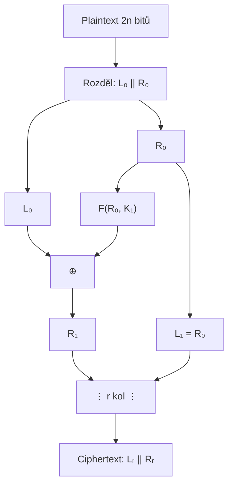
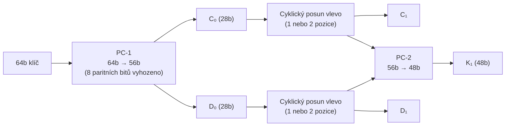
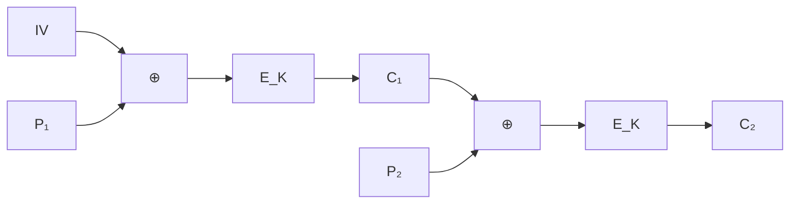
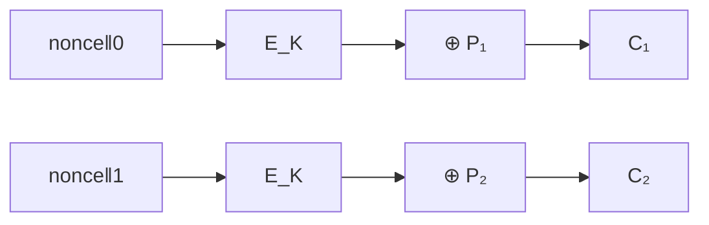

# 3. Blokové šifry

!!! abstract "Cíle kapitoly"
    - Porozumět Feistelově síti a proč je symetrická
    - Znát DES — F funkci, S-boxy, generování podklíčů
    - Porozumět AES — 4 operace v každém kole
    - Umět popsat provozní módy a vybrat správný pro danou situaci

---

## 3.1 Feistelova síť

### Princip

Feistelova síť dělí blok $2n$ bitů na **levou** a **pravou** polovinu a střídavě je míchá pomocí libovolné funkce $F$:

$$L_i = R_{i-1}$$
$$R_i = L_{i-1} \oplus F(R_{i-1}, K_i)$$



!!! success "Klíčová vlastnost: Symetrie"
    **Dešifrování = šifrování s obráceným pořadím podklíčů** $K_r, K_{r-1}, \ldots, K_1$.
    
    Funkce $F$ **nemusí být invertibilní** — to je elegance Feistelovy sítě.
    Bezpečnost závisí pouze na vlastnostech $F$ (konfúze, difúze).

!!! tip "Zkouška"
    Nakreslit jedno kolo Feistelovy sítě. Vysvětlit, proč stačí obrátit pořadí klíčů při dešifrování.

---

## 3.2 DES — Data Encryption Standard

### Parametry

| Parametr | Hodnota |
|----------|---------|
| Délka bloku | 64 bitů |
| Délka klíče | 56 bitů (+ 8 paritních = 64 bitů celkem) |
| Počet kol | 16 (Feistel) |
| Status | ❌ **ZASTARALÝ** (od ~1998) |

### F funkce (jedno kolo)

```mermaid
flowchart LR
    R32["R (32b)"] --> E["Expanzní permutace E\n32 → 48 bitů"]
    KI["Podklíč Kᵢ (48b)"] --> XOR["⊕"]
    E --> XOR
    XOR --> S["8× S-box\n(6b → 4b každý)\n= 48b → 32b"]
    S --> P["P-permutace\n32b difúze"]
    P --> OUT["F výstup (32b)"]
    style S fill:#2d1f4e,stroke:#a78bfa
```



**Detailně:**

1. **Expanze E:** 32 bitů → 48 bitů (16 bitů duplikováno pro rozšíření)
2. **XOR s podklíčem:** 48b ⊕ 48b podklíč
3. **S-boxy:** 8 paralelních S-boxů, každý 6b → 4b (nelineárnost!)
4. **P-permutace:** fixní permutace 32 bitů (difúze)

### S-boxy — klíčový zdroj nelinearity

Každý S-box je 4×16 lookup tabulka. Vstup: 6 bitů, výstup: 4 bity.

- **Vnější 2 bity** (b₁b₆) → číslo **řádku** (0–3)
- **Vnitřní 4 bity** (b₂b₃b₄b₅) → číslo **sloupce** (0–15)

!!! info "Příklad S1-boxu (řádek 0)"
    Vstup: `100110` → b₁=1, b₆=0 → řádek 2; b₂b₃b₄b₅=0011 → sloupec 3

### Generování podklíčů



Počty posunů: kola 1,2,9,16 → posun 1; ostatní kola → posun 2.

### 3DES — Triple DES

$$C = E_{K_3}(D_{K_2}(E_{K_1}(P)))$$


- **EDE** struktura (Encrypt-Decrypt-Encrypt) → zpětná kompatibilita s DES pro $K_1 = K_2 = K_3$
- Efektivní bezpečnost: **112 bitů** (nikoliv 168) — útok meet-in-the-middle

!!! danger "3DES"
    3DES je zastaralý. NIST ho deprecated v roce 2017 a disallowed od 2024. Migrace na AES-128 nebo AES-256.

---

## 3.3 AES / Rijndael

### Parametry

| Délka klíče | Počet kol | Velikost stavu |
|------------|-----------|----------------|
| 128 bitů | 10 | 4×4 bytes |
| 192 bitů | 12 | 4×4 bytes |
| 256 bitů | 14 | 4×4 bytes |

AES je **SP-síť** (Substitution-Permutation network), nikoli Feistel. Stav = matice 4×4 bytů = 128 bitů.

### 4 operace každého kola

=== "① SubBytes"
    Nelineární substituce — každý byte nahrazen hodnotou z AES S-boxu.
    
    S-box je odvozen z $\text{GF}(2^8)$ inverze + afinní transformace.
    
    Zajišťuje **konfúzi**.

=== "② ShiftRows"
    Cyklické rotace řádků stavu:
    
    ```
    Řádek 0: rotace o 0 (nezměněn)
    Řádek 1: rotace o 1 vlevo
    Řádek 2: rotace o 2 vlevo
    Řádek 3: rotace o 3 vlevo
    ```
    
    Zajišťuje **difúzi** mezi sloupci.

=== "③ MixColumns"
    Každý sloupec (4 byty) násoben fixní maticí v $\text{GF}(2^8)$:
    
    $$\begin{pmatrix}2&3&1&1\\1&2&3&1\\1&1&2&3\\3&1&1&2\end{pmatrix} \cdot \text{sloupec} \pmod{x^8+x^4+x^3+x+1}$$
    
    Zajišťuje **difúzi** v rámci každého sloupce. Vynecháno v posledním kole.

=== "④ AddRoundKey"
    Každý byte stavu XORován s odpovídajícím bytem podklíče (128 bitů).
    
    Jediné místo, kde vstupuje klíč.

### Schéma celého AES

```mermaid
flowchart LR
    PT["Plaintext\n128b"] --> ARK0["AddRoundKey\n(K₀)"]
    ARK0 --> SB["SubBytes"]
    SB --> SR["ShiftRows"]
    SR --> MC["MixColumns"]
    MC --> ARK["AddRoundKey\n(Kᵢ)"]
    ARK -->|"kola 1 … N-1"| SB
    ARK -->|"poslední kolo\n(bez MixColumns)"| CT["Ciphertext"]
    style PT fill:#1a1d2e,stroke:#34d399
    style CT fill:#1a1d2e,stroke:#f87171
```



### AES Key Schedule (rozvrh klíčů)

Z 128b klíče se expanduje na $(N_r + 1) \times 128$ bitů podklíčů pomocí:

- **SubWord** — SubBytes na slově
- **RotWord** — rotace slova
- **XOR s Rcon** — round constant (odvozena z $\text{GF}(2^8)$)

!!! tip "Zkouška"
    Popsat všechny 4 operace AES. Vysvětlit, proč poslední kolo vynechává MixColumns (symetrie inverze). Vědět, co zajišťuje konfúzi (SubBytes) a co difúzi (ShiftRows, MixColumns).

---

## 3.4 Provozní módy blokových šifer

### ECB — Electronic Codebook

$$c_i = E_K(p_i)$$

!!! danger "ECB nikdy nepoužívat"
    Deterministický — stejný plaintext blok → stejný ciphertext blok. Vzory plaintext se zachovají v ciphertextu („ECB tučňák").

### CBC — Cipher Block Chaining

$$c_i = E_K(p_i \oplus c_{i-1}), \quad c_0 = IV$$



- Šifrování **sekvenční**, dešifrování **paralelní**
- Chyba v $c_i$ poškodí dešifrování $p_i$ a $p_{i+1}$ (ale ne dál)
- Vyžaduje náhodné IV (nikdy nepoužívat stejné IV!)

### CTR — Counter Mode

$$c_i = p_i \oplus E_K(\text{nonce} \| i)$$



- Šifrování i dešifrování **paralelní** ✅
- Nevyžaduje inverzi $E_K^{-1}$ ✅
- Mění blokovou šifru na proudovou

### GCM — Galois/Counter Mode

$$C = \text{CTR}(P), \quad \text{Tag} = \text{GHASH}_H(A, C) \oplus E_K(IV\|0)$$

- **AEAD** = Authenticated Encryption with Associated Data
- Poskytuje **důvěrnost + integritu + autentizaci** v jednom
- Standard pro TLS 1.2, TLS 1.3, SSH, IPsec

### Srovnání módů

| Mód | Randomizace | Paral. E | Paral. D | Integrita | Použití |
|-----|-------------|----------|----------|-----------|---------|
| ECB | ❌ | ✅ | ✅ | ❌ | **Nikdy!** |
| CBC | ✅ (IV) | ❌ | ✅ | ❌ | Disk (hist.) |
| CTR | ✅ (nonce) | ✅ | ✅ | ❌ | Streaming |
| OFB | ✅ | ❌ | ❌ | ❌ | Kanály s šumem |
| **GCM** | ✅ | ✅ | ✅ | ✅ | **TLS, SSH** |

!!! tip "Zkouška"
    Vědět, který mód poskytuje AEAD (GCM). Proč je ECB nebezpečný. Jaký je rozdíl CBC vs CTR z hlediska paralelizace.

---

## Shrnutí kapitoly

!!! abstract "Rychlý přehled"

    | Algoritmus | Typ | Klíč | Blok | Kola | Status |
    |------------|-----|------|------|------|--------|
    | DES | Feistel | 56b | 64b | 16 | ❌ |
    | 3DES | 3×DES | 112/168b | 64b | 48 | ⚠️ |
    | AES-128 | SP-síť | 128b | 128b | 10 | ✅ |
    | AES-256 | SP-síť | 256b | 128b | 14 | ✅ |

!!! question "Klíčové otázky ke zkoušce"
    1. Proč DES F-funkce nemusí být invertibilní?
    2. Co je S-box v DES a jak se adresuje?
    3. Jaké jsou 4 operace AES? Co zajišťuje konfúzi a co difúzi?
    4. Proč poslední kolo AES vynechává MixColumns?
    5. Jaký mód použít, pokud chci důvěrnost i integritu zprávy?
    6. Proč ECB nikdy nepoužívat pro reálná data?
