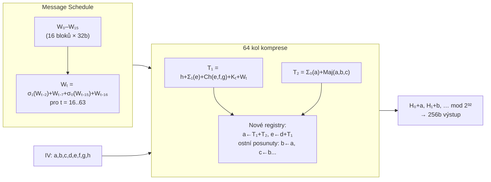

# 4. Hašovací funkce

!!! abstract "Cíle kapitoly"
    - Znát 3 bezpečnostní vlastnosti hašovacích funkcí a jejich složitosti
    - Porozumět Damgård-Merklově konstrukci a Davies-Meyerově kompresní funkci
    - Pochopit SHA-256 na úrovni struktury kola
    - Vědět, proč HMAC chrání před length extension útokem

---

## 4.1 Definice a bezpečnostní vlastnosti

Hašovací funkce $H: \{0,1\}^* \to \{0,1\}^n$ mapuje vstup libovolné délky na výstup pevné délky $n$ bitů.

### Tři požadované vlastnosti

!!! info "Preimage Resistance (Jednosměrnost)"
    Ze zadaného $h$ **nelze najít** $m$ takové, že $H(m) = h$.
    
    **Složitost útoku:** $O(2^n)$ — hrubá síla přes $2^n$ vstupů.

!!! info "Second Preimage Resistance"
    Ze zadaného $m$ **nelze najít** $m' \neq m$ takové, že $H(m') = H(m)$.
    
    **Složitost útoku:** $O(2^n)$.
    
    *Útočník zná originální zprávu a snaží se najít kolizi pro ni.*

!!! info "Collision Resistance"
    **Nelze najít žádná dvě** $m \neq m'$ taková, že $H(m) = H(m')$.
    
    **Složitost útoku:** $O(2^{n/2})$ — **narozeninový paradox!**

### Narozeninový paradox

!!! warning "Narozeninový paradox je kontraintuitivní"
    K nalezení kolize v $n$-bitové hašovací funkci stačí vyzkoušet přibližně $2^{n/2}$ vstupů (díky pravděpodobnosti).
    
    - SHA-256 ($n=256$): $2^{128}$ pokusů na kolizi — bezpečné
    - SHA-1 ($n=160$): $2^{80}$ pokusů — nestačí; Google to dokázal v 2017 (SHAttered)
    - MD5 ($n=128$): $2^{64}$ pokusů — dávno prolomen

!!! tip "Zkouška"
    Znát všechny 3 vlastnosti, jejich rozdíly a složitosti. Proč je Collision Resistance „obtížnější" vlastnost než preimage? (Útočník má volnost volit libovolná $m, m'$.)

---

## 4.2 Damgård-Merklova konstrukce

### Princip

Vstupní zpráva se **rozdělí na bloky pevné délky** pomocí paddingu, pak se iterativně komprimuje:

$$H_0 = IV \quad H_i = f(H_{i-1}, M_i) \quad H(M) = H_t$$

```mermaid
flowchart LR
    M["Zpráva M\n(libovolná délka)"] --> PAD["Padding\n+ délka M (Merkle-Damgård strengthening)"]
    PAD --> M1["M₁"] & M2["M₂"] & MT["Mₜ"]
    IV["IV\n(fixní konstanta)"] --> F1["f(H₀, M₁)"] --> H1["H₁"]
    M1 --> F1
    H1 --> F2["f(H₁, M₂)"] --> H2["H₂"]
    M2 --> F2
    H2 --> FT["f(Hₜ₋₁, Mₜ)"] --> HT["Haš = Hₜ"]
    MT --> FT
    style IV fill:#1a1d2e,stroke:#fbbf24
    style HT fill:#1a1d2e,stroke:#f87171
```

### Davies-Meyerova kompresní funkce

!!! info "Formule"
    $$H_i = E_{M_i}(H_{i-1}) \oplus H_{i-1}$$

Zpráva $M_i$ slouží jako **klíč** blokové šifry $E$; $H_{i-1}$ je šifrovaný plaintext; výsledek se XORuje s $H_{i-1}$.

**Proč XOR?** Bez XOR by existovaly fixní body: $E_M(H) = H$ by bylo problém. XOR tuto symetrii rozbíjí.

### Padding (Merkle-Damgård strengthening)

1. Přidáme bit `1`
2. Přidáme `0` bity tak, aby délka zprávy ≡ 448 (mod 512) pro SHA-256
3. Přidáme 64-bitovou reprezentaci **původní délky zprávy**

Přidání délky chrání před **length extension útokem** na samotnou iterativní strukturu.

---

## 4.3 SHA-256

### Parametry

| Vlastnost | Hodnota |
|-----------|---------|
| Výstup | 256 bitů (32 bytů) |
| Blok zprávy | 512 bitů |
| Počet kol | 64 |
| Vnitřní stav | 8 registrů × 32 bitů = 256 bitů |
| IV | prvních 256 bitů desetinné části odmocnin prvočísel 2–19 |

### Struktura SHA-256

### Jedno kolo — detailní výpočet

**Vstup kola $t$:** registry $a, b, c, d, e, f, g, h$ (každý 32 bitů)

$$T_1 = h + \Sigma_1(e) + Ch(e,f,g) + K_t + W_t$$
$$T_2 = \Sigma_0(a) + Maj(a,b,c)$$

**Aktualizace:**
$$\text{new\_}a = T_1 + T_2, \quad \text{new\_}e = d + T_1$$
$$\text{new\_}b = a, \quad \text{new\_}c = b, \quad \text{new\_}d = c$$
$$\text{new\_}f = e, \quad \text{new\_}g = f, \quad \text{new\_}h = g$$

**Pomocné funkce (všechny operace 32-bitové):**

$$Ch(e,f,g) = (e \wedge f) \oplus (\neg e \wedge g)$$
$$Maj(a,b,c) = (a \wedge b) \oplus (a \wedge c) \oplus (b \wedge c)$$
$$\Sigma_0(a) = (a \ggg 2) \oplus (a \ggg 13) \oplus (a \ggg 22)$$
$$\Sigma_1(e) = (e \ggg 6) \oplus (e \ggg 11) \oplus (e \ggg 25)$$
$$\sigma_0(x) = (x \ggg 7) \oplus (x \ggg 18) \oplus (x \gg 3)$$
$$\sigma_1(x) = (x \ggg 17) \oplus (x \ggg 19) \oplus (x \gg 10)$$

Konstanta $K_t$ = prvních 32 bitů desetinné části odmocnin prvočísel 2–311.

### Srovnání SHA variant

| Funkce | Výstup | Blok | Kola | Bezpečnost (kol) | Status |
|--------|--------|------|------|------------------|--------|
| MD5 | 128b | 512b | 64 | $2^{18}$ kol. | ❌ PROLOMEN |
| SHA-1 | 160b | 512b | 80 | $2^{63}$ kol. | ❌ PROLOMEN 2017 |
| **SHA-256** | **256b** | **512b** | **64** | **$2^{128}$ kol.** | **✅** |
| SHA-512 | 512b | 1024b | 80 | $2^{256}$ kol. | ✅ |
| SHA-3/Keccak | 224–512b | var. | 24 | $2^{n/2}$ kol. | ✅ |

!!! info "SHA-3 / Keccak"
    SHA-3 (Keccak) je jiný design než SHA-2 — **sponge construction** místo Damgård-Merkle. Odolný vůči length extension útoku nativně.

---

## 4.4 HMAC

### Problém: Proč nestačí $H(K \| M)$?

Damgård-Merklova konstrukce umožňuje **length extension útok**: pokud znám $H(K \| M)$, mohu spočítat $H(K \| M \| \text{padding} \| M')$ bez znalosti $K$.

### Řešení: HMAC

!!! info "Formule HMAC"
    $$\text{HMAC}_K(M) = H\!\bigl((K^+ \oplus \text{opad}) \;\|\; H\!\bigl((K^+ \oplus \text{ipad}) \;\|\; M\bigr)\bigr)$$

    kde $K^+$ = klíč doplněný nulami na délku bloku hashe, `ipad = 0x36...`, `opad = 0x5C...`.

```mermaid
flowchart LR
    K["Klíč K"] --> KP["K⁺ (zarovnán na délku bloku)"]
    KP --> IKEY["K⁺ ⊕ ipad"]
    KP --> OKEY["K⁺ ⊕ opad"]
    M["Zpráva M"] --> INNER["(ikey ‖ M)"]
    IKEY --> INNER
    INNER --> IH["H(ikey ‖ M)\n(vnitřní haš)"]
    IH --> OUTER["(okey ‖ IH)"]
    OKEY --> OUTER
    OUTER --> HMAC["H(okey ‖ IH)\n= HMAC výstup"]
    style HMAC fill:#1a1d2e,stroke:#f87171
```

**Proč dvojité hashování chrání?** Vnitřní hash zabalí zprávu s klíčem. Vnější hash přidá druhý klíč — útočník by musel najít kolizi pro **obě** hashování.

!!! tip "Zkouška"
    Vědět, proč $H(K \| M)$ nestačí (length extension). Umět nakreslit schéma HMAC. Vědět, co jsou ipad a opad.

---

## Shrnutí kapitoly

!!! abstract "Rychlý přehled"
    - **Preimage:** $O(2^n)$ — haš → zpráva
    - **2nd preimage:** $O(2^n)$ — zpráva → kolize pro tu zprávu
    - **Kolize:** $O(2^{n/2})$ — libovolná kolize (narozeninový paradox)
    - **SHA-256:** 8 registrů, 64 kol, Ch+Maj+Σ operace
    - **HMAC:** chrání před length extension útokem, 2× hash s různými klíči

!!! question "Klíčové otázky ke zkoušce"
    1. Jaké jsou tři vlastnosti hašovací funkce? Jaká je složitost každé?
    2. Proč $O(2^{n/2})$ na kolize, ne $O(2^n)$? (narozeninový paradox)
    3. Popište Damgård-Merklovu konstrukci.
    4. Co je Davies-Meyerova kompresní funkce? Proč XOR?
    5. Proč $H(K \| M)$ nestačí jako MAC? Co je length extension útok?
    6. Popište strukturu HMAC.
