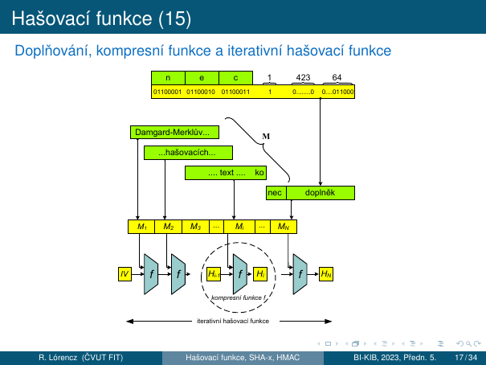
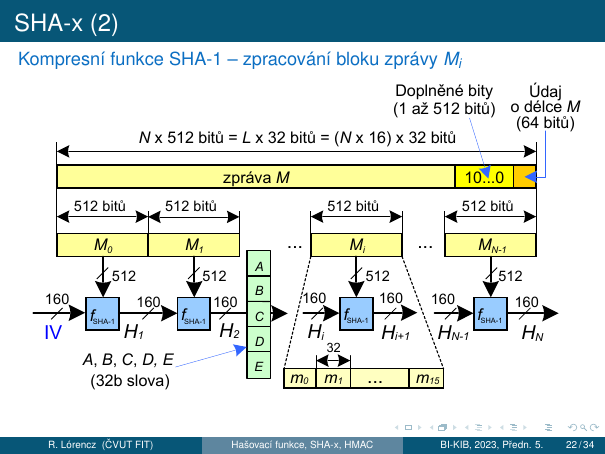
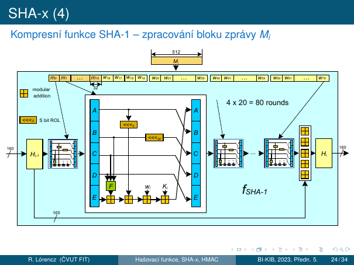
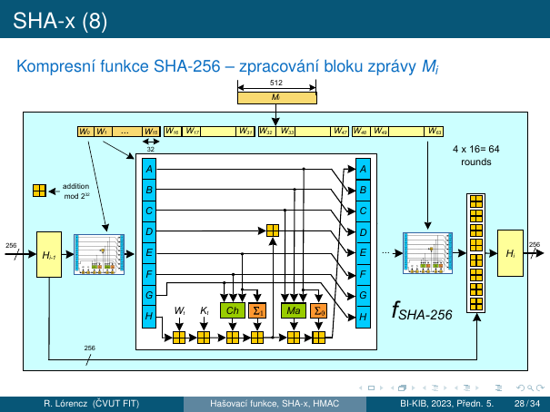
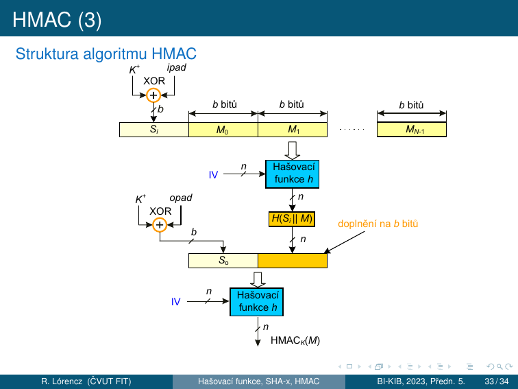

# 4. Hašovací funkce

!!! abstract "Cíle kapitoly"
    - Znát dva typy jednosměrných funkcí a jejich využití
    - Znát formální definici kryptografické hašovací funkce a model náhodného orákula
    - Rozumět Bezkoliznosti 1. a 2. řádu a narozeninovému paradoxu
    - Porozumět Damgård-Merklově konstrukci, zarovnání a Davies-Meyerově kompresní funkci
    - Znát strukturu SHA-1 a SHA-256 na úrovni kola
    - Vědět, jak funguje HMAC a co zaručuje

---

## 4.0 Jednosměrné funkce

!!! info "Definice — Jednosměrná funkce"
    Funkce $f: X \to Y$ je **jednosměrná**, jestliže:

    - **Snadný výpočet:** Pro libovolné $x \in X$ lze snadno spočítat $y = f(x)$.
    - **Obtížná inverze:** Pro libovolné (nebo náhodné) $y \in Y$ je výpočetně nezvládnutelné nalézt $x \in X$ tak, aby $f(x) = y$.

Existují dva typy jednosměrných funkcí:

| Typ | Popis | Příklad |
|-----|-------|---------|
| **Typ 1 — Absolutní** | Inverze je výpočetně nezvládnutelná **bez jakékoliv** pomocné informace | Součin dvou prvočísel $p \cdot q$ — faktorizace je těžká |
| **Typ 2 — Padací dvířka (trapdoor)** | Inverze je obtížná, ale lze ji nalézt se znalostí tajné informace „padacích dvířek" | Asymetrická kryptografie — soukromý klíč je trapdoor |

**Příklad (Typ 1):** Součin dvou velkých prvočísel $n = p \cdot q$ je snadný, ale faktorizace $n$ zpět na $p$ a $q$ je výpočetně nezvládnutelná.

**Příklad (Typ 2):** V asymetrické kryptografii slouží veřejný klíč k šifrování (snadný výpočet), ale dešifrování vyžaduje soukromý klíč (padací dvířka).

---

## 4.1 Kryptografická hašovací funkce

!!! info "Formální definice"
    Nechť $d$ je přirozené číslo a $X$ je množina binárních řetězců délek $0$ až $d$. Funkce $h: X \to \{0,1\}^n$ je **kryptografická hašovací funkce**, jestliže:

    1. Je **jednosměrná** (Typ 1) — nelze ji invertovat bez padacích dvířek.
    2. Je **bezkolizní** — nelze výpočetně nalézt dvě různé zprávy se stejným hašem.

Hašovací funkce mapuje vstup **libovolné délky** na výstup **pevné délky** $n$ bitů.

### Model náhodného orákula

**Náhodné orákulum** je idealizovaný bezpečnostní model pro hašovací funkce:

- **Orákulum** = stroj, který na dotaz vrátí odpověď (pro stejný vstup vždy stejný výstup).
- **Náhodné orákulum** na nový dotaz odpoví **náhodně** zvoleným výstupem z výstupní množiny $\{0,1\}^n$.
- Pro již viděný dotaz vrátí stejný výstup jako dříve.

Tento model formalizuje požadavek, aby hašovací funkce chovala jako „náhodná funkce" — bez struktury, která by umožnila předvídat výstup z jiných vstupů. Kryptografické analýzy bezpečnosti předpokládají, že $h$ se chová jako náhodné orákulum.

---

## 4.2 Bezpečnostní vlastnosti a Bezkoliznost

### Tři bezpečnostní vlastnosti

!!! info "Jednosměrnost (Preimage Resistance)"
    Ze zadaného $h$ **nelze najít** $m$ takové, aby $H(m) = h$.

    **Složitost útoku:** $\approx 2^n$ — hrubá síla přes $2^n$ vstupů.

!!! info "Bezkoliznost 2. řádu (Second Preimage Resistance)"
    Pro zadaný vzor $x$ je výpočetně nezvládnutelné nalézt 2. vzor $y \neq x$ tak, aby $h(x) = h(y)$.

    **Složitost útoku:** $\approx 2^n$.

    *Útočník zná konkrétní zprávu a snaží se najít jinou zprávu se stejným hašem.*

!!! info "Bezkoliznost 1. řádu (Collision Resistance)"
    Je výpočetně nezvládnutelné nalézt libovolné dvě různé zprávy $M$ a $M'$ tak, aby $h(M) = h(M')$.

    **Složitost útoku:** $\approx 2^{n/2}$ — **narozeninový paradox!**

    *Útočník si volí obě zprávy libovolně.*

!!! warning "Prolomení hašovací funkce"
    Pokud víme, jak vzory nalézat jednoduše, a to buď v případě kolizí 1. nebo 2. řádu, hovoříme o **prolomení hašovací funkce**.

**Bezkoliznost se běžně využívá k digitálním podpisům.** Nepodepisuje se přímo zpráva (často dlouhá), ale pouze její haš. Bezkoliznost zaručuje, že není možné nalézt dva dokumenty se stejnou haší — proto můžeme podepisovat haš.

### Bezkoliznost a digitální podpisy

Bezkoliznost 1. řádu (Collision Resistance) je **silnější** požadavek než Bezkoliznost 2. řádu:

- U **bezkoliznosti 1. řádu** si útočník volí **obě** zprávy libovolně (má větší svobodu).
- U **bezkoliznosti 2. řádu** je jedna zpráva pevně dána (útočník má menší svobodu).

Proto lze útok na bezkoliznost 1. řádu provést s výrazně menší složitostí ($2^{n/2}$ místo $2^n$).

---

## 4.3 Narozeninový paradox

### Formální odvození

!!! question "Otázka"
    Jak velká musí být množina náhodných zpráv, aby v ní s nezanedbatelnou pravděpodobností existovaly dvě různé zprávy se stejnou haší?

**Narozeninový paradox** říká, že pro $n$-bitovou hašovací funkci nastává kolize s cca 50% pravděpodobností v množině $2^{n/2}$ zpráv, namísto očekávaných $2^{n-1}$.

!!! info "Tvrzení"
    Mějme množinu $M$ o $n$ různých prvcích a proveďme výběr $k$ prvků po jedné s vracením. Pravděpodobnost, že vybereme některý prvek dvakrát nebo vícekrát, je:

    $$P(n, k) = 1 - \frac{n(n-1)\cdots(n-k+1)}{n^k}$$

    Pro $k = O(n^{\frac{1}{2}})$ a velká $n$ platí $P(n, k) \approx 1 - \exp\!\left(-\dfrac{k^2}{2n}\right)$.

**Důsledek:** Pro $k = (2n \ln 2)^{\frac{1}{2}} \approx n^{\frac{1}{2}}$ prvků z $M$ se s cca 50% pravděpodobností naleznou dva shodné. Obecně pro hašovací funkci s $b$ bitovým hašovacím kódem postačí zahašovat $n^{\frac{1}{2}} = (2^b)^{\frac{1}{2}} = 2^{\frac{b}{2}}$ zpráv, abychom přibližně s 50% pravděpodobností nalezli kolizi.

**Příklady:**

- $P(365, 23) = 0{,}507$ → 23 náhodně vybraných lidí postačí k tomu, aby se mezi nimi s cca 50% pravděpodobností našla dvojice slavící narozeniny tentýž den.
- $P(365, 30) = 0{,}706$ → u skupiny 30 lidí je pravděpodobnost 70,6%.

Paradox spočívá v tom, že hledáme **jakoukoliv** dvojici se stejnými narozeninami (Bezkoliznost 1. řádu), nikoli osobu se stejnými narozeninami jako konkrétní člověk (Bezkoliznost 2. řádu).

### Pojem bezkoliznosti

Pokud máme hašovací funkci SHA-1 → možných zpráv je mnoho ($2^0 + 2^1 + \cdots + 2^d$), kde $d = 2^{64} - 1$, a hašovacích kódů pouze $2^{160}$ → existuje ohromné množství zpráv vedoucích na tentýž hašový kód, v průměru je to řádově $2^{d-159}$.

**Kolizí existuje velké množství, ale nalezení i jediné kolize je nad naše výpočetní možnosti**, i když zohledníme narozeninový paradox.

Například pro 160 bitový hašový kód bychom očekávali $2^{(160-1)}$ zpráv, paradoxně je to pouhých $2^{80}$ zpráv.

---

## 4.4 Damgård-Merklova konstrukce

### Zarovnání (Padding)

U moderních hašovacích funkcí může být zpráva velmi dlouhá, například $d = 2^{64} - 1$ bitů. Zpracovává se **po blocích postupně**, ne najednou. Proto je nutné:

1. **Zarovnání vstupní zprávy na celistvý počet bloků** před hašováním.
2. Zarovnání musí být bezkolizní a umožňovat **jednoznačné odejmutí**.

!!! warning "Proč nestačí doplnění nulami?"
    Pokud bychom doplnili zprávu nulovými bity, nelze rozeznat, kolik jich bylo doplněno (a zda některé z nich nejsou platnými bity zprávy, pokud zpráva nulovými bity končila). Tyto zprávy by vedly ke kolizi:

    ```
    10111001101  0100000...000000000000000000000000
    10111001101  0100000...0000000000000000000000000
    10111001101  0100000...00000000000000000000000000
    ...
    ```

**Zarovnání u hašovacích funkcí** se definuje jako **doplnění bitem 1** a poté potřebným počtem bitů 0 → jednoznačné odejmutí doplňku.

### Damgård-Merklovo zesílení — doplnění o délku zprávy

Zpráva $M$ je nejprve doplněna bitem 1, poté bity 0 (může jich být 0 — 511), aby do celistvého násobku 512 bitů zbývalo ještě 64 bitů. Posledních 64 bitů je vyplněno 64 bitovou hodnotou počtu bitů původní zprávy $M$.

Délka zprávy je součástí hašovacího procesu. 64 bitů vyjadřující délku zprávy umožňuje hašovat zprávy až do délky $d = 2^{64} - 1$ bitů. **Informace o délce původní zprávy v paddingu eliminuje některé útoky.**



### Princip Damgård-Merklovy konstrukce

!!! info "Damgård-Merklova konstrukce"
    $$H_0 = IV, \quad H_i = f(H_{i-1}, M_i), \quad H(M) = H_N$$

- $f$ zpracovává aktuální blok zprávy $M_i$ a výsledkem je určitá hodnota — **kontext** $H_i$.
- Hodnota $H_i$ nutně tvoří vstup do $f$ v dalším kroku. $f$ má tedy dva vstupy: $H_{i-1}$ a $M_i$, výstupem je nové $H_i$.
- **Šíře $H_i$** je většinou stejná jako šíře výstupního kódu.
- Počáteční hodnota kontextu $H_0$ se nazývá **inicializační hodnota (IV)** — je definována jako konstanta daná v popisu každé iterativní hašovací funkce.
- $f$ zpracovává širší vstup $(H_{i-1}, M_i)$ na mnohem kratší $H_i$ → $f$ je skutečně **kompresní**.
- Blok $M_i$ se promítne do $H_i$, ale současně dochází ke ztrátě informace.
- Hašováním posledního bloku $M_N$ dostáváme $H_N$, z něhož bereme buď celou délku nebo část jako výslednou haš.

### Bezpečnost Damgård-Merklovy konstrukce

**Kolize kompresní funkce** $f$ spočívá v nalezení inicializační hodnoty $H$ a dvou různých bloků $B_1$ a $B_2$ tak, aby $f(H, B_1) = f(H, B_2)$.

!!! success "Bezpečnost DM konstrukce"
    Pokud je hašovací funkce bezkolizní, vyplývá odtud i bezkoliznost kompresní funkce. Bylo dokázáno, že pokud je kompresní funkce bezkolizní, je bezkolizní také iterovaná hašovací funkce konstruovaná výše uvedeným postupem.

    Tato vlastnost DM konstrukce je bezpečnostním základem všech moderních hašovacích funkcí → je možné se soustředit na nalezení kvalitní kompresní funkce.

### Davies-Meyerova kompresní funkce

!!! info "Davies-Meyerova formule"
    $$H_i = f(H_{i-1}, M_i) = E_{M_i}(H_{i-1}) \oplus H_{i-1}$$

Davies-Meyerova konstrukce kompresní funkce zesiluje vlastnost jednosměrnosti ještě přičtením (XOR) vzoru před výstupem:

- Výstup je navíc **maskován vstupem** (XOR s $H_{i-1}$), což ještě více ztěžuje případný zpětný chod.
- Blok zprávy $M_i$ je obvykle větší než klíče blokových šifer → se aplikuje bloková šifra **několikrát za sebou v rundách**.
- Rundovní klíč je postupně čerpán z bloku $M_i$.

Konstruovat kompresní funkce na bázi blokových šifer splňuje požadavek na **jednosměrnost** a požadavek na jejich chování jako **náhodné orákulum** (díky složitosti blokových šifer).

```mermaid
flowchart LR
    M["Zpráva M\n(libovolná délka)"] --> PAD["Padding\n1 + 0...0 + délka (64b)"]
    PAD --> M1["M₁"] & M2["M₂"] & MT["Mₙ"]
    IV["IV\n(fixní konstanta)"] --> F1["f(H₀, M₁)"] --> H1["H₁"]
    M1 --> F1
    H1 --> F2["f(H₁, M₂)"] --> H2["H₂"]
    M2 --> F2
    H2 --> FT["f(Hₙ₋₁, Mₙ)"] --> HT["Haš = Hₙ"]
    MT --> FT
    style IV fill:#1a1d2e,stroke:#fbbf24
    style HT fill:#1a1d2e,stroke:#f87171
```



---

## 4.5 SHA-x

### SHA-1

Algoritmus SHA (Secure Hash Algorithm) byl zaveden NIST a publikovaný v normě **FIPS 180 (1993)**. Revidovaná verze SHA-1 v normě **FIPS 180-1 (1995)**.

SHA-1 byla prolomena díky **rostoucímu výpočetnímu výkonu** a nalezení **teoretických slabin**.

**Parametry SHA-1:**

- Zpracovává zprávu $M$ s maximální délkou $2^{64} - 1$ bitů.
- Vrací výstupní hašový kód s délkou **160b**.
- Vstupní zpráva $M$ je zpracovávána po blocích $M_i$ s velikostí **512b**.
- Prostupující kontext se skládá z $5 \times 32$ bitových slov $A, B, C, D, E$.



**Zpracování bloku $M_i$** probíhá v **4 × 20 = 80 rundách**. 160 bitový kontext (s inicializační hodnotou IV) je postupně „zašifrováván" 32b slovem $m_0, m_1$ až $m_{15}$ pro rundy $0, 1, \ldots, 15$ a pro rundy $16, 17, \ldots, 79$ 32b slovem $w_i$, pro které platí:

$$w_i = \lll_1\!(w_{i-16} \oplus w_{i-14} \oplus w_{i-8} \oplus w_{i-3}), \quad i = 16, 17, \ldots, 79$$

Na místě funkce $F$ v obrázku se po 20 rundách střídají 4 různé funkce ($F, G, H, I$) a v každé rundě se využívá jiná konstanta $K_i$. Pro výpočet hodnot logických funkcí $F, G, H, I$ platí:

| Funkce | Definice |
|--------|----------|
| $F(b, c, d)$ | $(b \wedge c) \vee (\bar{b} \wedge d)$ |
| $G(b, c, d)$ | $b \oplus c \oplus d$ |
| $H(b, c, d)$ | $(b \wedge c) \vee (b \wedge d) \vee (c \wedge d)$ |
| $I(b, c, d)$ | $b \oplus c \oplus d$ |

**Konstanty $K_i$:**

| Rundy | Hexadecimální $K_i$ | Celočíselná část |
|-------|---------------------|-----------------|
| $0 \leq i \leq 19$ | `5A927999` | $2^{30} \times \sqrt{2}$ |
| $20 \leq i \leq 39$ | `6ED9EBA1` | $2^{30} \times \sqrt{3}$ |
| $40 \leq i \leq 59$ | `8F1BBCDC` | $2^{30} \times \sqrt{5}$ |
| $60 \leq i \leq 79$ | `CA62C1D6` | $2^{30} \times \sqrt{10}$ |

**Inicializační vektor IV** má hodnoty (hexadecimálně):
$A =$ `67452301`, $B =$ `EFCDAB89`, $C =$ `98BADCFE`, $D =$ `10325476`, $E =$ `C3D2E1F0`

Po 80 rundách je k výsledku přičten modulo $2^{32}$ původní kontext $H_{i-1}$ (podle Davies-Meyerovy konstrukce). Přičítání je prováděno po 32b slovech.



### Srovnání SHA variant

Inovací standardu FIPS 180-1 na FIPS 180-2 byly zavedeny 3 nové hašovací algoritmy SHA-2: SHA-256, SHA-384 a SHA-512.

| | SHA-1 | SHA-256 | SHA-384 | SHA-512 |
|--|-------|---------|---------|---------|
| Délka haš. kódu | 160 | 256 | 384 | 512 |
| Délka zprávy | $< 2^{64}$ | $< 2^{64}$ | $< 2^{128}$ | $< 2^{128}$ |
| Velikost bloku | 512 | 512 | 1024 | 1024 |
| Velikost slova | 32 | 32 | 64 | 64 |
| Počet rund $f$ | 80 | 64/80 | 80 | 80 |
| Bezpečnost v bitech | 80 | 128 | 192 | 256 |

Nejvýznamnější rozdíly jsou v délce hašového kódu, který určuje odolnost hašového kódu vůči nalezení kolizí 1. a 2. řádu. Na druhé straně struktura hašovacích funkcí (kompresních funkcí) je téměř stejná.

### SHA-256

SHA-256 je novější, bezpečná kryptografická hašovací funkce. Od roku 2000 jako nová generace funkcí SHA (2002 standard FIPS). SHA-256 má stejnou základní strukturu a používá stejné typy operací modulární aritmetiky a logických binárních operací jako algoritmus SHA-1, je ale bezpečný.

- Generuje **256bitovou** hašovací hodnotu z bloků zpráv o velikosti **512 bitů** s paddingem totožným s pro SHA-1.
- Původní velikost zprávy je až $2^{64} - 1$ bit.
- SHA-256 interně počítá **256bitový kontext** (kvůli bezpečnosti). Výstupní hash lze zkrátit na 196/128 bitů. Zkrácený SHA-256 je praktičtější a není předmětem žádných známých útoků.

**Zpracování bloku $M_i$** probíhá v **4 × 16 = 64 rundách**. 256 bitový kontext je postupně „zašifráváván" 32b slovem $W_t$:

- Pro rundy $t = 0, 1, \ldots, 15$ je $W_t = m_t$ (rozdělení bloku zprávy $M_i$).
- Pro rundy $t = 16, 17, \ldots, 63$ je:

$$W_t = \sigma_1(W_{t-2}) + W_{t-7} + \sigma_0(W_{t-15}) + W_{t-16}$$

Pro výpočet hodnot funkcí $Ch$, $Ma$, $\Sigma_0$, $\Sigma_1$, $\sigma_0$, $\sigma_1$ platí:

| Funkce | Definice |
|--------|----------|
| $Ch(x, y, z)$ | $(x \wedge y) \oplus (\bar{x} \wedge z)$ |
| $Ma(x, y, z)$ | $(x \wedge y) \oplus (x \wedge z) \oplus (y \wedge z)$ |
| $\Sigma_0(x)$ | $\ggg\!2\,(x) \oplus \ggg\!13\,(x) \oplus \ggg\!22\,(x)$ |
| $\Sigma_1(x)$ | $\ggg\!6\,(x) \oplus \ggg\!11\,(x) \oplus \ggg\!25\,(x)$ |
| $\sigma_0(x)$ | $\ggg\!7\,(x) \oplus \ggg\!18\,(x) \oplus \gg\!3\,(x)$ |
| $\sigma_1(x)$ | $\ggg\!17\,(x) \oplus \ggg\!19\,(x) \oplus \gg\!10\,(x)$ |

Konstanta $K_t$ = prvních 32 bitů desetinné části odmocnin prvočísel 2–311.

Po 64 rundách je k výsledku přičten modulo $2^{32}$ původní kontext $H_{i-1}$ (Davies-Meyerova konstrukce). Přičítání je prováděno po 32b slovech.



!!! tip "Zkouška"
    Znát strukturu kola SHA-256: 8 registrů (A–H), 64 kol, Ch + Ma + Σ operace. Znát formuli pro expanzi slov $W_t$. Vědět rozdíl SHA-1 vs SHA-256 (počet registrů, délka haše, počet kol).

---

## 4.6 Využití hašovacích funkcí

Kryptografické využití hašovacích funkcí:

1. **Kontrola integrity** — kontrola shody velkých souborů dat.
2. **Ukládání a kontrola přihlašovacích hesel** — Pro vyloučení slovníkových útoků se používá ještě metoda solení. S otiskem hesla se vygeneruje náhodný řetězec „sůl", který je dohromady hašován s heslem. Databáze obsahuje dvojici: $(sůl, haš(heslo, sůl))$.
3. **Jednoznačná identifikace dat** — jednoznačná reprezentace vzoru, digitální otisk dat, jednoznačný identifikátor dat — to vše zejména pro **digitální podpisy**.
4. **Prokazování znalosti** (zero-knowledge proof).
5. **Autentizace původu dat.**
6. **Pseudonáhodné generátory, odvozování klíčů.**

---

## 4.7 HMAC

### Algoritmus HMAC

**Klíčované hašové autentizační kódy zpráv (HMAC)** zpracovávají nejen zprávu $M$, ale spolu s ní i nějaký tajný klíč $K$.

- Jsou proto podobné autentizačnímu kódu zprávy MAC, ale místo blokové šifry využívají hašovací funkci.
- Používají se jako k nepadělatelné mu zabezpečení zpráv, tak k autentizaci (prokazováním znalosti tajného klíče $K$).
- HMAC je obecná konstrukce, která využívá obecnou hašovací funkci. Podle toho, jakou hašovací funkci používá konkrétně, se označuje výsledek — například HMAC-SHA-1$(M, K)$ používá SHA-1, $M$ je zpráva a $K$ je tajný klíč.
- **HMAC je definován ve standardu FIPS-PUB-198.** Definice závisí na tom, kolik bajtů má blok kompresní funkce. Například u SHA-1 je to 64B (512b), u SHA-384 a SHA-512 to je 128B (1024b).

**Konstanty:**

- Definujeme konstantní řetězce **ipad** jako řetězec $b/8$ bajtů s hodnotou `0x36` (`0011 0110`) a **opad** jako řetězec $b/8$ bajtů s hodnotou `0x5C` (`0101 1100`), kde $b$ je velikost bloku v bitech.
- Klíč $K$ v případě, že $\log_2 K < b$, doplníme bity 0 vlevo od MSB bitu klíče do délky $b$-bitů a označíme ho $K^+$.

**Definujeme hodnotu $HMAC_K(M)$ jako:**

$$HMAC_K(M) = H\!\Bigl(\bigl(K^+ \oplus opad\bigr) \,\|\, H\!\bigl(\bigl(K^+ \oplus ipad\bigr) \,\|\, M\bigr)\Bigr)$$

kde $\|$ označuje zřetězení.

Operace „doplnění na $b$ bitů" je prováděna stejným způsobem jako doplnění zprávy u hašovací funkce do celého bloku. Doplnění bude vždy jenom do 1 bloku, protože při použití SHA-x platí: **délka hašového kódu < velikost bloku − 64 [b]**.



### Bezpečnostní vlastnosti HMAC

!!! info "Nepadělatelný integritní kód, autentizace původu dat"
    - Zabezpečovací kód $HMAC_K(M)$, pokud je připojen za zprávu $M$, detekuje neúmyslnou chybu při jejím přenosu.
    - **Zabraňuje útočníkovi změnit zprávu a současně změnit HMAC**, protože bez znalosti klíče $K$ nelze nový HMAC vypočítat.
    - HMAC — nepadělatelný integritní kód (neposkytuje samotná haš).
    - Pro komunikujícího partnera je správný HMAC autentizací původu dat, protože odesílatel musel znát hodnotu tajného klíče $K$.

!!! warning "HMAC vs. nepopiratelnost"
    HMAC **neposkytuje nepopiratelnost** — obě strany komunikace znají tajný klíč $K$, tedy obě strany by mohly HMAC vytvořit.

### Průkaz znalosti při autentizaci entit

HMAC může být použit jako průkaz znalosti sdíleného tajemství — tajný klíč $K$ — při autentizaci entit:

1. Dotazovatel odešle náhodnou výzvu (řetězec) **challenge** prokazateli.
2. Od prokazatele obdrží odpověď **response** $= HMAC_K(challenge)$.
3. Prokazovatel zná tajný klíč $K$.

Útočník na komunikačním kanálu z hodnoty response klíč $K$ nemůže odvodit.

```mermaid
flowchart LR
    K["Klíč K"] --> KP["K⁺ (zarovnán na délku bloku b)"]
    KP --> IKEY["K⁺ ⊕ ipad\n(0x36...)"]
    KP --> OKEY["K⁺ ⊕ opad\n(0x5C...)"]
    M["Zpráva M"] --> INNER["(K⁺⊕ipad ‖ M)"]
    IKEY --> INNER
    INNER --> IH["H(K⁺⊕ipad ‖ M)\n(vnitřní haš)"]
    IH --> OUTER["(K⁺⊕opad ‖ vnitřní haš)"]
    OKEY --> OUTER
    OUTER --> HMAC["HMAC_K(M)"]
    style HMAC fill:#1a1d2e,stroke:#f87171
```



!!! tip "Zkouška"
    Znát formuli HMAC. Vědět, co jsou ipad (`0x36`) a opad (`0x5C`). Vědět, proč HMAC zaručuje autentizaci původu dat ale **neposkytuje nepopiratelnost**. Umět popsat průkaz znalosti pomocí HMAC (challenge–response).

---

## Shrnutí kapitoly

!!! abstract "Rychlý přehled"
    - **Jednosměrné funkce:** Typ 1 (absolutní, např. faktorizace) a Typ 2 (trapdoor, asymetrická kryptografie)
    - **Jednosměrnost:** $O(2^n)$ — haš → zpráva
    - **Bezkoliznost 2. řádu:** $O(2^n)$ — daná zpráva → kolize pro ni
    - **Bezkoliznost 1. řádu:** $O(2^{n/2})$ — libovolná kolize (narozeninový paradox)
    - **Padding:** bit 1 + nuly + 64b délka; jednoznačné odejmutí
    - **DM konstrukce:** $H_i = f(H_{i-1}, M_i)$, $H_0 = IV$; bezkolizní pokud je $f$ bezkolizní
    - **Davies-Meyer:** $H_i = E_{M_i}(H_{i-1}) \oplus H_{i-1}$
    - **SHA-1:** 160b, 5×32b (ABCDE), 4×20 kol, funkce F/G/H/I, prolomen
    - **SHA-256:** 256b, 8×32b (A–H), 64 kol, Ch+Ma+Σ operace, bezpečný
    - **HMAC:** $H((K^+ \oplus opad) \| H((K^+ \oplus ipad) \| M))$; autentizace původu dat, NE nepopiratelnost

!!! question "Klíčové otázky ke zkoušce"
    1. Definujte jednosměrnou funkci a hašovací funkci. Jaké jsou tři základní bezpečnostní vlastnosti hašovací funkce?
    2. Co je narozeninový paradox a jak ovlivňuje odolnost hašovacích funkcí vůči kolizím?
    3. Jak se správně zarovnává vstupní zpráva před hašováním? Co je Damgård-Merklovo zesílení a proč je důležité?
    4. Popište Damgård-Merklovu konstrukci hašovací funkce — jak je zpracována zpráva jako celek?
    5. Co je Davies-Meyerova konstrukce kompresní funkce?
    6. Jaké jsou základní charakteristiky SHA-1 a SHA-256? Čím se zásadně liší?
    7. Co je HMAC, k čemu slouží a proč neposkytuje nepopiratelnost?
