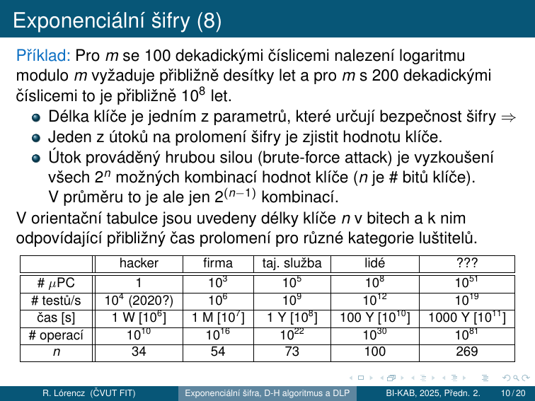
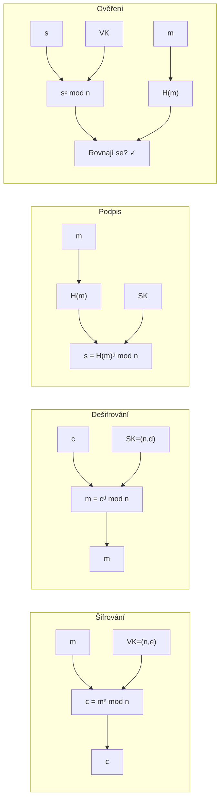
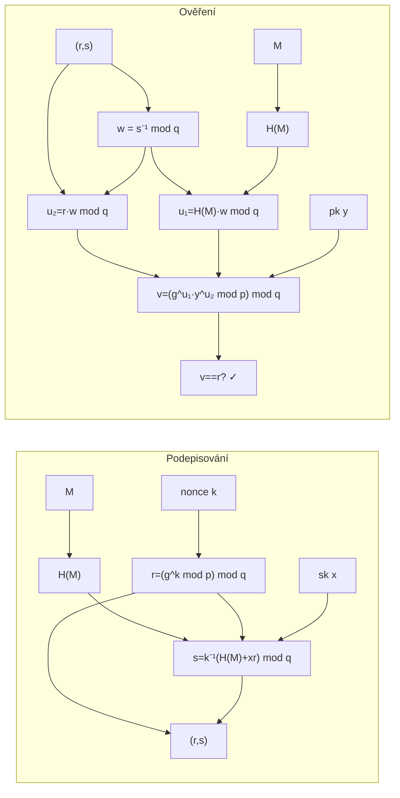

# 5. Asymetrická kryptografie

!!! abstract "Cíle kapitoly"
    - Porozumět principu asymetrické kryptografie (dvojice klíčů)
    - Zvládnout Diffie-Hellman výměnu klíčů a DLP
    - Umět ručně projít RSA šifrování, dešifrování a podpis
    - Pochopit RSA-CRT, ElGamal a DSA
    - Znát běžné útoky a bezpečnostní požadavky

---

## 5.0 Exponenciální šifra

!!! info "Symetrická šifra na modulárním umocňování"
    Exponenciální šifry jsou **symetrické** – používají stejný klíč pro šifrování i dešifrování.
    Byly uvedeny v roce **1978 Pohligem a Hellmanem**. Jsou značně odolné vůči kryptoanalýze.

### Parametry

- $m$ je prvočíslo
- $e$ je přirozené číslo – **šifrovací klíč**, platí $\gcd(e, m-1) = 1$
- OT je nejdříve převeden do dvojciferného číselného ekvivalentu (A=00, B=01, ..., Z=25)

### Bloky a šifrování

Získaná čísla seskupíme do dekadických číslic délky $2s$ tvořících číslo, kde $s$ je počet písmen v jednom bloku. Tyto bloky tvoří čísla menší než $m$. Kdy $2525 < m < 252525$, potom $s = 2$ (bloky po dvou písmenech = 4-ciferná čísla).

Každý blok $p$ s $s$ písmeny OT, reprezentující celé číslo s $2s$ dekadickými číslicemi, je převeden na blok $c$ ŠT vztahem:

$$c = |p^e|_m, \quad 0 \le c < m$$

### Příklad šifrování: $m = 2633$, $e = 29$

$\gcd(29, 2632) = 1$ ✓

OT: **THIS IS AN EXAMPLE OF AN EXPONENTIATION CIPHER**

Číselné ekvivalenty (4-ciferné bloky po 2 písmenech):

```
1907 0818 0818 0013 0423 0012 1511 0414 0500 1304
2315 1413 0413 1908 0019 0814 1302 0815 0704 1723
```

(Na konec přidáno X = 23 kvůli zarovnání.) Příklad prvního bloku: $c = |1907^{29}|_{2633} = 2199$

ŠT: `2199 1745 1745 1209 2437 2425 1729 1619 0935 0960 1072 1541 1721 1553 0735 2064 1351 1741 1741 1459`

### Dešifrování

K dešifrování bloku $c$ ŠT potřebujeme **dešifrovací klíč** $d$:

$$de \equiv 1 \pmod{m-1} \implies d = e^{-1} \bmod (m-1)$$

Dešifrovací vztah — odvozen pomocí **malé Fermatovy věty** ($p^{m-1} \equiv 1 \pmod{m}$):

$$|c^d|_m = |(p^e)^d|_m = |p^{ed}|_m = |p^{k(m-1)+1}|_m = |(p^{m-1})^k \cdot p|_m = |p|_m$$

!!! example "Příklad dešifrování: $m = 2633$, $e = 29$"
    $d = |29^{-1}|_{2632} = 2269$ (výpočet EEA)

    Dešifrování bloku 2199: $p = |2199^{2269}|_{2633} = 1907$ ✓

### Časová složitost

- Šifrování každého bloku: $O(k^3)$ bitových operací algoritmem **Square & Multiply** ($k = \lceil \log_2 m \rceil$ bitů)
- Nalezení $d$ pomocí EEA: $O(\log 2k)$ bitových operací — provede se jednou
- Kryptoanalýza: vyžaduje řešení **problému diskrétního logaritmu** (viz sekce 5.3) — v obecném případě nemůže být vykonána v přijatelné době

---

## 5.1 Matematické základy

### Modulární aritmetika — klíčové fakty

$$a^{\phi(n)} \equiv 1 \pmod{n} \quad \text{(Eulerova věta, } \gcd(a,n)=1\text{)}$$
$$a^{p-1} \equiv 1 \pmod{p} \quad \text{(Fermatova věta, } p \text{ prvočíslo)}$$

**Eulerova funkce:**
$$\phi(p) = p - 1 \quad \phi(n) = (p-1)(q-1) \text{ pro } n = pq$$

### Rozšířený Euklidův algoritmus (výpočet inverzního prvku)

Pro výpočet $a^{-1} \bmod m$ (existuje pokud $\gcd(a,m) = 1$):

!!! example "Příklad: $5^{-1} \bmod 26$"
    Euklidův algoritmus: $26 = 5 \cdot 5 + 1$
    
    $1 = 26 - 5 \cdot 5$
    
    $\Rightarrow 1 \equiv -5 \cdot 5 \pmod{26} \Rightarrow 5^{-1} \equiv -5 \equiv 21 \pmod{26}$
    
    Ověření: $5 \cdot 21 = 105 = 4 \cdot 26 + 1$ ✓

---

## 5.2 Diffie-Hellman výměna klíčů

### Protokol

**Veřejné parametry:** prvočíslo $p$, generátor $g$ (primitivní kořen mod $p$)

| Krok | Alice | Bob |
|------|-------|-----|
| Generuje tajné | $a \leftarrow \{1, \ldots, p-2\}$ | $b \leftarrow \{1, \ldots, p-2\}$ |
| Počítá veřejné | $A = g^a \bmod p$ | $B = g^b \bmod p$ |
| Pošle | $A \to$ Bob | $B \to$ Alice |
| Sdílený klíč | $K = B^a \bmod p$ | $K = A^b \bmod p$ |
| Shodnost | $K = g^{ab} \bmod p$ | $K = g^{ab} \bmod p$ ✓ |

### Bezpečnost — Diskrétní logaritmus (DLP)

Útočník zná $p, g, A = g^a \bmod p$ a chce najít $a$. To je **Discrete Logarithm Problem (DLP)** — v obecné grupě není znám polynomiální algoritmus.

!!! warning "Diffie-Hellman není odolný vůči MITM!"
    Útok Man-in-the-Middle: Eve se vloží mezi Alici a Boba, každému nabídne svůj klíč. DH samotný neověřuje identitu — potřebujeme autentizaci (certifikáty, STS protokol).

### Diffie-Hellmanův protokol — formální popis

Jedná se o aplikaci exponenciální šifry pro zřízení společného klíče. Exponenciální šifra je vhodná pro zřízení **společného klíče** pro dva nebo více subjektů.

1. **Volba veřejných prvků účastníkem A:** prvočíslo $m$ a celé číslo $a$ ($a$ je generátor grupy $\mathbb{Z}_m^*$)
2. **Generování parametrů klíče účastníkem A:** volba čísla $k_1 < m-1$ a výpočet $y_1 = |a^{k_1}|_m$; A odešle prostřednictvím komunikačního kanálu B čísla $a$, $m$ a $y_1$
3. **Generování parametrů klíče účastníkem B:** volba čísla $k_2 < m-1$ a výpočet $y_2 = |a^{k_2}|_m$; B odešle prostřednictvím komunikačního kanálu A číslo $y_2$
4. **Dopočítání sdíleného klíče účastníkem A:** $K = |y_2^{k_1}|_m$
5. **Dopočítání sdíleného klíče účastníkem B:** $K = |y_1^{k_2}|_m$

Shodnost: $K = |a^{k_1 k_2}|_m$ pro oba účastníky. Neautorizované subjekty nemohou najít $K$ v rozumném čase — jsou nuceny hledat logaritmus modulo $m$.

!!! example "Příklad: $m = 13$, $a = 2$, $k_1 = 7$, $k_2 = 11$"
    1. A pošle B: $y_1 = |2^7|_{13} = 11$
    2. B pošle A: $y_2 = |2^{11}|_{13} = 7$
    3. A vypočítá: $K = |7^7|_{13} = 6$
    4. B vypočítá: $K = |11^{11}|_{13} = 6$ ✓

### Rozšíření pro $n$ subjektů

V případě $n$ subjektů má každý vlastní klíč $k_1, k_2, \ldots, k_n$. Společný klíč:

$$K = |a^{k_1 k_2 \cdots k_n}|_m, \quad 0 < K < m$$

!!! tip "Zkouška"
    Provést DH na malých číslech ručně. Vysvětlit, proč útočník nemůže spočítat sdílený klíč. Znát formální kroky protokolu.

---

## 5.3 Problém diskrétního logaritmu (DLP)

### Motivace

Při práci s reálnými čísly není výpočet mocniny výrazně jednodušší než výpočet logaritmu. Jiná situace nastává v konečné grupě, např. $\mathbb{Z}_n^*$ (s operací násobení modulo $n$), která obsahuje prvky nesoudělné s $n$. S použitím metody „Square & Multiply" je výpočet mocniny v konečné grupě rychlý.

Ale když máme prvek $m \in \mathbb{Z}_n^*$, o kterém víme, že je ve tvaru $b^k$, kde $b \in \mathbb{Z}_n^*$ je známý prvek, tak neznáme rychlý algoritmus na nalezení hodnoty $k = \log_b m$.

### Definice

Nechť $G$ je grupa, $b \in G$ a $y \in G$ je mocninou prvku $b$. Potom **diskrétní logaritmus** prvku $y$ o základu $b$ je každé číslo $k$ takové, že $b^k = y$, značíme ho $\log_b y$.

**Pro libovolné prvky $g, h \in G$** nemusí vždy existovat číslo $k$ takové, že $g^k = h$. Např. v grupě $\mathbb{Z}_{11}^*$ neexistuje číslo $k$ takové, že $5^k = 7$ (tj. v $\mathbb{Z}_{11}^*$ neexistuje $\log_5 7$). Avšak když je grupa $G$ cyklická a prvek $b \in G$ bude jejím generátorem, tak existence $\log_b m$ je garantována pro všechna $m \in G$.

### Vlastnosti diskrétního logaritmu

Mějme cyklickou grupu $G$ řádu $n$ a nechť $g$ je její generátor. Pak platí:

1. $\log_g 1 = 0$, $\log_g g^k = k$ pro $k \in \mathbb{N}$
2. $\log_g a^k = k \cdot \log_g a$ pro všechna $a \in G$, $k \in \mathbb{N}$
3. $\log_g(a \cdot b) = \log_g a + \log_g b$ pro všechna $a, b \in G$

!!! example "Příklady"
    1. Cyklická grupa $\mathbb{Z}_{17}^*$ s operací **násobení** modulo 17, generátor $g = 3$:

       $\log_3 7 = 11$, protože $3^{11} \equiv 7 \pmod{17}$

    2. Cyklická grupa $\mathbb{Z}_{17}$ s operací **sčítání** modulo 17, generátor $g = 3$:

       $\log_3 7 = 8$, protože $3 \cdot 8 \equiv 7 \pmod{17}$

    V 1. případě ($\mathbb{Z}_p^*$) neexistuje rychlý algoritmus. Ve 2. případě ($\mathbb{Z}_p$) lze PDL vyřešit pomocí Euklidova algoritmu v polynomiálním čase.

### Výpočetní obtížnost

Nejrychlejší algoritmy pro výpočet diskrétního logaritmu v $\mathbb{Z}_p^*$ potřebují přibližně $\exp(\sqrt{\log m \cdot \log \log m})$ bitových operací — přibližně **stejně jako nejrychlejší algoritmy pro faktorizaci**.

**Útok hrubou silou:** Postupný výpočet $g, g^2, g^3, \ldots$ až do $g^k = y$. V nejhorším případě $n$ operací → složitost $\mathcal{O}(2^d) = \mathcal{O}(n)$, kde $d = \log_2 n$.

**Efektivnější algoritmy** (všechny stále exponenciální):

- Baby-step giant-step
- Pollardův $\rho$ algoritmus
- Pohlig-Hellmanův algoritmus
- Index kalkulus
- Funkční síto (momentálně nejrychlejší)

### Délka klíče a bezpečnostní kategorie



| | hacker | firma | taj. služba | lidé | ??? |
|---|--------|-------|-------------|------|-----|
| \# µPC | 1 | 10³ | 10⁵ | 10⁸ | 10⁵¹ |
| \# testů/s | 10⁴ | 10⁶ | 10⁹ | 10¹² | 10¹⁹ |
| čas [s] | 1 týden | 1 měsíc | 1 rok | 100 let | 1000 let |
| \# operací | 10¹⁰ | 10¹⁶ | 10²² | 10³⁰ | 10⁸¹ |
| $n$ (bitů) | **34** | **54** | **73** | **100** | **269** |

Pro praktické použití: doporučená délka modulárního prvočísla pro $\mathbb{Z}_p^*$ je $p \approx 2^{4096}$.

### Slabé instance a silná prvočísla

!!! warning "Slabá instance"
    Když $m$ je prvočíslo a $m - 1$ je součinem malých prvočísel (slabá instance) ⇒ lze použít speciálních metod pro nalezení logaritmu modulo $m$ s **menším počtem binárních operací** než $O(\log_2^2 m)$.

!!! tip "Silné prvočíslo"
    Jako modula pro exponenciální šifrovací systémy je vhodné používat čísla $m = 2q + 1$, kde $q$ je prvočíslo.

### Využití DLP v kryptografii

- **Diffie-Hellman:** útočník zná $g^a$ a $g^b$, ale nemůže rychle spočítat $g^{ab}$ bez znalosti $a$ nebo $b$
- **ElGamal** šifrování i podpis
- **ECDSA** (Elliptic Curve Digital Signature Algorithm)
- Bezpečnost závisí na zvolené grupě — běžnou volbou jsou cyklické grupy $\mathbb{Z}_p^*$ pro dostatečně velká prvočísla

---

## 5.4 RSA

### Generování klíčů

1. Zvolíme velká prvočísla $p$ a $q$
2. $n = p \cdot q$ (modulus)
3. $\phi(n) = (p-1)(q-1)$
4. Zvolíme $e$ s $\gcd(e, \phi(n)) = 1$ (typicky $e = 65537 = 2^{16}+1$)
5. Spočítáme $d = e^{-1} \bmod \phi(n)$
6. **Veřejný klíč:** $(n, e)$ &emsp; **Soukromý klíč:** $(n, d)$

### Šifrování a dešifrování

$$c = m^e \bmod n \qquad m = c^d \bmod n$$

**Proč to funguje?** Eulerova věta: $(m^e)^d = m^{ed} = m^{1 + k\phi(n)} = m \cdot (m^{\phi(n)})^k \equiv m \pmod{n}$

### Digitální podpis RSA

| Krok | Operace |
|------|---------|
| Podepisování | $s = H(m)^d \bmod n$ |
| Ověření | Spočítám $s^e \bmod n$, porovnám s $H(m)$ |

!!! example "Příklad RSA (malá čísla)"
    - $p=43, q=59 \Rightarrow n=2537, \phi(n)=2436$
    - $e=13, d=937$ (protože $13 \cdot 937 = 12181 = 5 \cdot 2436 + 1$)
    - Šifrování: $m=1520 \Rightarrow c = 1520^{13} \bmod 2537 = 95$
    - Dešifrování: $c=95 \Rightarrow m = 95^{937} \bmod 2537 = 1520$ ✓



### Bezpečnostní požadavky RSA

!!! warning "Bezpečnostní požadavky"
    - **Délka klíče:** ≥ 2048 b (dnes doporučeno 3072–4096 b)
    - **Padding:** Vždy OAEP pro šifrování, PSS pro podpisy — bez paddingu je RSA deterministické a náchylné k útokům
    - **Bezpečnost spojena s faktorizací** $n = pq$ — kvadratické síto, GNFS (General Number Field Sieve)
    - $p, q$ musí být náhodná a přibližně stejně velká

!!! danger "Schoolbook RSA"
    RSA bez paddingu je **nezabezpečená**:
    - Deterministická (stejný $m$ → stejný $c$)
    - Náchylná k Håstad's broadcast attack, small exponent attack
    
---

## 5.5 RSA-CRT

### Motivace

Dešifrování $c^d \bmod n$ je pomalé pro velké $n$. Čínská věta o zbytcích (CRT) to zrychlí 4–8×.

### Rozšířený soukromý klíč

$$d_p = d \bmod (p-1), \quad d_q = d \bmod (q-1), \quad q_{inv} = q^{-1} \bmod p$$

### Algoritmus

```mermaid
flowchart TB
    C["Ciphertext c"] --> M1["m₁ = c^{d_p} mod p\n(číslo délky p — poloviční!)"]
    C --> M2["m₂ = c^{d_q} mod q\n(číslo délky q — poloviční!)"]
    M1 & M2 --> H["h = q_{inv}·(m₁-m₂) mod p"]
    H --> M["m = m₂ + h·q"]
    style M fill:#1a1d2e,stroke:#34d399
```



**Proč je to rychlejší?** Exponenciáty jsou délky $p$ a $q$ (polovina $n$). Exponencování $k$-bitového čísla trvá $O(k^3)$ → polovina délky = $(1/2)^3 = 1/8$ → **~4× rychlejší pro každé exponencování** + $m_1$ a $m_2$ jsou nezávislé → **paralelizovatelné**.

---

## 5.6 ElGamal

### Generování klíčů (Alice)

1. Zvolí prvočíslo $p$ a generátor $g$
2. Zvolí tajné $k_A \in \{1, \ldots, p-2\}$
3. $y_A = g^{k_A} \bmod p$ (veřejná hodnota)
4. Veřejný klíč: $(p, g, y_A)$

### Šifrování (Bob → Alice)

1. Zvolí náhodné $k_B$
2. $y_B = g^{k_B} \bmod p$
3. Sdílený klíč: $K = y_A^{k_B} \bmod p$
4. Ciphertext: $c = p_{msg} \cdot K \bmod p$
5. Odešle $(y_B, c)$

### Dešifrování (Alice)

$$K = y_B^{k_A} \bmod p, \quad p_{msg} = c \cdot K^{-1} \bmod p$$

!!! danger "Kritická slabina"
    **$k_B$ musí být vždy nové a náhodné!** Pokud se $k_B$ opakuje pro zprávy $c_1, c_2$:
    
    $$\frac{c_1}{c_2} = \frac{p_1 \cdot K}{p_2 \cdot K} = \frac{p_1}{p_2} \pmod{p}$$
    
    Poměr plaintextů je přímo znám.

---

## 5.7 DSA — Digital Signature Algorithm

### Parametry

- Prvočíslo $p$ (1024–3072 bitů)
- Prvočíslo $q$ s $q | (p-1)$ (160–256 bitů)
- Generátor $g = h^{(p-1)/q} \bmod p$
- Soukromý klíč $x$, veřejný klíč $y = g^x \bmod p$

### Podpis zprávy $M$

1. Zvolíme náhodné $k$ (nonce), $1 \leq k \leq q-1$
2. $r = (g^k \bmod p) \bmod q$
3. $s = k^{-1}(H(M) + xr) \bmod q$
4. Podpis = $(r, s)$

### Ověření podpisu $(r, s)$ zprávy $M$

1. $w = s^{-1} \bmod q$
2. $u_1 = H(M) \cdot w \bmod q$, &ensp; $u_2 = r \cdot w \bmod q$
3. $v = (g^{u_1} \cdot y^{u_2} \bmod p) \bmod q$
4. Platný ↔ $v = r$



!!! danger "Sony PS3 — kritický příklad"
    Sony používalo **konstantní $k$** (ne náhodné) pro všechny DSA podpisy firmwaru PS3.
    
    Ze dvou podpisů $(r, s_1)$, $(r, s_2)$ pro zprávy $H(M_1), H(M_2)$:
    
    $$k = \frac{H(M_1) - H(M_2)}{s_1 - s_2} \pmod{q}$$
    $$x = \frac{s_1 k - H(M_1)}{r} \pmod{q}$$
    
    Hackeři tak získali soukromý klíč a mohli podepisovat libovolný software pro PS3.

!!! tip "Zkouška"
    Znát kroky generování DSA podpisu a ověření. Vysvětlit Sony PS3 exploit.

---

## Shrnutí kapitoly

!!! abstract "Rychlý přehled"

    | Algoritmus | Základ | Klíče | Použití |
    |------------|--------|-------|---------|
    | Exponenciální šifra | DLP (sym.) | $(e, d)$ — $de \equiv 1 \pmod{m-1}$ | Symetrické šifrování |
    | DH | DLP | $(g^a, g^b) \to g^{ab}$ | Výměna klíčů |
    | RSA | Faktorizace | $(e,d)$ — $ed \equiv 1 \pmod{\phi(n)}$ | Šifrování, podpis |
    | RSA-CRT | Faktorizace + CRT | + $(d_p, d_q, q_{inv})$ | Rychlé dešifrování |
    | ElGamal | DLP | $(k_A, y_A)$ | Šifrování, podpis |
    | DSA | DLP | $(x, y)$ | Pouze podpis |

!!! question "Klíčové otázky ke zkoušce"
    1. Popište RSA: generování klíčů, šifrování, dešifrování, podpis.
    2. Proč je RSA bez paddingu nebezpečné?
    3. Jak RSA-CRT zrychlí dešifrování?
    4. Proč musí být $k_B$ v ElGamal vždy nové?
    5. Vysvětlete Sony PS3 exploit — proč konstantní $k$ kompromituje DSA?
    6. Jaký je rozdíl mezi DH a ElGamal?
    7. Co je problém diskrétního logaritmu? Proč je těžký v $\mathbb{Z}_p^*$ ale snadný v $\mathbb{Z}_p$?
    8. Zašifrujte zprávu exponenciální šifrou ($m = 2633$, $e = 29$, blok 1907).
    9. Co je slabá instance a silné prvočíslo u exponenciální šifry?
    10. Jak funguje DH pro 3 subjekty?
