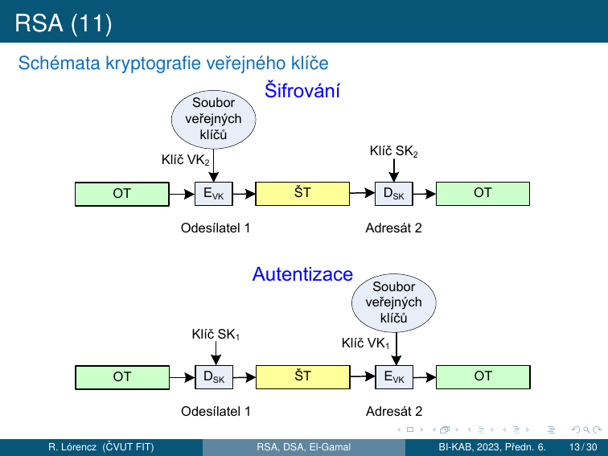
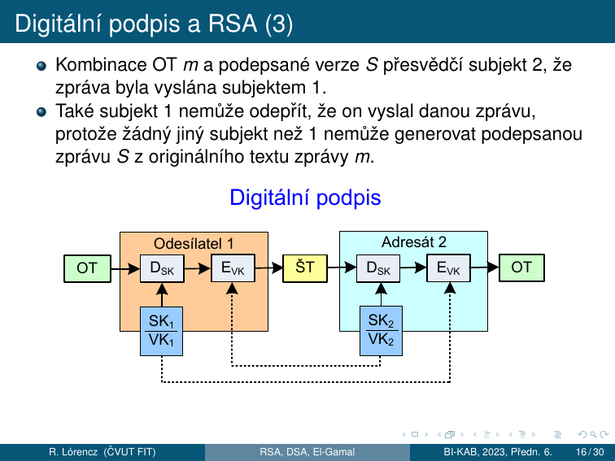
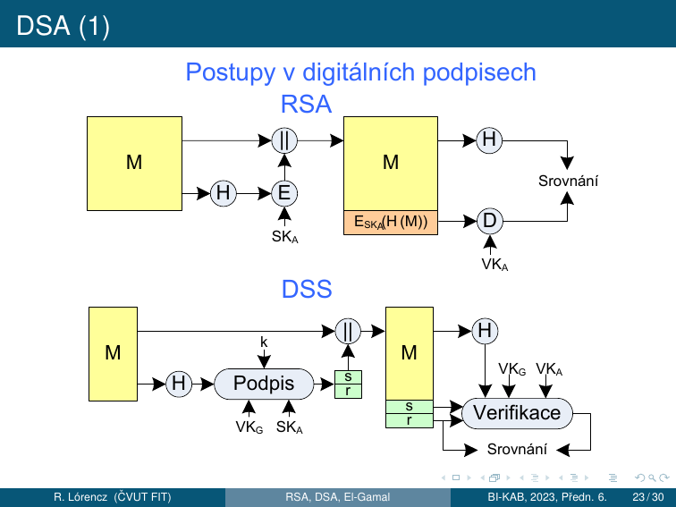

# 5. Asymetrická kryptografie

!!! abstract "Cíle kapitoly"
    - Porozumět principu asymetrické kryptografie (dvojice klíčů)
    - Zvládnout Diffie-Hellman výměnu klíčů a DLP
    - Umět ručně projít RSA šifrování, dešifrování a podpis
    - Pochopit RSA-CRT, ElGamal a DSA
    - Znát běžné útoky a bezpečnostní požadavky

---

## 5.0 Exponenciální šifra

!!! info "Symetrická šifra na modulárním umocňování"
    Exponenciální šifry jsou **symetrické** – používají stejný klíč pro šifrování i dešifrování.
    Byly uvedeny v roce **1978 Pohligem a Hellmanem**. Jsou značně odolné vůči kryptoanalýze.

### Parametry

- $m$ je prvočíslo
- $e$ je přirozené číslo – **šifrovací klíč**, platí $\gcd(e, m-1) = 1$
- OT je nejdříve převeden do dvojciferného číselného ekvivalentu (A=00, B=01, ..., Z=25)

### Bloky a šifrování

Získaná čísla seskupíme do dekadických číslic délky $2s$ tvořících číslo, kde $s$ je počet písmen v jednom bloku. Tyto bloky tvoří čísla menší než $m$. Kdy $2525 < m < 252525$, potom $s = 2$ (bloky po dvou písmenech = 4-ciferná čísla).

Každý blok $p$ s $s$ písmeny OT, reprezentující celé číslo s $2s$ dekadickými číslicemi, je převeden na blok $c$ ŠT vztahem:

$$c = |p^e|_m, \quad 0 \le c < m$$

### Příklad šifrování: $m = 2633$, $e = 29$

$\gcd(29, 2632) = 1$ ✓

OT: **THIS IS AN EXAMPLE OF AN EXPONENTIATION CIPHER**

Číselné ekvivalenty (4-ciferné bloky po 2 písmenech):

```
1907 0818 0818 0013 0423 0012 1511 0414 0500 1304
2315 1413 0413 1908 0019 0814 1302 0815 0704 1723
```

(Na konec přidáno X = 23 kvůli zarovnání.) Příklad prvního bloku: $c = |1907^{29}|_{2633} = 2199$

ŠT: `2199 1745 1745 1209 2437 2425 1729 1619 0935 0960 1072 1541 1721 1553 0735 2064 1351 1741 1741 1459`

### Dešifrování

K dešifrování bloku $c$ ŠT potřebujeme **dešifrovací klíč** $d$:

$$de \equiv 1 \pmod{m-1} \implies d = e^{-1} \bmod (m-1)$$

Dešifrovací vztah — odvozen pomocí **malé Fermatovy věty** ($p^{m-1} \equiv 1 \pmod{m}$):

$$|c^d|_m = |(p^e)^d|_m = |p^{ed}|_m = |p^{k(m-1)+1}|_m = |(p^{m-1})^k \cdot p|_m = |p|_m$$

!!! example "Příklad dešifrování: $m = 2633$, $e = 29$"
    $d = |29^{-1}|_{2632} = 2269$ (výpočet EEA)

    Dešifrování bloku 2199: $p = |2199^{2269}|_{2633} = 1907$ ✓

### Časová složitost

- Šifrování každého bloku: $O(k^3)$ bitových operací algoritmem **Square & Multiply** ($k = \lceil \log_2 m \rceil$ bitů)
- Nalezení $d$ pomocí EEA: $O(\log 2k)$ bitových operací — provede se jednou
- Kryptoanalýza: vyžaduje řešení **problému diskrétního logaritmu** (viz sekce 5.3) — v obecném případě nemůže být vykonána v přijatelné době

---

## 5.1 Matematické základy

### Modulární aritmetika — klíčové fakty

$$a^{\phi(n)} \equiv 1 \pmod{n} \quad \text{(Eulerova věta, } \gcd(a,n)=1\text{)}$$

$$a^{p-1} \equiv 1 \pmod{p} \quad \text{(Fermatova věta, } p \text{ prvočíslo)}$$

**Eulerova funkce:**

$$\phi(p) = p - 1 \quad \phi(n) = (p-1)(q-1) \text{ pro } n = pq$$

### Rozšířený Euklidův algoritmus (výpočet inverzního prvku)

Pro výpočet $a^{-1} \bmod m$ (existuje pokud $\gcd(a,m) = 1$):

!!! example "Příklad: $5^{-1} \bmod 26$"
    Euklidův algoritmus: $26 = 5 \cdot 5 + 1$
    
    $1 = 26 - 5 \cdot 5$
    
    $\Rightarrow 1 \equiv -5 \cdot 5 \pmod{26} \Rightarrow 5^{-1} \equiv -5 \equiv 21 \pmod{26}$
    
    Ověření: $5 \cdot 21 = 105 = 4 \cdot 26 + 1$ ✓

---

## 5.2 Diffie-Hellman výměna klíčů

### Protokol

**Veřejné parametry:** prvočíslo $p$, generátor $g$ (primitivní kořen mod $p$)

| Krok | Alice | Bob |
|------|-------|-----|
| Generuje tajné | $a \leftarrow \{1, \ldots, p-2\}$ | $b \leftarrow \{1, \ldots, p-2\}$ |
| Počítá veřejné | $A = g^a \bmod p$ | $B = g^b \bmod p$ |
| Pošle | $A \to$ Bob | $B \to$ Alice |
| Sdílený klíč | $K = B^a \bmod p$ | $K = A^b \bmod p$ |
| Shodnost | $K = g^{ab} \bmod p$ | $K = g^{ab} \bmod p$ ✓ |

### Bezpečnost — Diskrétní logaritmus (DLP)

Útočník zná $p, g, A = g^a \bmod p$ a chce najít $a$. To je **Discrete Logarithm Problem (DLP)** — v obecné grupě není znám polynomiální algoritmus.

!!! warning "Diffie-Hellman není odolný vůči MITM!"
    Útok Man-in-the-Middle: Eve se vloží mezi Alici a Boba, každému nabídne svůj klíč. DH samotný neověřuje identitu — potřebujeme autentizaci (certifikáty, STS protokol).

### Diffie-Hellmanův protokol — formální popis

Jedná se o aplikaci exponenciální šifry pro zřízení společného klíče. Exponenciální šifra je vhodná pro zřízení **společného klíče** pro dva nebo více subjektů.

1. **Volba veřejných prvků účastníkem A:** prvočíslo $m$ a celé číslo $a$ ($a$ je generátor grupy $\mathbb{Z}_m^*$)
2. **Generování parametrů klíče účastníkem A:** volba čísla $k_1 < m-1$ a výpočet $y_1 = |a^{k_1}|_m$; A odešle prostřednictvím komunikačního kanálu B čísla $a$, $m$ a $y_1$
3. **Generování parametrů klíče účastníkem B:** volba čísla $k_2 < m-1$ a výpočet $y_2 = |a^{k_2}|_m$; B odešle prostřednictvím komunikačního kanálu A číslo $y_2$
4. **Dopočítání sdíleného klíče účastníkem A:** $K = |y_2^{k_1}|_m$
5. **Dopočítání sdíleného klíče účastníkem B:** $K = |y_1^{k_2}|_m$

Shodnost: $K = |a^{k_1 k_2}|_m$ pro oba účastníky. Neautorizované subjekty nemohou najít $K$ v rozumném čase — jsou nuceny hledat logaritmus modulo $m$.

!!! example "Příklad: $m = 13$, $a = 2$, $k_1 = 7$, $k_2 = 11$"
    1. A pošle B: $y_1 = |2^7|_{13} = 11$
    2. B pošle A: $y_2 = |2^{11}|_{13} = 7$
    3. A vypočítá: $K = |7^7|_{13} = 6$
    4. B vypočítá: $K = |11^{11}|_{13} = 6$ ✓

### Rozšíření pro $n$ subjektů

V případě $n$ subjektů má každý vlastní klíč $k_1, k_2, \ldots, k_n$. Společný klíč:

$$K = |a^{k_1 k_2 \cdots k_n}|_m, \quad 0 < K < m$$

!!! tip "Zkouška"
    Provést DH na malých číslech ručně. Vysvětlit, proč útočník nemůže spočítat sdílený klíč. Znát formální kroky protokolu.

---

## 5.3 Problém diskrétního logaritmu (DLP)

### Motivace

Při práci s reálnými čísly není výpočet mocniny výrazně jednodušší než výpočet logaritmu. Jiná situace nastává v konečné grupě, např. $\mathbb{Z}_n^*$ (s operací násobení modulo $n$), která obsahuje prvky nesoudělné s $n$. S použitím metody „Square & Multiply" je výpočet mocniny v konečné grupě rychlý.

Ale když máme prvek $m \in \mathbb{Z}_n^*$, o kterém víme, že je ve tvaru $b^k$, kde $b \in \mathbb{Z}_n^*$ je známý prvek, tak neznáme rychlý algoritmus na nalezení hodnoty $k = \log_b m$.

### Definice

Nechť $G$ je grupa, $b \in G$ a $y \in G$ je mocninou prvku $b$. Potom **diskrétní logaritmus** prvku $y$ o základu $b$ je každé číslo $k$ takové, že $b^k = y$, značíme ho $\log_b y$.

**Pro libovolné prvky $g, h \in G$** nemusí vždy existovat číslo $k$ takové, že $g^k = h$. Např. v grupě $\mathbb{Z}_{11}^*$ neexistuje číslo $k$ takové, že $5^k = 7$ (tj. v $\mathbb{Z}_{11}^*$ neexistuje $\log_5 7$). Avšak když je grupa $G$ cyklická a prvek $b \in G$ bude jejím generátorem, tak existence $\log_b m$ je garantována pro všechna $m \in G$.

### Vlastnosti diskrétního logaritmu

Mějme cyklickou grupu $G$ řádu $n$ a nechť $g$ je její generátor. Pak platí:

1. $\log_g 1 = 0$, $\log_g g^k = k$ pro $k \in \mathbb{N}$
2. $\log_g a^k = k \cdot \log_g a$ pro všechna $a \in G$, $k \in \mathbb{N}$
3. $\log_g(a \cdot b) = \log_g a + \log_g b$ pro všechna $a, b \in G$

!!! example "Příklady"
    1. Cyklická grupa $\mathbb{Z}_{17}^*$ s operací **násobení** modulo 17, generátor $g = 3$:

       $\log_3 7 = 11$, protože $3^{11} \equiv 7 \pmod{17}$

    2. Cyklická grupa $\mathbb{Z}_{17}$ s operací **sčítání** modulo 17, generátor $g = 3$:

       $\log_3 7 = 8$, protože $3 \cdot 8 \equiv 7 \pmod{17}$

    V 1. případě ($\mathbb{Z}_p^*$) neexistuje rychlý algoritmus. Ve 2. případě ($\mathbb{Z}_p$) lze PDL vyřešit pomocí Euklidova algoritmu v polynomiálním čase.

### Výpočetní obtížnost

Nejrychlejší algoritmy pro výpočet diskrétního logaritmu v $\mathbb{Z}_p^*$ potřebují přibližně $\exp(\sqrt{\log m \cdot \log \log m})$ bitových operací — přibližně **stejně jako nejrychlejší algoritmy pro faktorizaci**.

**Útok hrubou silou:** Postupný výpočet $g, g^2, g^3, \ldots$ až do $g^k = y$. V nejhorším případě $n$ operací → složitost $\mathcal{O}(2^d) = \mathcal{O}(n)$, kde $d = \log_2 n$.

**Efektivnější algoritmy** (všechny stále exponenciální):

- Baby-step giant-step
- Pollardův $\rho$ algoritmus
- Pohlig-Hellmanův algoritmus
- Index kalkulus
- Funkční síto (momentálně nejrychlejší)

### Délka klíče a bezpečnostní kategorie

| | hacker | firma | taj. služba | lidé | ??? |
|---|--------|-------|-------------|------|-----|
| \# µPC | 1 | 10³ | 10⁵ | 10⁸ | 10⁵¹ |
| \# testů/s | 10⁴ | 10⁶ | 10⁹ | 10¹² | 10¹⁹ |
| čas [s] | 1 týden | 1 měsíc | 1 rok | 100 let | 1000 let |
| \# operací | 10¹⁰ | 10¹⁶ | 10²² | 10³⁰ | 10⁸¹ |
| $n$ (bitů) | **34** | **54** | **73** | **100** | **269** |

Pro praktické použití: doporučená délka modulárního prvočísla pro $\mathbb{Z}_p^*$ je $p \approx 2^{4096}$.

### Slabé instance a silná prvočísla

!!! warning "Slabá instance"
    Když $m$ je prvočíslo a $m - 1$ je součinem malých prvočísel (slabá instance) ⇒ lze použít speciálních metod pro nalezení logaritmu modulo $m$ s **menším počtem binárních operací** než $O(\log_2^2 m)$.

!!! tip "Silné prvočíslo"
    Jako modula pro exponenciální šifrovací systémy je vhodné používat čísla $m = 2q + 1$, kde $q$ je prvočíslo.

### Využití DLP v kryptografii

- **Diffie-Hellman:** útočník zná $g^a$ a $g^b$, ale nemůže rychle spočítat $g^{ab}$ bez znalosti $a$ nebo $b$
- **ElGamal** šifrování i podpis
- **ECDSA** (Elliptic Curve Digital Signature Algorithm)
- Bezpečnost závisí na zvolené grupě — běžnou volbou jsou cyklické grupy $\mathbb{Z}_p^*$ pro dostatečně velká prvočísla

---

## 5.4 RSA

### Úvod — Šifrovací systém s veřejným klíčem

**Problém distribuce klíčů v síti:** Zabezpečení utajené komunikace v síti ⇒ každá komunikující dvojice musí používat šifrovací klíč. U symetrické šifry pokud je šifrovací klíč známý ⇒ dešifrovací klíč lze generovat s použitím malého počtu operací.

**Šifrovací systém veřejného klíče (VK)** je řešením tohoto problému:

- Používá **veřejný klíč $VK$** pro šifrování a **soukromý klíč $SK$** pro dešifrování.
- **Vypočítat $SK$ při znalosti $VK$ je výpočetně neschodné.**
- Použitím $VK_A$ kdokoliv může poslat Alici zprávu zašifrovanou $VK_A$, ale **POUZE** Alice umí zprávu dešifrovat, protože jen ona zná $SK_A$.
- Každý subjekt má svůj vlastní $VK$ a $SK$. **Seznam klíčů $VK_1, VK_2, \ldots, VK_n$ je veřejný.**

**Princip RSA šifrovacího systému:**

- Uveden Rivestem, Shamirem a Adlemanem v roce **1970**.
- RSA je šifrovací systém VK a je **založený na modulárním umocňování**.
- Dvojice $(e, n)$ je $VK$ klíče; $e$ — exponent a $n$ — modul.
- $n$ → součin dvou prvočísel $p$ a $q$, tj. $n = pq$ a $\gcd(e, \Phi(n)) = 1$.



### Definice RSA a generování klíčů

!!! info "Definice RSA"
    - Nechť $p$ a $q$ jsou prvočísla.
    - Vypočítáme $n = pq$, $\Phi(n) = (p-1)(q-1)$.
    - Zvolíme $e$, $1 < e < n$, $\gcd(e, \Phi(n)) = 1$ a spočítáme $d = |e^{-1}|_{\Phi(n)}$.
    - Dvojici $VK = (n, e)$ prohlásíme za **veřejný klíč** (a zveřejníme), dvojici $SK = (n, d)$ prohlásíme za **soukromý klíč**.

**Postup pro generování $VK$ a $SK$:**

- Každý subjekt si náhodně vybere 2 velká náhodná lichá čísla $p$ a $q$ se 340 dekadickými číslicemi. Pravděpodobnost prvočíselnosti: $\approx 2 / \log(10^{340})$, průměrně $\approx 400$ testů.
- Ke zjištění prvočíselnosti: **Rabinův-Millerův pravděpodobnostní test** pro 100 „svědků". Pravděpodobnost složeného čísla: $\approx 10^{-60}$. Každý subjekt provádí výpočet pouze **dvakrát**.
- **Doporučení:** zvolit $e$ jako nějaké prvočíslo $> p$ a $q$.
- Podmínka $2^e > n$ zaručuje, že každý blok OT $m$ je správně zašifrován (nelze dešifrovat pouhým odmocňováním bez modulární redukce).

### Šifrování a dešifrování

$$E(m) = c = |m^e|_n, \quad 0 < c < n$$

$$D(c) = m = |c^d|_n$$

**Formální důkaz dešifrování** (pomocí Eulerovy věty):

$$D(c) = |c^d|_n = |m^{ed}|_n = |m^{k\Phi(n)+1}|_n = |(m^{\Phi(n)})^k \cdot m|_n = |m|_n$$

kde $ed = k\Phi(n) + 1$ pro nějaké celé číslo $k$ a z Eulerovy věty $|p^{\Phi(n)}|_n = 1$ pro $\gcd(p, n) = 1$.

!!! example "Příklad RSA — šifrování textu"
    **Parametry:** $p = 43$, $q = 59$ ⇒ $n = 2537$, $e = 13$, $\gcd(13, 42 \cdot 58) = 1$ ✓, $\Phi(2537) = 42 \cdot 58 = 2436$

    **OT:** `PUBLIC KEY CRYPTOGRAPHY` (X = 23 je výplň/padding)

    Bloky OT (4-ciferné, tj. $s=2$ písmena, protože $2525 < 2537 < 252525$):
    ```
    1520  0111  0802  1004  2402  1724  1519  1406  1700  1507  2423
    ```

    Šifrování prvního bloku: $c = |1520^{13}|_{2537} = 95$

    Všechny bloky ŠT:
    ```
    0095  1648  1410  1299  0811  2333  2132  0370  1185  1457  1084
    ```

    **Dešifrování:** $d = |13^{-1}|_{2436} = 937$ (Euklidův algoritmus). Dešifrování: $m = |c^{937}|_{2537}$

    Ověření: $|c^{937}|_{2537} = |(m^{13})^{937}|_{2537} = |m \cdot (m^{2436})^5|_{2537} = m$ ✓

### Digitální podpis RSA

Šifrovací systém RSA lze použít pro vysílání **podepsané zprávy**. Při použití podpisu se příjemce zprávy může ujistit, že zpráva přišla od oprávněného odesílatele, a to na základě nestranného a objektivního testu.

**Princip (přímý RSA podpis):**

Nechť subjekt 1 vysílá podepsanou zprávu $m$ subjektu 2. Subjekt 1 spočítá pro zprávu $m$ OT (podpis):

$$S = D_{SK_1}(m) = |m^{d_1}|_{n_1}$$

kde $SK_1 = (d_1, n_1)$ je soukromý dešifrovací klíč pro subjekt 1. Při $n_2 > n_1$, kde $VK_2 = (e_2, n_2)$ je veřejný šifrovací klíč pro subjekt 2, subjekt 1 zašifruje $S$ pomocí vztahu:

$$c = E_{VK_2}(S) = |S^{e_2}|_{n_2}, \quad 0 < c < n_2$$

**Ověření:** Subjekt 2 nejdříve použije soukromou dešifrovací transformaci $D_{SK_2}$ k získání $S$. K nalezení OT $m$ předpokládáme, že byl vyslán subjektem 1, dále použije veřejnou šifrovací transformaci $E_{VK_1}$, protože $E_{VK_1}(S) = E_{VK_1}(D_{SK_1}(m)) = m$.



Kombinace OT $m$ a podepsané verze $S$ přesvědčí subjekt 2, že zpráva byla vyslána subjektem 1. Také subjekt 1 **nemůže odepřít**, že on vyslal danou zprávu, protože žádný jiný subjekt než 1 nemůže generovat podepsanou zprávu $S$ z originálního textu zprávy $m$.

**Moderní přístup (hash-then-sign):**

| Krok | Operace |
|------|---------|
| Podepisování | $s = H(m)^d \bmod n$ |
| Ověření | Spočítám $s^e \bmod n$, porovnám s $H(m)$ |

### Bezpečnost RSA a faktorizace

**Modulární umocňování** pro šifrování s VK a $m$ o velikosti $\approx 680$ dekadických číslic probíhá v řádech milisekund a méně.

!!! warning "Problém faktorizace a RSA"
    - Pokud $p$ a $q$ jsou 100číslicová prvočísla ⇒ $n$ je 200číslicové. Nejrychlejší algoritmy pro faktorizaci potřebují $\approx$ **250 roků počítačového času**.
    - Naopak, pokud známe $d$, ale neznáme $\Phi(n)$, je možné lehce faktorizovat $n$ (protože $ed - 1$ je násobkem $\Phi(n)$).
    - **Dosud nebylo prokázáno** dešifrování zprávy zašifrované RSA bez faktorizace $n$!
    - Výpočetní náročnost je tím větší, čím větší je modul.

**Požadavky na prvočísla** (ochrana proti speciálním technikám faktorizace):

- $p-1$ a $q-1$ by měly mít velký prvočíselný faktor; $\gcd(p-1, q-1)$ by mělo být malé; $p$ a $q$ se musí dostatečně lišit.
- FIPS 186-4 požaduje: $|p - q| > 2^{\frac{\Delta n}{2} - 100}$.

!!! danger "Schoolbook RSA"
    RSA bez paddingu je **nezabezpečené**:
    - Deterministické (stejný $m$ → stejný $c$)
    - Náchylné k Håstad's broadcast attack, small exponent attack
    - **Padding:** Vždy OAEP pro šifrování, PSS pro podpisy
    
---

## 5.5 RSA-CRT

### Motivace

Pro urychlení šifrování je normou doporučena množina šifrovacích exponentů $e$ s **malou Hammingovou váhou** ⇒ šifrování probíhá rychle v několika krocích, viz modulární umocňování. Například $e = 11_2, 1011_2, 10001_2, 2^{16}+1, \ldots$

Pro urychlení **dešifrování** se využívá rozklad pomocí Čínské věty o zbytcích — **RSA-CRT**. Na základě tohoto rozkladu se při dešifrování počítá s čísly poloviční délky ⇒ zrychlení 4 až 8 násobné oproti původnímu dešifrovacímu výpočtu.

### Definice RSA-CRT

!!! info "Formální definice"
    - Nechť $p$ a $q$ jsou prvočísla. Vypočítáme $n = pq$, $\Phi(n) = (p-1)(q-1)$.
    - Zvolíme $e$, $\gcd(e, \Phi(n)) = 1$ a spočítáme $d = |e^{-1}|_{\Phi(n)}$.
    - Vypočítáme $d_p = |d|_{p-1}$, $d_q = |d|_{q-1}$, $q_{inv} = |q^{-1}|_p$.
    - Dvojici $VK = (n, e)$ prohlásíme za **veřejný klíč**, pětici $SK = (p, q, d_p, d_q, q_{inv})$ za **soukromý klíč**.

Pro **šifrování** platí stejný vztah jako pro RSA: $c = |m^e|_n$.

Pro **dešifrování** v RSA-CRT musí platit pro $d_p$ a $d_q$ následující kongruence:

$$ed_p \equiv 1 \pmod{p-1} \qquad ed_q \equiv 1 \pmod{q-1}$$

### Algoritmus dešifrování

1. Vypočteme $m_1 = |c^{d_p}|_p$ a $m_2 = |c^{d_q}|_q$
2. Vypočteme $h = |q_{inv}(m_1 - m_2)|_p$
3. Vypočteme $m = m_2 + hq$

---

- Krok 1 je výpočetně nejnáročnější. Počítáme ale s polovičními délkami čísel.
- Výpočet $m_1$ a $m_2$ je datově nezávislý a lze ho provádět **paralelně**.
- Krok 2 je nenáročné násobení rozdílu $m_1$ a $m_2$ s předpočítanou konstantou $q_{inv}$ a následná redukce modulo $p$.
- Poslední krok představuje nejméně náročné násobení a sčítání.

**Proč je to rychlejší?** Exponenciáty jsou délky $p$ a $q$ (polovina $n$). Exponencování $k$-bitového čísla trvá $O(k^3)$ → polovina délky = $(1/2)^3 = 1/8$ → **~4× rychlejší pro každé exponencování** + $m_1$ a $m_2$ jsou nezávislé → **paralelizovatelné** = celkem 4–8× zrychlení.

---

## 5.6 ElGamal

**El Gamal** (Taher ElGamal) je algoritmus pro kryptografii s veřejným klíčem. Je **založen na Diffie-Hellmanově výměně klíčů**, resp. problému diskrétního logaritmu (DLP). Podobně jako RSA umožňuje El Gamal šifrování i digitální podpis.

### Připomenutí DH

- Alice (A) a Bob (B) si veřejně dohodnou prvočíslo $m$ a bázi $a$, $1 < a < m$ (přesněji: grupu řádu $m-1$).
- A si náhodně zvolí číslo $k_A$ takové, že $0 < k_A < m$ a $\gcd(k_A, m-1) = 1$, spočítá $y_A = |a^{k_A}|_m$ a odešle ho B.
- B si náhodně zvolí číslo $k_B$ takové, že $0 < k_B < m$ a $\gcd(k_B, m-1) = 1$, spočítá $y_B = |a^{k_B}|_m$ a odešle ho A.
- A i B spočítají sdílený klíč $K = |y_B^{k_A}|_m = |(a^{k_B})^{k_A}|_m = |a^{k_A \cdot k_B}|_m = |(a^{k_A})^{k_B}|_m = |y_A^{k_B}|_m$.
- DHP (Diffie-Hellmanův problém) je složitější než DLP — ale nevíme jistě, zda je DHP jednodušší než DLP.

### Příprava klíče (Alice)

El Gamal vzniká úpravou DH:

1. Alice zvolí číslo $g$ a prvočíslo $m$, $1 < g < m$ (přesněji: grupu řádu $m-1$ a její generátor $g$).
2. Alice si náhodně zvolí číslo $k_A$ (soukromý klíč) takové, že $0 < k_A < m$, spočítá $y_A = |g^{k_A}|_m$.
3. Alice zveřejní uspořádanou trojici $(m, g, y_A)$ jako svůj **veřejný klíč**. $k_A$ je jejím **soukromým klíčem**.

### Šifrování (Bob → Alice)

1. Bob chce Alici poslat zprávu $p$.
2. Bob si náhodně zvolí číslo $k_B$ takové, že $0 < k_B < m$, spočítá $y_B = |g^{k_B}|_m$.
3. Bob spočítá sdílený klíč $K = |y_A^{k_B}|_m = |(g^{k_A})^{k_B}|_m = |g^{k_A \cdot k_B}|_m = |(g^{k_B})^{k_A}|_m = |y_B^{k_A}|_m$.
4. Bob zašifruje zprávu $p$ pomocí vztahu $c = |p \cdot K|_m$.
5. Bob odešle Alici uspořádanou dvojici $(y_B, c)$.

### Dešifrování (Alice)

1. Alice dostala od Boba zprávu $(y_B, c)$.
2. Alice si spočítá sdílený klíč $K = |y_B^{k_A}|_m = |(g^{k_B})^{k_A}|_m = |g^{k_B \cdot k_A}|_m$.
3. Alice si spočítá $|K^{-1}|_m$ (Euklidův rozšířený algoritmus).
4. Alice dešifruje zprávu: $p = |c \cdot K^{-1}|_m = |p \cdot K \cdot K^{-1}|_m = |p|_m = p$.

!!! example "Příklad El Gamal"
    **Parametry:** $m = 2543$, $g = 5$, $y_A = |g^{k_A}|_m = 505$ (pro $k_A = 10$, ale B nezná).

    **Šifrování:** $k_B = 123$ (náhodná volba)
    $$y_B = |g^{k_B}|_{2543} = |5^{123}|_{2543} = 308, \quad K = |y_A^{k_B}|_{2543} = |505^{123}|_{2543} = 1883$$

    Zpráva $p =$ `"ELGAMAL RULES"` → $0511, 0701, 1301, 1118, 2111, 0519$

    $$c = |p \cdot K|_{2543} \to 0959, 0166, 0874, 2133, 0304, 0765$$

    Bob odešle A dvojice: $(308, 959), (308, 166), (308, 874), \ldots$

    **Dešifrování:** Alice dostala $(308, 959)$, tzn. $y_B = 308$, $c = 959$
    $$K = |y_B^{k_A}|_m = |308^{10}|_{2543} = 1883$$
    $$|K^{-1}|_{2543} = |1883^{-1}|_{2543} = 1337 \quad \text{(Euklidův rozšířený algoritmus)}$$
    $$p = |959 \cdot 1337|_{2543} = 511 \to \text{"EL"}$$
    Obdobně pro další bloky zprávy.

!!! danger "Kritická slabina"
    **$k_B$ musí být vždy nové a náhodné!** Pokud se $k_B$ opakuje pro zprávy $c_1, c_2$:

    $$\frac{c_1}{c_2} = \frac{p_1 \cdot K}{p_2 \cdot K} = \frac{p_1}{p_2} \pmod{m}$$

    Poměr plaintextů je přímo znám.

---

## 5.7 Digitální podpis

Digitální podpis je formou **asymetrického kryptografického schématu**:

- **Soukromý klíč** — podepisování
- **Veřejný klíč** — ověření

### Vlastnosti digitálního podpisu

| Vlastnost | Popis |
|-----------|-------|
| **Nezfalšovatelnost / autentizace** | Podpis se nedá napodobit jiným subjektem než podepisujícím; ověřitelnost — příjemce dokumentu musí být schopen ověřit, že podpis je platný |
| **Integrita** | Podepsaná zpráva se nedá změnit, aniž by se zneplatnilo podpis |
| **Nepopiratelnost** | Podepisující nesmí mít možnost popřít, že dokument podepsal |

Digitální podpis je **skupina bitů**, jejichž hodnoty závisí na celém podepisovaném dokumentu. Využívá informaci, kterou zná jen podepisující (soukromý klíč). Implementace digitálního podpisu by měla být snadná, ale **falšování digitálního podpisu by mělo být výpočetně obtížné**:

- neschůdné vyrobit falešný podpis pro existující zprávu
- neschůdné vyrobit falešnou zprávu pro existující podpis

### Kategorie digitálních podpisů

**Přímé digitální podpisy (direct digital signature):**

- Mezi dvěma subjekty, příjemce zná VK odesílatele.
- Problém s popiratelností ⇒ pokud odesílatel popře podepsání zprávy, příjemce ho nemůže usvědčit (není nikdo třetí, kdo by svědčil proti odesílateli).

**Verifikované digitální podpisy (arbitrated digital signature):**

- Využívá důvěryhodnou třetí stranu (arbitra), který ověřuje podpisy všech zpráv.

### DSS (Digital Signature Standard)



---

## 5.8 DSA — Digital Signature Algorithm

### Parametry

- Prvočíslo $p$ (1024–3072 bitů)
- Prvočíslo $q$ s $q | (p-1)$ (160–256 bitů)
- Generátor $g = h^{(p-1)/q} \bmod p$
- Soukromý klíč $x$, veřejný klíč $y = g^x \bmod p$

### Podpis zprávy $M$

1. Zvolíme náhodné $k$ (nonce), $1 \leq k \leq q-1$
2. $r = (g^k \bmod p) \bmod q$
3. $s = k^{-1}(H(M) + xr) \bmod q$
4. Podpis = $(r, s)$

### Ověření podpisu $(r, s)$ zprávy $M$

1. $w = s^{-1} \bmod q$
2. $u_1 = H(M) \cdot w \bmod q$, &ensp; $u_2 = r \cdot w \bmod q$
3. $v = (g^{u_1} \cdot y^{u_2} \bmod p) \bmod q$
4. Platný ↔ $v = r$

!!! danger "Sony PS3 — kritický příklad"
    Sony používalo **konstantní $k$** (ne náhodné) pro všechny DSA podpisy firmwaru PS3.
    
    Ze dvou podpisů $(r, s_1)$, $(r, s_2)$ pro zprávy $H(M_1), H(M_2)$:
    
    $$k = \frac{H(M_1) - H(M_2)}{s_1 - s_2} \pmod{q}$$

    $$x = \frac{s_1 k - H(M_1)}{r} \pmod{q}$$
    
    Hackeři tak získali soukromý klíč a mohli podepisovat libovolný software pro PS3.

!!! tip "Zkouška"
    Znát kroky generování DSA podpisu a ověření. Vysvětlit Sony PS3 exploit.

---

## Shrnutí kapitoly

!!! abstract "Rychlý přehled"

    | Algoritmus | Základ | Klíče | Použití |
    |------------|--------|-------|---------|
    | Exponenciální šifra | DLP (sym.) | $(e, d)$ — $de \equiv 1 \pmod{m-1}$ | Symetrické šifrování |
    | DH | DLP | $(g^a, g^b) \to g^{ab}$ | Výměna klíčů |
    | RSA | Faktorizace | $(e,d)$ — $ed \equiv 1 \pmod{\phi(n)}$ | Šifrování, podpis |
    | RSA-CRT | Faktorizace + CRT | + $(d_p, d_q, q_{inv})$ | Rychlé dešifrování |
    | ElGamal | DLP | $(k_A, y_A)$ | Šifrování, podpis |
    | DSA | DLP | $(x, y)$ | Pouze podpis |

!!! question "Klíčové otázky ke zkoušce"
    1. Vysvětlete princip šifrovacího systému VK — jak se liší od symetrické šifry?
    2. Popište RSA: generování klíčů, šifrování, dešifrování, podpis. Formální důkaz dešifrování.
    3. Jaký je vztah RSA k problému faktorizace? Proč nebylo prokázáno, že dešifrování RSA vyžaduje faktorizaci?
    4. Jak funguje RSA-CRT? Jaká je podmínka na $ed_p$ a $ed_q$? Proč je to rychlejší?
    5. Popište přímý digitální podpis RSA (bez hašování). Jaké vlastnosti digitálního podpisu garantuje?
    6. Jaký je rozdíl mezi přímým a verifikovaným digitálním podpisem?
    7. Proč je RSA bez paddingu nebezpečné?
    8. Co je El Gamal? Jak se liší od DH? Projděte šifrování a dešifrování na příkladu.
    9. Proč musí být $k_B$ v El Gamal vždy nové a náhodné?
    10. Vysvětlete Sony PS3 exploit — proč konstantní $k$ kompromituje DSA?
    11. Jaký je rozdíl mezi DH a El Gamal?
    12. Co je problém diskrétního logaritmu? Proč je těžký v $\mathbb{Z}_p^*$ ale snadný v $\mathbb{Z}_p$?
    13. Zašifrujte zprávu exponenciální šifrou ($m = 2633$, $e = 29$, blok 1907).
    14. Co je slabá instance a silné prvočíslo u exponenciální šifry?
    15. Jak funguje DH pro 3 subjekty?
