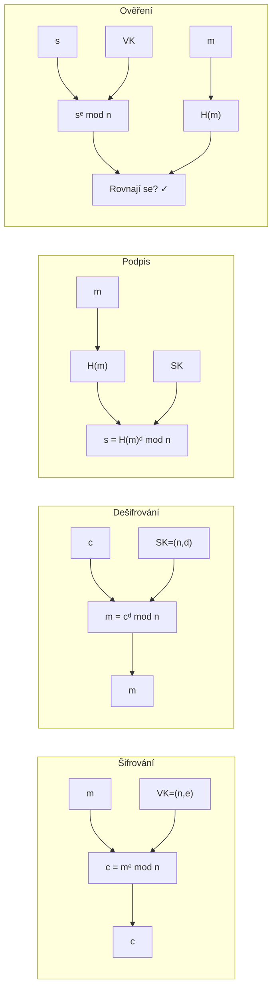
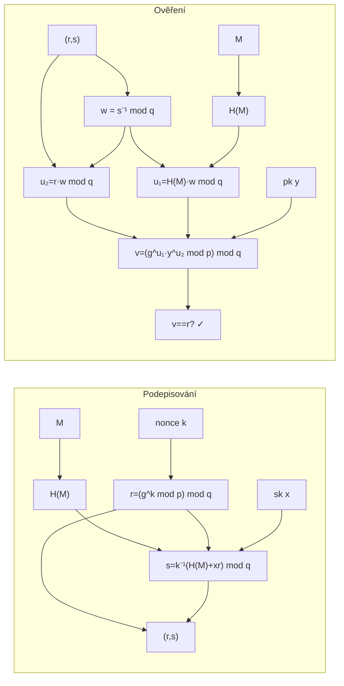

# 5. Asymetrická kryptografie

!!! abstract "Cíle kapitoly"
    - Porozumět principu asymetrické kryptografie (dvojice klíčů)
    - Zvládnout Diffie-Hellman výměnu klíčů a DLP
    - Umět ručně projít RSA šifrování, dešifrování a podpis
    - Pochopit RSA-CRT, ElGamal a DSA
    - Znát běžné útoky a bezpečnostní požadavky

---

## 5.1 Matematické základy

### Modulární aritmetika — klíčové fakty

$$a^{\phi(n)} \equiv 1 \pmod{n} \quad \text{(Eulerova věta, } \gcd(a,n)=1\text{)}$$
$$a^{p-1} \equiv 1 \pmod{p} \quad \text{(Fermatova věta, } p \text{ prvočíslo)}$$

**Eulerova funkce:**
$$\phi(p) = p - 1 \quad \phi(n) = (p-1)(q-1) \text{ pro } n = pq$$

### Rozšířený Euklidův algoritmus (výpočet inverzního prvku)

Pro výpočet $a^{-1} \bmod m$ (existuje pokud $\gcd(a,m) = 1$):

!!! example "Příklad: $5^{-1} \bmod 26$"
    Euklidův algoritmus: $26 = 5 \cdot 5 + 1$
    
    $1 = 26 - 5 \cdot 5$
    
    $\Rightarrow 1 \equiv -5 \cdot 5 \pmod{26} \Rightarrow 5^{-1} \equiv -5 \equiv 21 \pmod{26}$
    
    Ověření: $5 \cdot 21 = 105 = 4 \cdot 26 + 1$ ✓

---

## 5.2 Diffie-Hellman výměna klíčů

### Protokol

**Veřejné parametry:** prvočíslo $p$, generátor $g$ (primitivní kořen mod $p$)

| Krok | Alice | Bob |
|------|-------|-----|
| Generuje tajné | $a \leftarrow \{1, \ldots, p-2\}$ | $b \leftarrow \{1, \ldots, p-2\}$ |
| Počítá veřejné | $A = g^a \bmod p$ | $B = g^b \bmod p$ |
| Pošle | $A \to$ Bob | $B \to$ Alice |
| Sdílený klíč | $K = B^a \bmod p$ | $K = A^b \bmod p$ |
| Shodnost | $K = g^{ab} \bmod p$ | $K = g^{ab} \bmod p$ ✓ |

### Bezpečnost — Diskrétní logaritmus (DLP)

Útočník zná $p, g, A = g^a \bmod p$ a chce najít $a$. To je **Discrete Logarithm Problem (DLP)** — v obecné grupě není znám polynomiální algoritmus.

!!! warning "Diffie-Hellman není odolný vůči MITM!"
    Útok Man-in-the-Middle: Eve se vloží mezi Alici a Boba, každému nabídne svůj klíč. DH samotný neověřuje identitu — potřebujeme autentizaci (certifikáty, STS protokol).

!!! tip "Zkouška"
    Provést DH na malých číslech ručně. Vysvětlit, proč útočník nemůže spočítat sdílený klíč.

---

## 5.3 RSA

### Generování klíčů

1. Zvolíme velká prvočísla $p$ a $q$
2. $n = p \cdot q$ (modulus)
3. $\phi(n) = (p-1)(q-1)$
4. Zvolíme $e$ s $\gcd(e, \phi(n)) = 1$ (typicky $e = 65537 = 2^{16}+1$)
5. Spočítáme $d = e^{-1} \bmod \phi(n)$
6. **Veřejný klíč:** $(n, e)$ &emsp; **Soukromý klíč:** $(n, d)$

### Šifrování a dešifrování

$$c = m^e \bmod n \qquad m = c^d \bmod n$$

**Proč to funguje?** Eulerova věta: $(m^e)^d = m^{ed} = m^{1 + k\phi(n)} = m \cdot (m^{\phi(n)})^k \equiv m \pmod{n}$

### Digitální podpis RSA

| Krok | Operace |
|------|---------|
| Podepisování | $s = H(m)^d \bmod n$ |
| Ověření | Spočítám $s^e \bmod n$, porovnám s $H(m)$ |

!!! example "Příklad RSA (malá čísla)"
    - $p=43, q=59 \Rightarrow n=2537, \phi(n)=2436$
    - $e=13, d=937$ (protože $13 \cdot 937 = 12181 = 5 \cdot 2436 + 1$)
    - Šifrování: $m=1520 \Rightarrow c = 1520^{13} \bmod 2537 = 95$
    - Dešifrování: $c=95 \Rightarrow m = 95^{937} \bmod 2537 = 1520$ ✓

### Bezpečnostní požadavky RSA

!!! warning "Bezpečnostní požadavky"
    - **Délka klíče:** ≥ 2048 b (dnes doporučeno 3072–4096 b)
    - **Padding:** Vždy OAEP pro šifrování, PSS pro podpisy — bez paddingu je RSA deterministické a náchylné k útokům
    - **Bezpečnost spojena s faktorizací** $n = pq$ — kvadratické síto, GNFS (General Number Field Sieve)
    - $p, q$ musí být náhodná a přibližně stejně velká

!!! danger "Schoolbook RSA"
    RSA bez paddingu je **nezabezpečená**:
    - Deterministická (stejný $m$ → stejný $c$)
    - Náchylná k Håstad's broadcast attack, small exponent attack
    
---

## 5.4 RSA-CRT

### Motivace

Dešifrování $c^d \bmod n$ je pomalé pro velké $n$. Čínská věta o zbytcích (CRT) to zrychlí 4–8×.

### Rozšířený soukromý klíč

$$d_p = d \bmod (p-1), \quad d_q = d \bmod (q-1), \quad q_{inv} = q^{-1} \bmod p$$

### Algoritmus

```mermaid
flowchart TB
    C["Ciphertext c"] --> M1["m₁ = c^{d_p} mod p\n(číslo délky p — poloviční!)"]
    C --> M2["m₂ = c^{d_q} mod q\n(číslo délky q — poloviční!)"]
    M1 & M2 --> H["h = q_{inv}·(m₁-m₂) mod p"]
    H --> M["m = m₂ + h·q"]
    style M fill:#1a1d2e,stroke:#34d399
```

**Proč je to rychlejší?** Exponenciáty jsou délky $p$ a $q$ (polovina $n$). Exponencování $k$-bitového čísla trvá $O(k^3)$ → polovina délky = $(1/2)^3 = 1/8$ → **~4× rychlejší pro každé exponencování** + $m_1$ a $m_2$ jsou nezávislé → **paralelizovatelné**.

---

## 5.5 ElGamal

### Generování klíčů (Alice)

1. Zvolí prvočíslo $p$ a generátor $g$
2. Zvolí tajné $k_A \in \{1, \ldots, p-2\}$
3. $y_A = g^{k_A} \bmod p$ (veřejná hodnota)
4. Veřejný klíč: $(p, g, y_A)$

### Šifrování (Bob → Alice)

1. Zvolí náhodné $k_B$
2. $y_B = g^{k_B} \bmod p$
3. Sdílený klíč: $K = y_A^{k_B} \bmod p$
4. Ciphertext: $c = p_{msg} \cdot K \bmod p$
5. Odešle $(y_B, c)$

### Dešifrování (Alice)

$$K = y_B^{k_A} \bmod p, \quad p_{msg} = c \cdot K^{-1} \bmod p$$

!!! danger "Kritická slabina"
    **$k_B$ musí být vždy nové a náhodné!** Pokud se $k_B$ opakuje pro zprávy $c_1, c_2$:
    
    $$\frac{c_1}{c_2} = \frac{p_1 \cdot K}{p_2 \cdot K} = \frac{p_1}{p_2} \pmod{p}$$
    
    Poměr plaintextů je přímo znám.

---

## 5.6 DSA — Digital Signature Algorithm

### Parametry

- Prvočíslo $p$ (1024–3072 bitů)
- Prvočíslo $q$ s $q | (p-1)$ (160–256 bitů)
- Generátor $g = h^{(p-1)/q} \bmod p$
- Soukromý klíč $x$, veřejný klíč $y = g^x \bmod p$

### Podpis zprávy $M$

1. Zvolíme náhodné $k$ (nonce), $1 \leq k \leq q-1$
2. $r = (g^k \bmod p) \bmod q$
3. $s = k^{-1}(H(M) + xr) \bmod q$
4. Podpis = $(r, s)$

### Ověření podpisu $(r, s)$ zprávy $M$

1. $w = s^{-1} \bmod q$
2. $u_1 = H(M) \cdot w \bmod q$, &ensp; $u_2 = r \cdot w \bmod q$
3. $v = (g^{u_1} \cdot y^{u_2} \bmod p) \bmod q$
4. Platný ↔ $v = r$

!!! danger "Sony PS3 — kritický příklad"
    Sony používalo **konstantní $k$** (ne náhodné) pro všechny DSA podpisy firmwaru PS3.
    
    Ze dvou podpisů $(r, s_1)$, $(r, s_2)$ pro zprávy $H(M_1), H(M_2)$:
    
    $$k = \frac{H(M_1) - H(M_2)}{s_1 - s_2} \pmod{q}$$
    $$x = \frac{s_1 k - H(M_1)}{r} \pmod{q}$$
    
    Hackeři tak získali soukromý klíč a mohli podepisovat libovolný software pro PS3.

!!! tip "Zkouška"
    Znát kroky generování DSA podpisu a ověření. Vysvětlit Sony PS3 exploit.

---

## Shrnutí kapitoly

!!! abstract "Rychlý přehled"

    | Algoritmus | Základ | Klíče | Použití |
    |------------|--------|-------|---------|
    | DH | DLP | $(g^a, g^b) \to g^{ab}$ | Výměna klíčů |
    | RSA | Faktorizace | $(e,d)$ — $ed \equiv 1 \pmod{\phi(n)}$ | Šifrování, podpis |
    | RSA-CRT | Faktorizace + CRT | + $(d_p, d_q, q_{inv})$ | Rychlé dešifrování |
    | ElGamal | DLP | $(k_A, y_A)$ | Šifrování, podpis |
    | DSA | DLP | $(x, y)$ | Pouze podpis |

!!! question "Klíčové otázky ke zkoušce"
    1. Popište RSA: generování klíčů, šifrování, dešifrování, podpis.
    2. Proč je RSA bez paddingu nebezpečné?
    3. Jak RSA-CRT zrychlí dešifrování?
    4. Proč musí být $k_B$ v ElGamal vždy nové?
    5. Vysvětlete Sony PS3 exploit — proč konstantní $k$ kompromituje DSA?
    6. Jaký je rozdíl mezi DH a ElGamal?
