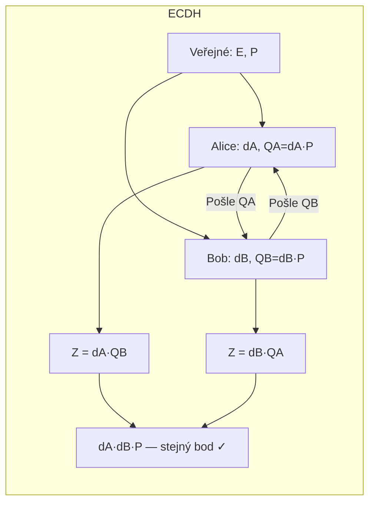

# 6. ECC — Kryptografie eliptických křivek

!!! abstract "Cíle kapitoly"
    - Znát rovnici eliptické křivky a podmínku hladkosti
    - Umět ručně sečíst dva body na křivce
    - Pochopit ECDLP a proč je těžší než DLP
    - Znát ECDH a srovnání s RSA

---

## 6.1 Eliptická křivka nad $\text{GF}(p)$

!!! info "Definice"
    $$y^2 \equiv x^3 + ax + b \pmod{p}$$
    
    Podmínka hladkosti (žádné singularity): $4a^3 + 27b^2 \not\equiv 0 \pmod{p}$
    
    Skupina bodů $E(\text{GF}(p))$ + **bod v nekonečnu** $\mathcal{O}$ (neutrální prvek)

### Geometrická interpretace

Na reálných číslech vypadá sčítání geometricky takto:

```
y
│        . Q
│       /|
│      / |
│     /  .−R (průsečík přímky PQ s křivkou)
│    . P  |
│         . R = P+Q (odraz −R přes osu x)
└─────────────── x
```

- **$P + Q$:** Vedeme přímku přes $P$ a $Q$ → třetí průsečík s křivkou = $-R$ → odrazíme přes osu $x$ → $R = P + Q$
- **$2P$ (tečna):** $P = Q$ → vedeme tečnu v $P$

---

## 6.2 Sčítání bodů — formule

### $P + Q$ (P ≠ Q)

$$s = \frac{y_Q - y_P}{x_Q - x_P} \bmod p$$
$$x_R = s^2 - x_P - x_Q \bmod p$$
$$y_R = s(x_P - x_R) - y_P \bmod p$$

### $2P$ (zdvojení bodu, tečna)

$$s = \frac{3x_P^2 + a}{2y_P} \bmod p$$
$$x_{2P} = s^2 - 2x_P \bmod p$$
$$y_{2P} = s(x_P - x_{2P}) - y_P \bmod p$$

### Sčítání s bodem v nekonečnu

$$P + \mathcal{O} = P \qquad P + (-P) = \mathcal{O}$$

kde $-P = (x_P, -y_P \bmod p)$ je bod symetrický přes osu $x$.

!!! example "Numerický příklad — zdvojení bodu"
    Křivka: $E: y^2 \equiv x^3 + 2x + 2 \pmod{17}$, bod $P = [5, 1]$
    
    **Krok 1 — směrnice tečny:**
    $$s = \frac{3 \cdot 25 + 2}{2 \cdot 1} \bmod 17 = \frac{77}{2} \bmod 17$$
    
    $77 \bmod 17 = 9$, &ensp; $2^{-1} \bmod 17 = 9$ (protože $2 \cdot 9 = 18 \equiv 1$)
    
    $s = 9 \cdot 9 \bmod 17 = 81 \bmod 17 = 13$
    
    **Krok 2 — souřadnice $2P$:**
    $$x_{2P} = 13^2 - 2 \cdot 5 \bmod 17 = 169 - 10 \bmod 17 = 159 \bmod 17 = 6$$
    $$y_{2P} = 13 \cdot (5 - 6) - 1 \bmod 17 = 13 \cdot (-1) - 1 \bmod 17 = -14 \bmod 17 = 3$$
    
    $2P = [6, 3]$ ✓

!!! tip "Zkouška"
    Na zkoušce budete počítat sčítání bodů ručně. Naučte se oba vzorce (P+Q a 2P) nazpaměť a procvičte výpočet inverzního prvku mod p.

---

## 6.3 ECDLP — Elliptic Curve Discrete Logarithm Problem

!!! info "ECDLP"
    Dáno $P$ a $Q = kP$ na křivce $E$ nad $\text{GF}(p)$ → **najdi $k$**.
    
    Kde $kP = P + P + \ldots + P$ ($k$-krát) — skalární násobení bodu.

### Proč je ECDLP těžší než DLP?

| | DLP (mod $p$) | ECDLP |
|---|---|---|
| Nejlepší útok | Index calculus | Pollardova $\rho$ |
| Složitost | $O(e^{(\ln p)^{1/3}})$ — subexponenciální | $O(\sqrt{\pi r/2})$ — **plně exponenciální** |
| Klíč pro 128b bezpečnost | 3072 bitů | **256 bitů** |

**Index calculus nelze aplikovat na ECC** — bodové sčítání nevytváří vhodnou algebraickou strukturu pro smoothness útoky.

### Skalární násobení — double-and-add

Pro výpočet $kP$ efektivně (analogie square-and-multiply):

```
výsledek = ∞
pro každý bit k od nejvyššího:
    výsledek = 2 × výsledek      (zdvojení)
    pokud bit = 1:
        výsledek = výsledek + P  (přičtení)
```

Složitost: $O(\log k)$ zdvojení + přičtení.

---

## 6.4 ECDH — Elliptic Curve Diffie-Hellman

### Protokol

**Veřejné parametry:** křivka $E$, bod $P$ (generátor skupiny řádu $r$)

| Krok | Alice | Bob |
|------|-------|-----|
| Tajné | $d_A \in \{1, \ldots, r-1\}$ | $d_B \in \{1, \ldots, r-1\}$ |
| Veřejné | $Q_A = d_A \cdot P$ | $Q_B = d_B \cdot P$ |
| Pošle | $Q_A \to$ Bob | $Q_B \to$ Alice |
| Sdílený klíč | $Z = d_A \cdot Q_B = d_A \cdot d_B \cdot P$ | $Z = d_B \cdot Q_A = d_B \cdot d_A \cdot P$ ✓ |



---

## 6.5 ECDSA — Elliptic Curve DSA

Analogie DSA na eliptické křivce:

**Podpis:** nonce $k$ → $R = k \cdot P$, $r = R_x \bmod r$, $s = k^{-1}(H(M) + d_A \cdot r) \bmod r$

**Ověření:** $u_1 = H(M) \cdot s^{-1}$, $u_2 = r \cdot s^{-1}$, zkontrolujeme $x$-souřadnici $u_1 P + u_2 Q_A$

!!! danger "Stejná slabina jako DSA"
    Opakované nebo předvídatelné $k$ → kompromitace soukromého klíče (stejný Sony PS3 exploit platí i pro ECDSA).

---

## 6.6 Srovnání RSA vs. ECC

| Symetrická bezpečnost | RSA/DH | ECC |
|-----------------------|--------|-----|
| 80 bitů | 1024 b | 160 b |
| 112 bitů | 2048 b | 224 b |
| 128 bitů | 3072 b | 256 b |
| 192 bitů | 7680 b | 384 b |
| 256 bitů | 15360 b | 521 b |

!!! success "Výhody ECC"
    - **6–10× kratší klíče** při stejné bezpečnosti → rychlejší výpočty, méně paměti
    - Ideální pro: IoT, čipové karty, mobilní zařízení, TLS (ECDHE)
    - Standardy: **NIST P-256** (secp256r1), Curve25519 (X25519), secp256k1 (Bitcoin)

---

## Shrnutí kapitoly

!!! abstract "Rychlý přehled"
    - Eliptická křivka: $y^2 \equiv x^3 + ax + b \pmod{p}$, podmínka $4a^3+27b^2 \neq 0$
    - Sčítání bodů: geometrická interpretace + analytické formule
    - ECDLP: exponenciální složitost (lepší než DLP) → kratší klíče
    - ECDH: analogie DH s bodovým násobením místo mocnění
    - ECDSA: analogie DSA, stejné nebezpečí při opakování $k$

!!! question "Klíčové otázky ke zkoušce"
    1. Nakreslete schéma sčítání dvou různých bodů na eliptické křivce.
    2. Jaký je vzorec pro $P + Q$ a pro $2P$?
    3. Proč je ECDLP těžší než DLP a co to znamená pro délky klíčů?
    4. Popište ECDH protokol.
    5. Proč index calculus nefunguje na ECDLP?
