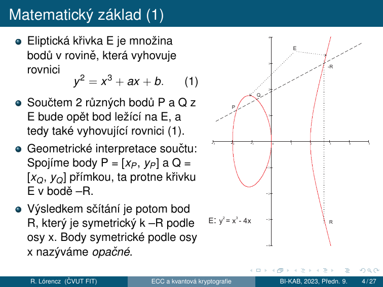
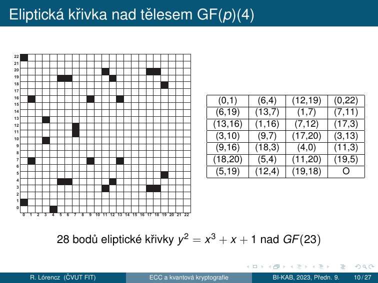

# 6. ECC — Kryptografie eliptických křivek

!!! abstract "Cíle kapitoly"
    - Znát historii a motivaci ECC jako alternativy k RSA
    - Znát rovnici eliptické křivky a podmínku hladkosti nad GF(p)
    - Umět ručně sečíst dva body na křivce (P+Q i 2P)
    - Pochopit ECDLP — řád bodu, řád křivky, kofaktor
    - Znát ECDH a srovnání s RSA

---

## 6.1 Historie a motivace

- Kryptografie eliptických křivek (ECC) je moderním a rozšířeným směrem současné kryptografie.
- ECC je další možností pro realizaci **elektronického podpisu**.
- ECC v některých ukazatelích dává lepší výsledky než předtím běžně používané kryptosystémy.
- V současnosti jsou eliptické kryptosystémy v řadě světových standardů a staly se **alternativou k RSA**.
- ECC má výhodu v **rychlosti a menší náročnosti na hardware**.
- Eliptické křivky jsou speciální podtřídou kubických křivek.
- Název „eliptické" vznikl proto, že kubické rovinné funkce se v minulosti používaly k výpočtu obvodu elipsy.
- Zkoumáním vlastností eliptických křivek se nejvíce zabýval německý matematik **K. T. W. Weierstrass (1815–1897)**.
- **V. Miller** a **N. Koblitz** přišli nezávisle na sobě na možnost použití eliptických křivek v rámci kryptosystému veřejného klíče **(1985)**.

---

## 6.2 Matematický základ — reálné křivky

### Rovnice a geometrie

Eliptická křivka E je množina bodů v rovině, která vyhovuje rovnici:

$$y^2 = x^3 + ax + b \tag{1}$$



**Sčítání dvou různých bodů P a Q:**

- Spojíme body $P = [x_P, y_P]$ a $Q = [x_O, y_O]$ přímkou — ta protne křivku E v bodě $-R$.
- Výsledkem sčítání je bod $R$, který je **symetrický k $-R$ podle osy $x$**. Body symetrické podle osy $x$ nazýváme **opačné**.

$$\text{Směrnice přímky: } s = \frac{y_Q - y_P}{x_Q - x_P} \tag{2}$$

$$x_R = s^2 - x_P - x_Q, \quad y_R = s(x_P - x_R) - y_P \tag{3}$$

**Zdvojení bodu $2P$ (tečna):**

Když $P = Q$ → jejich spojnice je tečna k E a její směrnice je rovna:

$$s = \frac{3x_P^2 + a}{2y_P} \tag{4}$$

### Bod v nekonečnu (nulový prvek)

- Sčítáním 2 opačných bodů ($P = -Q$) bychom měli dostat „0 bod".
- Taková přímka nám dá bod E už neprotnout, resp. jí protne v $\infty$ → definitoricky k E přidáme bod v $\infty$ → sčítání 2 opačných bodů definujeme: $P + (-P) = O$.
- **Bod $v \infty$** je název „0 bodu" křivky E.
- Dododefinujeme sčítání pro $O$: $P + O = P$, $O + O = -O = O$ a $A = -O$.
- Takto je definováno sčítání pro $\forall$ dvojice bodů na E včetně O.

---

## 6.3 Eliptická křivka nad tělesem GF(p)

### Využití pro šifrování

Při využití eliptických křivek pro šifrování pracujeme v oblasti diskrétních hodnot (celých čísel, bitových řetězců, $m$-tice bitů). Uvažujeme těleso $\text{GF}(2^m)$ a těleso $\text{GF}(p)$, kde $p$ je prvočíslo. Obě tělesa jsou v praxi využívaná — každé z nich má své přednosti. Pro jednoduchost výkladu dále jen operace nad tělesem $\text{GF}(p)$.

!!! info "Definice — Eliptická křivka nad GF(p)"
    Eliptická křivka nad tělesem $\text{GF}(p)$ je definována jako bod $O$ v $\infty$ společně s množinou bodů $P = [x, y]$, kde $x$ a $y$ jsou z tělesa $\text{GF}(p)$ a vyhovují rovnici $y^2 = x^3 + ax + b$ v $\text{GF}(p)$, tj.
    
    $$y^2 \equiv x^3 + ax + b \pmod{p} \tag{5}$$

Koeficienty $a$ a $b$ jsou také prvky tělesa $\text{GF}(p)$ a musí splňovat podmínku:

$$|4a^3 + 27b^2|_p \neq 0 \tag{6}$$

Takto definovaná množina bodů tvoří grupu; koeficienty $a$ a $b$ volíme libovolně (veřejné parametry příslušného kryptosystému).

### Grupové operace nad GF(p)

V této grupě definujeme opačný bod k $O$ jako $O$. Pro ostatní nenulové body $P = [x_P, y_P] \in E$ definujeme $-P = [x_P, \;|-y_P|_p]$; dále pro všechny body $P \in E$ definujeme $P + (-P) = O$ a $P + O = P$.

**Bod v nekonečnu** nazýváme také nulovým bodem, vzhledem k jeho roli při sčítání v grupě E.

Sčítání stejných nenulových bodů $P + P$ definujeme jako $R = P + P = [x_R, y_R]$, kde směrnice $s$ je rovna:

$$s = \left|\frac{3x_P^2 + a}{2y_P}\right|_p \tag{7}$$

a souřadnice bodu $R$:

$$x_R = \left|s^2 - x_P - x_Q\right|_p \quad \text{a} \quad y_R = \left|s(x_P - x_R) - y_P\right|_p \tag{8}$$

Sčítání různých nenulových a vzájemně neinverzních bodů $P = [x_P, y_P]$ a $Q = [x_Q, y_Q]$ křivky E definujeme jako $P + Q = R = [x_R, y_R]$, kde směrnice $s$ je rovna:

$$s = \left|\frac{y_Q - y_P}{x_Q - x_P}\right|_p \tag{9}$$

a souřadnice bodu $R$:

$$x_R = \left|s^2 - x_P - x_Q\right|_p \quad \text{a} \quad y_R = \left|s(x_P - x_R) - y_P\right|_p \tag{10}$$



!!! example "28 bodů eliptické křivky $y^2 = x^3 + x + 1$ nad $\text{GF}(23)$"
    Křivka $E: y^2 \equiv x^3 + x + 1 \pmod{23}$ má 28 bodů (včetně bodu $O$ v $\infty$). Všechny celočíselné body jsou vidět v tabulce — souřadnice jsou vždy z množiny $\{0, 1, \ldots, 22\}$.

---

## 6.4 Sčítání bodů — příklad

!!! example "Numerický příklad — zdvojení bodu $2P$"
    Křivka: $E: y^2 \equiv x^3 + 2x + 2 \pmod{17}$, bod $P = [5, 1]$, hledáme $2P = ?$
    
    **Krok 1 — směrnice tečny:**
    
    $$s = \left|\frac{3x_P^2 + a}{2y_P}\right|_{17} = \left|(2 \cdot 1)^{-1} \cdot (3 \cdot 5^2 + 2)\right|_{17} = |9 \cdot 9|_{17} = |81|_{17} = 13$$
    
    **Krok 2 — souřadnice $2P$:**
    
    $$x_{2P} = \left|s^2 - x_P - x_P\right|_{17} = \left|13^2 - 5 - 5\right|_{17} = |159|_{17} = 6$$
    
    $$y_{2P} = \left|s(x_P - x_{2P}) - y_P\right|_{17} = \left|13(5 - 6) - 1\right|_{17} = |-14|_{17} = 3$$
    
    $\Rightarrow 2P = [6, 3]$ ✓
    
    **Zkouška:** $3^2 \equiv 6^3 + 2 \cdot 6 + 2 \pmod{17}$ → $9 \equiv 12 + 12 + 2 \pmod{17}$ → $9 = 9$ ✓

!!! tip "Zkouška"
    Na zkoušce budete počítat sčítání bodů ručně. Naučte se oba vzorce ($P+Q$ a $2P$) nazpaměť a procvičte výpočet inverzního prvku mod p (rozšířený Euklidův algoritmus nebo malá Fermatova věta: $a^{-1} \equiv a^{p-2} \pmod p$).

---

## 6.5 ECDLP — Elliptic Curve Discrete Logarithm Problem

### Řád bodu a řád křivky

Pro pochopení podstaty šifrování a podepisování v ECC je důležité využití tzv. **problému diskrétního logaritmu**.

Pro určitý bod $P$ na křivce $E$ postupně vypočítáme body $2P, 3P, 4P, 5P, 6P$ atd., čímž dostaneme obecně různé body $xP$ na E. Protože křivka má konečný počet bodů, označíme ho $\#P$; po určitém kroku $m$ se nám musí tato posloupnost opakovat.

- V bodě opakování $mP = nP$, kde $nP$ je některý z předešlých bodů. Odtud definujeme $mP - nP = O$.
- Existuje tedy nějaké $r = m - n$, $r < m$ takové, že $rP = O$.
- Z toho plyne, že v posloupnosti $P, 2P, 3P, 4P, 5P, \ldots$ se vždy dostaneme k bodu $O$, a poté cyklus začíná znovu od bodu $P$, protože $(r+1)P = rP + P = O + P = P$.
- **Nejmenší takové $r$**, pro které $rP = O$, nazýváme **řád bodu** P.

Lze dále dokázat, že řád bodu dělí řád křivky, přičemž **řádem křivky** nazýváme počet bodů na křivce $\#E$.

Body na křivce $E$ mají různý řád. V kryptografii vybíráme takové body, jejichž řád je roven největšímu prvočíslu v rozkladu čísla $\#E$ nebo jeho násobku. **Kofaktor** je podíl: řád křivky / řád počátečního bodu a měl by být malý.

U bodu řádu $r$ máme zaručeno, že dojde k opakování v posloupnosti $P, 2P, 3P, \ldots$ až po $r$-tém kroku. V případě, že $r$ je velké číslo, např. $2^{256}$, je to skutečně dlouhá posloupnost.

Právě při šifrování a elektronickém podepisování se využívá tak velké posloupnosti a to právě v souvislosti s tzv. **problémem diskrétního logaritmu**.

### Definice ECDLP

!!! info "ECDLP — Elliptic Curve Discrete Logarithm Problem"
    **Problém diskrétního logaritmu** je úloha: jak z bodů $P$ a $Q$ získat tajné číslo $k$ tak, aby platilo $Q = kP$.

- Je zřejmé, že pro malý řád bodu $P$ je úloha triviální.
- Pro velké $r$ je tato úloha, která se nedá řešit efektivně, tj. v polynomiálním čase.
- Z tohoto důvodu mohou být oba body $P$ a $Q$ zveřejněny.

!!! info "Pollardova $\rho$ metoda"
    Dosud nejúčinnější metodou pro řešení takto definovaného problému diskrétního logaritmu je tzv. **Pollardova $\rho$ metoda**, jejíž složitost je řádově $\left(\pi r/2\right)^{1/2}$ kroků.
    
    - Pokud máme $r = 2^{256}$, dostáváme $\approx 2^{128}$ kroků, což je zhruba na úrovni luštitelnosti symetrické blokové šifry se 128 bitovým klíčem.
    - Pro nás je to z výpočetního hlediska neřešitelné, a tedy příslušná šifra je **výpočetně bezpečná**.

### Proč je ECDLP těžší než DLP?

| | DLP (mod $p$) | ECDLP |
|---|---|---|
| Nejlepší útok | Index calculus | Pollardova $\rho$ |
| Složitost | $O(e^{(\ln p)^{1/3}})$ — sub-exponenciální | $O\left(\sqrt{\pi r/2}\right)$ — **plně exponenciální** |
| Klíč pro 128b bezpečnost | 3072 bitů | **256 bitů** |

**Index calculus nelze aplikovat na ECC** — bodové sčítání nevytváří vhodnou algebraickou strukturu pro smoothness útoky.

### Skalární násobení — double-and-add

Pro výpočet $kP$ efektivně (analogie square-and-multiply pro RSA):

```
výsledek = O (bod v nekonečnu)
pro každý bit k od nejvyššího:
    výsledek = 2 × výsledek       (zdvojení)
    pokud bit = 1:
        výsledek = výsledek + P   (přičtení)
```

Složitost: $O(\log k)$ zdvojení + přičtení.

---

## 6.6 Šifrování s ECC — ECDH

Podstatu šifrování pomocí ECC si ukážeme na analogii **Diffie-Hellmanova schématu výměny klíče**.

Strana $i$ a $j$ si chtějí vyměnit tajnou informaci přes veřejný kanál. Každá strana má důvěryhodnou cestou získaný veřejný klíč protistrany. V případě ECC ještě navíc předpokládáme, že oba sdílejí stejnou křivku E a její bod $P$.

### Protokol ECDH

**Veřejné parametry:** křivka $E$, bod $P$ (generátor skupiny řádu $r$)

| Krok | Strana $i$ (Alice) | Strana $j$ (Bob) |
|------|--------------------|------------------|
| Privátní klíč | $d_i \in \{1, \ldots, r-1\}$ | $d_j \in \{1, \ldots, r-1\}$ |
| Veřejný klíč | $Q_i = d_i \cdot P$ | $Q_j = d_j \cdot P$ |
| Pošle | $Q_i \to$ Bob | $Q_j \to$ Alice |
| Sdílený klíč | $Z = d_i \cdot Q_j$ | $Z = d_j \cdot Q_i$ |

Strana $i$ vypočte bod $Z$ jako $d_i Q_j$ a strana $j$ jako $d_j Q_i$. Tyto body jsou ve skutečnosti stejné, protože:

$$Z = d_i Q_j = d_i(d_j P) = (d_i d_j)P$$

a současně:

$$Z = d_j Q_i = d_j(d_i P) = (d_j d_i)P$$

Tedy každá strana vezme veřejný klíč protistrany a sečte ho $n$-krát, kde $n$ je privátní klíč. Protože obě strany vycházejí ze stejného bodu $P$, dospějí do stejného bodu $Z$.

---

## 6.7 ECDSA — Elliptic Curve DSA

Analogie DSA na eliptické křivce:

**Podpis:** nonce $k$ → $R = k \cdot P$, $r = R_x \bmod n$, $s = k^{-1}(H(M) + d_A \cdot r) \bmod n$

**Ověření:** $u_1 = H(M) \cdot s^{-1}$, $u_2 = r \cdot s^{-1}$, zkontrolujeme $x$-souřadnici $u_1 P + u_2 Q_A$

!!! danger "Stejná slabina jako DSA"
    Opakované nebo předvídatelné $k$ → kompromitace soukromého klíče (stejný Sony PS3 exploit platí i pro ECDSA — viz kap. 8.2).

---

## 6.8 Srovnání RSA vs. ECC

| Symetrická bezpečnost | RSA/DH | ECC |
|-----------------------|--------|-----|
| 80 bitů | 1024 b | 160 b |
| 112 bitů | 2048 b | 224 b |
| 128 bitů | 3072 b | 256 b |
| 192 bitů | 7680 b | 384 b |
| 256 bitů | 15360 b | 521 b |

!!! success "Výhody ECC"
    - **6–10× kratší klíče** při stejné bezpečnosti → rychlejší výpočty, méně paměti
    - Ideální pro: IoT, čipové karty, mobilní zařízení, TLS (ECDHE)
    - Standardy: **NIST P-256** (secp256r1), Curve25519 (X25519), secp256k1 (Bitcoin)
    - ECC má výhodu v rychlosti a menší náročnosti na hardware

---

## Shrnutí kapitoly

!!! abstract "Rychlý přehled"
    - Eliptická křivka (reálná): $y^2 = x^3 + ax + b$; sčítání geometricky — průsečík + odraz
    - ECC nad $\text{GF}(p)$: $y^2 \equiv x^3 + ax + b \pmod{p}$, podmínka $|4a^3+27b^2|_p \neq 0$
    - **Řád bodu** $r$: nejmenší $r$ tak, že $rP = O$; **kofaktor** = $\#E / r$, má být malý
    - **ECDLP**: dáno $P$ a $Q = kP$, najdi $k$; Pollard $\rho$ → složitost $\approx 2^{128}$ pro $r = 2^{256}$
    - **ECDH**: sdílený klíč $Z = d_i \cdot Q_j = d_j \cdot Q_i$ (analogie DH)
    - **ECDSA**: analogie DSA — nebezpečí při opakování nonce $k$
    - **ECC vs RSA**: 128-bit bezpečnost → ECC 256 b vs RSA 3072 b

!!! question "Klíčové otázky ke zkoušce"
    1. Jak geometricky interpretujeme součet dvou bodů na eliptické křivce? Co se stane při sčítání bodu se sebou samým?
    2. Co je řád bodu, řád křivky a kofaktor? Jak spolu tyto pojmy souvisejí?
    3. Co je problém diskrétního logaritmu na eliptických křivkách (ECDLP) a proč je výpočetně obtížný?
    4. Jak funguje Diffie-Hellmanův protokol na eliptických křivkách (ECDH)?
    5. Proč ECC dosahuje srovnatelné bezpečnosti jako RSA s výrazně kratšími klíči?
