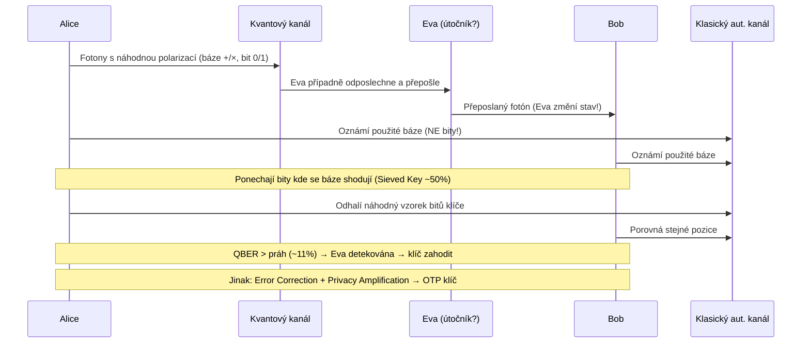

# 7. Kvantová kryptografie

!!! abstract "Cíle kapitoly"
    - Porozumět principu qubitu a proč nelze odposlechnout bez detekce
    - Projít celý BB84 protokol krok za krokem
    - Znát post-kvantové hrozby pro klasickou kryptografii

---

## 7.1 Qubit — základní jednotka

!!! info "Qubit"
    $$|\psi\rangle = \alpha|0\rangle + \beta|1\rangle, \quad \alpha, \beta \in \mathbb{C}, \quad |\alpha|^2 + |\beta|^2 = 1$$
    
    Qubit je v **superpozici** obou stavů, dokud není změřen.

### Heisenbergův princip neurčitosti

$$\Delta x \cdot \Delta p \geq \frac{\hbar}{2}$$

Nelze přesně změřit polohu i hybnost částice zároveň. Důsledek pro kryptografii: **nelze zkopírovat nebo změřit qubit bez ovlivnění jeho stavu**.

### Polarizace fotonů — reprezentace qubitů

| Báze | $|0\rangle$ | $|1\rangle$ |
|------|-------------|-------------|
| `+` (rectilinear) | → (0°) | ↑ (90°) |
| `×` (diagonal) | ↗ (45°) | ↘ (135°) |

Pokud měříme v **špatné bázi** (fotón je v bázi `+`, měříme bází `×`), výsledek je **náhodný** a původní stav je destruován.

---

## 7.2 Protokol BB84

BB84 (Bennett & Brassard, 1984) je první kvantový protokol pro distribuci klíče (QKD).

### Celý průběh

### Krok za krokem — příklad

| Pozice | 1 | 2 | 3 | 4 | 5 | 6 | 7 | 8 |
|--------|---|---|---|---|---|---|---|---|
| Alice bit | 0 | 1 | 1 | 0 | 1 | 0 | 0 | 1 |
| Alice báze | `+` | `+` | `×` | `×` | `+` | `×` | `+` | `×` |
| **Bob báze** | `+` | `×` | `×` | `+` | `+` | `×` | `×` | `×` |
| Bob bit | 0 | ? | 1 | ? | 1 | 0 | ? | 1 |
| Shoda bází | ✅ | ❌ | ✅ | ❌ | ✅ | ✅ | ❌ | ✅ |
| **Sieved key** | **0** | — | **1** | — | **1** | **0** | — | **1** |

Výsledný prosievaný klíč: `01101` (pozice 1,3,5,6,8)

### Proč Eva nemůže odposlechnout?

!!! info "Princip detekce odposlechu"
    Eva musí změřit každý fotón, aby ho přečetla. Pokud zvolí **špatnou bázi** (50% šance), stav fotónu se změní. Přepošle Bobovi fotón ve špatném stavu → Bob naměří špatnou hodnotu, i když použil správnou bázi.
    
    - Pravděpodobnost chyby na jeden odposlechnutý bit: **25%**
    - Pravděpodobnost detekce při $n$ obětovaných bitech: $1 - (3/4)^n \to 1$
    
    Např. pro $n=40$: pravděp. nedetekce $< 10^{-5}$.

!!! tip "Zkouška"
    Umět projít celý BB84 na příkladě. Spočítat pravděpodobnost detekce pro $n$ obětovaných bitů. Vysvětlit, proč Heisenbergův princip zaručuje detekci.

### QBER — Quantum Bit Error Rate

$$\text{QBER} = \frac{\text{počet chybných bitů}}{\text{celkový počet bitů}}$$

- Bez odposlechu: $\text{QBER} \approx 0$ (nebo malé kvůli fyzickému šumu)
- S Evou (100% odposlechu): $\text{QBER} \approx 25\%$
- Bezpečnostní práh: typicky $\text{QBER} \leq 11\%$ (závisí na implementaci)

---

## 7.3 Post-kvantová kryptografie

### Kvantové hrozby pro klasické algoritmy

| Algoritmus | Kvantový útok | Efektivní bezpečnost |
|------------|---------------|----------------------|
| AES-128 | Groverův alg. | 64 bitů (polovina) |
| AES-256 | Groverův alg. | 128 bitů ✅ |
| RSA-2048 | Shorův alg. | **0 bitů** ❌ |
| DH-3072 | Shorův alg. | **0 bitů** ❌ |
| ECC-256 | Shorův alg. | **0 bitů** ❌ |
| SHA-256 | Groverův alg. | 128 bitů ✅ |

!!! danger "Shorův algoritmus"
    Shorův algoritmus (1994) řeší faktorizaci a diskrétní logaritmus v **polynomiálním čase** na kvantovém počítači.
    
    - RSA, DH, ElGamal, DSA, ECDH, ECDSA → **zranitelné**
    - Dostatečně velký kvantový počítač zatím neexistuje, ale příprava musí začít dnes

### NIST Post-Quantum Standardy (2024)

NIST v srpnu 2024 vydal první post-kvantové standardy:

| Standard | Původ | Typ | Použití |
|----------|-------|-----|---------|
| **ML-KEM** (FIPS 203) | CRYSTALS-Kyber | Lattice | Key encapsulation |
| **ML-DSA** (FIPS 204) | CRYSTALS-Dilithium | Lattice | Digitální podpis |
| **SLH-DSA** (FIPS 205) | SPHINCS+ | Hash-based | Digitální podpis |

---

## Shrnutí kapitoly

!!! abstract "Rychlý přehled"
    - Qubit = superpozice $|0\rangle$ a $|1\rangle$ → měření destruuje stav
    - Heisenbergův princip → nelze odposlechnout bez detekce
    - BB84: fotony, dvě báze (+/×), sieving, QBER detekuje Evu
    - Shorův algoritmus ohrožuje vše na diskrétním logaritmu a faktorizaci
    - Řešení: post-kvantová kryptografie (ML-KEM, ML-DSA) nebo QKD

!!! question "Klíčové otázky ke zkoušce"
    1. Co je qubit a jak se liší od klasického bitu?
    2. Proč nelze odposlechnout BB84 bez detekce?
    3. Projděte BB84 na příkladu 8 fotonů.
    4. Jaká je pravděpodobnost detekce Evy při $n$ obětovaných bitech?
    5. Jaké klasické kryptografické algoritmy ohrožuje Shorův algoritmus?
    6. Co je post-kvantová kryptografie?
