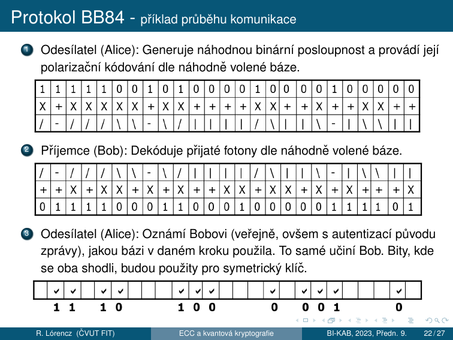
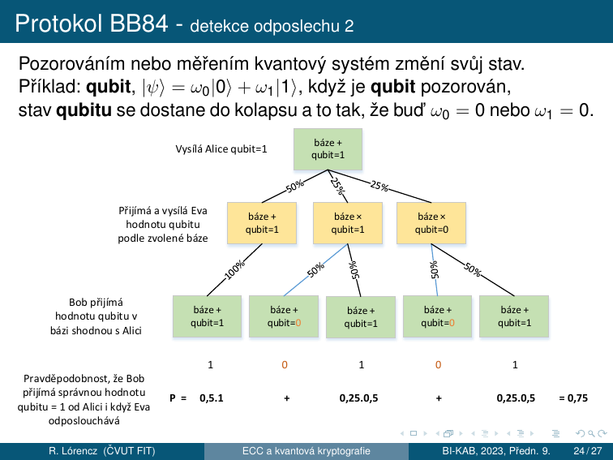

# 7. Kvantová kryptografie

!!! abstract "Cíle kapitoly"
    - Pochopit rozdíl mezi klasickou a kvantovou informací
    - Porozumět principu qubitu, superpozice a měření
    - Projít celý BB84 protokol krok za krokem
    - Znát detekci odposlechu a pravděpodobnost detekce Evy
    - Znát post-kvantové hrozby pro klasickou kryptografii

---

## 7.1 Klasická vs. kvantová informace

### Klasická informace

- Lze libovolně **kopírovat**. Zejména je možné vytvořit zcela identickou kopii dané zprávy.

### Kvantová informace

- **Nelze vytvořit identickou kopii** neznámého kvantového stavu.
- Vychází z **Heisenbergova principu neurčitosti**:
    - Čtení zprávy zároveň ovlivňuje její obsah.
    - Nejznámějšími veličinami tohoto typu jsou *poloha* a *hybnost* elementární částice v kvantové fyzice: $\Delta x \cdot \Delta p \geq \frac{\hbar}{2}$

!!! info "Heisenbergův princip neurčitosti"
    Je to matematická vlastnost dvou kanonicky konjugovaných veličin. Čím přesněji určíme jednu z konjugovaných veličin, tím méně přesně můžeme určit tu druhou, a to bez ohledu na kvalitu přístrojů.

!!! warning "Klíčový rozdíl"
    **Tvrzení z klasické fyziky:** Můžeme předpovědět chování systému, pokud známe jeho počáteční stav.
    
    **Pro kvantovou fyziku neplatí:** Počáteční stav systému nikdy nemůžeme zjistit dostatečně přesně — nelze dostatečně přesně zjistit obě konjugované veličiny najednou.

---

## 7.2 Klasická vs. kvantová kryptografie

### Klasická kryptografie

- Musí se vyrovnat s možností **neomezeného kopírování** nosičů klasické informace.
- Řešení:
    - Použití klíčů o extrémních délkách — princip one-time pad
    - Spoléhání na výpočetní složitost

### Kvantová kryptografie

- Zakládá na **nemožnosti tvorby identických kopií** neznámého kvantového stavu.
- Nejprve se přenese klíč, který se při **pozitivní detekci odposlechu zruší**.

---

## 7.3 Kvantová kryptografie — hlavní rysy

### Nepodmíněná bezpečnost

- V teoretické rovině lze dokázat bezpečnost systému bez ohledu na prostředky útočníka.
- V teoretické rovině lze dosáhnout i **absolutní bezpečnosti**.
- Předpokládá se, že bezpečnost těchto systémů nebude dotčena ani ve věku kvantových počítačů.

### Současný stav

- Hlavní pozornost je zatím věnována **přenosu zpráv**.
- S uchováváním kvantově šifrované informace jsou spojeny jisté technologické potíže.
- Některé druhy schémat nejsou dostatečně propracovány — kvantová schémata **digitálního podpisu**.

---

## 7.4 Qubit — základní jednotka

Za fyzikální obraz qubitu považujeme libovolný kvantově mechanicky popsaný objekt, jehož stavy jsou prvky dvourozměrného **Hilbertova prostoru**:

- **Foton** (polarizace, fázový posun)
- **Elektron** (spin)
- **Atom** (spin)

!!! info "Formální definice qubitu"
    $$|\psi\rangle = \omega_0|0\rangle + \omega_1|1\rangle$$
    
    kde $\omega_0, \omega_1 \in \mathbb{C}$, $|0\rangle, |1\rangle$ jsou **bázové vektory** $H_2$.
    
    $|0\rangle, |1\rangle$ nazýváme **vlastní stavy qubitu**.

- Měřením qubitu získáme hodnotu odpovídající právě 1 vlastnímu stavu.
- Superpozici nelze „vidět" — koeficienty $\omega_0, \omega_1$ určují rozdělení výsledků měření.
- Měření superpozice zaniká a qubit přechází do vlastního stavu (**kolaps kvantového systému**).
- Měřením jednoho qubitu získáme nejvýše **1 bit klasické informace**.

---

## 7.5 Polarizační kódování

### Lineární báze ("+")

| Stav | Symbol | Polarizace |
|------|-------|-----------|
| $\vert 0\rangle_{(r)}$ | `|` | 0° (vertikální) |
| $\vert 1\rangle_{(r)}$ | `—` | 90° (horizontální) |

$$|\psi\rangle = \omega_{(r),0}|0\rangle_{(r)} + \omega_{(r),1}|1\rangle_{(r)}$$

### Diagonální báze ("×")

| Stav | Symbol | Polarizace |
|------|--------|-----------|
| $\vert 0\rangle_{(d)}$ | `\` | 135° |
| $\vert 1\rangle_{(d)}$ | `/` | 45° |

$$|\psi\rangle = \omega_{(d),0}|0\rangle_{(d)} + \omega_{(d),1}|1\rangle_{(d)}$$

### Využití v kryptografii

**Heisenbergův princip neurčitosti:** nelze současně přesně určit stav daného qubitu vzhledem k lineární a diagonální bázi.

- Při vhodně zvolené diagonální bázi lze pro ilustraci přímo napsat:

$$|0\rangle_{(r)} = \frac{1}{\sqrt{2}}\left(|0\rangle_{(d)} + |1\rangle_{(d)}\right)$$

$$|1\rangle_{(r)} = \frac{1}{\sqrt{2}}\left(|0\rangle_{(d)} - |1\rangle_{(d)}\right)$$

**Interpretace:** Čím určitější je stav vzhledem k lineární bázi, tím méně určitý je vzhledem k diagonální bázi a naopak.

Pokud měříme fotón ve **špatné bázi** (fotón je v bázi `+`, měříme bází `×`), výsledek je **náhodný** a původní stav je destruován.

---

## 7.6 Protokol BB84 (Benett-Brassard 1984)

### Motivace

!!! info "Absolutně bezpečné kryptosystémy"
    - Existují perfektní kryptosystémy, např. **One-Time Pad (OTP — Vernamova šifra)**.
    - Zůstává ale problém **bezpečné distribuce klíčů**.
    - **Řešení:** Distribuce klíče (zřízení společného klíče) na základě kvantového jevu zaručujícího perfektní utajení.
    - Protokol BB84 slouží k dohodě na symetrickém klíči využívající kvantových jevů, který je následně použit pro systém one-time pad.
    - Založen na využití **Heisenbergova principu neurčitosti** ve spojení s polarizačním kódováním.
    - S mírnými obměnami je BB84 používán a rozvíjen dodnes.

### Krok za krokem — příklad z přednášky

### Proč Eva nemůže odposlechnout?

!!! info "Princip detekce odposlechu"
    Eva musí **změřit každý fotón**, aby ho přečetla. Pokud zvolí **špatnou bázi** (50% šance), stav fotónu se změní. Přepošle Bobovi fotón ve špatném stavu → Bob naměří špatnou hodnotu, i když použil správnou bázi.

- Pravděpodobnost chyby na jeden odposlechnutý bit: **25%**
- Pravděpodobnost **detekce** při $n$ obětovaných bitech: $1 - \left(\frac{3}{4}\right)^n \to 1$

!!! example "Číselný příklad"
    Pro $n = 40$ obětovaných bitů: pravděpodobnost nedetekce $= (3/4)^{40} < 10^{-5}$.

Pozorováním nebo měřením **kvantový systém změní svůj stav**. Příklad: qubit $|\psi\rangle = \omega_0|0\rangle + \omega_1|1\rangle$, když je qubit pozorován, stav qubitu se dostane do kolapsu a to tak, že buď $\omega_0 = 0$ nebo $\omega_1 = 0$.

### Privacy Amplification

V současných systémech se ještě provádí **zesílení soukromí** (*privacy amplification*):
- Cílem je dále minimalizovat Evinu informaci o dohodnutém klíči, která (snad) byla získána nedetekovaným odposlechem.

---

## 7.7 QBER — Quantum Bit Error Rate

$$\text{QBER} = \frac{\text{počet chybných bitů}}{\text{celkový počet bitů}}$$

| Situace | QBER |
|---------|------|
| Bez odposlechu (ideální) | $\approx 0$ |
| Fyzický šum kanálu | malé nenulové |
| 100% odposlech Evou | $\approx 25\%$ |
| Bezpečnostní práh | typicky $\leq 11\%$ |

---

## 7.8 Implementační aspekty BB84

### Dva druhy komunikace

**Kvantová komunikace:**
- Nutný **kvalitní nerušený** komunikační kanál mezi Alicí a Bobem
- Optický kabel bez běžných infrastrukturních prvků
- Nutno znát model chyb
- Synchronizace přenosu

**Klasická komunikace:**
- Lze použít **běžnou síťovou infrastrukturu**
- Není třeba zajišťovat důvěrnost přenášených zpráv
- Musí být zajištěna **autentizace** původu kontrolních zpráv mezi Alicí a Bobem
- Použití rádiového kanálu nemusí být dostatečné

### Aplikační aspekty

BB84 je schopen do jisté míry **nahradit asymetrické systémy** ve stávajících aplikacích:
- Zamýšleno zejména s ohledem na **teoretické hrozby přicházející z oblasti kvantových počítačů**.

**V zásadě dva typy uživatelů:**

| Typ uživatele | Co získají | Co ztratí |
|---------------|-----------|-----------|
| Současní uživatelé asymetrických schémat | Vyšší teoretickou bezpečnost | Poněkud ztrácejí pohodlí; ne všechny komponenty lze zatím nahradit (podpis) |
| Vojenští a zpravodajští uživatelé | Větší pohodlí při zachování přibližně stejné úrovně bezpečnosti | — |

---

## 7.9 Post-kvantová kryptografie

### Kvantové hrozby pro klasické algoritmy

| Algoritmus | Kvantový útok | Efektivní bezpečnost |
|------------|---------------|----------------------|
| AES-128 | Groverův alg. | 64 bitů (polovina) |
| AES-256 | Groverův alg. | 128 bitů ✅ |
| RSA-2048 | Shorův alg. | **0 bitů** ❌ |
| DH-3072 | Shorův alg. | **0 bitů** ❌ |
| ECC-256 | Shorův alg. | **0 bitů** ❌ |
| SHA-256 | Groverův alg. | 128 bitů ✅ |

!!! danger "Shorův algoritmus (1994)"
    Řeší faktorizaci a diskrétní logaritmus v **polynomiálním čase** na kvantovém počítači.
    
    - RSA, DH, ElGamal, DSA, ECDH, ECDSA → **zranitelné**
    - Dostatečně velký kvantový počítač zatím neexistuje, ale příprava musí začít dnes.

### NIST Post-Quantum Standardy (2024)

NIST v srpnu 2024 vydal první post-kvantové standardy:

| Standard | Původ | Typ | Použití |
|----------|-------|-----|---------|
| **ML-KEM** (FIPS 203) | CRYSTALS-Kyber | Lattice | Key encapsulation |
| **ML-DSA** (FIPS 204) | CRYSTALS-Dilithium | Lattice | Digitální podpis |
| **SLH-DSA** (FIPS 205) | SPHINCS+ | Hash-based | Digitální podpis |

---

## Shrnutí kapitoly

!!! abstract "Rychlý přehled"
    - **Klasická vs. kvantová info:** kvantovou informaci nelze zkopírovat bez ovlivnění
    - **Qubit:** $|\psi\rangle = \omega_0|0\rangle + \omega_1|1\rangle$; fyzické realizace: foton, elektron, atom
    - **Heisenbergův princip:** nelze přesně měřit polohu i hybnost → nelze odposlechnout bez detekce
    - **Polarizační kódování:** dvě báze `+` a `×`, nekompatibilní měření = náhodný výsledek
    - **BB84:** Alice posílá fotony, Bob měří, veřejně porovnají báze, QBER detekuje Evu
    - **Detekce:** pravděpodobnost detekce $= 1-(3/4)^n$ pro $n$ obětovaných bitů
    - **Privacy amplification:** minimalizuje Evinu informaci z nedetekovaného odposlechu
    - **Kvantová kryptografie:** nepodmíněná bezpečnost, odolná vůči kvantovým počítačům
    - **Post-kvantová kryptografie:** ML-KEM, ML-DSA, SLH-DSA (NIST 2024)

!!! question "Klíčové otázky ke zkoušce"
    1. Co je qubit a jak se liší od klasického bitu? Jaké jsou fyzické realizace?
    2. Proč nelze kvantovou informaci zkopírovat? (Heisenbergův princip)
    3. Vysvětlete polarizační kódování — dvě báze a jejich vztah.
    4. Projděte BB84 na příkladu — co Alice posílá, co Bob dělá, jak se filtruje klíč.
    5. Jak Eve detekujeme? Proč Eva nemůže odposlechnout bez chyby?
    6. Jaká je pravděpodobnost detekce Evy při $n$ obětovaných bitech? Spočítejte pro $n = 40$.
    7. Co je QBER a jaký je bezpečnostní práh?
    8. Jaké jsou implementační požadavky na kvantový vs. klasický kanál v BB84?
    9. Jaké klasické kryptografické algoritmy ohrožuje Shorův algoritmus?
    10. Co je post-kvantová kryptografie? Vyjmenujte NIST standardy 2024.
