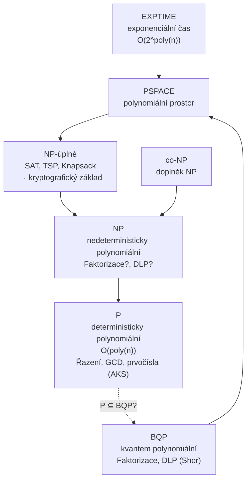

# 8. Bezpečnost kryptosystémů

!!! abstract "Cíle kapitoly"
    - Znát Kerckhoffsův princip a typy bezpečnosti
    - Porozumět Shannonově teorii — entropie, vzdálenost jednoznačnosti
    - Orientovat se v teorii složitosti a zařadit kryptografické problémy

---

## 8.1 Kerckhoffsův princip a bezpečnostní typy

!!! warning "Kerckhoffsův princip (1883)"
    **Bezpečnost kryptosystému závisí POUZE na tajnosti klíče**, nikoli na tajnosti algoritmu.
    
    Předpokládáme, že útočník zná celý algoritmus (Kerckhoffs, Shannonovo maximum: „The enemy knows the system").
    
    *Security through obscurity* je nepřijatelná jako jediná obrana.

### Čtyři typy bezpečnosti

| Typ | Definice | Příklad |
|-----|----------|---------|
| **Nepodmíněná** (unconditional) | Nelze prolomit ani s neomezenou výpočetní mocí | OTP (Vernamova šifra) |
| **Podmíněná** (computational) | Prolomení vyžaduje výpočetní prostředky, které útočník nemá | AES, RSA |
| **Prokazatelná** (provable) | Důkaz, že prolomení implikuje vyřešení NP těžkého problému | RSA ≤ faktorizace |
| **Výpočetní** | Prolomení trvá déle než životnost chráněné informace | DES (7 dní, $10k) |

### Dokonale bezpečný systém — OTP

Shannon dokázal, že **jedinou dokonale bezpečnou šifrou** je One-Time Pad:
- Klíč délky ≥ délky zprávy
- Klíč náhodný, nikdy nepoužitý znovu
- Šifrování: $c = p \oplus k$

Problém: klíč musíme tajně distribuovat → stejně těžký problém, jako distribuovat zprávu.

---

## 8.2 Shannonova teorie informace

### Entropie

!!! info "Shannonova entropie"
    $$H(X) = -\sum_{i=1}^n p_i \log_2 p_i \quad [\text{bitů}]$$
    
    Maximum při rovnoměrném rozdělení: $H_{\max} = \log_2 n$ bitů.

!!! example "Příklad"
    Česká abeceda (26 písmen), rovnoměrné rozdělení: $H = \log_2 26 \approx 4.7$ b/znak
    
    Skutečná entropie češtiny: $r \approx 1.5$ b/znak (jazyk má redundanci)

### Vzdálenost jednoznačnosti

!!! info "Formule"
    $$\delta_U = \frac{H(K)}{D}$$
    
    kde $D = R - r$ (redundance jazyka), $R$ = maximální entropie, $r$ = skutečná entropie.

**Angličtina:** $R = \log_2 26 \approx 4.7$ b/znak, $r \approx 1.5$ b/znak, $D \approx 3.2$ b/znak.

**Vzdálenost jednoznačnosti** = minimální délka ciphertextu, ze které lze (teoreticky) jednoznačně určit klíč.

!!! example "Caesarova šifra"
    $H(K) = \log_2 25 \approx 4.6$ b, $D = 3.2$ b/znak
    
    $\delta_U = 4.6 / 3.2 \approx 1.4$ znaku → stačí 2 znaky k určení klíče!

!!! example "Vigenère, délka klíče $V$"
    $H(K) = V \cdot \log_2 26 \approx 4.7V$ b
    
    $\delta_U = 4.7V / 3.2 \approx 1.5V$ znaků

### Konfúze a difúze

!!! info "Shannon: dvě klíčové vlastnosti"
    **Konfúze** — každý bit ciphertextu závisí na mnoha bitech klíče (složitý vztah).
    
    Realizace: **substituce** (S-boxy v DES, SubBytes v AES)
    
    ---
    
    **Difúze** — každý bit plaintextu ovlivňuje mnoho bitů ciphertextu (avalanche effect).
    
    Realizace: **permutace/transpozice** (ShiftRows + MixColumns v AES, P-permutace v DES)

Dobrá bloková šifra musí mít obojí.

---

## 8.3 Typy útočníků a útoky

### Klasifikace útočníků podle znalostí

| Model | Co útočník zná |
|-------|---------------|
| **COA** — Ciphertext-Only Attack | Jen šifrový text |
| **KPA** — Known-Plaintext Attack | Páry (plaintext, ciphertext) |
| **CPA** — Chosen-Plaintext Attack | Může si zvolit plaintexty k zašifrování |
| **CCA** — Chosen-Ciphertext Attack | Může si zvolit ciphertexty k dešifrování |

Silnější model = slabší předpoklady pro útočníka = silnější bezpečnostní garance.

### Efektivní délka klíče po útocích

| Algoritmus | Jmen. délka | Po útoku | Metoda |
|------------|-------------|----------|--------|
| DES | 56 b | ≈0 | Hrubá síla (Deep Crack) |
| 3DES-EDE | 168 b | **112 b** | Meet-in-the-middle |
| AES-256 kv. hrozba | 256 b | **128 b** | Groverův algoritmus |
| RSA-1024 | 1024 b | ≈0 | GNFS faktorizace |

---

## 8.4 Teorie složitosti

### Třídy složitosti

### Relevantní problémy pro kryptografii

| Problém | Klasická složitost | Kvantová složitost | Použití |
|---------|--------------------|--------------------|---------|
| Faktorizace $n=pq$ | Sub-exp (GNFS) | **Poly (Shor)** | RSA |
| DLP mod $p$ | Sub-exp (Index calculus) | **Poly (Shor)** | DH, DSA, ElGamal |
| ECDLP | Exp (Pollard $\rho$) | **Poly (Shor)** | ECC |
| AES klíč hrubou silou | Exp | Semi-exp (Grover) | AES |
| SAT | NP-úplný | ? | Důkazy |

!!! tip "Zkouška"
    Vědět, která kryptografická primitiva jsou ohrožena Shorovým algoritmem (vše na faktorizaci a DLP). Znát P vs NP vs BQP.

---

## Shrnutí kapitoly

!!! abstract "Rychlý přehled"
    - **Kerckhoffs:** bezpečnost = tajnost klíče, ne algoritmu
    - **OTP:** jediná dokonale bezpečná šifra (klíč = délka zprávy, jednorázový)
    - **Entropie:** $H = -\sum p_i \log_2 p_i$; maximum při rovnoměrném rozdělení
    - **Vzdálenost jednoznačnosti:** $\delta_U = H(K)/D$ — jak moc ciphertextu stačí na určení klíče
    - **Konfúze** (substituce) + **Difúze** (permutace) = základ bezpečných šifer
    - **P vs NP:** NP-těžké problémy jsou základem asymetrické kryptografie

!!! question "Klíčové otázky ke zkoušce"
    1. Formulujte Kerckhoffsův princip.
    2. Jaký je rozdíl mezi nepodmíněnou a podmíněnou bezpečností? Příklady.
    3. Co je vzdálenost jednoznačnosti a jak ji spočítat?
    4. Co je konfúze a difúze? Jak jsou realizovány v AES?
    5. Proč je OTP dokonale bezpečný a proč ho nelze prakticky použít?
    6. Jaká je třída složitosti faktorizace a co to říká o bezpečnosti RSA?
