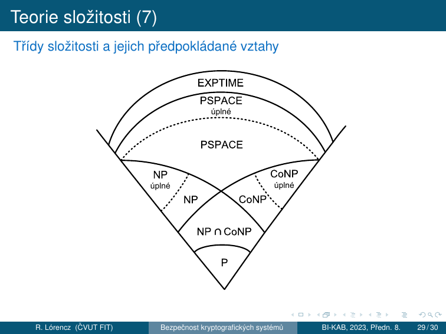

# 8. Bezpečnost kryptosystémů

!!! abstract "Cíle kapitoly"
    - Znát typy bezpečnosti kryptosystémů a Kerckhoffsův princip
    - Porozumět Shannonově teorii informace — entropie, obsažnost jazyka, nadbytečnost, vzdálenost jednoznačnosti
    - Chápat konfúzi a difúzi jako nástroje k potlačení redundance
    - Orientovat se v teorii složitosti a zařadit kryptografické problémy do tříd P/NP

---

## 8.1 Hodnocení odolnosti šifry

Odolnost šifry vůči útokům je určena:

- **Vnitřní strukturou šifry** (nelineární prvky, délka klíče, key management, ...)
- **Použitou abecedou** → určité bigramy, trigramy, atd. jako např. „XZ", „ZXW" se nevyskytují, což zjednodušuje útok → **teorie informace**
- **Teoretickou bezpečností** (pseudonáhodné generátory čísel jsou predikovatelné, ...)
- **Složitostí matematického problému**, na kterém je šifra postavena → **podmíněná bezpečnost** a **nepodmíněná bezpečnost** v rámci **teorie složitosti**

!!! info "Dvě hlavní teorie"
    - **Teorie informace** → za jakých podmínek znalosti (jazykového) kryptografického prostředí lze kryptografický algoritmus rozluštit.
    - **Teorie složitosti** → s jakou složitostí bude možné kryptografický algoritmus rozluštit.

---

## 8.2 Typy bezpečnosti

### Teoretická bezpečnost

!!! info "Definice — Teoretická bezpečnost"
    O teoretické bezpečnosti kryptosystému hovoříme tehdy, pokud při splnění konkrétních podmínek je šifra považována za bezpečnou, ovšem dané podmínky může být v praxi těžké splnit.

Problémy v praxi:
- distribuce tajného klíče
- generování náhodných čísel
- implementace v hardwaru
- ...

!!! example "Příklad — PS3 / ECDSA"
    Sony pro generování podpisu u zařízení PS3 použilo algoritmu *ECDSA*. Soukromý klíč *SK* byl však napevno nastaven v zařízení, stačily tak dva různé digitální podpisy a klíč *SK* se dal snadno dopočítat.

---

### Nepodmíněná bezpečnost

!!! info "Definice — Nepodmíněná bezpečnost"
    Kryptosystém je nepodmíněně bezpečný, pokud můžeme dokázat, že jej není možné prolomit **bez ohledu na útočníkem použité prostředky**.

- Pokud útočník nezíská opakovaným použitím šifry žádnou novou užitečnou informaci, hovoříme o **absolutní bezpečnosti**.
- Protože asymetrické šifry ve svém *VK* nesou informace pro zjištění *SK*, nemohou být nikdy **nepodmíněně bezpečné**.

!!! example "Příklad — Vernamova šifra (OTP)"
    *Vernamova šifra (one-time-pad)* provádí posuv každého znaku o náhodný počet míst v použité abecedě. Je jedinou prakticky používanou nepodmíněně bezpečnou šifrou, ovšem za podmínek:
    - klíč délky ≥ délky zprávy
    - klíč náhodný, nikdy nepoužitý znovu
    - šifrování: $c = p \oplus k$
    
    **Problém:** klíč musíme tajně distribuovat → stejně těžký problém jako distribuovat zprávu.

---

### Podmíněná bezpečnost

!!! info "Definice — Podmíněná bezpečnost"
    Kryptosystém je podmíněně bezpečný, pokud jeho prolomení vyžaduje **prostředky, které nemáme** (výpočetní výkon, paměťový prostor, ...).

- Podmíněná bezpečnost má velmi striktní podmínky → zavádíme podtřídy: **prokazatelnou** a **výpočetní bezpečnost**.
- Podmíněná bezpečnost je slabší variantou nepodmíněné bezpečnosti — opírá svou bezpečnost o prostředky oproti podstatě šifry.

!!! example "Příklad — AES"
    AES je systémem podmíněně bezpečným, protože při útoku nemáme žádnou informaci o klíči a lze tak provádět pouze útok hrubou silou, což je zatím výpočetně neproveditelné v rozumném čase.

---

### Prokazatelná bezpečnost

!!! info "Definice — Prokazatelná bezpečnost"
    Kryptosystém je prokazatelně bezpečný, pokud je znám matematický důkaz, který říká, že provést útok znamená vyřešit problém výpočetně ekvivalentní s **problémem třídy NP**.

!!! info "NP problém"
    Problém neřešitelný v polynomiálním čase deterministickým Turingovým strojem → více v teorii složitosti dále v přednášce.

!!! example "Příklad — RSA"
    *RSA* je systémem prokazatelně bezpečným, protože je založen na problému faktorizace (spadá do třídy NP).

---

### Výpočetní bezpečnost

!!! info "Definice — Výpočetní bezpečnost"
    Kryptosystém je výpočetně bezpečný, pokud pro jeho prolomení je třeba vynaložit prostředky nebo čas, které přesahují **cenu respektive životnost informace**.

!!! example "Příklad — COPACABANA (2006)"
    Prolomení DES na zařízení typu **COPACABANA** (2006) je možné v rámci **7 dní** s náklady na hardware kolem **$10 000**. V takovém případě je šifra výpočetně bezpečná pro informace, které ztrácí význam během kratší doby nebo mají menší hodnotu.

!!! note "COPACABANA"
    Jedná se o zařízení **založené na FPGA** optimalizované pro běh kryptoanalytických algoritmů, vhodné pro paralelní výpočetní problémy.

---

### Kerckhoffsův princip (1885)

!!! warning "Kerckhoffsův princip"
    Systém musí být prakticky, pokud ne matematicky, nedešifrovatelný a jeho utajení nesmí být podmínkou jeho bezpečnosti. Dále musí být přenositelný, schopný měnit klíče dle přání uživatele, snadný na používání a nesmí vyžadovat žádné speciální znalosti uživatele.

- Při posuzování bezpečnosti kryptosystému **předpokládáme, že útočník zná celý kryptosystém** (Shannonovo maximum: *"The enemy knows the system"*).
- Založení bezpečnosti na *security through obscurity* je nepřijatelné — může sloužit pouze jako **další bezpečnostní prvek**.

---

## 8.3 Shannonova teorie informace

V letech 1948 a 1949 C. E. Shannon zveřejněním svých prací položil základy teorie informace a teorie šifrovacích systémů. Stanovil teoretickou míru bezpečnosti šifry pomocí **neurčitosti otevřeného textu (OT)**.

- Mějme ŠT → jestliže se nic nového o OT nedozvíme (například zúžení prostoru možných zpráv), i když přijmeme jakékoliv množství ŠT → šifra dosahuje **absolutní bezpečnosti** (*perfect secrecy*), tj. ŠT nenese žádnou informaci o OT.
- Zvyšováním počtu znaků ŠT je u většiny praktických šifer (zvlášť u historických šifer) poskytováno více a více **informace o OT**.
- Tato informace nemusí být bezprostředně viditelná.
- **Vzdálenost jednoznačnosti** = počet znaků ŠT, pro který množství informace o OT obsažené v ŠT dosáhne takového bodu, že je možný jen jediný OT.

---

### Entropie

!!! info "Definice — Entropie"
    Entropie je množství informace obsažené ve zprávě. Teorie informace měří entropii zprávy průměrným počtem bitů nezbytných k jejímu zakódování při optimálním kódování (minimum bitů).
    
    Entropie zprávy ze zdroje $X$ je:

    $$H(X) = -\sum_{i=1}^{n} p_i \log_2 p_i \quad [\text{bitů}]$$
    
    kde $p_1, \ldots, p_n$ jsou pravděpodobnosti všech zpráv $X_1, \ldots, X_n$ zdroje $X$ a $-p_i \log_2 p_i$ = počet bitů nutných k optimálnímu zakódování zprávy $X_i$.

Speciální případ — $n$ zpráv se **stejnou pravděpodobností** $p = \frac{1}{n}$:

$$H(X) = -n \left(\frac{1}{n} \log_2 \frac{1}{n}\right) = \log_2 n$$

!!! note "Maximální entropie"
    Lze dokázat, že **maximální entropie** nabývá zdroj, který produkuje všechny zprávy se stejnou pravděpodobností. Má-li zdroj $n$ zpráv se stejnou pravděpodobností $\frac{1}{n}$, pak dosahuje maximální entropie $\log_2 n$.
    
    *Tip:* V případě velkých souborů dat lze získat orientační představu a horní odhad pro entropii těchto souborů použitím kvalitního komprimačního programu → entropie souboru ≤ počet bitů komprimovaného souboru.

!!! example "Příklady výpočtu entropie"
    **Příklad 1:** Mějme 2 možné zprávy: „panna" nebo „orel" a nechť mají stejnou pravděpodobnost:

    $$H(X) = -0.5 \cdot (-1) - 0.5 \cdot (-1) = 1 \text{ bit}$$
    
    **Příklad 2:** Zdroj vydávající zprávy: „bílý" s pravděpodobností $\frac{1}{4}$ a „černý" s pravděpodobností $\frac{3}{4}$:

    $$H(X) = 0.25 \cdot \log_2 4 + 0.75 \cdot \log_2 \frac{4}{3} = 0.25 \cdot 2 + 0.75 \cdot 0.41 = 0.81 \text{ b}$$
    
    **Příklad 3:** Zdroj vydávající pouze jednu zprávu $p = 1$:

    $$H(X) = -(1 \cdot 0) = 0 \text{ b}$$

    Daný zdroj nemá žádnou neurčitost a zprávy z něj nenesou žádnou informaci.

---

### Neurčitost

!!! info "Neurčitost"
    Entropie zprávy vyjadřuje také míru její **neurčitosti**. Tato míra neurčitosti je **počet bitů, které potřebujeme získat luštěním ŠT, s cílem určit OT**.

!!! example "Příklad"
    Například v případě, že část ŠT „4lů9Fg" vyjadřuje buď výsledek „panna" nebo „orel", pak míra neurčitosti této zprávy je rovna právě **1 bitu**.

---

### Obsažnost jazyka

!!! info "Definice — Obsažnost jazyka (průměrná entropie)"
    Pro daný jazyk uvažujme množinu $X$ všech $N$-znakových zpráv. Obsažnost jazyka pro zprávy délky $N$ znaků definujeme jako výraz
    
    $$R_N = \frac{H(X)}{N}$$
    
    tj. průměrnou entropii na 1 znak (průměrný počet bitů informace v 1 znaku).

- Máme-li dlouhou zprávu, její další písmeno bývá v řadě případů určeno již jednoznačně nebo je možný jen malý počet variant.
- Například máme-li 13 znakovou zprávu „Zítra odpoled", je pravděpodobné, že pokračuje písmenem „n". U 14. znaku nepřibude žádná entropie.
- U přirozených jazyků výraz $R_N$ pro zvyšující se $N$ klesá.
- Z předchozího plyne: $\lim_{N \to \infty} R_N = r$
- Konstanta $r$ je **obsažnost jazyka vzhledem k jednomu písmenu**.
- Pro hovorovou angličtinu je $r = 1.3$ až $1.5$ bitů/znak.

---

### Absolutní obsažnost jazyka

!!! info "Definice — Absolutní obsažnost jazyka $R$"
    Mějme stejně pravděpodobné zprávy tvořené v jazyce s $L$ stejně pravděpodobnými znaky:
    
    $$R_N = \frac{\log_2 L^N}{N} = \log_2 L = R$$
    
    $R$ nazýváme **absolutní obsažnost jazyka**. Absolutní obsažnosti dosahuje takový jazyk, který poskytuje generátor náhodných znaků. Je to maximální neurčitost, kterou přirozené jazyky nemohou dosáhnout, neboť jednotlivé znaky tvoří slova a věty, které mají odlišné pravděpodobnosti.

---

### Nadbytečnost jazyka

!!! info "Definice — Nadbytečnost jazyka $D$"
    Nadbytečnost (redundance) jazyka vzhledem k jednomu písmenu nám vyjadřuje, kolik bitů je v jednom znaku daného jazyka nadbytečných, a je dána výrazem:
    
    $$D = R - r$$
    
    a číslo $\frac{100D}{R}$ pak udává, kolik bitů jazyka je nadbytečných procentuálně.

!!! example "Nadbytečnost angličtiny"
    Pro angličtinu máme $L = 26$, $R = \log_2 26 = 4.7$ bitů na písmeno, $r = 1.5$ bitů/písmeno:
    
    $$D = R - r = 4.7 - 1.5 = 3.2 \text{ nadbytečných bitů/písmeno}$$
    
    $$\frac{100D}{R} = \frac{100 \cdot 3.2}{4.7} = 68\% \text{ nadbytečných bitů/písmeno}$$

!!! example "ASCII redundance"
    Anglický text v kódu ASCII má v každém bytu 7b informací a 1b parity → 1.5b informace anglického znaku. 8b informace může nést také 8b informace:
    
    $$D = R - r = 8 - 1.5 = 6.5 \text{ b redundance}$$

---

### Vzdálenost jednoznačnosti

#### Odvození

Uvažujme pro ilustraci následující úvahu (neplatí pro všechny šifry):

- Mějme množinu zpráv $M$, množinu ŠT $C$ a množinu $2^{H(K)}$ stejně pravděpodobných klíčů $K$.
- Předpokládejme, že máme ŠT $c$ délky $N$ znaků a že pro klíče $k \in K$ jsou odpovídající OT $D_k(c)$ vybírány z množiny všech zpráv $M$ nezávisle a náhodně.
- V množině $M$ je celkem $2^{RN}$ zpráv, z toho je $2^{rN}$ smysluplných zpráv a $U = 2^{RN} - 2^{rN}$ zpráv nesmysluplných.
- Pokud provedeme dešifrování ŠT $c$ všemi možnými $2^{H(K)}$ klíči, dostáváme $2^{H(K)}$ zpráv. Z nich je smysluplných průměrně pouze:

$$S = 2^{H(K)} \cdot \frac{2^{rN}}{2^{RN}} = \frac{2^{H(K)}}{2^{DN}} = 2^{H(K) - DN}$$

- Abychom dostali pouze jednu zprávu — tu, která byla skutečně zašifrována — musí být $S = 1$, tedy $H(K) = DN$.

!!! info "Definice — Vzdálenost jednoznačnosti $\delta_U$"
    Z předchozího plyne: $H(K) = DN$ a $N = \frac{H(K)}{D} = \delta_U$.
    
    Vzdálenost jednoznačnosti je definována jako:
    
    $$\delta_U = \frac{H(K)}{D}$$
    
    kde $H(K)$ je neurčitost klíče a $D$ je redundance jazyka otevřené zprávy.

!!! example "Jednoduchá substituce nad anglickou abecedou"
    Vzdálenost jednoznačnosti jednoduché substituce:
    
    $$\delta_U = \frac{H(K)}{D} = \frac{\log_2(26!)}{3.2} = \frac{88.3}{3.2} = 27.6$$
    
    V ŠT o **28 znacích** je tedy dostatečné množství informace na to, aby zbýval v průměru jediný možný OT. K rozluštění jednoduché substituce v angličtině postačí tedy v průměru **28 písmen ŠT**.

!!! example "Vigenèrova šifra s klíčem délky $V$"
    Mějme klíč Vigenèrovy šifry o délce $V$ náhodných znaků a uvažujme otevřený text z anglické abecedy:
    
    $$\delta_U = \frac{H(K)}{D} = \frac{\log_2(26^V)}{3.2} = \frac{V \cdot \log_2(26)}{3.2} = \frac{4.7V}{3.2} = 1.5V$$
    
    To je na první pohled optimistický výsledek, ale:
    - Mějme ŠT v délce 1.5 násobku hesla, tj. oněch 1.5V znaků. 1. a 3. třetina textu používá stejné heslo, které lze eliminovat odečtením a poté s určitou pravděpodobností vyluštit 1. a 3. třetinu OT.
    - Zůstává neznámá 2. třetina OT, kde je heslo zcela náhodné a neznámé — nemáme tedy z něj žádnou informaci. Zbývá redundance OT, z níž známe 1. a 3. třetinu.
    - $\delta_U$ je střední hodnota vzdálenosti jednoznačnosti a nezohledňuje právě takové rozložení informace z OT, které je k dispozici.
    - S ŠT o délce $2V$ znaků budeme schopni heslo eliminovat a luštit metodou knižní šifry. Skutečnou vzdálenost jednoznačnosti lze proto v závislosti na konkrétním problému a daném $V$ očekávat v rozmezí **$1.5V$ až $2V$**.

!!! warning "Upozornění"
    Vzdálenost jednoznačnosti je **odhad množství informace** nutného k vyluštění dané úlohy. **Neříká nic o složitosti** takové úlohy. I když máme dostatek informace, prolomení může být výpočetně neproveditelné.

---

### Konfúze a difúze

Podle Shannona jsou to základní techniky k **potlačení redundance $D$** ve zprávě:

!!! info "Konfúze"
    **Konfúze** — maří vztahy mezi ŠT a OT. Ztěžuje studium redundancí a statistických struktur OT.
    
    - Nejjednodušší: **substituce** (Caesarova šifra)
    - Proudové šifry: konfúze, pokud také zpětné vazby → i difúze
    - Moderní substituční šifry jsou mnohem složitější, nahrazují se dlouhé bloky OT blokem ŠT a mechanizmus substituce se mění s bity klíče nebo OT.
    
    *Realizace:* S-boxy v DES, SubBytes v AES

!!! info "Difúze"
    **Difúze** — rozprostírá redundanci OT. Vyhledávání rozprostřených redundancí ztěžuje kryptoanalýzu.
    
    - Nejjednodušší: **transpozice**
    - V současnosti jsou tyto způsoby kombinovány k dokonalejšímu rozptylu redundance.
    - Obecně — difúzi lze snadno luštit, ale již ne například po dvojnásobné transpozici.
    
    *Realizace:* ShiftRows + MixColumns v AES, P-permutace v DES

Dobrá bloková šifra musí mít **obojí**.

---

## 8.4 Teorie složitosti

Teorie složitosti je **metodologický základ pro analýzu výpočetní složitosti** kryptografických technik a algoritmů. Porovnává kryptografické techniky a algoritmy a určuje jejich bezpečnost.

**Výpočetní složitost algoritmu** je dána výpočetním výkonem potřebným pro jeho realizaci a zahrnuje:
- $T(n)$ — časovou náročnost
- $S(n)$ — prostorovou náročnost (paměťové požadavky)

Proměnná $n$ je **rozsah vstupu**.

---

### O-notace

Výpočetní složitost se vyjadřuje **řádem $O$ (Order)** hodnoty výpočetní složitosti:

- Řád složitosti $O$ roste nejrychleji v závislosti na $n$.
- Všechny prvky nižšího řádu se zanedbávají → systémově nezávislé vyjádření.
- Příklad: $7n^4 + 5n^2 + 6$ je $O(n^4)$

| Případ | Interpretace |
|--------|-------------|
| $T(n) = O(n)$ | Dvakrát větší vstup → dvakrát větší časová náročnost |
| $T(n) = O(2^n)$ | Zvětšení vstupu o 1 → prodloužení doby výpočtu dvojnásobně |
| $T(n) = O(1)$ | Časová složitost je nezávislá na $n$ (na vstupech) |

### Klasifikace algoritmů podle složitosti

| Třída | O-notace | Poznámka |
|-------|----------|----------|
| Konstatní | $O(1)$ | Nezávisí na vstupu |
| Lineární | $O(n)$ | |
| Polynomiální | $O(n^m)$, $m$ konstantní | Kvadratická $O(n^2)$, kubická $O(n^3)$, ... |
| Exponenciální | $O(t^{f(n)})$, $t > 1$, $f(n)$ polynomiální | Příklad: $O(2^n)$ |
| Superpolynomiální | $O(t^{f(n)})$, $f(n)$ > konst., $f(n)$ < lineární | Podmnožina exponenciálních |

!!! note "Důležitá poznámka"
    Známé luštitelské algoritmy jsou časově superpolynomiálně složité. Nedá se ale zatím dokázat, že nebude nikdy možné objevit nějaký časově polynomiální luštitelský algoritmus.

### Tabulka složitosti pro $n = 10^6$

| $T(n)$ | # operací ($n = 10^6$) | Čas výpočtu (1 oper. = 0.1 μs) |
|--------|----------------------|-------------------------------|
| $O(1)$ | $1$ | $0.1\ \mu\text{s}$ |
| $O(n)$ | $10^6$ | $100\ \text{ms}$ |
| $O(n^2)$ | $10^{12}$ | $1.2\ \text{dne}$ |
| $O(n^3)$ | $10^{18}$ | $3200\ \text{let}$ |
| $O(2^n)$ | $10^{301030}$ | $10^{301005} \times \text{věk vesmíru}$ |

!!! example "56-bitový klíč DES"
    Pro $n$-bitový klíč je časová složitost luštění hrubou silou $O(2^n)$.
    
    Nechť klíč je 56 bitový → $O(2^{56}) = 7.2 \cdot 10^{16}$, čas výpočtu je přibližně **81 000 dní** (1 oper. = 0.1 μs). 
    
    Uvažujme $1000 \times \mu\text{PC}$ s tímto výkonem → nám stačí pro luštění čas kratší než **3 měsíce**.

---

### Kategorie problémů

| Kategorie | Popis |
|-----------|-------|
| **Snadno řešitelné** | Dají se řešit časově polynomiálními algoritmy za „přijatelně" dlouhou dobu pro „rozumné" velikosti $n$ |
| **Obtížné (těžké)** | Nelze řešit v polynomiálním čase za „přijatelně" dlouhou dobu. Problémy řešitelné pouze superpolynomiálními algoritmy jsou obtížně řešitelné i při malých hodnotách $n$ |
| **Nerozhodnutelné** | Pro jejich řešení nelze navrhnout žádný algoritmus, i v případě, že neuvažujeme časovou složitost |

---

### Třídy složitosti

| Třída | Definice |
|-------|----------|
| **P** | Problémy mohou být řešeny v polynomiálním čase (deterministickým TS) |
| **NP** | Problémy mohou být řešeny v polynomiálním čase, ale pouze nedeterministickým TS — může provádět pouze odhad buď správného řešení, nebo paralelně provede všechny odhady (výsledky prověřuje v polynomiálním čase) |
| **NP-úplný** | Problém, na který lze převést polynomiálním převodem každý problém ve třídě NP (NP-těžký) a náleží do třídy NP |
| **PSPACE** | Problémy mohou být řešeny v polynomiálním prostoru, ale nikoliv nezbytně v polynomiálním čase |
| **EXPTIME** | Problémy, které jsou řešitelné v exponenciálním čase |
| **CoNP** | Zahrnuje problémy, které jsou doplňkem některých problémů NP |

### Diagram tříd složitosti

---

### Vztah kryptologie a tříd složitosti

- Mnohé symetrické algoritmy a všechny algoritmy veřejného klíče se dají vyluštit v **nedeterministickém polynomiálním čase**.
- Při zadaném ŠT kryptoanalytik odhaduje OT a klíč a v polynomiálním čase nechá zpracovávat šifrovacím algoritmem tento odhad a prověřuje případnou shodu se ŠT.
- Tento postup je důležitý z teoretického hlediska, protože vymezuje **horní mez složitosti kryptoanalýzy** algoritmu.
- V praxi kryptoanalytik hledá **deterministický časově polynomiální algoritmus**.

!!! danger "Pokud by se dokázalo, že P = NP..."
    - Hodně šifer lze triviálně luštit v nedeterministickém polynomiálním čase.
    - Pokud P = NP, pak tyto šifry budou **luštitelné realizovatelnými deterministickými algoritmy**.
    - Celá moderní kryptografie (RSA, ECC, DH, DSA...) by byla v ohrožení.

!!! example "Relevantní kryptografické problémy"
    | Problém | Klasická složitost | Kvantová složitost | Použití |
    |---------|--------------------|--------------------|---------|
    | Faktorizace $n=pq$ | Sub-exp (GNFS) | **Poly (Shor)** | RSA |
    | DLP mod $p$ | Sub-exp (Index calculus) | **Poly (Shor)** | DH, DSA, ElGamal |
    | ECDLP | Exp (Pollard $\rho$) | **Poly (Shor)** | ECC |
    | AES klíč hrubou silou | Exp $O(2^n)$ | Semi-exp (Grover $O(2^{n/2})$) | AES |

---

## 8.5 Typy útočníků

### Klasifikace útočníků podle znalostí

| Model | Co útočník zná |
|-------|---------------|
| **COA** — Ciphertext-Only Attack | Jen šifrový text |
| **KPA** — Known-Plaintext Attack | Páry (plaintext, ciphertext) |
| **CPA** — Chosen-Plaintext Attack | Může si zvolit plaintexty k zašifrování |
| **CCA** — Chosen-Ciphertext Attack | Může si zvolit ciphertexty k dešifrování |

Silnější model = slabší předpoklady pro útočníka = silnější bezpečnostní garance.

---

## Shrnutí kapitoly

!!! abstract "Rychlý přehled"
    - **Kerckhoffs (1885):** bezpečnost = tajnost klíče, ne algoritmu; útočník zná celý systém
    - **4 typy bezpečnosti:** Teoretická → Nepodmíněná (OTP) → Podmíněná → Prokazatelná (RSA/faktorizace) / Výpočetní (DES/COPACABANA)
    - **Entropie:** $H(X) = -\sum p_i \log_2 p_i$; maximum při rovnoměrném rozdělení = $\log_2 n$
    - **Obsažnost jazyka:** $R_N = H(X)/N$, limit $r$; angličtina $r \approx 1.5$ b/znak
    - **Absolutní obsažnost:** $R = \log_2 L$ (max. entropie pro abecedu velikosti $L$)
    - **Nadbytečnost:** $D = R - r$; angličtina $D = 3.2$ b/znak, 68%
    - **Vzdálenost jednoznačnosti:** $\delta_U = H(K)/D$; substituce $\delta_U \approx 27.6$; Vigenère $\delta_U = 1.5V$
    - **Konfúze** (substituce) + **Difúze** (transpozice) = základ bezpečných šifer
    - **P vs NP:** NP-těžké problémy jsou základem asymetrické kryptografie; P=NP by kryptografii zničilo

!!! question "Klíčové otázky ke zkoušce"
    1. Formulujte Kerckhoffsův princip. Co znamená „security through obscurity"?
    2. Jaký je rozdíl mezi nepodmíněnou a podmíněnou bezpečností? Příklady.
    3. Co je prokazatelná bezpečnost? Jak je RSA prokazatelně bezpečný?
    4. Co je COPACABANA a jak ilustruje výpočetní bezpečnost?
    5. Definujte entropii. Kdy je entropie maximální?
    6. Co je obsažnost jazyka $r$, absolutní obsažnost $R$ a nadbytečnost $D$? Hodnoty pro angličtinu.
    7. Co je vzdálenost jednoznačnosti $\delta_U$? Spočítejte pro jednoduchou substituci a Vigenère.
    8. Co je konfúze a difúze? Jak jsou realizovány v AES?
    9. Proč je OTP dokonale bezpečný a proč ho nelze prakticky použít?
    10. Jaká je třída složitosti faktorizace? Co by znamenalo P=NP pro kryptografii?
    11. Vyjmenujte třídy složitosti P, NP, NP-úplný, PSPACE, EXPTIME, CoNP a jejich vztahy.
