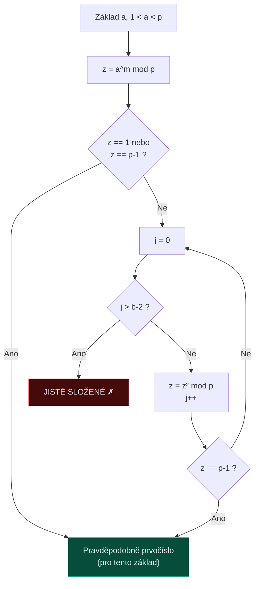
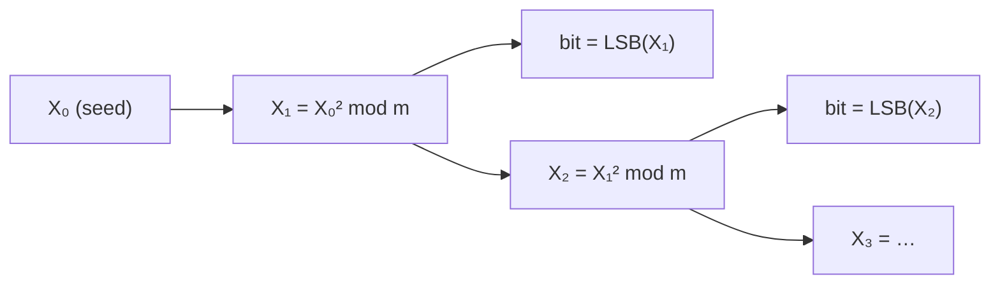

# 9. Generování klíčů

!!! abstract "Cíle kapitoly"
    - Pochopit Čínskou větu o zbytcích a umět ji aplikovat
    - Znát Legendreův a Jacobiho symbol a Eulerovo kritérium
    - Projít Rabin-Millerův test krok za krokem
    - Rozumět rozdílu PRNG vs. TRNG a znát BBS

---

## 9.1 Čínská věta o zbytcích (CRT)

### Věta

!!! info "Čínská věta o zbytcích"
    Jsou-li $m_1, m_2, \ldots, m_k$ **navzájem nesoudělná** celá čísla, pak soustava:
    
    $$x \equiv a_1 \pmod{m_1}, \quad x \equiv a_2 \pmod{m_2}, \quad \ldots, \quad x \equiv a_k \pmod{m_k}$$
    
    má **jediné řešení** modulo $M = m_1 \cdot m_2 \cdots m_k$:
    
    $$x = \left(\sum_{i=1}^k a_i \cdot M_i \cdot y_i\right) \bmod M$$
    
    kde $M_i = M / m_i$ a $y_i = M_i^{-1} \bmod m_i$.

!!! example "Příklad"
    Vyřeš: $x \equiv 2 \pmod{3}$, $x \equiv 3 \pmod{5}$, $x \equiv 2 \pmod{7}$
    
    $M = 3 \cdot 5 \cdot 7 = 105$
    
    $M_1 = 35$, $M_2 = 21$, $M_3 = 15$
    
    $y_1 = 35^{-1} \bmod 3 = 2^{-1} \bmod 3 = 2$ (protože $2 \cdot 2 = 4 \equiv 1$)
    
    $y_2 = 21^{-1} \bmod 5 = 1^{-1} \bmod 5 = 1$
    
    $y_3 = 15^{-1} \bmod 7 = 1^{-1} \bmod 7 = 1$
    
    $x = (2 \cdot 35 \cdot 2 + 3 \cdot 21 \cdot 1 + 2 \cdot 15 \cdot 1) \bmod 105$
    $x = (140 + 63 + 30) \bmod 105 = 233 \bmod 105 = \mathbf{23}$
    
    Ověření: $23 \bmod 3 = 2$ ✓, $23 \bmod 5 = 3$ ✓, $23 \bmod 7 = 2$ ✓

**Využití v kryptografii:** RSA-CRT (rychlé dešifrování), exponencování.

---

## 9.2 Kvadratické zbytky

### Kvadratický zbytek (QR)

$a$ je **kvadratický zbytek** mod $p$ (prvočíslo), pokud $\exists x: x^2 \equiv a \pmod{p}$.

### Legendreův symbol

!!! info "Legendreův symbol"
    $$\left(\frac{a}{p}\right) = \begin{cases} 1 & \text{a je QR mod p (a } a \not\equiv 0) \\ -1 & \text{a je QNR mod p} \\ 0 & \text{p | a} \end{cases}$$

**Eulerovo kritérium:**
$$\left(\frac{a}{p}\right) \equiv a^{(p-1)/2} \pmod{p}$$

!!! example "Příklad"
    Je 3 kvadratický zbytek mod 7?
    
    $3^{(7-1)/2} = 3^3 = 27 \equiv 6 \equiv -1 \pmod{7}$
    
    $\Rightarrow \left(\frac{3}{7}\right) = -1$ → 3 je **QNR** mod 7

### Jacobiho symbol

Pro složené číslo $n = p_1^{\alpha_1} \cdots p_k^{\alpha_k}$:
$$\left(\frac{a}{n}\right) = \prod_{i=1}^k \left(\frac{a}{p_i}\right)^{\alpha_i}$$

!!! warning "Pozor na Jacobiho symbol"
    $\left(\frac{a}{n}\right) = +1$ **neznamená** nutně, že $a$ je QR mod $n$!
    (Platí jen pro prvočísla — Legendreův symbol)

---

## 9.3 Rabin-Millerův test prvočíselnosti

Testuje, zda číslo $p$ je (pravděpodobně) prvočíslo, s malou pravděpodobností chyby.

### Příprava

Zapišme $p - 1 = 2^b \cdot m$, kde $m$ je liché.

### Jeden test pro základ $a$

Opakujeme pro $t$ různých základů $a$.

### Pravděpodobnost chyby

$$P(\text{složené projde}) \leq 4^{-t}$$

| $t$ | Chyba |
|-----|-------|
| 10 | $< 10^{-6}$ |
| 20 | $< 10^{-12}$ |
| 40 | $< 10^{-24}$ |

!!! example "Příklad testu: p = 561"
    $561 - 1 = 560 = 2^4 \cdot 35$ → $b = 4$, $m = 35$
    
    Test s $a = 2$: $z = 2^{35} \bmod 561$
    
    Výpočtem (square-and-multiply): $2^{35} \bmod 561 = 263$
    
    $263 \neq 1$ a $263 \neq 560$ → pokračujeme:
    
    $j=0$: $z = 263^2 \bmod 561 = 166$, $166 \neq 560$
    
    $j=1$: $z = 166^2 \bmod 561 = 67$, $67 \neq 560$
    
    $j=2$: $z = 67^2 \bmod 561 = 1$, $1 \neq 560$
    
    $j=3 > b-2 = 2$ → **JISTĚ SLOŽENÉ** (561 = 3 × 11 × 17)

!!! tip "Zkouška"
    Projít test Rabin-Miller krok za krokem na příkladu. Vědět pravděpodobnost chyby.

---

## 9.4 PRNG a TRNG

### Blum-Blum-Shub (BBS) — Prokazatelně bezpečný PRNG

!!! info "Formule BBS"
    $$X_{n+1} = X_n^2 \bmod m, \quad m = p \cdot q, \quad p, q \equiv 3 \pmod{4}$$
    
    Výstup = LSB (nejnižší bit) každého $X_n$.

- Bezpečnost spojena s **kvadratickým zbytkem** mod $m$ (redukuje na faktorizaci)
- Prokazatelně bezpečný — pokud neumíme faktorizovat $m$, nelze předvídat bity
- **Pomalý** — pouze pro aplikace, kde je potřeba prokazatelná bezpečnost

### TRNG — True Random Number Generator

Fyzikální zdroje entropie:

| Zdroj | Charakteristika |
|-------|----------------|
| Radioaktivní rozpad | Velmi náhodný, ale pomalý |
| Atmosférický šum | random.org |
| Tepelný šum | Dostupný v HW čipech |
| Pohyb myši | Dostupný v OS |
| Prodlevy klávesnice | Dostupný v OS |
| Jitter oscilátorů | Moderní CPU/FPGA |

**Von Neumannův dekorelátor** (odstranění statistického biasu z TRNG):

| Vstupní pár | Výstup |
|-------------|--------|
| `00` | — (zahodit) |
| `01` | `0` |
| `10` | `1` |
| `11` | — (zahodit) |

### CSPRNG v praxi (OS)

| Systém | API |
|--------|-----|
| Linux | `/dev/urandom`, `getrandom()` |
| macOS | `getentropy()`, `SecRandomCopyBytes()` |
| Windows | `BCryptGenRandom()` |
| Standard | NIST SP 800-90A — CTR_DRBG, Hash_DRBG |

---

## Shrnutí kapitoly

!!! abstract "Rychlý přehled"
    - **CRT:** soustava kongruencí → jediné řešení mod $M = \prod m_i$
    - **Legendreův symbol:** $a^{(p-1)/2} \bmod p \in \{1, -1\}$ → QR nebo QNR
    - **Rabin-Miller:** $p-1 = 2^b m$, testujeme $a^m$ a kvadráty; chyba $\leq 4^{-t}$
    - **BBS:** $X_{n+1} = X_n^2 \bmod m$ — pomalý ale prokazatelně bezpečný
    - **TRNG:** fyzikální šum → Von Neumannův dekorelátor

!!! question "Klíčové otázky ke zkoušce"
    1. Formulujte CRT a spočítejte příklad.
    2. Co je Legendreův symbol a jak ho spočítat (Eulerovo kritérium)?
    3. Projděte Rabin-Miller test na čísle 15 ($= 2^1 \cdot 7$, $b=1$, $m=7$).
    4. Proč je BBS prokazatelně bezpečný?
    5. Co je Von Neumannův dekorelátor a proč ho potřebujeme?
