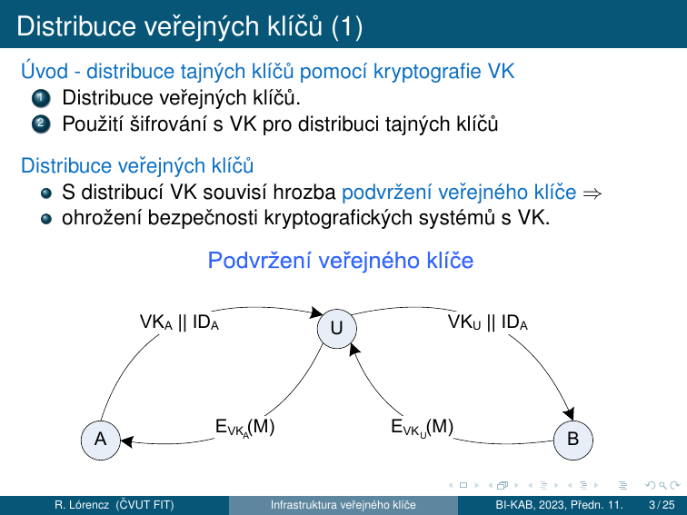
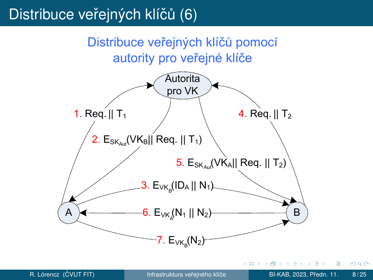
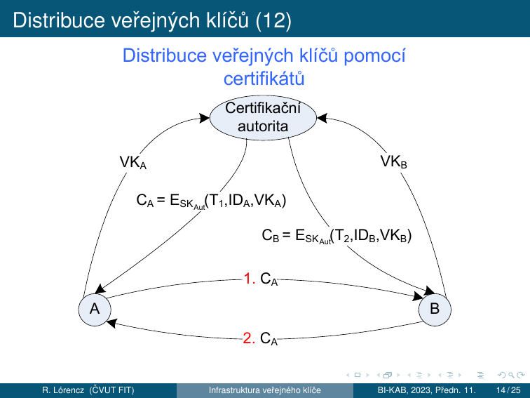
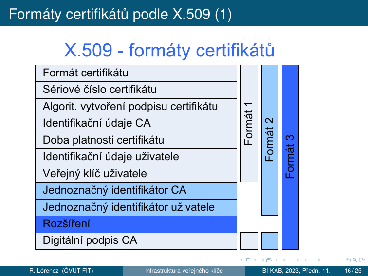
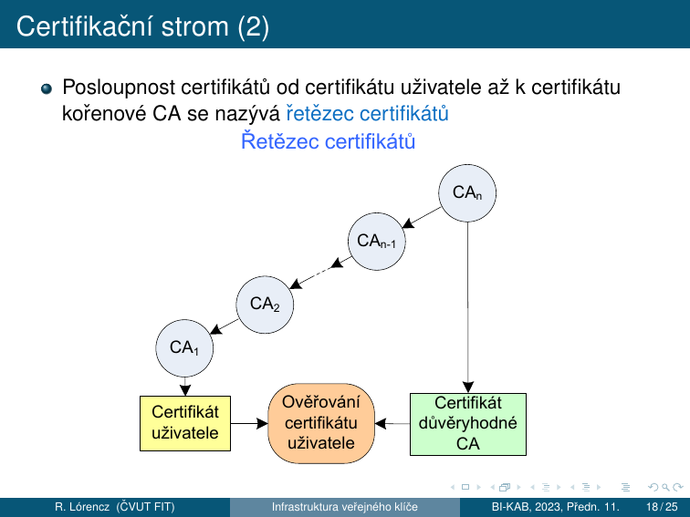
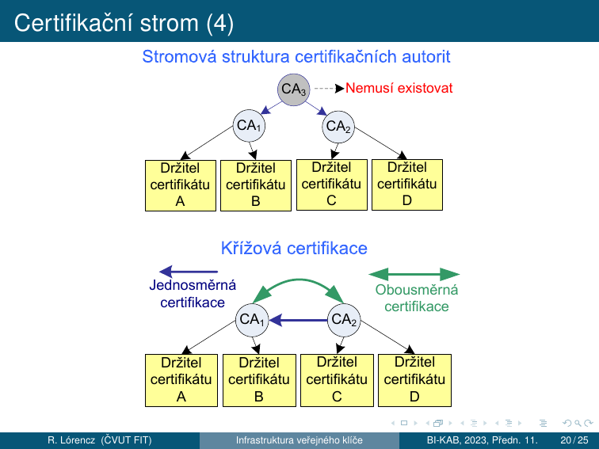
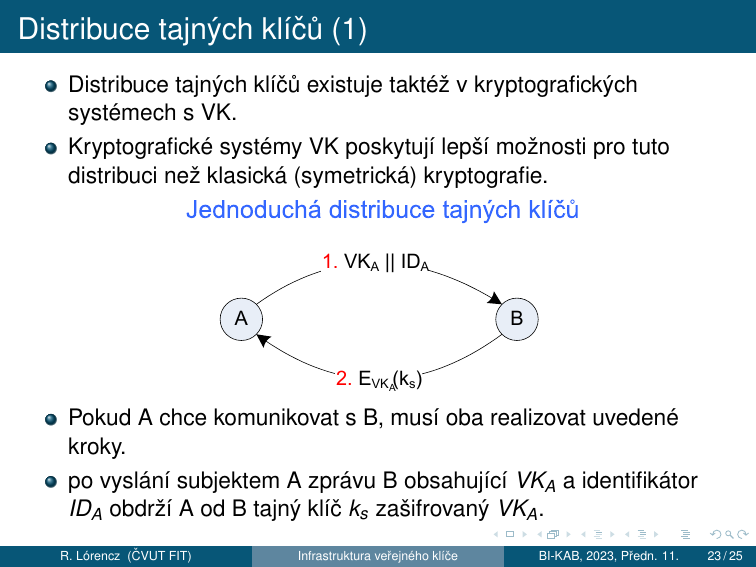
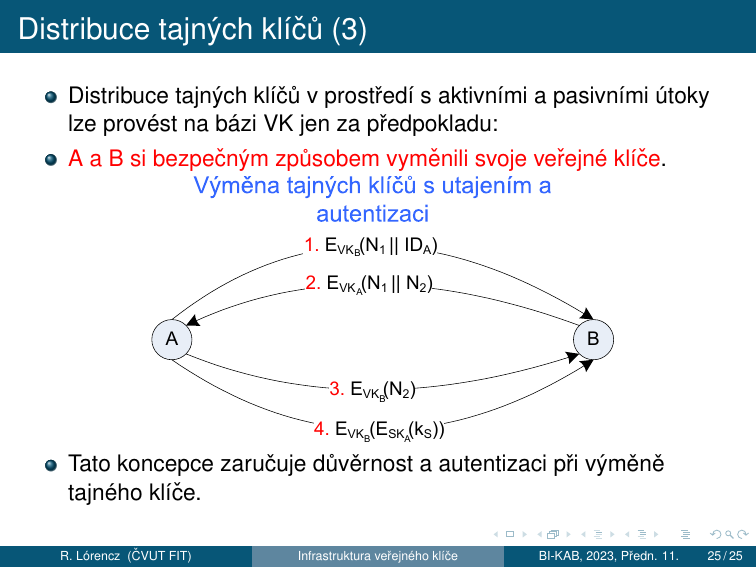

# 10. PKI — Infrastruktura veřejného klíče

!!! abstract "Cíle kapitoly"
    - Porozumět problému distribuce veřejných klíčů a hrozbě podvržení VK
    - Znát 4 metody distribuce VK (zveřejnění, adresář, autorita, certifikace)
    - Znát protokol distribuce VK pomocí autority (7 kroků)
    - Znát strukturu certifikátu a formát X.509
    - Orientovat se v hierarchii certifikačních autorit a certifikačním stromu
    - Rozumět distribuci tajných klíčů pomocí kryptografie VK

---

## 10.1 Distribuce veřejných klíčů

### Problém podvržení veřejného klíče

Úvod — distribuce tajných klíčů pomocí kryptografie VK:

1. Distribuce veřejných klíčů.
2. Použití šifrování s VK pro distribuci tajných klíčů.

S distribucí VK souvisí hrozba **podvržení veřejného klíče** → ohrožení bezpečnosti kryptografických systémů s VK.

**Způsob podvržení VK:**

- Subjekt A pošle svůj $VK_A$ a svůj identifikátor $ID_A$, tj. zprávu $VK_A \| ID_A$, subjektu B.
    - Předpoklad: útočník U má **aktivní** přístup k veřejnému kanálu.
- U zachytí zprávu $VK_A \| ID_A$, vytvoří novou zprávu $VK_U \| ID_A$ a odešle ji B — **podvržení $VK_U$ subjektu B**.
- B se domnívá, že $VK_U$, který dostal, patří A → B zašifruje každou zprávu M klíčem $VK_U$, tj. vytvoří $E_{VK_U}(M)$, odešle ji A.
- U zachytí $E_{VK_U}(M)$, dešifruje ji $SK_U$ a získává zprávu M.
- U zná $VK_A$ → zašifruje M → $E_{VK_A}(M)$ a pošle ji A.
- **Důsledek:** U čte korespondenci zaslanou subjektem B subjektu A. U také může tyto zprávy měnit!
- Tato činnost nemusí být subjektem B detekována.

---

### Metody distribuce veřejných klíčů

Distribuce veřejných klíčů lze realizovat technikou:

1. **Zveřejnění veřejných klíčů** (*public announcement*)
2. **Veřejně dostupný adresář** (*public available directory*)
3. **Autorita pro veřejné klíče** (*public-key authority*)
4. **Certifikace veřejných klíčů** (*public-key certification*)

---

### Metoda 1 — Zveřejnění veřejných klíčů

- Zasíláním VK individuálně nebo hromadně v rámci nějaké komunity.
- Na internetu — připojením k emailu, vystavením na webu apod.
- Rychlý a jednoduchý způsob.
- **Nízká bezpečnost!** Není odolný proti podvržení VK → nepovolaný subjekt může číst zprávy dotčeného subjektu až do odhalení.

---

### Metoda 2 — Veřejně dostupný adresář

- Vyšší stupeň bezpečnosti.
- Distribuci VK zabezpečuje důvěryhodná autorita — zodpovídá za obsah, je správcem adresáře.
- Účastníci registrují svůj VK prostřednictvím autorizovaného správce adresáře.
- Bezpečná registrace: osobně nebo přes bezpečnou komunikaci.
- Položky v adresáři jsou tvořeny: [jméno; VK].
- Účastníci mění VK podle potřeby (bezpečnost, velký objem dat jedním VK, zkompromitovaný VK atd.)
- Správce periodicky aktualizuje adresář — elektronicky nebo fyzicky.
- **Slabé místo:** Pokud nepovolaný subjekt získá $SK$ správce adresáře → může modifikovat adresář a provádět odposlech jako v předchozí metodě.

---

### Metoda 3 — Autorita pro veřejné klíče

- Přísnější dohled na distribuci VK z adresáře → vyšší stupeň bezpečnosti.
- Autorita vykonává činnost správce adresáře VK.
- Každý účastník zná veřejný klíč autority $VK_{Aut}$, která vlastní odpovídající soukromý klíč $SK_{Aut}$.

**Distribuce VK pomocí autority (7 kroků):**

1. A ve zprávě Autoritě požádá (*Req* — Request) $VK_B$ za účelem komunikace s B. Žádost je doplněna časovou značkou $T_1$ (Time).
2. Autorita odpoví zprávou zašifrovanou $SK_{Aut}$. A dešifruje zprávu $VK_{Aut}$ — potvrzení, že zpráva je od Autority. Zpráva obsahuje:
    - $VK_B$ — A může šifrovat zprávy pro B
    - kopii žádosti *Req* od A — A může verifikovat kopii s vyslanou žádostí, tj. zda žádost nebyla modifikována před přijetím Autoritou
    - kopii $T_1$ — umožňuje A verifikovat aktuálitu žádosti.
3. A použije $VK_B$ pro zašifrování zprávy pro B obsahující identifikátor A $ID_A$ a náhodné číslo $N_1$ (potvrzuje jedinečnost výměny).
4. B po obdržení zprávy od A vyžádá od Autority $VK_A$ (jako A v 1.).
5. B obdrží $VK_A$ od Autority stejným způsobem jako A v bodě 2.
6. B zašle A zprávu $N_1 \| N_2$ zašifrovanou $VK_A$. $N_2$ generuje B.
7. A zašle B zprávu $N_2$ zašifrovanou $VK_B$.

**Zvýšení bezpečnosti předaných zpráv:** Postup v bodech 6 a 7 zvyšuje bezpečnost výměny zpráv. B zasláním zprávy $N_1 \| N_2$ subjektu A, kde $N_2$ je náhodné číslo generované B, dá jistotu A, že autorem zprávy je B, protože obsahuje $N_1$ vygenerované A. Dešifrování na obou stranách je možné jen se znalostí příslušných SK A a B.

!!! warning "Nevýhody autority pro VK"
    Distribuce VK pomocí Autority pro VK má své nevýhody. Autorita představuje **„úzké hrdlo"** této koncepce. Každý účastník na získání VK adresáta musí nejdříve komunikovat s Autoritou. **Alternativním přístupem** v distribuci VK představuje použití *certifikátů*.

---

### Metoda 4 — Certifikace veřejných klíčů

Distribuce VK bez kontaktu s třetím důvěryhodným subjektem. Tento přístup vyžaduje definici **certifikátu** a **certifikační autority**.

#### Definice certifikátu

!!! info "Definice — Certifikát"
    Certifikát je struktura, která obsahuje:

    - veřejný klíč žadatele/držitele certifikátu
    - identifikační údaje držitele certifikátu
    - dobu platnosti certifikátu
    - další údaje vytvořené certifikační autoritou.
    
    Tato struktura je **podepsána soukromým klíčem certifikační autority $SK_{Aut}$** a každý účastník může verifikovat obsah certifikátu pomocí veřejného klíče certifikační autority $VK_{Aut}$.

#### Definice certifikační autority (CA)

!!! info "Definice — Certifikační autorita (CA)"
    Certifikační autorita (CA) je **důvěryhodná třetí strana**, která na základě žádosti vydává a aktualizuje certifikáty. Každý účastník může verifikovat to, že certifikát byl vytvořen CA, pomocí jejího veřejného klíče $VK_{Aut}$.
    
    - Žádost o vydání certifikátu lze CA doručit osobně nebo elektronicky s využitím bezpečné komunikace.
    - Přijímání žádostí, kontrola údajů v žádosti a odevzdávání certifikátů žadatelům se realizuje **registrační autoritou**.

#### Formát certifikátu

CA vydá certifikát $C_A$ pro subjekt A, který obsahuje:

- dobu platnosti — $T_1$
- identifikační údaje A — $ID_A$
- veřejný klíč A — $VK_A$

Tuto strukturu certifikátu podepíše svým soukromým klíčem $SK_{Aut}$ a odešle A:

$$C_A = E_{SK}(T_1, ID_A, VK_A)$$

Certifikát v této podobě lze poskytnout subjektu A, který ho může zveřejnit, protože ho lze číst/verifikovat pomocí veřejného klíče CA — $VK_{Aut}$:

$$D_{VK_{Aut}}(C_A) = D_{VK_{Aut}}(E_{SK_{Aut}}(T_1, ID_A, VK_A)) = (T_1, ID_A, VK_A)$$

Tento proces dešifrování klíčem CA je současně **ověřením toho, že certifikát byl vytvořen CA**.

#### Distribuce VK pomocí certifikátů

1. A zašle B certifikát $C_A$.
2. B dešifruje $C_A$ pomocí $VK_{Aut}$ → získá jméno a veřejný klíč držitele certifikátu a také časový údaj o platnosti.

Analogicky B požádá o vydání certifikátu. Certifikát $C_B$ má analogickou strukturu jako $C_A$. Distribuce veřejných klíčů potom představuje výměnu certifikátů $C_A$ a $C_B$ mezi subjekty A a B.

---

## 10.2 Formáty certifikátů podle X.509

Formáty certifikátů určuje doporučení **ITU-T X.509**, které je částí doporučení X.500. Doporučení X.509 definuje také autentizační protokoly používané v různých typech sítí a aplikacích síťové bezpečnosti.

---

## 10.3 Certifikační strom

### Vlastnosti certifikátů vydávaných CA

- Kterýkoliv subjekt prostřednictvím veřejného klíče CA může verifikovat veřejné klíče jiných subjektů.
- Žádný jiný subjekt než CA nemůže modifikovat vydané certifikáty.
- Certifikáty jsou nefalšovatelné → jsou umístěny v adresáři CA přístupném všem subjektům bez nutnosti zvláštní ochrany.

!!! note "Problém při velkém počtu uživatelů"
    Uvedená koncepce má nevýhodu při velkém počtu uživatelů. Každý uživatel musí mít kopii veřejného klíče CA. Výhodnější je vytvořit více CA pro různé okruhy uživatelů.

Vytvoření více CA předpokládá vzájemné propojení mezi CA například ve formě stromové struktury — **certifikačního stromu**. Každý strom reprezentuje **kořenová CA**, která vlastní **kořenový certifikát**.

### Řetězec certifikátů

Posloupnost certifikátů od certifikátu uživatele až k certifikátu kořenové CA se nazývá **řetězec certifikátů**.

- Certifikát je platný ⟺ platné jsou všechny certifikáty v řetězci certifikátů.
- Kořenový certifikát musí být ověřen jinou bezpečnou cestou (např. křížová certifikace).
- Je možné prohlásit za důvěryhodný i certifikát v řetězci certifikátů → se ověřovaní urychlí.
- Řetěz certifikátů předpokládá stromovou strukturu CA.

### Křížová certifikace

Problém vzniká se získáváním certifikátů uživatelů jiné stromové struktury. V tomto případě získání certifikátů mezi uživateli dvou různých CA umožňuje **křížová certifikace**:

- **Jednosměrná**
- **Obousměrná**

**Příklad:** V případě, že C (obrazek Křížová certifikace) chce komunikovat s A, musí A poslat C množinu certifikátů:

- certifikát A, podepsaný $CA_1$
- certifikát $CA_1$ podepsaný $CA_1$, tj. kořenový certifikát $CA_1$
- certifikát $CA_1$ podepsaný $CA_2$, tj. **křížový certifikát**

Křížovou certifikací se $CA_1$ a její uživatelé stanou důvěryhodnými pro $CA_2$ a její uživatele — neplatí to naopak. Aby tento vztah byl **obousměrný**, je nutné, aby i $CA_2$ si vyžádala křížový certifikát podepsaný $CA_1$. Obousměrná křížová certifikace znamená, že $CA_1$ a $CA_2$ vlastní kromě kořenových certifikátů také křížové.

### Platnost certifikátu

- Každý certifikát má **vymezenou dobu platnosti**. Nový certifikát je vydán těsně před uplynutím této doby platnosti.
- Na žádost držitele certifikátu může certifikát ztratit platnost — žádostí odvolání certifikátu podanou na CA. Motivace:
    - kompromitace soukromého klíče
    - uživatel chce změnit aktuální CA
    - kompromitace certifikátu vydaného CA
- CA zveřejňuje **seznam odvolaných certifikátů**.

### PKI — Public Key Infrastructure

!!! info "Definice — PKI"
    PKI (Public Key Infrastructure) je **norma v síti Internet** vycházející z norem ITU-T X.500. Specifikace technických a organizačních opatření pro vydávání, správu, používání a odvolávání klíčů a certifikátů.
    
    **Hlavní cíl** — zabezpečení kompatibility SW pro Internet.

---

## 10.4 Distribuce tajných klíčů

Distribuce tajných klíčů existuje taktéž v kryptografických systémech s VK. Kryptografické systémy VK poskytují lepší možnosti pro tuto distribuci než klasická (symetrická) kryptografie.

### Jednoduchá distribuce tajných klíčů

1. A → B: $VK_A \| ID_A$
2. B → A: $E_{VK_A}(k_s)$

Pokud A chce komunikovat s B, musí oba realizovat uvedené kroky. Po vyslání subjektem A zprávy B obsahující $VK_A$ a identifikátor $ID_A$ obdrží A od B tajný klíč $k_s$ zašifrovaný $VK_A$.

**Problém:** Podvržením veřejného klíče aktivním útočníkem U lze získat tajný klíč $k_s$. Podvržení je provedeno stejným způsobem jako u podvržení veřejného klíče.

**Výsledek:** Tajný klíč $k_s$ určený pro tajnou komunikaci mezi A a B zná také U, který může dešifrovat tajnou komunikaci mezi A a B.

Jednoduchou koncepcí distribuce tajných klíčů lze použít jen v prostředí umožňujícím **pouze pasivní útoky**.

---

### Distribuce tajných klíčů s utajením a autentizací

Distribuce tajných klíčů v prostředí s aktivními a pasivními útoky lze provést na bázi VK jen za předpokladu, že **A a B si bezpečným způsobem vyměnili své veřejné klíče**.

1. A → B: $E_{VK_B}(N_1 \| ID_A)$
2. B → A: $E_{VK_A}(N_1 \| N_2)$
3. A → B: $E_{VK_B}(N_2)$
4. A → B: $E_{VK_B}(E_{SK_A}(k_s))$

Tato koncepce zaručuje **důvěrnost a autentizaci** při výměně tajného klíče.

---

## Shrnutí kapitoly

!!! abstract "Rychlý přehled"
    - **Podvržení VK:** MitM útočník U přeposílá VK_U místo VK_A → čte komunikaci
    - **4 metody distribuce VK:** zveřejnění (nebezpečné) → adresář → autorita (7 kroků) → certifikáty
    - **Certifikát:** $C_A = E_{SK_{Aut}}(T_1, ID_A, VK_A)$; verifikace pomocí $VK_{Aut}$
    - **X.509:** 3 formáty (v1/v2/v3); pole: VK, identita, platnost, podpis CA
    - **Certifikační strom:** řetězec certifikátů od uživatele ke kořenové CA; platný pokud platné všechny v řetězci
    - **Křížová certifikace:** jednosměrná nebo obousměrná; spojení různých certifikačních stromů
    - **PKI:** standard X.500; distribuce, správa, odvolání klíčů a certifikátů
    - **Distribuce tajných klíčů:** jednoduchá (jen pasivní útoky) vs. s autentizací (4 kroky, N_1, N_2 nonce)

!!! question "Klíčové otázky ke zkoušce"
    1. Vysvětlete hrozbu podvržení veřejného klíče. Jak probíhá útok?
    2. Vyjmenujte a popište 4 metody distribuce VK.
    3. Popište protokol distribuce VK pomocí autority (7 kroků).
    4. Co je certifikát? Zapište jeho strukturu formálně ($C_A = \ldots$).
    5. Co je certifikační autorita? Co je registrační autorita?
    6. Jaká pole obsahuje certifikát X.509? Jaký je rozdíl mezi formáty 1, 2 a 3?
    7. Co je certifikační strom a řetězec certifikátů?
    8. Kdy je certifikát platný?
    9. Co je křížová certifikace? Kdy je jednosměrná a kdy obousměrná?
    10. Co je PKI? Kde je specifikováno?
    11. Popište jednoduchou distribuci tajných klíčů a její slabinu.
    12. Jak probíhá distribuce tajných klíčů s utajením a autentizací?
