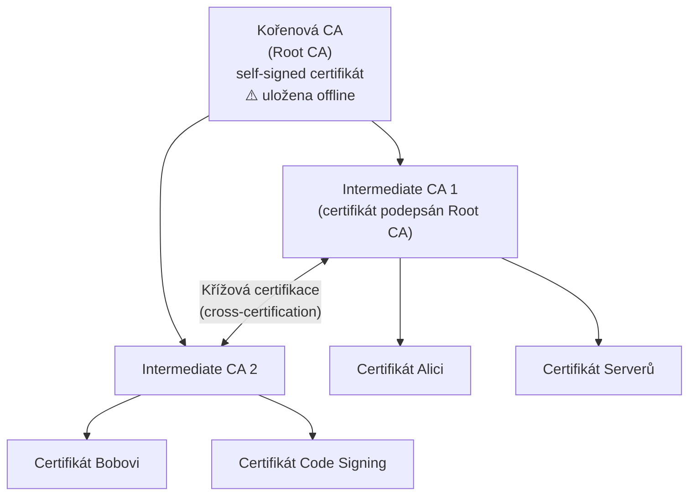
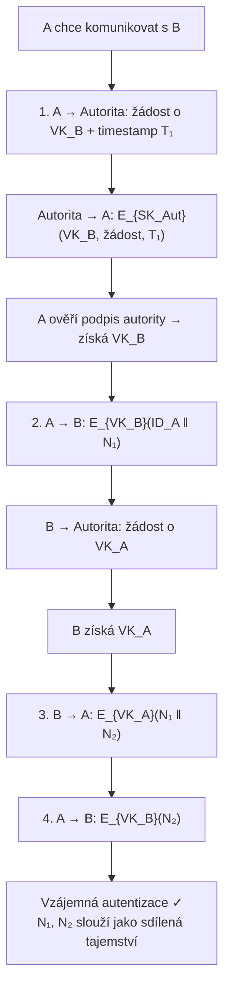

# 10. PKI — Infrastruktura veřejného klíče

!!! abstract "Cíle kapitoly"
    - Porozumět problému distribuce veřejných klíčů a roli PKI
    - Znát strukturu certifikátu X.509
    - Orientovat se v hierarchii certifikačních autorit
    - Vědět, jak funguje odvolání certifikátu (CRL, OCSP)

---

## 10.1 Problém distribuce veřejných klíčů

**Problém:** Jak si může Alice být jistá, že klíč, který dostala pro „Boba", skutečně patří Bobovi?

Man-in-the-Middle útok bez PKI:
```
Alice → "Pošli mi VK_Bob" → MITM (Eve) → Bob
Alice ← VK_Eve (vydáváme se za Boba) ← Eve
Alice šifruje Evou → Eve čte/mění → Eve šifruje Bobem → Bob
```

**Řešení:** Certifikát = veřejný klíč **podepsaný** důvěryhodnou třetí stranou (Certificate Authority).

---

## 10.2 Certifikát X.509

### Struktura

```
Certificate:
  Version:           v3
  Serial Number:     12345
  Signature Alg.:    sha256WithRSAEncryption
  Issuer:            CN=Root CA, O=ČVUT, C=CZ
  Validity:
    Not Before:      2024-01-01 00:00:00 UTC
    Not After:       2025-01-01 00:00:00 UTC
  Subject:           CN=Alice Novák, O=ČVUT FIT, C=CZ
  Subject Public Key Info:
    Algorithm:       RSA 2048-bit
    Public Key:      (n, e) = (modulus, 65537)
  Extensions (v3):
    Key Usage:       Digital Signature, Key Encipherment
    Extended KU:     TLS Web Server Authentication
    SAN:             alice@fit.cvut.cz, fit.cvut.cz
    CRL DP:          http://crl.cvut.cz/root.crl
    OCSP:            http://ocsp.cvut.cz/
  Signature:         SK_CA(SHA256(TBS Certificate))
```

### Podpis certifikátu

$$\text{Signature} = \text{SK}_{CA}\bigl(H(\text{TBS Certificate})\bigr)$$

kde TBS = „To Be Signed" část certifikátu (vše kromě samotného podpisu).

Ověření: $\text{SK}_{CA}^{-1}(\text{Signature}) = H(\text{TBS})$ → ověřujeme pomocí VK_CA.

---

## 10.3 Hierarchie certifikačních autorit



### Řetězec certifikátů (Certificate Chain)

```
Certifikát Alici  →  podepsán Intermediate CA 1
Intermediate CA 1  →  podepsán Root CA
Root CA            →  self-signed (důvěřujeme mu explicitně)
```

Ověření: projdeme celý řetězec od listového certifikátu k Root CA — **každý certifikát musí být platný**.

### Trust Store

Prohlížeče a OS obsahují **předinstalovaných ~150 Root CA** (Mozilla, Microsoft, Apple, Google). Certifikát je důvěryhodný, pokud jeho řetězec vede k jedné z těchto Root CA.

---

## 10.4 Protokol autentizace přes autoritu



Nonce $N_1, N_2$ chrání před **replay útoky**.

---

## 10.5 Odvolání certifikátů

### CRL — Certificate Revocation List

- CA periodicky vydává seznam sériových čísel odvolaných certifikátů
- **Výhoda:** jednoduchý
- **Nevýhoda:** může být zastaralý (vydává se periodicky, ne okamžitě)

### OCSP — Online Certificate Status Protocol

- Real-time dotaz na stav konkrétního certifikátu
- CA (nebo OCSP Responder) odpovídá: `good` / `revoked` / `unknown`
- **Nevýhoda:** dovoluje CA sledovat, kdo přistupuje k jakým stránkám

### OCSP Stapling

- Server **sám** přikládá podepsanou OCSP odpověď ke svému certifikátu při TLS handshake
- Odpověď je časově omezená (typicky 24h) a podepsána CA → klient nemusí sám kontaktovat OCSP
- **Výhoda:** rychlost + soukromí

---

## Shrnutí kapitoly

!!! abstract "Rychlý přehled"
    - **Certifikát X.509** = VK + identita + podpis CA
    - **Hierarchie:** Root CA → Intermediate CA → End Entity
    - **Řetězec certifikátů** musí vést k důvěryhodnému Root CA
    - **CRL:** periodický seznam odvolání; **OCSP:** real-time dotaz; **OCSP Stapling:** server přikládá odpověď

!!! question "Klíčové otázky ke zkoušce"
    1. Co je certifikát X.509? Jaká pole obsahuje?
    2. Jak funguje ověření řetězce certifikátů?
    3. Jaký je rozdíl mezi CRL a OCSP?
    4. Co je OCSP Stapling a proč je lepší než plain OCSP?
    5. Proč je Root CA obvykle offline?
