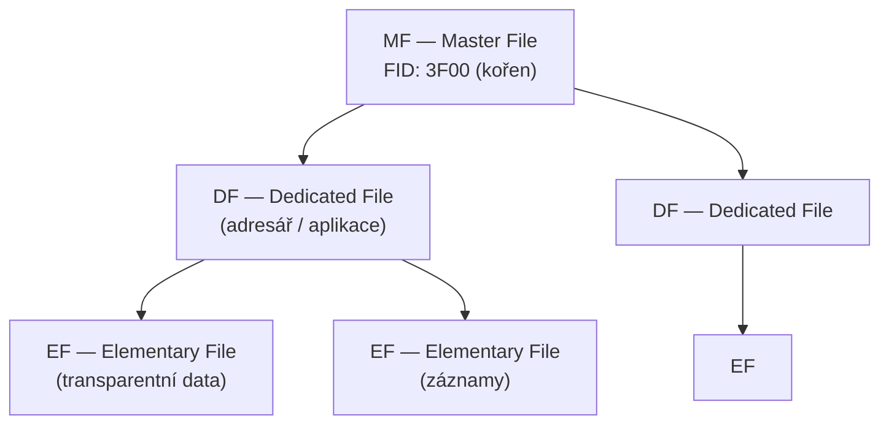
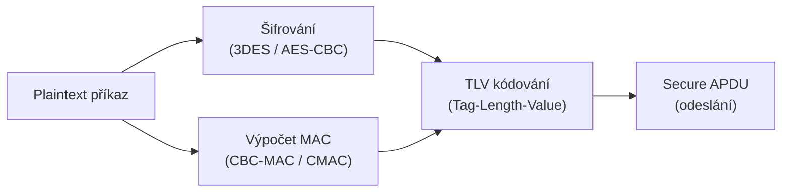

# 11. Čipové karty

!!! abstract "Cíle kapitoly"
    - Znát formát APDU příkazu a odpovědi
    - Orientovat se v souborovém systému ISO 7816-4
    - Pochopit princip Secure Messaging

---

## 11.1 Čipová karta — architektura

Čipová karta (smart card) je malý tamper-resistant počítač s:
- **CPU** (typicky 8/16/32-bit)
- **ROM** — OS a aplikace (trvalá paměť)
- **EEPROM** — data, klíče (perzistentní, mazatelná)
- **RAM** — pracovní paměť (ztracena při vypnutí)
- **Kryptografický koprocesor** (RSA, ECC, AES)
- **I/O rozhraní** — ISO 7816 kontakty nebo bezkontaktní (RFID)

---

## 11.2 APDU — Application Protocol Data Unit

### Command APDU (C-APDU)

```
┌──────┬──────┬──────┬──────┬──────────────┬──────────────┬──────┐
│ CLA  │ INS  │  P1  │  P2  │      Lc      │     Data     │  Le  │
│ 1 B  │ 1 B  │ 1 B  │ 1 B  │  0/1/3 B     │    Lc B      │0/1/3B│
└──────┴──────┴──────┴──────┴──────────────┴──────────────┴──────┘
```

| Pole | Popis |
|------|-------|
| **CLA** | Třída instrukce (00 = ISO standard) |
| **INS** | Kód instrukce |
| **P1, P2** | Parametry instrukce |
| **Lc** | Délka dat příkazu (volitelné) |
| **Data** | Data příkazu (volitelné) |
| **Le** | Očekávaná délka odpovědi (volitelné) |

### Response APDU (R-APDU)

```
┌──────────────┬──────┬──────┐
│     Data     │ SW1  │ SW2  │
│   (volitelné)│ 1 B  │ 1 B  │
└──────────────┴──────┴──────┘
```

### Status Words — nejdůležitější

| SW1 SW2 | Hex | Význam |
|---------|-----|--------|
| `90 00` | 9000 | ✅ Úspěch |
| `61 xx` | — | Odpověď dostupná (xx bytů) |
| `67 00` | 6700 | Špatná délka |
| `69 82` | 6982 | Přístup zamítnut |
| `69 83` | 6983 | Autentizace blokována (PIN locked) |
| `6A 82` | 6A82 | Soubor nenalezen |
| `6A 86` | 6A86 | Nesprávné P1/P2 |
| `63 Cx` | — | Ověření selhalo, zbývá x pokusů |

### Příklad — SELECT aplikace (AID = ABCDEF)

```
→ 00 A4 04 00 06 41 42 43 44 45 46
   │  │  │  │  │  └─────────────── AID data (6 B = "ABCDEF")
   │  │  │  │  └────────────────── Lc = 06
   │  │  │  └───────────────────── P2 = 00
   │  │  └──────────────────────── P1 = 04 (select by name)
   │  └─────────────────────────── INS = A4 (SELECT)
   └────────────────────────────── CLA = 00

← 90 00   (OK)
```

---

## 11.3 Souborový systém ISO 7816-4



### Typy Elementary Files

| Typ | Popis | Příkazy |
|-----|-------|---------|
| **Transparent** | Binární blob | READ BINARY, UPDATE BINARY |
| **Linear Fixed** | Záznamy pevné délky | READ RECORD, APPEND RECORD |
| **Linear Variable** | Záznamy proměnné délky | READ RECORD, APPEND RECORD |
| **Cyclic** | Cyklický buffer | READ RECORD (poslední záznam) |

### Identifikátory

- **FID** (File Identifier): 2 byty, identifikuje soubor
- **SFI** (Short File Identifier): 5 bitů, pro přístup v rámci DF
- **AID** (Application Identifier): 5–16 bytů, identifikuje aplikaci

---

## 11.4 Secure Messaging

Secure Messaging chrání APDU komunikaci šifrováním a integritou dat.



### TLV kódování

Každé pole APDU je zakódováno jako:
```
[TAG (1-3 B)] [LENGTH (1-3 B)] [VALUE (LENGTH B)]
```

Příklad šifrovaného APDU:
```
87 11 01 <16 bytů AES šifrovaných dat>   ← šifrovaná data
8E 08    <8 bytů CMAC>                    ← MAC integrity
```

---

## 11.5 Bezpečnostní mechanismy

| Mechanismus | Popis |
|-------------|-------|
| **PIN ověření** | VERIFY APDU; po N chybách → karta blokována |
| **Key Diversification** | Unikátní klíče pro každou kartu odvozeny z master klíče + sériového čísla |
| **Secure Channel** | Vzájemná autentizace + šifrovaná + MACovaná komunikace |
| **Anti-tampering** | Aktivní mesh (detekce proniknutí), UV senzory, teplotní senzory |
| **Secure Delete** | Přepis paměti před odmazáním klíčů |

---

## Shrnutí kapitoly

!!! abstract "Rychlý přehled"
    - **APDU:** CLA INS P1 P2 [Lc Data Le] → [Data] SW1 SW2
    - **SW 9000** = OK; **SW 6983** = PIN locked; **SW 6A82** = file not found
    - **MF → DF → EF** hierarchie souborů
    - **Secure Messaging:** šifrování + MAC, TLV kódování

!!! question "Klíčové otázky ke zkoušce"
    1. Jaký je formát Command APDU? Popište každé pole.
    2. Co znamená SW = 9000? A SW = 63Cx?
    3. Nakreslete hierarchii souborového systému ISO 7816-4.
    4. Co je Secure Messaging a jaká ochrana poskytuje?
    5. Co je Key Diversification?
