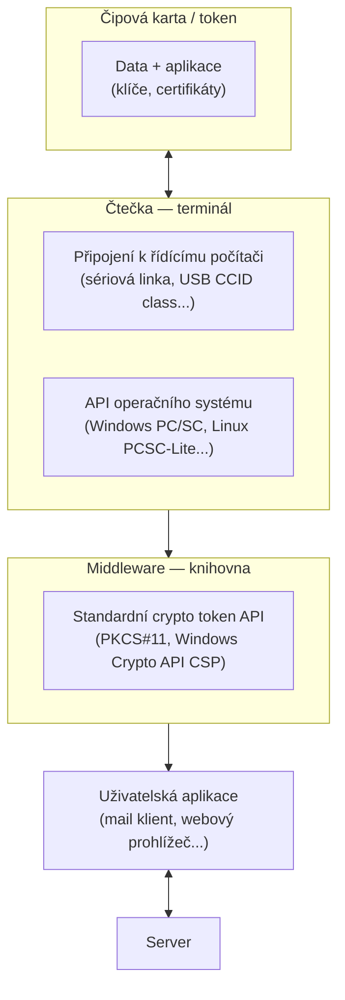
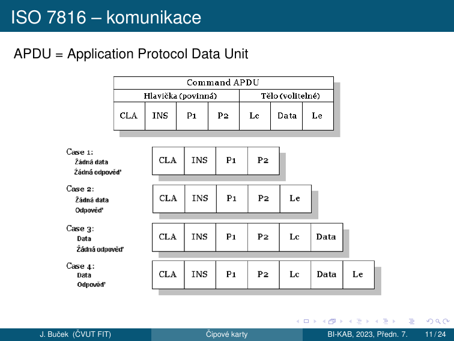
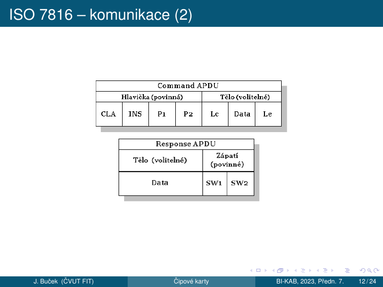
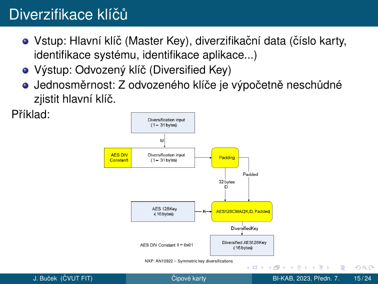
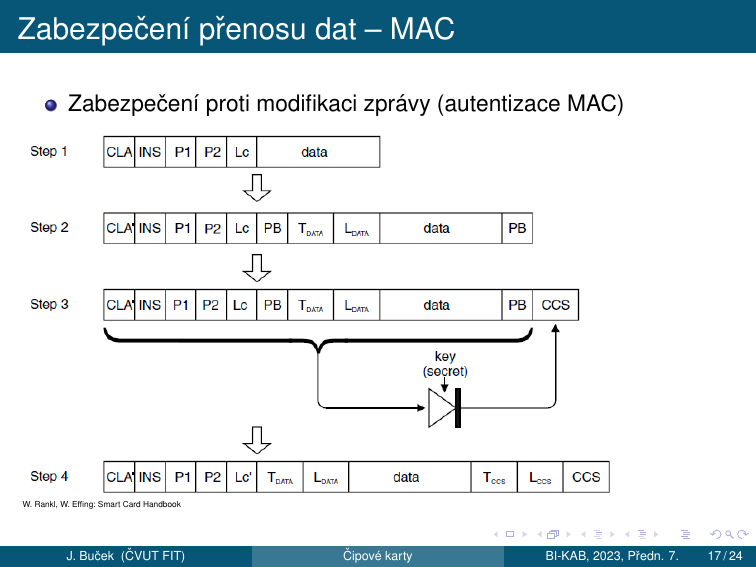
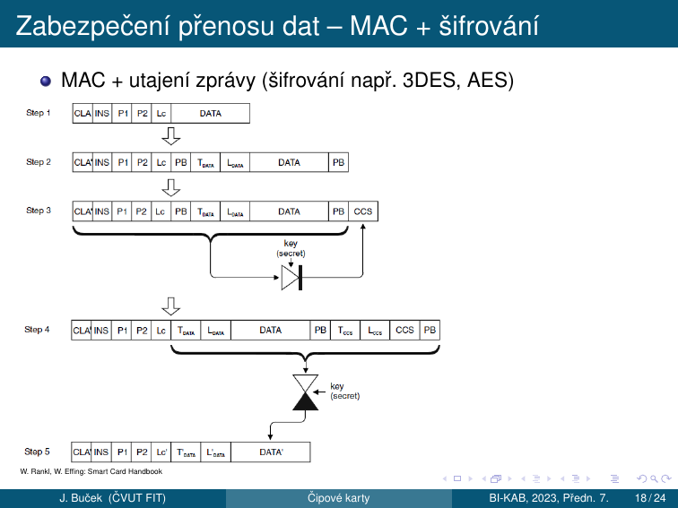
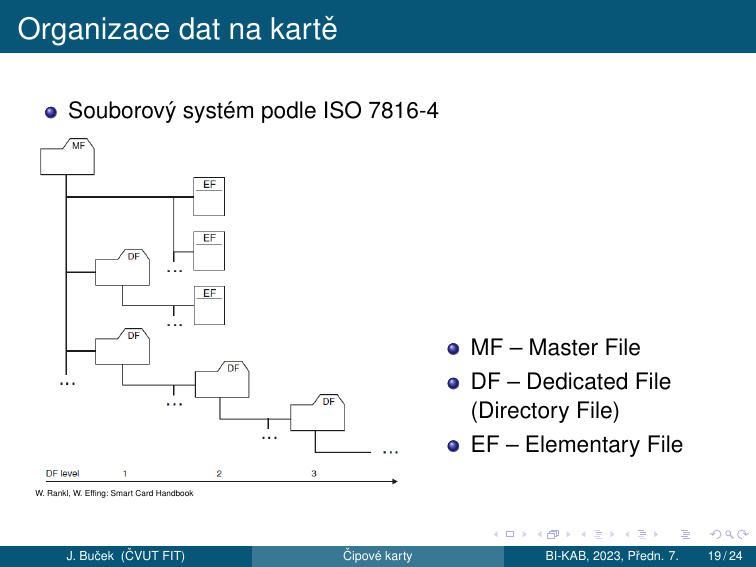
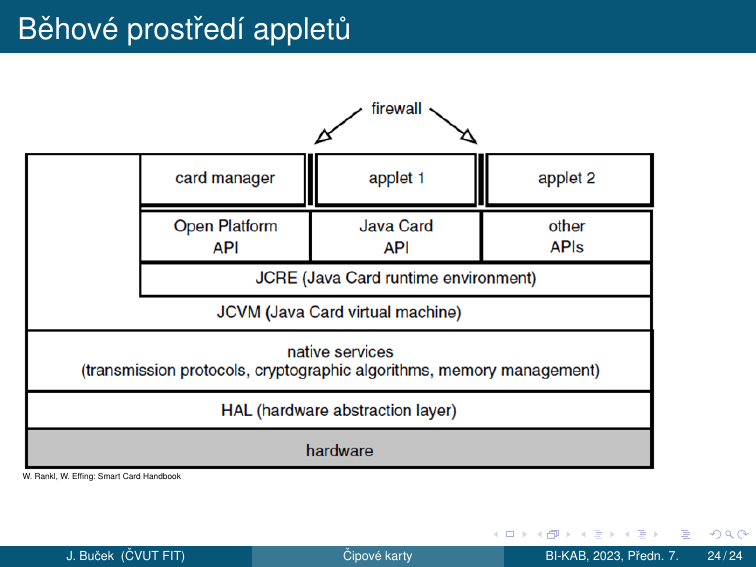

# 11. Čipové karty

!!! abstract "Cíle kapitoly"
    - Znát důvody nasazení čipových karet a princip vícefaktorové autentizace
    - Orientovat se v rozhraních (kontaktní vs. bezkontaktní, ISO 14443)
    - Popsat vnitřní architekturu čipové karty a klient/server systém
    - Znát formát APDU příkazu a odpovědi a 4 případy command APDU
    - Orientovat se v souborovém systému ISO 7816-4
    - Pochopit princip diverzifikace klíčů a Secure Messaging
    - Znát specifika Java karet

---

## 11.1 Proč čipové karty

**Čipová (smart) karta** — obvykle plastová kartička obsahující integrovaný obvod. Nosič informace spojené s nějakým užitečným účelem — **token**.

Důvody nasazení:

- **Bezpečná identifikace a autentizace**
- **Uchování a zpracování dat** (kryptografické operace)
- **Odolnost proti padělání** (tamper resistance)
- **Vícefaktorová autentizace** — druhý faktor

### Vícefaktorová autentizace (MFA)

| Faktor | Princip | Příklad |
|--------|---------|---------|
| **Co víme** | Znalost (heslo, PIN) | Heslo, PIN |
| **Co máme** | Vlastnictví (ČK) | Čipová karta, token |
| **Co jsme** | Inherence, biometrie | Prst, duhovka, sítnice, obličej, hlas |

### Příklady čipových karet

- **Předplacená telefonní karta** (minulé tisíciletí)
- **SIM** — Subscriber Identification Module (GSM); UICC — Universal Integrated Circuit Card (UMTS); R-UIM — Removable User Identity Module (CDMA)
- **VISA/MC/EMV** — bankovní platební karta
- **Elektronická peněženka** (drobné nákupy, platby za služby)
- **Elektronická jízdenka, vstupenka**
- **Průkaz na slevu, věrnostní karta**
- **Průkaz pro vstup do budovy**
- **Karta pro digitální podpis, dešifrování** (soukromý klíč, certifikát)
- **NFC** — Secure Element v mobilním telefonu nebo SW emulace
- „Čipování" — označení zvířete nebo člověka (?)

---

## 11.2 Rozhraní

Napájecí a komunikační rozhraní čipové karty může být zejména:

- **Kontaktní** (např. ISO 7816-2, USB...)
- **Bezkontaktní** (např. ISO 14443) ⇒ typ RFID (Rádiofrekvenční identifikace), základ NFC

**Kombinace:** hybridní (dva čipy), duální (jeden čip, dvě rozhraní)

Napájení a přenos dat:

| Princip | Použití |
|---------|---------|
| Elektrický | Pro kontaktní rozhraní |
| Elektromagnetický | Pro bezkontaktní rozhraní — rádiové signály, indukční vazba |
| Optický | Potisk, záznam — čárové kódy, MRZ (Machine Readable Zone) |

### Bezkontaktní rozhraní — frekvence

Mnoho různých proprietárních i standardních druhů:

| Pásmo | Frekvence | Příklady |
|-------|-----------|---------|
| **LF** (nízkofrekvenční) | 125 kHz, 135 kHz | EM 4102, TI tagIT |
| **HF** s vazbou na blízko (proximity) | 13,56 MHz | **ISO 14443** |
| **HF** s vazbou na dálku (vicinity) | 13,56 MHz | ISO 15693 |
| **UHF** | 868–928 MHz | ... |

Z hlediska procesorových karet s kryptografickými funkcemi nás zajímá zejména **ISO 14443**.

Příklady karet na ISO 14443:

- Studentský, zaměstnanecký průkaz ČVUT — **MIFARE 1K (Classic)** (proprietární protokol nad ISO 14443, ne podle ISO 7816-4)
- Opencard, In-karta ČD — **MIFARE DESFire, DESFire EV1**
- Biometrický pas — **ICAO** (International Civil Aviation Organization)
- **Platební karty** — Visa payWave, MC PayPass...

### ISO 14443

- Frekvence **13,56 MHz**, indukční vazba
- Dva typy modulace: **Typ A** (častější) a **Typ B**

---

## 11.3 Co je uvnitř čipové karty

### Paměťové karty (ne „smart" v užším smyslu)

- **Nic (skoro)** — jen propojené kontakty, rezonanční obvod apod. (není *smart* ani *čipová*)
- **Paměť:**
    - ROM s unikátním sériovým číslem
    - EEPROM
    - Zabezpečená paměť (např. Philips/NXP **MIFARE Classic**) — paměť s funkcí autentizace a šifrování, řízení přístupu k datům
    - Ani ta ještě není *smart* v užším smyslu

### Počítač (true smart card)

- **Konfigurovatelný pomocí API** — programovaný při výrobě
- **Programovatelný v terénu** — např. Java Cards (Standard GlobalPlatform — správa aplikací)

**Vnitřní struktura čipové karty:**

| Komponenta | Popis |
|------------|-------|
| CPU | Výpočetní jednotka |
| Kryptografický koprocesor | Akcelerace RSA, ECC, AES |
| RAM | Pracovní paměť (ztracena při vypnutí) |
| ROM | OS, trvalá paměť |
| EEPROM | Data, klíče (perzistentní, mazatelná) |
| Komunikační rozhraní | ISO 7816 kontakty nebo bezkontaktní |
| Obvody napájení, senzory | Ochrana, detekce útoků |

---

## 11.4 Systém s čipovými kartami — klient/server



---

## 11.5 Ovládání čipových karet — příkazy

| Oblast | Standardy |
|--------|-----------|
| **Obecné** | ISO/IEC 7816-4, -7, -8, -9...; GlobalPlatform — správa aplikací |
| **Platební systémy** | EMV (Europay, MasterCard, Visa); EN 1546, CEPS — elektronické peněženky |
| **Telekomunikace** | GSM 11.11, 11.14 (SIM); TS 31.102, 31.111... (UICC, USIM) |
| **Další** | Standardizované nebo proprietární |

---

## 11.6 APDU — Application Protocol Data Unit

### Command APDU (C-APDU)

**APDU = Application Protocol Data Unit** je základní komunikační jednotka mezi kartou a terminálem (ISO 7816).



| Pole | Povinnost | Velikost | Popis |
|------|-----------|----------|-------|
| **CLA** | povinné | 1 B | Třída instrukce (00 = ISO standard) |
| **INS** | povinné | 1 B | Kód instrukce |
| **P1** | povinné | 1 B | Parametr 1 |
| **P2** | povinné | 1 B | Parametr 2 |
| **Lc** | volitelné | 0/1/3 B | Délka datového pole |
| **Data** | volitelné | Lc B | Data příkazu |
| **Le** | volitelné | 0/1/3 B | Očekávaná délka odpovědi |

**4 případy Command APDU:**

| Případ | CLA INS P1 P2 | Lc | Data | Le | Popis |
|--------|---------------|----|------|-----|-------|
| Case 1 | ✓ | — | — | — | Žádná data, žádná odpověď |
| Case 2 | ✓ | — | — | ✓ | Žádná data, odpověď |
| Case 3 | ✓ | ✓ | ✓ | — | Data, žádná odpověď |
| Case 4 | ✓ | ✓ | ✓ | ✓ | Data, odpověď |

### Response APDU (R-APDU)



| Pole | Povinnost | Popis |
|------|-----------|-------|
| **Data** | volitelné | Data odpovědi |
| **SW1** | povinné | Status Word byte 1 |
| **SW2** | povinné | Status Word byte 2 |

### Status Words — nejdůležitější

| SW1 SW2 | Hex | Význam |
|---------|-----|--------|
| `90 00` | 9000 | ✅ Úspěch |
| `61 xx` | — | Odpověď dostupná (xx bytů) |
| `67 00` | 6700 | Špatná délka |
| `69 82` | 6982 | Přístup zamítnut |
| `69 83` | 6983 | Autentizace blokována (PIN locked) |
| `6A 82` | 6A82 | Soubor nenalezen |
| `6A 86` | 6A86 | Nesprávné P1/P2 |
| `63 Cx` | — | Ověření selhalo, zbývá x pokusů |

### Příklad — SELECT aplikace

```
→ 00  A4  04  00  06  41 42 43 44 45 46
   │   │   │   │   │   └─────────────── AID data (6 B = číslo aplikace)
   │   │   │   │   └────────────────── Lc = 06 (délka datového pole s AID)
   │   │   │   └───────────────────── P2 = 00 (vrať nepovinnou FCI)
   │   │   └──────────────────────── P1 = 04 (výběr podle jména/AID)
   │   └─────────────────────────── INS = A4 (SELECT)
   └────────────────────────────── CLA = 00 (standardní příkaz ISO 7816)

← 90 00   (OK)
```

---

## 11.7 Prvky zabezpečení

### Fyzická bezpečnost

**Nic** — doufáme, že nikdo neposlouchá, nenahrává, neopakuje. Spoléháme se, že nevzniknou klony, emulátory.

### Symetrická autentizace a šifrování

Klíč je tajný, sdílený mezi kartou a terminálem. Možno použít odvozování (**diverzifikaci**) klíčů.

- **KDF** (Key Derivation Function) — jednosměrná funkce (např. HMAC, MAC)
- Princip: $k = \text{KDF}(\text{MasterKey}, \text{SerialNo})$
- Různé karty budou mít různé klíče $k$
- Jednosměrnost KDF ⇒ prolomení $k$ neprozradí MasterKey
- MasterKey stačí jen jeden (pro jednu sérii karet)

### Asymetrická schémata

Veřejný a soukromý klíč, PKI, certifikáty, řetěz důvěry:

- Každá karta má soukromý klíč a odpovídající veřejný klíč
- Může mít VK certifikát → PKI

### Diverzifikace klíčů

- **Vstup:** Hlavní klíč (Master Key) + diverzifikační data (číslo karty, identifikace systému, identifikace aplikace...)
- **Výstup:** Odvozený klíč (Diversified Key)
- **Jednosměrnost:** Z odvozeného klíče je výpočetně neschůdné zjistit hlavní klíč



---

## 11.8 Secure Messaging

Secure Messaging chrání APDU komunikaci. Různé úrovně zabezpečení:

| Úroveň | Popis |
|--------|-------|
| **Bez autentizace, bez utajení** | Plaintext komunikace |
| **MAC** | Zabezpečení proti modifikaci zprávy (autentizace MAC) |
| **MAC + šifrování** | MAC + utajení zprávy (šifrování např. 3DES, AES) |

Princip „zabalení" do struktur typu **TLV** — Tag, Length, Value.

### Secure Messaging s MAC

Zabezpečení proti modifikaci zprávy:



### Secure Messaging s MAC + šifrování

MAC + utajení zprávy:



### TLV kódování

Každé pole APDU je zakódováno jako:
```
[TAG (1-3 B)] [LENGTH (1-3 B)] [VALUE (LENGTH B)]
```

Příklad šifrovaného APDU:
```
87 11 01 <16 bytů AES šifrovaných dat>   ← šifrovaná data
8E 08    <8 bytů CMAC>                    ← MAC integrity
```

---

## 11.9 Souborový systém ISO 7816-4

Data na kartě jsou organizována jako **souborový systém podle ISO 7816-4**:



- **MF** — Master File (kořen, FID = 3F 00)
- **DF** — Dedicated File (Directory File = adresář / aplikace)
- **EF** — Elementary File (soubor s daty)

### Jména souborů

| Identifikátor | Velikost | Použití |
|---------------|----------|---------|
| **FID** (File Identifier) | 2 byty | Identifikuje MF, DF i EF; MF = 3F 00; výběr: SELECT (P1=0) |
| **SFI** (Short File Identifier) | 5 bitů | Identifikuje EF; přímý výběr v příkazech pro manipulaci s daty; čtení s implicitním výběrem — READ BINARY (P1=100sssss) |
| **DF name / AID** | až 16 bytů | Identifikuje DF (nebo aplikaci); může obsahovat AID → Java karty; výběr: SELECT (P1=4) |

### Operace se soubory

| Operace | Příkaz | Hex |
|---------|--------|-----|
| **Výběr** (MF, DF nebo EF) | SELECT | `00 A4 ...` |
| Čtení transparentního souboru | READ BINARY | `00 B0 ...` |
| Zápis transparentního souboru | UPDATE BINARY | `00 D6 ...` |
| Čtení záznamu | READ RECORD | `00 B2 ...` |
| Zápis záznamu | UPDATE RECORD | `00 DC ...` |

**Typy Elementary Files:**

| Typ | Popis | Operace |
|-----|-------|---------|
| **Transparentní** | Binární blob bez vnitřní struktury | READ BINARY, UPDATE BINARY |
| **Záznamy pevné délky** | Záznamy pevné délky | READ RECORD, APPEND RECORD |
| **Záznamy variabilní délky** | Záznamy proměnné délky | READ RECORD, APPEND RECORD |
| **Cyklické** | Cyklické soubory (pevná délka záznamu) | READ RECORD (poslední záznam) |

---

## 11.10 Java karty

**Java karta** obsahuje **CPU + Java VM** (virtuální stroj jazyka Java):

- Podmnožina jazyka Java
- Zjednodušený VM, předzpracování (konverze)
- Java interpreter (většinou částečná HW podpora)
- **Java Card Framework**, runtime
- Persistence dat — „heap je v EEPROM"
- Podpora transakčního zpracování
- Na Java kartách: Aplikace → **Applet**

### Rysy jazyka Java Card

**Podporované typy:**

| Typ | Bitů | Podpora |
|-----|------|---------|
| `byte` | 8 | ✅ |
| `short` | 16 | ✅ |
| `int` | 32 | ⚠️ nepovinně |
| `long`, `float`, `double` | — | ❌ |

**Nepodporováno:** znaky, řetězce, vícerozměrná pole, dynamické nahrávání tříd, GC a finalizace, serializace, klonování objektů.

**Runtime knihovny:** `java.lang`, `javacard.framework`, `javacard.security`, `javacardx.crypto`, (`java.rmi`...). V novějších verzích i float, řetězce, servlety.

### Běhové prostředí appletů



Vrstvová architektura (od hardwaru nahoru):

1. **Hardware** — fyzický čip
2. **HAL** — Hardware Abstraction Layer
3. **Native services** — transmission protocols, cryptographic algorithms, memory management
4. **JCVM** — Java Card Virtual Machine
5. **JCRE** — Java Card Runtime Environment
6. **API vrstvy** — OpenPlatform API, Java Card API, Other APIs
7. **Aplikace** — Card Manager, Applet 1, Applet 2, ..., firewall

---

## Shrnutí kapitoly

!!! abstract "Rychlý přehled"
    - **MFA:** Co víme (heslo/PIN), Co máme (čipová karta), Co jsme (biometrie)
    - **Rozhraní:** Kontaktní (ISO 7816-2), Bezkontaktní (ISO 14443 @ 13,56 MHz)
    - **APDU:** CLA INS P1 P2 [Lc Data Le] → [Data] SW1 SW2; 4 případy
    - **SW 9000** = OK; **SW 6983** = PIN locked; **SW 6A82** = file not found
    - **MF → DF → EF** hierarchie souborů (ISO 7816-4)
    - **Diverzifikace klíčů:** $k = \text{KDF}(\text{MasterKey}, \text{SerialNo})$ — jednosměrná
    - **Secure Messaging:** bez/MAC/MAC+šifrování; TLV kódování
    - **Java Card:** CPU+JVM, Applet, EEPROM heap, JCRE/JCVM architektura

!!! question "Klíčové otázky ke zkoušce"
    1. Co je vícefaktorová autentizace? Jaké jsou tři faktory?
    2. Jaký je rozdíl mezi kontaktním a bezkontaktním rozhraním? Jaký standard se používá pro NFC platební karty?
    3. Jaký je formát Command APDU? Popište každé pole. Jaké jsou 4 případy?
    4. Co jsou SW1 a SW2? Co znamená SW = 9000? A SW = 63Cx?
    5. Nakreslete hierarchii souborového systému ISO 7816-4 (MF/DF/EF).
    6. Co je FID, SFI a AID? Kdy se každý používá?
    7. Co je Secure Messaging? Jaké jsou tři úrovně zabezpečení?
    8. Co je Key Diversification? Jaká je výhoda oproti sdílení jednoho klíče?
    9. Co je Java karta? Jaké jsou specifika jazyka Java Card?
    10. Popište vrstvovou architekturu Java Card runtime prostředí.
